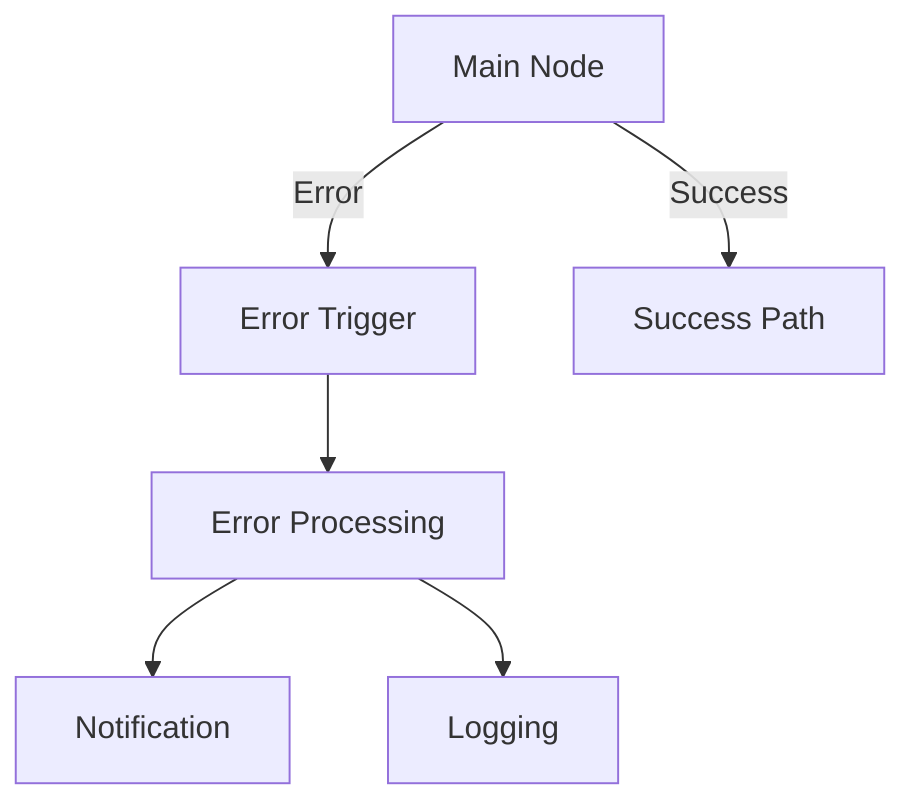
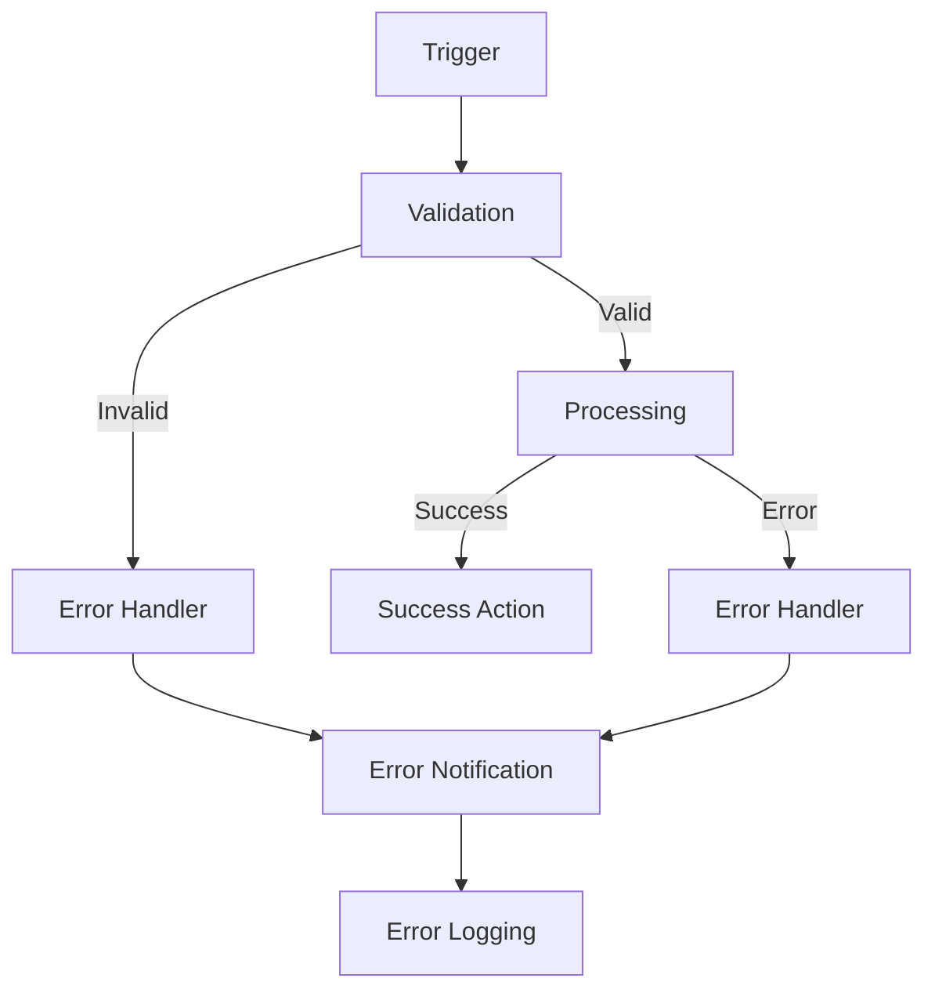
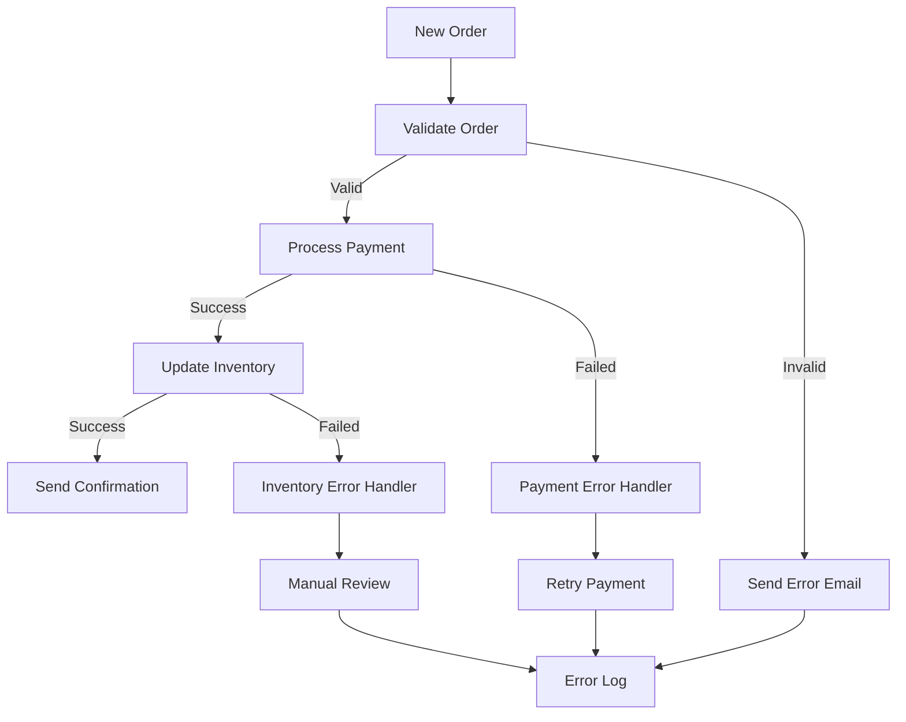

# Tratamento de Erros

O tratamento de erros é fundamental para criar workflows robustos e confiáveis no n8n. Este guia aborda estratégias, técnicas e ferramentas para implementar tratamento de erros eficiente.

## Conceitos Fundamentais

### Por que Tratar Erros
Tratar erros adequadamente garante:
- **Confiabilidade**: Workflows que continuam funcionando mesmo com falhas
- **Observabilidade**: Visibilidade sobre problemas e suas causas
- **Recuperação**: Capacidade de se recuperar automaticamente
- **Manutenibilidade**: Facilita debugging e correção de problemas

### Tipos de Erros

#### 1. Erros de Conectividade
```json
{
  "error": {
    "type": "connection",
    "code": "ECONNREFUSED",
    "message": "Connection refused",
    "node": "HTTP Request",
    "timestamp": "2024-01-20T10:00:00Z"
  }
}
```

#### 2. Erros de Autenticação
```json
{
  "error": {
    "type": "authentication",
    "code": "401",
    "message": "Unauthorized",
    "node": "Gmail",
    "timestamp": "2024-01-20T10:00:00Z"
  }
}
```

#### 3. Erros de Dados
```json
{
  "error": {
    "type": "data",
    "code": "VALIDATION_ERROR",
    "message": "Required field missing",
    "node": "Set",
    "timestamp": "2024-01-20T10:00:00Z"
  }
}
```

#### 4. Erros de Rate Limiting
```json
{
  "error": {
    "type": "rate_limit",
    "code": "429",
    "message": "Too Many Requests",
    "node": "API Request",
    "timestamp": "2024-01-20T10:00:00Z"
  }
}
```

## Estratégias de Tratamento

### 1. Try-Catch Pattern

#### Implementação com IF Node
```json
{
  "node": {
    "type": "n8n-nodes-base.if",
    "name": "Error Handler",
    "parameters": {
      "conditions": {
        "string": [
          {
            "value1": "={{ $json.error }}",
            "operation": "exists"
          }
        ]
      }
    }
  }
}
```

#### Implementação com Code Node
```javascript
// Code Node para tratamento de erros
try {
  // Operação que pode falhar
  const result = await someOperation();
  return { success: true, data: result };
} catch (error) {
  // Tratamento do erro
  console.error('Error occurred:', error);
  return { 
    success: false, 
    error: error.message,
    timestamp: new Date().toISOString()
  };
}
```

### 2. Retry Logic

#### Configuração de Retry
```json
{
  "retry": {
    "attempts": 3,
    "delay": 5000,
    "backoff": "exponential",
    "maxDelay": 30000,
    "conditions": [
      "network_error",
      "rate_limit",
      "temporary_failure"
    ]
  }
}
```

#### Retry Customizado
```javascript
// Code Node para retry inteligente
const maxAttempts = 3;
const currentAttempt = $execution.attempt || 1;

if (currentAttempt < maxAttempts) {
  // Calcular delay exponencial
  const delay = Math.pow(2, currentAttempt) * 1000;
  
  // Aguardar antes da próxima tentativa
  await new Promise(resolve => setTimeout(resolve, delay));
  
  // Lançar erro para forçar retry
  throw new Error(`Retry attempt ${currentAttempt}`);
}

// Se chegou aqui, é a última tentativa
return items;
```

### 3. Circuit Breaker Pattern

#### Implementação
```javascript
// Code Node para Circuit Breaker
const circuitBreaker = {
  failureThreshold: 5,
  recoveryTimeout: 60000,
  state: 'CLOSED', // CLOSED, OPEN, HALF_OPEN
  failureCount: 0,
  lastFailureTime: null
};

// Verificar estado do circuit breaker
if (circuitBreaker.state === 'OPEN') {
  const timeSinceLastFailure = Date.now() - circuitBreaker.lastFailureTime;
  
  if (timeSinceLastFailure > circuitBreaker.recoveryTimeout) {
    circuitBreaker.state = 'HALF_OPEN';
  } else {
    throw new Error('Circuit breaker is OPEN');
  }
}

try {
  // Executar operação
  const result = await riskyOperation();
  
  // Sucesso - reset circuit breaker
  if (circuitBreaker.state === 'HALF_OPEN') {
    circuitBreaker.state = 'CLOSED';
  }
  circuitBreaker.failureCount = 0;
  
  return result;
} catch (error) {
  // Falha - incrementar contador
  circuitBreaker.failureCount++;
  circuitBreaker.lastFailureTime = Date.now();
  
  if (circuitBreaker.failureCount >= circuitBreaker.failureThreshold) {
    circuitBreaker.state = 'OPEN';
  }
  
  throw error;
}
```

## Nodes Específicos para Tratamento de Erros

### 1. Error Trigger Node

#### Configuração
```json
{
  "node": {
    "type": "n8n-nodes-base.errorTrigger",
    "name": "Error Handler",
    "parameters": {
      "errorMessage": "={{ $json.error.message }}",
      "errorType": "={{ $json.error.type }}",
      "nodeName": "={{ $json.error.node }}"
    }
  }
}
```

#### Uso no Workflow


### 2. Set Node para Error Handling

#### Configuração de Error Context
```json
{
  "node": {
    "type": "n8n-nodes-base.set",
    "name": "Add Error Context",
    "parameters": {
      "values": {
        "string": [
          {
            "name": "errorTimestamp",
            "value": "={{ $now }}"
          },
          {
            "name": "workflowName",
            "value": "={{ $workflow.name }}"
          },
          {
            "name": "executionId",
            "value": "={{ $execution.id }}"
          },
          {
            "name": "errorSeverity",
            "value": "high"
          }
        ]
      }
    }
  }
}
```

### 3. HTTP Request para Error Reporting

#### Configuração de Webhook de Erro
```json
{
  "node": {
    "type": "n8n-nodes-base.httpRequest",
    "name": "Send Error Report",
    "parameters": {
      "method": "POST",
      "url": "https://api.error-reporting.com/errors",
      "authentication": "predefinedCredentialType",
      "sendHeaders": true,
      "headerParameters": {
        "parameters": [
          {
            "name": "Content-Type",
            "value": "application/json"
          }
        ]
      },
      "sendBody": true,
      "bodyParameters": {
        "parameters": [
          {
            "name": "error",
            "value": "={{ $json.error }}"
          },
          {
            "name": "context",
            "value": "={{ $json.context }}"
          }
        ]
      }
    }
  }
}
```

## Padrões de Tratamento por Tipo de Erro

### 1. Erros de Rede

#### Detecção e Retry
```javascript
// Code Node para tratamento de erros de rede
const isNetworkError = (error) => {
  const networkErrors = [
    'ECONNREFUSED',
    'ENOTFOUND',
    'ETIMEDOUT',
    'ECONNRESET'
  ];
  
  return networkErrors.includes(error.code) || 
         error.message.includes('network') ||
         error.message.includes('timeout');
};

try {
  const result = await networkOperation();
  return result;
} catch (error) {
  if (isNetworkError(error)) {
    // Implementar retry com backoff exponencial
    const retryCount = $execution.attempt || 1;
    const delay = Math.pow(2, retryCount) * 1000;
    
    if (retryCount < 3) {
      await new Promise(resolve => setTimeout(resolve, delay));
      throw new Error('Retry network operation');
    }
  }
  
  // Se não for erro de rede ou excedeu tentativas
  throw error;
}
```

### 2. Erros de Rate Limiting

#### Implementação de Rate Limiting
```javascript
// Code Node para tratamento de rate limiting
const handleRateLimit = async (error) => {
  if (error.status === 429) {
    // Extrair tempo de espera do header
    const retryAfter = error.headers['retry-after'] || 60;
    
    console.log(`Rate limited. Waiting ${retryAfter} seconds...`);
    await new Promise(resolve => setTimeout(resolve, retryAfter * 1000));
    
    // Retry a operação
    throw new Error('Retry after rate limit');
  }
  
  throw error;
};

try {
  const result = await apiCall();
  return result;
} catch (error) {
  await handleRateLimit(error);
}
```

### 3. Erros de Validação

#### Validação de Dados
```javascript
// Code Node para validação e tratamento de erros
const validateData = (data) => {
  const errors = [];
  
  // Validar campos obrigatórios
  if (!data.email) {
    errors.push('Email is required');
  }
  
  if (!data.name) {
    errors.push('Name is required');
  }
  
  // Validar formato de email
  if (data.email && !isValidEmail(data.email)) {
    errors.push('Invalid email format');
  }
  
  return errors;
};

const isValidEmail = (email) => {
  const emailRegex = /^[^\s@]+@[^\s@]+\.[^\s@]+$/;
  return emailRegex.test(email);
};

// Processar dados
const validationErrors = validateData($input.first().json);

if (validationErrors.length > 0) {
  return {
    success: false,
    errors: validationErrors,
    data: $input.first().json
  };
}

// Dados válidos - continuar processamento
return {
  success: true,
  data: $input.first().json
};
```

## Monitoramento e Alertas

### 1. Logging de Erros

#### Estrutura de Log
```json
{
  "log": {
    "level": "error",
    "timestamp": "2024-01-20T10:00:00Z",
    "workflow": "Processamento de Pedidos",
    "execution": "exec_12345",
    "node": "HTTP Request",
    "error": {
      "type": "connection",
      "message": "Connection refused",
      "code": "ECONNREFUSED",
      "stack": "..."
    },
    "context": {
      "input": "dados de entrada",
      "attempt": 3,
      "retryCount": 2
    }
  }
}
```

### 2. Alertas Automáticos

#### Configuração de Alertas
```json
{
  "alerts": {
    "critical": {
      "conditions": [
        "error_rate > 0.1",
        "consecutive_failures > 5",
        "execution_time > 300000"
      ],
      "channels": ["email", "slack", "sms"],
      "recipients": ["oncall@company.com"]
    },
    "warning": {
      "conditions": [
        "error_rate > 0.05",
        "execution_time > 60000"
      ],
      "channels": ["slack"],
      "recipients": ["dev-team"]
    }
  }
}
```

### 3. Dashboard de Erros

#### Métricas Importantes
```yaml
Error Rate:
  - Total Errors: 25
  - Error Rate: 2.5%
  - Critical Errors: 5
  - Warning Errors: 20

Error Types:
  - Network: 40%
  - Authentication: 25%
  - Validation: 20%
  - Rate Limiting: 15%

Top Error Sources:
  - HTTP Request Node: 15 errors
  - Gmail Node: 5 errors
  - Database Node: 3 errors
  - API Node: 2 errors
```

## Melhores Práticas

### 1. Design de Workflows

#### Estrutura Recomendada


### 2. Nomenclatura e Organização

#### Convenções
```yaml
Error Nodes:
  - "Error Handler - [Tipo]"
  - "Retry Logic - [Operação]"
  - "Validation - [Dados]"
  - "Notification - [Canal]"

Error Workflows:
  - "Error Processing - [Contexto]"
  - "Error Reporting - [Sistema]"
  - "Error Recovery - [Processo]"
```

### 3. Documentação

#### Template de Documentação
```markdown
# Error Handling Strategy

## Error Types
- **Network Errors**: Retry with exponential backoff
- **Authentication Errors**: Alert admin, disable workflow
- **Validation Errors**: Log and continue with default values
- **Rate Limiting**: Wait and retry

## Recovery Actions
- **Automatic**: Retry, circuit breaker, fallback
- **Manual**: Admin notification, workflow pause
- **Escalation**: SMS alert, phone call

## Monitoring
- **Metrics**: Error rate, response time, success rate
- **Alerts**: Email, Slack, SMS
- **Logs**: Structured logging with context
```

## Exemplos Práticos

### Exemplo 1: E-commerce Order Processing



### Exemplo 2: Data Synchronization

```javascript
// Code Node para sincronização com tratamento de erros
const syncData = async (source, destination) => {
  const errors = [];
  const successes = [];
  
  for (const item of source) {
    try {
      // Tentar sincronizar item
      const result = await syncItem(item, destination);
      successes.push({ item, result });
    } catch (error) {
      // Registrar erro
      errors.push({ 
        item, 
        error: error.message,
        timestamp: new Date().toISOString()
      });
      
      // Continuar com próximo item
      continue;
    }
  }
  
  return {
    total: source.length,
    successful: successes.length,
    failed: errors.length,
    errors: errors,
    successes: successes
  };
};
```

## Recursos Adicionais

### Documentação Oficial
- [Error Handling](https://docs.n8n.io/workflows/error-handling/)
- [Retry Logic](https://docs.n8n.io/workflows/retry-logic/)
- [Error Nodes](https://docs.n8n.io/integrations/builtin/cluster-nodes/)

### Ferramentas de Debug
- [Execution Inspector](https://docs.n8n.io/workflows/executions/)
- [Error Logging](https://docs.n8n.io/hosting/logging/)
- [Performance Monitoring](https://docs.n8n.io/hosting/monitoring/)

### Comunidade
- [Error Handling Discussions](https://community.n8n.io/c/error-handling/)
- [Best Practices](https://community.n8n.io/c/best-practices/)
- [Troubleshooting](https://community.n8n.io/c/troubleshooting/)

---

**Próximos Passos:**
- [Looping e Iteração](looping.md)
- [Merging e Agregação](merging.md)
- [Subworkflows](subworkflows.md)
