import Tabs from '@theme/Tabs';
import TabItem from '@theme/TabItem';
import Admonition from '@theme/Admonition';
import CodeBlock from '@theme/CodeBlock';
import IonicIcon from '@site/src/components/IonicIcon';

# <IonicIcon name="git-branch-outline" /> Splitting de Workflows: Criando Lógica Condicional no n8n


## O que você vai aprender nesta página

<Admonition type="info" title="📚 Objetivos de Aprendizado">
1. **Definir** o que é *splitting* (ramificação condicional) no n8n
2. **Identificar** por que e quando aplicar essa técnica
3. **Conhecer** os nós essenciais – **IF**, **Switch** e **Merge** – e suas configurações críticas
4. **Construir** um fluxo multi‑ramo, passo a passo, a partir de um fluxo linear
5. **Controlar** a ordem de execução, paralelismo e a opção **Always Output Data**
6. **Aplicar** boas práticas e evitar armadilhas comuns em ambientes de produção
</Admonition>

## Entendendo o Conceito de Splitting

<Admonition type="tip" title="💡 Analogia Prática">
Splitting em workflows é como criar um **ponto de decisão** em um processo automatizado. Imagine que você é um gerente de atendimento ao cliente que precisa distribuir tickets de suporte: tickets simples vão para o nível 1, problemas técnicos vão para especialistas, e reclamações urgentes vão direto para supervisores.

**No n8n, splitting funciona exatamente assim** - você cria pontos onde o workflow "decide" qual caminho seguir baseado em condições específicas.
</Admonition>

### O que é Splitting de Workflow?

No n8n, um [workflow](/primeiros-passos/primeiro-workflow) percorre naturalmente um **único caminho sequencial**. *Splitting* transforma esse caminho em **ramificações paralelas**: cada item é avaliado por um nó condicional ([*IF*](/integracoes/builtin-nodes/logic-control) ou [*Switch*](/integracoes/builtin-nodes/logic-control)) e roteado ao ramo que corresponde aos seus dados.

<Admonition type="warning" title="⚠️ Importante: Não confunda com Split Out">
**Splitting** ≠ **Split Out**

- **Split Out**: Quebra uma lista em itens individuais para [processamento em loop](/logica-e-dados/01-flow-logic/looping)
- **Splitting condicional**: Mantém o item intacto e decide *qual* caminho ele seguirá

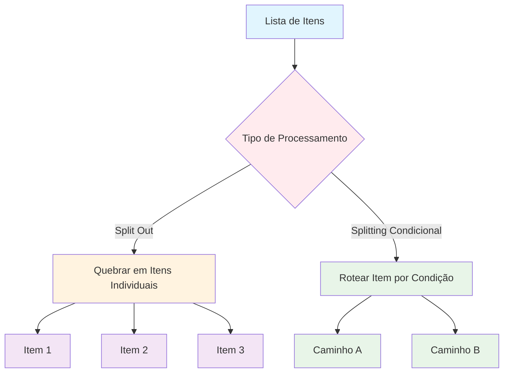
</Admonition>

### Por que e quando usar Splitting?

<Tabs>
<TabItem value="beneficios" label="Benefícios" default>

| **Situação** | **Benefício do Splitting** |
|-------------|---------------------------|
| **Filas de suporte com múltiplos SLAs** | Priorização automática conforme urgência e plano |
| **Campanhas de marketing multilíngues** | Mensagens corretas por país ou segmento sem scripts extras |
| **Processamento de pagamentos** | Diferenciar rotas de antifraude para valores altos ou clientes novos |
| **Aprovações corporativas** | Automação de fluxos de aprovação baseados em valor e categoria |
| **Triagem de leads** | Distribuição automática para equipes especializadas |

</TabItem>
<TabItem value="comparacao" label="Antes vs Depois">

**Workflow Linear**

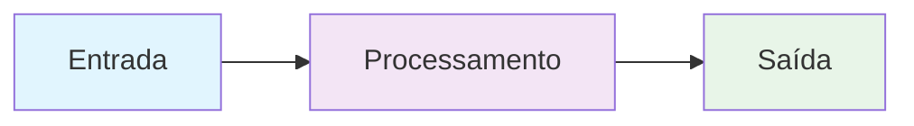

**Limitações:**
- Todos os itens seguem o mesmo caminho
- Não há personalização baseada em dados
- Lógica rígida e inflexível
- Retrabalho e atrasos
- Falta de personalização

**Workflow Inteligente**

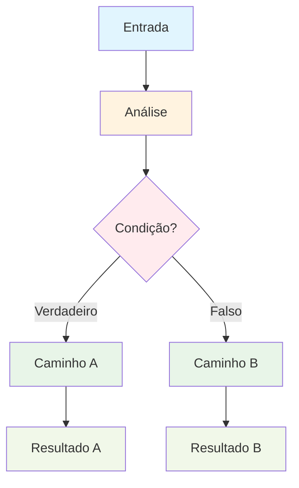

**Vantagens:**
- Lógica adaptativa baseada em dados
- Múltiplos caminhos de processamento
- Automação inteligente e personalizada
- Escalabilidade aumentada
- Eliminação de lógica manual

</TabItem>
</Tabs>

## Nós Essenciais para Splitting

<Tabs>
<TabItem value="comparativo" label="Comparativo Rápido" default>

| **Nó** | **Finalidade** | **Saídas** | **Dicas Rápidas** |
|--------|---------------|------------|------------------|
| **[IF](/integracoes/builtin-nodes/logic-control)** | Decisão binária | `true`, `false` | Combine condições com **AND/OR**; ative **Always Output Data** se for fazer [merge](/logica-e-dados/01-flow-logic/merging) depois |
| **[Switch](/integracoes/builtin-nodes/logic-control)** | Seleção multicondicional | `Case n`, `Default` | Dois modos: **Rules** (comparação direta) ou **Expression** ([lógica JavaScript](/referencia/glossario)) |
| **[Merge](/logica-e-dados/01-flow-logic/merging)** | Reunir ramificações | — | Estratégias *Wait → All* ou *Merge By Key* garantem dados completos |

</TabItem>
<TabItem value="if" label="Node IF">

### <IonicIcon name="help-circle-outline" /> Node IF: Decisões Simples (Sim/Não)

**Quando usar**: Para condições binárias simples onde você precisa de apenas dois caminhos.

<Admonition type="example" title="Exemplo prático">
"Se o valor do pedido for maior que R$ 1000, envie para aprovação manual. Caso contrário, processe automaticamente."
</Admonition>

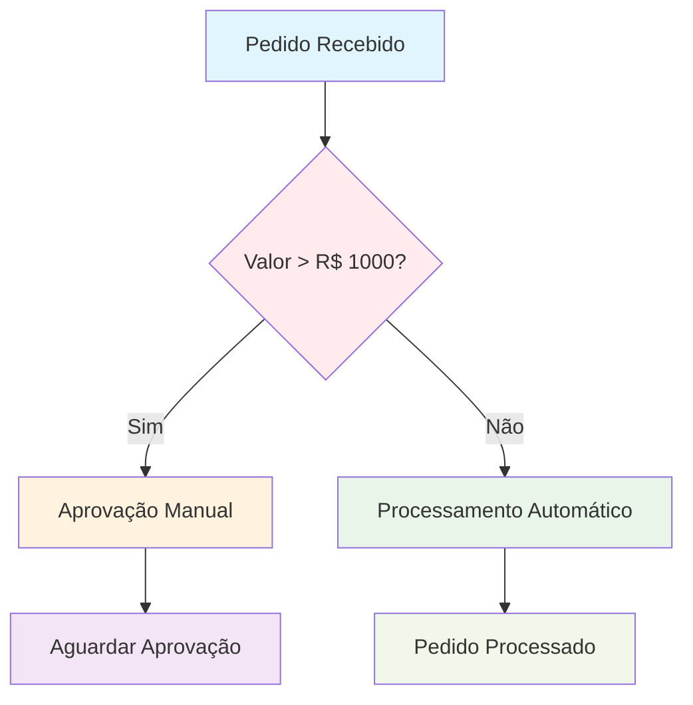

**Configurações Críticas:**
- **Always Output Data**: Garante que mesmo ramos "vazios" produzam dados
- **Combine Conditions**: Use AND/OR para lógicas complexas
- **Data Type**: Certifique-se de comparar tipos compatíveis - veja [estrutura de dados](/logica-e-dados/02-data/data-structure)

<CodeBlock language="javascript" title="Lógica do node IF">
{`// Lógica do node IF
if (valor_pedido > 1000) {
    // Caminho "true" - Aprovação manual
    enviarParaAprovacao();
} else {
    // Caminho "false" - Processamento automático
    processarAutomaticamente();
}`}
</CodeBlock>
<!-- Estrutura dos componentes retráteis para replicar -->
<details>
<summary><IonicIcon name="eye-outline" size={16} color="#6b7280" /> Copie e cole este template na dashboard do n8n: </summary>
<CodeBlock language="json" title="Exemplo de Condicional IF">
{`
{
  "name": "1 - Node IF Simples (Exemplo)",
  "nodes": [
    {
      "parameters": {},
      "type": "n8n-nodes-base.manualTrigger",
      "typeVersion": 1,
      "position": [
        0,
        0
      ],
      "id": "cc141f51-104f-4418-8855-7d60d0f5bf37",
      "name": "Pedido Recebido (Clique)"
    },
    {
      "parameters": {
        "conditions": {
          "options": {
            "caseSensitive": true,
            "leftValue": "",
            "typeValidation": "strict",
            "version": 2
          },
          "conditions": [
            {
              "id": "a3c56011-c465-4d36-865d-ea19ed69533e",
              "leftValue": "={{ $json.valor_pedido }}",
              "rightValue": 1000,
              "operator": {
                "type": "number",
                "operation": "gt"
              }
            }
          ],
          "combinator": "and"
        },
        "options": {}
      },
      "type": "n8n-nodes-base.if",
      "typeVersion": 2.2,
      "position": [
        440,
        0
      ],
      "id": "9c878dfe-3b58-421a-af0b-28b854f5627c",
      "name": "Valor > R$ 1000 "
    },
    {
      "parameters": {},
      "type": "n8n-nodes-base.noOp",
      "typeVersion": 1,
      "position": [
        800,
        -120
      ],
      "id": "05194991-a2f7-476b-9d38-86caffa0228a",
      "name": "Processamento Automático"
    },
    {
      "parameters": {},
      "type": "n8n-nodes-base.noOp",
      "typeVersion": 1,
      "position": [
        800,
        140
      ],
      "id": "82a80168-402c-4045-8a31-9880ac4be86c",
      "name": "Aprovação Manual"
    },
    {
      "parameters": {
        "mode": "raw",
        "jsonOutput": "{\n  \"valor_pedido\": 1500\n}\n",
        "options": {}
      },
      "type": "n8n-nodes-base.set",
      "typeVersion": 3.4,
      "position": [
        220,
        0
      ],
      "id": "6693b086-a4a5-4be4-a2dd-ad9d863d0410",
      "name": "Valor do Pedido"
    }
  ],
  "pinData": {},
  "connections": {
    "Pedido Recebido (Clique)": {
      "main": [
        [
          {
            "node": "Valor do Pedido",
            "type": "main",
            "index": 0
          }
        ]
      ]
    },
    "Valor > R$ 1000 ": {
      "main": [
        [
          {
            "node": "Processamento Automático",
            "type": "main",
            "index": 0
          }
        ],
        [
          {
            "node": "Aprovação Manual",
            "type": "main",
            "index": 0
          }
        ]
      ]
    },
    "Valor do Pedido": {
      "main": [
        [
          {
            "node": "Valor > R$ 1000 ",
            "type": "main",
            "index": 0
          }
        ]
      ]
    }
  },
  "active": false,
  "settings": {
    "executionOrder": "v1"
  },
  "versionId": "9f87682e-bf1b-4d70-8256-3137f28ffa9a",
  "meta": {
    "templateCredsSetupCompleted": true,
    "instanceId": "5d478e0a2f4e8d45c4e0abcf4fbfa908e6f06b0598ed1dff66e5f3280b44e520"
  },
  "id": "EJZFhzQGa087iUZQ",
  "tags": []
}
`}
</CodeBlock>
</details>
<!-- ########################### -->

</TabItem>
<TabItem value="switch" label="Node Switch">

### <IonicIcon name="options-outline" /> Node Switch: Decisões Múltiplas

**Quando usar**: Para múltiplas condições onde você precisa de vários caminhos diferentes.

<Admonition type="example" title="Exemplo prático: Classificar leads por origem">
- Google Ads → Equipe de Marketing Pago
- Redes Sociais → Equipe de Social Media  
- Website → Equipe de Vendas Inbound
- Indicação → Equipe de Relacionamento
</Admonition>

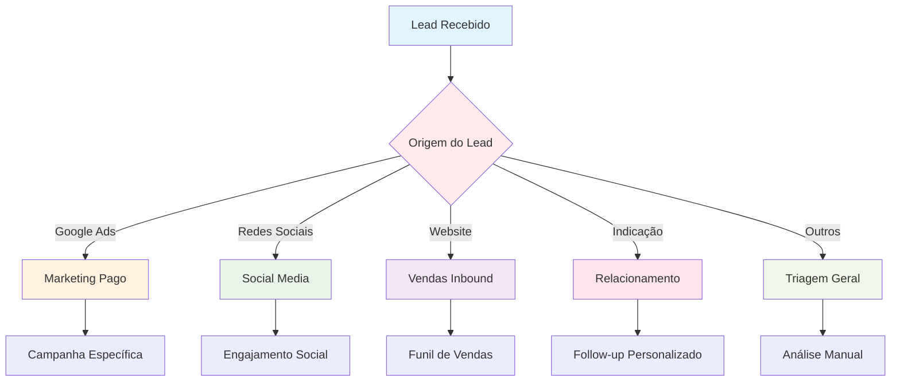

**Modos de Operação:**
- **Rules**: Comparação direta (mais simples)
- **Expression**: [Lógica JavaScript](/referencia/glossario) (mais flexível)

<CodeBlock language="javascript" title="Lógica do node Switch">
{`// Lógica do node Switch
switch (origem_lead) {
    case "google_ads":
        // Caminho 1
        enviarParaMarketingPago();
        break;
    case "redes_sociais":
        // Caminho 2
        enviarParaSocialMedia();
        break;
    case "website":
        // Caminho 3
        enviarParaVendasInbound();
        break;
    case "indicacao":
        // Caminho 4
        enviarParaRelacionamento();
        break;
    default:
        // Caminho padrão
        enviarParaTriagem();
}`}
</CodeBlock>

</TabItem>
<TabItem value="merge" label="Node Merge">

### <IonicIcon name="git-merge-outline" /> Node Merge: Reunindo Ramificações

**Quando usar**: Quando diferentes caminhos precisam convergir para uma ação final comum.

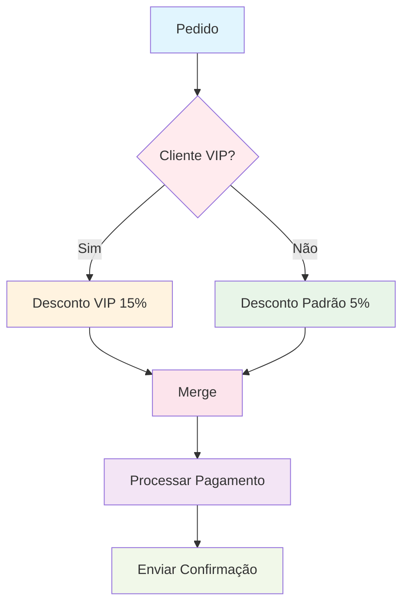

**Estratégias de Merge:**
- **Wait → All**: Aguarda todos os ramos terminarem
- **Merge By Key**: Combina dados baseado em chaves específicas
- **Append**: Adiciona dados sequencialmente

Saiba mais sobre [manipulação de dados](/logica-e-dados/02-data/data-mapping).

</TabItem>
</Tabs>

## Implementação Prática: Exemplo Completo

### <IonicIcon name="business-outline" /> Cenário: Sistema de Aprovação de Despesas

Vamos criar um workflow que automatiza a aprovação de despesas corporativas com base em valor e categoria:

<Admonition type="info" title="Regras de negócio">
- Despesas até R$ 500: Aprovação automática
- Despesas R$ 501-2000: Aprovação do supervisor
- Despesas acima de R$ 2000: Aprovação da diretoria
- Categoria "Viagem": Sempre vai para RH (independente do valor)
</Admonition>

### Diagrama Completo do Workflow

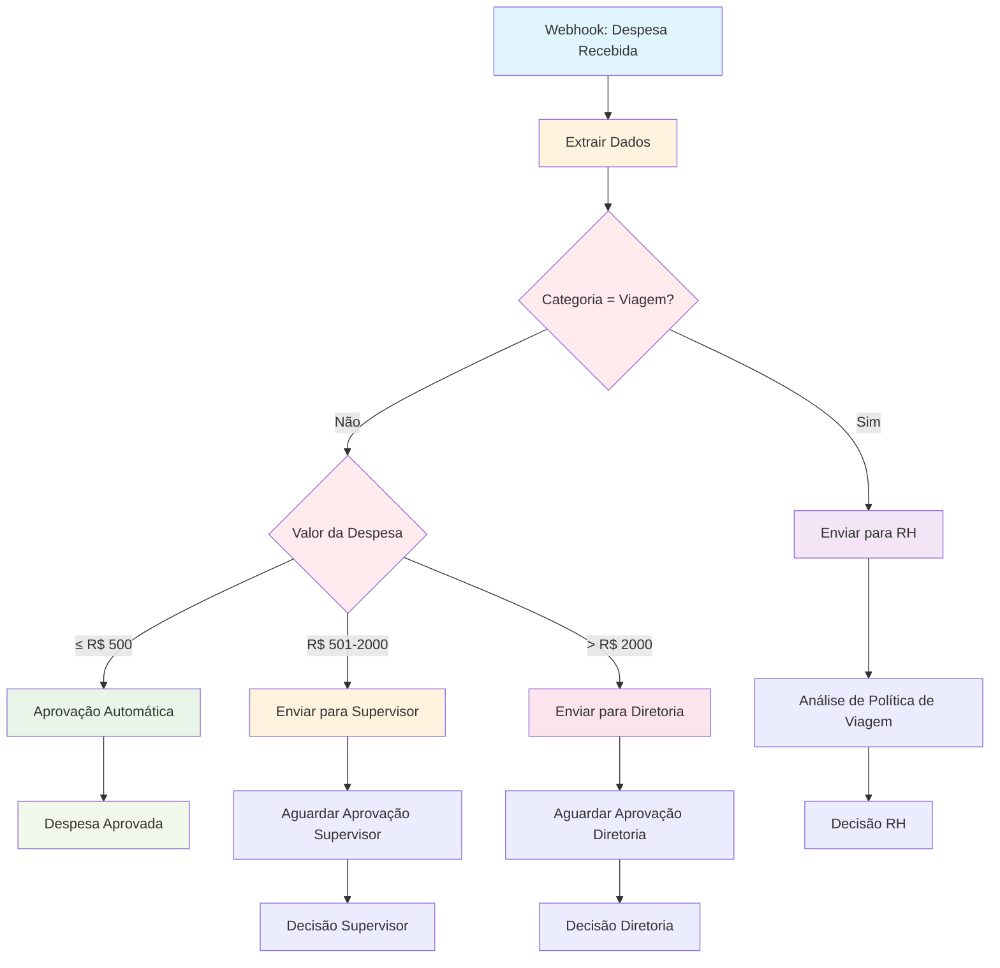

### Construção Passo a Passo

<Tabs>
<TabItem value="passo1" label="1. Webhook/Trigger" default>

#### <IonicIcon name="play-outline" /> 1. Webhook/Trigger – Receber Dados

**Objetivo**: O usuário envia um ticket de despesa, disparando o workflow.

<CodeBlock language="json" title="Dados de entrada">
{`{
  "funcionario": "João Silva",
  "valor": 1500.00,
  "categoria": "Material de Escritório",
  "descricao": "Notebooks para equipe",
  "data": "2024-01-15",
  "prioridade": "normal",
  "plano_suporte": "Premium"
}`}
</CodeBlock>

</TabItem>
<TabItem value="passo2" label="2. Extrair Dados">

#### <IonicIcon name="filter-outline" /> 2. Set/Function – Extrair Dados Essenciais

**Objetivo**: Extrair `priority`, `supportPlan`, `description`, `valor`, `categoria`.

<CodeBlock language="javascript" title="Extração de dados">
{`// Extrair dados essenciais
const dados = {
  funcionario: $json.funcionario,
  valor: parseFloat($json.valor),
  categoria: $json.categoria?.toLowerCase(),
  prioridade: $json.prioridade || 'normal',
  descricao: $json.descricao,
  data: $json.data
};

return dados;`}
</CodeBlock>

</TabItem>
<TabItem value="passo3" label="3. IF Categoria">

#### <IonicIcon name="help-circle-outline" /> 3. IF Categoria – Verificar se é Viagem

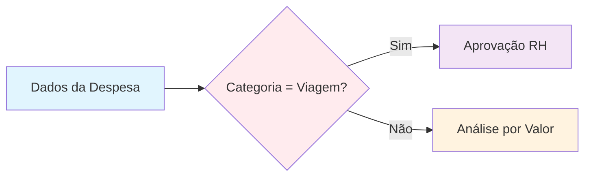

**Configuração do IF Node "Verificar Categoria"**:
- **Condition**: `{{ $json.categoria === "viagem" }}`
- **Always Output Data**: ✅ Ativado
- **true** → Caminho RH
- **false** → Continua análise por valor

</TabItem>
<TabItem value="passo4" label="4. Switch Valor">

#### <IonicIcon name="calculator-outline" /> 4. Switch Valor – Análise por Valor

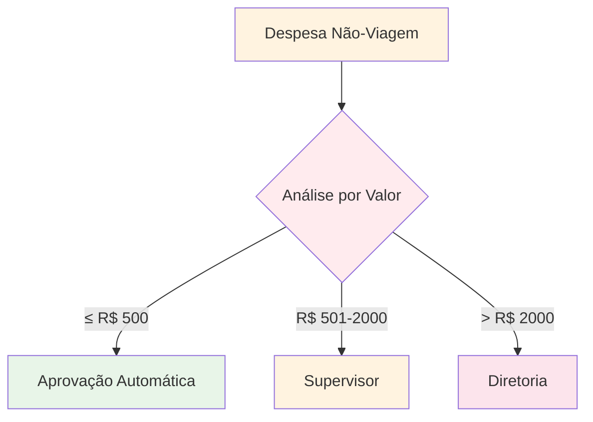

**Configuração do Switch Node "Análise por Valor"**:
- **Rule 1**: `{{ $json.valor <= 500 }}` → **Aprovação Automática**
- **Rule 2**: `{{ $json.valor > 500 && $json.valor <= 2000 }}` → **Supervisor**
- **Rule 3**: `{{ $json.valor > 2000 }}` → **Diretoria**

</TabItem>
<TabItem value="passo5" label="5. Ações Finais">

#### <IonicIcon name="checkmark-circle-outline" /> 5. Ações Finais – Processar Cada Caminho

<Tabs>
<TabItem value="rh" label="Caminho RH" default>

**Caminho RH (Viagens)**:

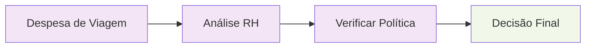

<CodeBlock language="javascript" title="Node: Enviar para RH">
{`{
  "aprovador": "RH",
  "mensagem": "Despesa de viagem para análise de política corporativa",
  "prioridade": "normal",
  "sla": "2 dias úteis"
}`}
</CodeBlock>

</TabItem>
<TabItem value="automatico" label="Aprovação Automática">

**Caminho Aprovação Automática**:

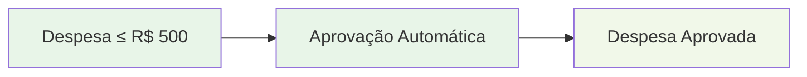

<CodeBlock language="javascript" title="Node: Aprovar Automaticamente">
{`{
  "status": "aprovado",
  "aprovador": "sistema",
  "data_aprovacao": "{{ $now }}",
  "observacao": "Aprovação automática - valor dentro do limite"
}`}
</CodeBlock>

</TabItem>
<TabItem value="supervisor" label="Supervisor">

**Caminho Supervisor**:

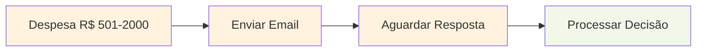

<CodeBlock language="javascript" title="Node: Enviar para Supervisor">
{`{
  "aprovador": "supervisor",
  "email_destino": "supervisor@empresa.com",
  "template": "aprovacao_supervisor",
  "dados_despesa": "{{ $json }}",
  "sla": "1 dia útil"
}`}
</CodeBlock>

</TabItem>
<TabItem value="diretoria" label="Diretoria">

**Caminho Diretoria**:

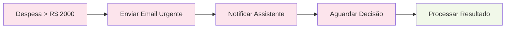

<CodeBlock language="javascript" title="Node: Enviar para Diretoria">
{`{
  "aprovador": "diretoria",
  "email_destino": "diretoria@empresa.com",
  "template": "aprovacao_diretoria",
  "urgencia": "alta",
  "dados_despesa": "{{ $json }}",
  "sla": "4 horas"
}`}
</CodeBlock>

</TabItem>
</Tabs>

</TabItem>
<TabItem value="passo6" label="6. Merge (Opcional)">

#### <IonicIcon name="git-merge-outline" /> 6. [Merge](/logica-e-dados/01-flow-logic/merging) – Reunir Resultados

**Objetivo**: Se etapas posteriores exigirem o conjunto completo de itens, configure *Wait → All*.

**Configurações importantes**:
- **Mode**: Wait
- **Strategy**: All
- **Timeout**: 30 minutos (para aprovações)

**Ações finais após merge**:
- Atualizar CRM
- Logar métricas
- Enviar notificação final
- Encerrar execução

</TabItem>
</Tabs>

## Lógica de Execução e Controle

### <IonicIcon name="settings-outline" /> Entendendo a Ordem de Execução

<Tabs>
<TabItem value="ordem" label="Ordem de Execução" default>

<Admonition type="info" title="Como o n8n executa ramificações">
- **Ordem**: O n8n executa o primeiro ramo que finalizar
- **Paralelismo**: Ramos são executados em paralelo por padrão
- **Sincronização**: Use **Merge** se precisar aguardar todos os ramos
- **Timeout**: Configure timeouts para evitar execuções infinitas
</Admonition>

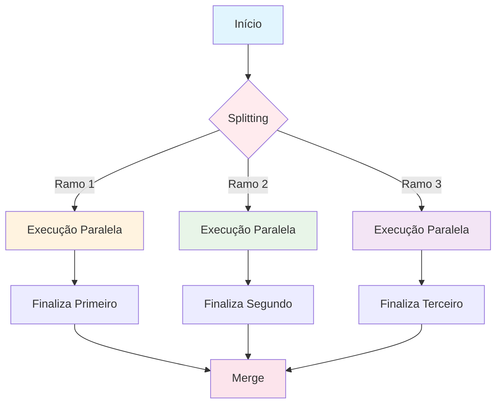

</TabItem>
<TabItem value="always-output" label="Always Output Data">

### <IonicIcon name="shield-checkmark-outline" /> Always Output Data

**Função**: Garante que mesmo um ramo "vazio" produza um item, evitando falhas na junção.

<Admonition type="warning" title="Quando usar Always Output Data">
✅ **Use quando:**
- Vai fazer [merge](/logica-e-dados/01-flow-logic/merging) depois
- Precisa garantir continuidade do fluxo
- Alguns ramos podem não ter dados

❌ **Não use quando:**
- Quer que ramos vazios parem a execução
- Dados vazios causariam problemas downstream
</Admonition>

**Exemplo prático**:
```javascript
// Sem Always Output Data
if (condicao_raramente_verdadeira) {
    return dados; // Só executa se condição for verdadeira
}
// Ramo pode ficar "vazio" e quebrar o merge

// Com Always Output Data
if (condicao_raramente_verdadeira) {
    return dados;
} else {
    return {}; // Sempre retorna algo, mesmo vazio
}
```

### <IonicIcon name="code-outline" /> Sintaxe JavaScript em Expressões

<Admonition type="tip" title="💡 Boas Práticas para Expressões">
**Sintaxe Recomendada:**
```javascript
// ✅ Sintaxe padrão (mais limpa)
{{ $json.valor > 1000 }}

// ✅ Sintaxe com brackets (necessária para propriedades especiais)
{{ $json["valor-especial"] > 1000 }}

// ✅ Tratamento de tipos
{{ parseInt($json.valor) > 1000 }}

// ✅ Tratamento de valores nulos/undefined
{{ ($json.valor || 0) > 1000 }}

// ✅ Verificação de existência
{{ $json.valor !== undefined && $json.valor > 1000 }}
```

**Evite:**
```javascript
// ❌ Pode causar erros com propriedades undefined
{{ $json.valor_inexistente > 1000 }}

// ❌ Sem tratamento de tipos
{{ $json.valor_string > 1000 }}

// ❌ Sem verificações de segurança
{{ $json.nested.deep.property }}
```
</Admonition>

</TabItem>
<TabItem value="paralelismo" label="Paralelismo">

### <IonicIcon name="flash-outline" /> Paralelismo e Performance

**Em instâncias self-hosted**: Habilite [filas Redis/RabbitMQ](/hosting-n8n/configuracao/queues) para processar ramos em paralelo.

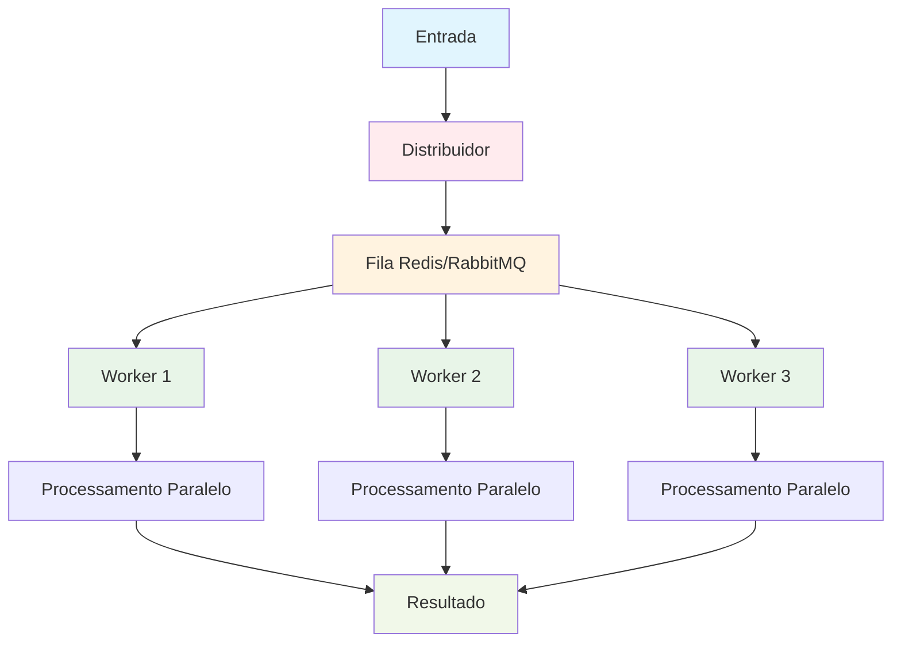

**Configuração para alta performance**:
- **Queue Mode**: Ativado
- **Concurrent Executions**: 10-50 (baseado na capacidade)
- **Timeout**: Configurado por tipo de processo
- **Retry Policy**: Configurada para falhas temporárias

### <IonicIcon name="rocket-outline" /> Performance em Produção

<Admonition type="tip" title="🚀 Configurações Otimizadas para Produção">
**Processamento Distribuído:**
- **Concurrent Executions**: 10-50 baseado na capacidade do servidor
- **Queue Mode**: Para processamento distribuído e alta concorrência
- **Worker Scaling**: Ajuste conforme demanda

**Estratégia de Timeout:**
- **Timeout Strategy**: 30s operações simples, 5min complexas
- **Connection Timeout**: 10s para APIs externas
- **Retry Backoff**: Exponencial com jitter

**Monitoramento:**
- **Métricas de Performance**: Latência, throughput, taxa de erro
- **Alertas**: Para timeouts e falhas de execução
- **Logs Estruturados**: Para debugging e análise
</Admonition>

### <IonicIcon name="analytics-outline" /> Monitoramento de Splitting

<Admonition type="info" title="📊 Métricas Essenciais para Workflows com Splitting">
**Eficiência de Roteamento:**
- **Split Efficiency**: % de dados que seguem o caminho esperado
- **Route Distribution**: Distribuição de itens por ramo
- **Condition Accuracy**: Taxa de acerto das condições

**Performance por Ramo:**
- **Branch Performance**: Tempo médio por ramo de execução
- **Bottleneck Detection**: Identificação de gargalos específicos
- **Parallel Efficiency**: Eficácia do processamento paralelo

**Qualidade e Confiabilidade:**
- **Error Rate**: Falhas por tipo de condição
- **Retry Success Rate**: Taxa de sucesso nas reexecuções
- **Data Quality**: Integridade dos dados em cada ramo
</Admonition>

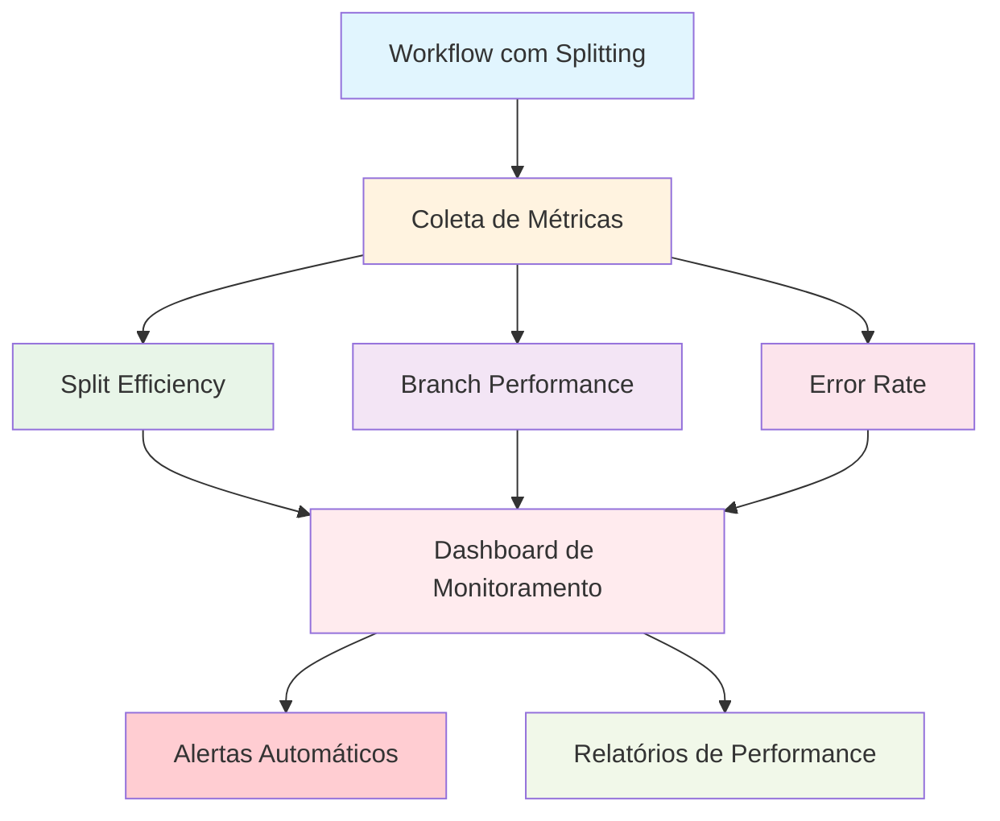

</TabItem>
</Tabs>

## Padrões Avançados de Splitting

<Tabs>
<TabItem value="sequencial" label="Splitting Sequencial" default>

### <IonicIcon name="arrow-down-outline" /> Splitting Sequencial (Cascata)

Para lógicas mais complexas, você pode encadear múltiplos splits - veja mais sobre [subworkflows](/logica-e-dados/01-flow-logic/subworkflows):

<Tabs>
<TabItem value="visao-geral" label="Visão Geral" default>

**Conceito Simplificado:**
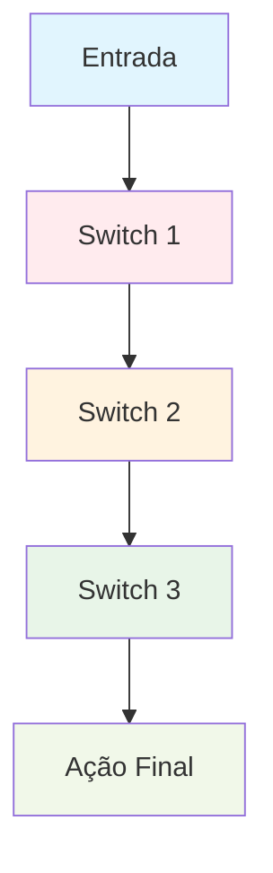

**Estrutura em Cascata:**
- **Nível 1**: Categorização inicial
- **Nível 2**: Refinamento por prioridade
- **Nível 3**: Decisão final por contexto

</TabItem>
<TabItem value="exemplo-pratico" label="Exemplo Prático">

**Sistema de Suporte Técnico - Passo a Passo:**

**1. Primeiro Split - Categoria:**
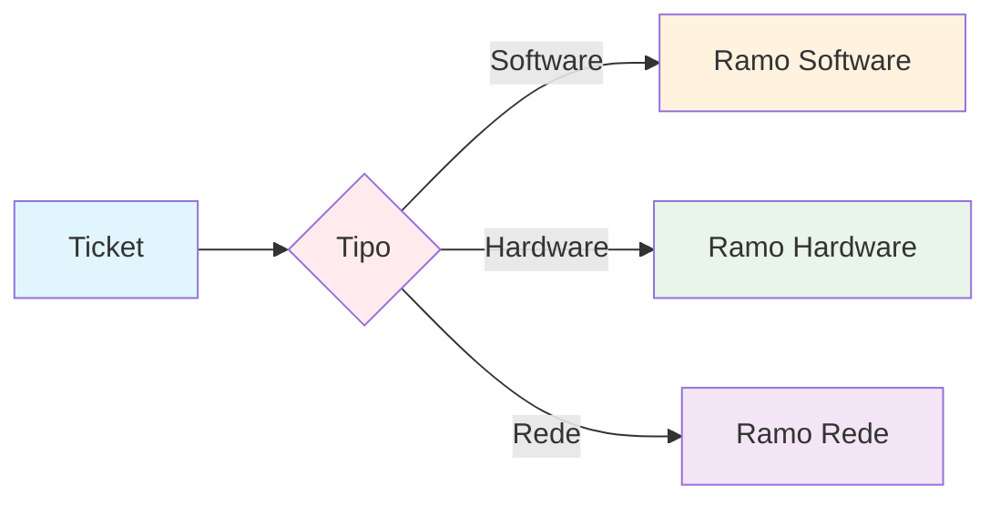

**2. Segundo Split - Criticidade:**
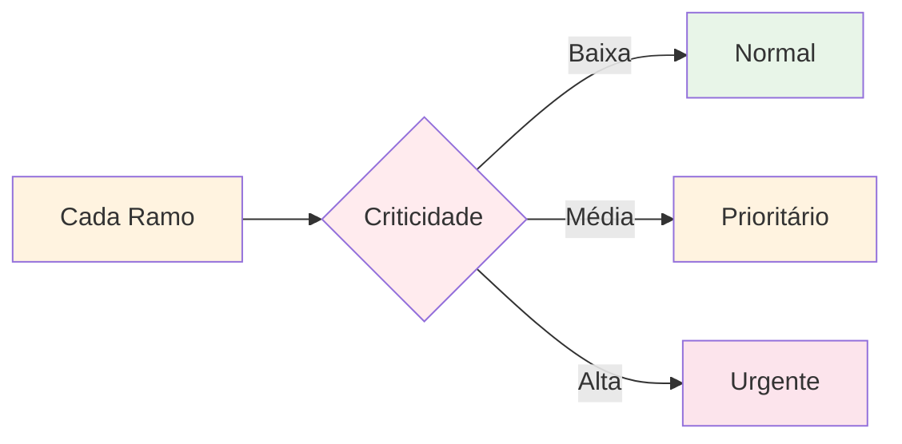

**3. Terceiro Split - Cliente:**
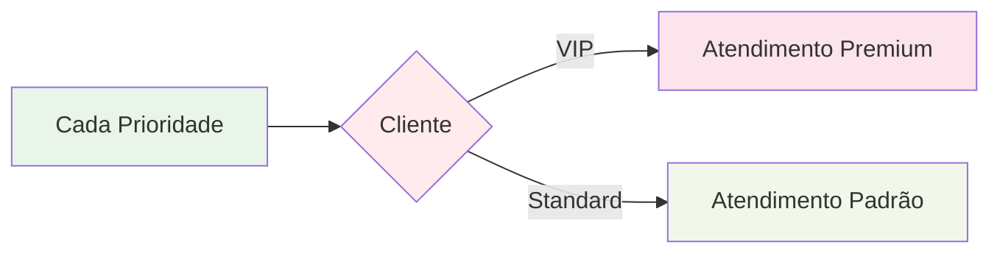

</TabItem>
<TabItem value="fluxo-completo" label="Fluxo Completo">

**Exemplo de um Caminho Completo:**

```mermaid
graph TD
    A[Ticket: Software + Alta + VIP] --> B[Switch 1: Software]
    B --> C[Switch 2: Criticidade Alta]
    C --> D[Switch 3: Cliente VIP]
    D --> E[Ação: Especialista + SLA 1h]
    
    style A fill:#e1f5fe
    style B fill:#fff3e0
    style C fill:#fce4ec
    style D fill:#ffebee
    style E fill:#f1f8e9
```

**Resultado Final:**
- **Software** → **Alta Criticidade** → **Cliente VIP** = **Especialista com SLA de 1 hora**

</TabItem>
</Tabs>

<Admonition type="example" title="Exemplo: Sistema de suporte técnico">
**Estrutura de Decisão em 3 Níveis:**
1. **Primeiro Split**: Tipo de problema (Software/Hardware/Rede)
2. **Segundo Split**: Criticidade (Baixa/Média/Alta)
3. **Terceiro Split**: Cliente (VIP/Standard)

**Resultado**: 18 combinações possíveis (3 × 3 × 2) com tratamento específico para cada uma
</Admonition>

</TabItem>
<TabItem value="paralelo" label="Splitting Paralelo">

### <IonicIcon name="resize-outline" /> Splitting Paralelo

Quando você precisa executar múltiplas verificações simultaneamente:

```mermaid
graph TD
    A[Entrada] --> B[Split Paralelo]
    B --> C[Verificação de Segurança]
    B --> D[Verificação de Compliance]
    B --> E[Verificação de Orçamento]
    
    C --> F[Resultado Segurança]
    D --> G[Resultado Compliance]
    E --> H[Resultado Orçamento]
    
    F --> I[Merge]
    G --> I
    H --> I
    
    I --> J[Decisão Final]
    
    style A fill:#e1f5fe
    style B fill:#ffebee
    style C fill:#fff3e0
    style D fill:#e8f5e8
    style E fill:#f3e5f5
    style F fill:#fff3e0
    style G fill:#e8f5e8
    style H fill:#f3e5f5
    style I fill:#fce4ec
    style J fill:#f1f8e9
```

</TabItem>
<TabItem value="merge" label="Splitting com Merge">

### <IonicIcon name="git-merge-outline" /> Splitting com [Merge](/logica-e-dados/01-flow-logic/merging)

Após dividir o fluxo, você pode reunir os caminhos usando um **[Merge node](/logica-e-dados/01-flow-logic/merging)**:

**Quando usar**: Quando diferentes caminhos precisam convergir para uma ação final comum.

**Modos de Merge Disponíveis:**
- **Append**: Concatena todos os dados de entrada
- **Keep Key Matches**: Mantém apenas itens com chaves correspondentes  
- **Remove Key Matches**: Remove itens duplicados por chave
- **Pass-through**: Passa dados do primeiro input que chegar

```mermaid
graph TD
    A[Pedido] --> B{Cliente VIP?}
    B -->|Sim| C[Desconto VIP 15%]
    B -->|Não| D[Desconto Padrão 5%]
    
    C --> E[Merge]
    D --> E
    
    E --> F[Processar Pagamento]
    F --> G[Enviar Confirmação]
    
    style A fill:#e1f5fe
    style B fill:#ffebee
    style C fill:#fff3e0
    style D fill:#e8f5e8
    style E fill:#fce4ec
    style F fill:#f3e5f5
    style G fill:#f1f8e9
```

<CodeBlock language="javascript" title="Exemplo: Processar pedido">
{`// Exemplo: Processar pedido
Pedido → IF (Cliente VIP?)
           ├── TRUE → Desconto VIP → 
           └── FALSE → Desconto Padrão → 
                                        ↘
                                     Merge → Processar Pagamento`}
</CodeBlock>

</TabItem>
</Tabs>

## <IonicIcon name="construct-outline" /> Debugging: Ferramentas e Técnicas

### <IonicIcon name="search-outline" /> Debugging de Condições

<Admonition type="tip" title="🔍 Técnicas de Debug para Splitting">
**1. Adicione um [Edit Fields (Set)](/integracoes/builtin-nodes/core-nodes/edit-fields-set) antes do split:**
```javascript
{
  "debug_valor": "{{ $json.categoria }}",
  "debug_tipo": "{{ typeof $json.categoria }}",
  "debug_condicao": "{{ $json.categoria === 'urgente' }}",
  "debug_timestamp": "{{ new Date().toISOString() }}"
}
```

**2. Use [Expression Editor](/referencia/glossario) para testar condições:**
- Teste expressões isoladamente
- Verifique tipos de dados
- Confirme valores antes de aplicar no workflow

**3. Ative logging no [Code node](/integracoes/builtin-nodes/core-nodes/code):**
```javascript
// Log detalhado para debug
console.log('Splitting Debug:', {
  item: $input.item,
  condition: $input.item.json.categoria === 'urgente',
  itemIndex: $itemIndex,
  timestamp: new Date().toISOString()
});

return $input.item;
```
</Admonition>

### <IonicIcon name="analytics-outline" /> Ferramentas de Debugging

**Ferramentas Built-in:**
- **Execution History**: Visualize dados em cada node
- **[Debug Helper](/integracoes/builtin-nodes/core-nodes/debug-helper)**: Insira breakpoints visuais
- **Data Pinning**: Congele dados para testes consistentes

**Ferramentas Externas:**
- **Webhook.site**: Para inspecionar payloads HTTP
- **Postman**: Para testes manuais de APIs
- **Browser DevTools**: Para debugging de expressões JavaScript

## Troubleshooting: Problemas Comuns

<Tabs>
<TabItem value="problema1" label="Workflow Para na Condição" default>

### <IonicIcon name="stop-circle-outline" /> ❌ Problema: "Workflow Para na Condição"

<Admonition type="warning" title="Sintomas">
O workflow executa até o node de splitting e não continua.
</Admonition>

```mermaid
graph TD
    A[Dados] --> B{Condição}
    B -.->|Problema| C[❌ Execução Para]
    
    style A fill:#e1f5fe
    style B fill:#ffebee
    style C fill:#ffcdd2
```

**Diagnóstico**:
1. Verifique se a condição está retornando o valor esperado
2. Teste a expressão no **Expression Editor**
3. Confirme se há dados na entrada do node

**Solução**:
<Tabs>
<TabItem value="incorreto" label="❌ Incorreto" default>

<CodeBlock language="javascript" title="Expressão incorreta">
{`{{ $json.valor > "1000" }}  // Comparando número com string`}
</CodeBlock>

</TabItem>
<TabItem value="correto" label="✅ Correto">

<CodeBlock language="javascript" title="Expressão correta">
{`{{ $json.valor > 1000 }}    // Comparando número com número`}
</CodeBlock>

Saiba mais sobre [expressões JavaScript](/referencia/glossario) e [tipos de dados](/logica-e-dados/02-data/data-structure).

</TabItem>
</Tabs>

</TabItem>
<TabItem value="problema2" label="Caminho Errado">

### <IonicIcon name="alert-circle-outline" /> ❌ Problema: "Caminho Errado Sendo Executado"

<Admonition type="warning" title="Sintomas">
Os dados seguem por um caminho diferente do esperado.
</Admonition>

```mermaid
graph TD
    A[Dados] --> B{Condição}
    B -->|Esperado| C[Caminho Correto]
    B -.->|Problema| D[❌ Caminho Errado]
    
    style A fill:#e1f5fe
    style B fill:#ffebee
    style C fill:#e8f5e8
    style D fill:#ffcdd2
```

**Diagnóstico**:
<CodeBlock language="javascript" title="Debug: Adicione um node 'Edit Fields' antes do split">
{`{
  "debug_valor": "{{ $json.valor }}",
  "debug_tipo": "{{ typeof $json.valor }}",
  "debug_condicao": "{{ $json.valor > 1000 }}"
}`}
</CodeBlock>

**Soluções comuns**:
- Converta tipos: `{{ parseInt($json.valor) > 1000 }}`
- Trate valores nulos: `{{ ($json.valor || 0) > 1000 }}`
- Use trim para strings: `{{ $json.categoria.trim() === "Viagem" }}`

Para mais informações sobre [tratamento de erros](/logica-e-dados/01-flow-logic/error-handling).

### <IonicIcon name="bug-outline" /> ❌ Problema: "Erro em Ramificação Específica"

<Admonition type="danger" title="Sintomas">
Uma ramificação falha mas o workflow continua nas outras.
</Admonition>

```mermaid
graph TD
    A[Dados] --> B{Switch}
    B --> C[Ramificação 1 ✅]
    B --> D[Ramificação 2 ❌]
    B --> E[Ramificação 3 ✅]
    
    D --> F[Error Trigger]
    F --> G[Tratamento de Erro]
    
    style A fill:#e1f5fe
    style B fill:#ffebee
    style C fill:#e8f5e8
    style D fill:#ffcdd2
    style E fill:#e8f5e8
    style F fill:#ffeaa7
    style G fill:#fdcb6e
```

**Solução**: Use [**Error Trigger**](/integracoes/builtin-nodes/core-nodes/error-trigger) para capturar erros em ramificações:
- **Error Trigger** captura falhas de qualquer node do workflow
- Configure **Error Workflow** específico para tratar falhas de splitting
- Use **Continue On Fail** em nodes críticos para não quebrar outras ramificações

</TabItem>
<TabItem value="problema3" label="Multiple Output Branches">

### <IonicIcon name="warning-outline" /> ❌ Problema: "Multiple Output Branches"

<Admonition type="warning" title="Sintomas">
Switch node criando saídas inesperadas.
</Admonition>

```mermaid
graph TD
    A[Switch Node] --> B[Output Esperado]
    A --> C[Output Esperado]
    A -.-> D[❌ Output Inesperado]
    A -.-> E[❌ Output Inesperado]
    
    style A fill:#ffebee
    style B fill:#e8f5e8
    style C fill:#e8f5e8
    style D fill:#ffcdd2
    style E fill:#ffcdd2
```

**Solução**: Configure adequadamente o **Mode**:
- **"Rules"**: Para múltiplas regras independentes
- **"Expression"**: Para lógica JavaScript personalizada

**Configurações Importantes:**
- **Send data to all matching outputs**: Controla se dados vão para todos os outputs que atendem as condições
- **Fallback Output**: Define comportamento para dados que não atendem nenhuma regra

</TabItem>
</Tabs>

## Casos de Uso Comuns

<Tabs>
<TabItem value="ecommerce" label="E-commerce" default>

### <IonicIcon name="storefront-outline" /> 1. E-commerce: Processamento de Pedidos

```mermaid
graph TD
    A[Pedido Recebido] --> B{Forma de Pagamento}
    B -->|Cartão| C[Processar Imediatamente]
    B -->|PIX| D[Aguardar Confirmação]
    B -->|Boleto| E[Gerar Boleto + Email]
    B -->|Crediário| F[Análise de Crédito]
    
    C --> G[Pedido Aprovado]
    D --> H[Verificar Pagamento]
    E --> I[Aguardar Pagamento]
    F --> J[Decisão Crédito]
    
    H --> G
    I --> G
    J -->|Aprovado| G
    J -->|Rejeitado| K[Pedido Cancelado]
    
    style A fill:#e1f5fe
    style B fill:#ffebee
    style C fill:#e8f5e8
    style D fill:#fff3e0
    style E fill:#f3e5f5
    style F fill:#fce4ec
    style G fill:#f1f8e9
    style K fill:#ffcdd2
```

Para integrar com APIs de pagamento brasileiras, consulte nossa seção sobre [integrações BR](/integracoes-br).

</TabItem>
<TabItem value="marketing" label="Marketing">

### <IonicIcon name="megaphone-outline" /> 2. Marketing: Segmentação de Leads

```mermaid
graph TD
    A[Lead Recebido] --> B{Empresa > 100 funcionários?}
    B -->|Sim| C[Vendas Enterprise]
    B -->|Não| D{Orçamento Mensal}
    
    D -->|Alto R$ 10k+| E[Vendas Premium]
    D -->|Médio R$ 1-10k| F[Vendas Standard]
    D -->|Baixo < R$ 1k| G[Marketing Nurturing]
    
    C --> H[Account Manager]
    E --> I[Consultor Senior]
    F --> J[Consultor Pleno]
    G --> K[Sequência de Emails]
    
    style A fill:#e1f5fe
    style B fill:#ffebee
    style D fill:#ffebee
    style C fill:#fce4ec
    style E fill:#fff3e0
    style F fill:#e8f5e8
    style G fill:#f3e5f5
```

</TabItem>
<TabItem value="suporte" label="Suporte">

### <IonicIcon name="headset-outline" /> 3. Suporte: Triagem de Tickets

```mermaid
graph TD
    A[Ticket Recebido] --> B{Análise de Palavras-chave}
    B -->|urgente/crítico| C[Nível 3 - Especialista]
    B -->|erro/bug| D[Nível 2 - Técnico]
    B -->|dúvida/como| E[Nível 1 - Suporte]
    B -->|Outros| F[Triagem Manual]
    
    C --> G[Resposta em 1h]
    D --> H[Resposta em 4h]
    E --> I[Resposta em 24h]
    F --> J[Análise Humana]
    
    style A fill:#e1f5fe
    style B fill:#ffebee
    style C fill:#fce4ec
    style D fill:#fff3e0
    style E fill:#e8f5e8
    style F fill:#f3e5f5
    style G fill:#ffcdd2
    style H fill:#fff3e0
    style I fill:#f1f8e9
```

Para automatizar respostas, considere usar [Slack](/integracoes/app-nodes/communication/slack) ou [Gmail](/integracoes/app-nodes/communication/gmail).

</TabItem>
</Tabs>

## Boas Práticas e Armadilhas

<Tabs>
<TabItem value="boas-praticas" label="✅ Boas Práticas" default>

### <IonicIcon name="checkmark-circle-outline" /> Boas Práticas Essenciais

<Admonition type="tip" title="🎯 Práticas Recomendadas">
**Nomenclatura e Documentação:**
- **Nomeie nós de forma autoexplicativa** (`IF Urgente?`, `SW Plano Suporte`)
- **Documente regras no Description** do nó para facilitar auditorias
- **Use comentários** para explicar lógicas complexas

**Estrutura e Organização:**
- **Evite aninhar IF dentro de IF**: prefira **Switch** quando houver >2 caminhos
- **Split Out antes de splitting** quando precisar percorrer cada linha de uma lista separadamente
- **Centralize regras de negócio** em nodes dedicados para facilitar manutenção

**Testes e Validação:**
- **Teste cenários extremos** (valores nulos, caminhos sem saída) antes de mover para produção
- **Valide tipos de dados** antes de fazer comparações
- **Configure timeouts** apropriados para cada tipo de processo
</Admonition>

```mermaid
graph TD
    A[Planejamento] --> B[Nomenclatura Clara]
    B --> C[Documentação]
    C --> D[Testes Abrangentes]
    D --> E[Deploy Seguro]
    
    style A fill:#e1f5fe
    style B fill:#fff3e0
    style C fill:#e8f5e8
    style D fill:#f3e5f5
    style E fill:#f1f8e9
```

</TabItem>
<TabItem value="armadilhas" label="❌ Armadilhas Comuns">

### <IonicIcon name="warning-outline" /> Armadilhas a Evitar

<Admonition type="danger" title="🚨 Cuidados Importantes">
**Problemas de Estrutura:**
- **Não aninhhe IFs excessivamente**: Torna o workflow difícil de manter
- **Evite splitting excessivo**: Máximo 3-4 níveis de profundidade
- **Não ignore o Always Output Data**: Pode quebrar merges

**Problemas de Dados:**
- **Não compare tipos diferentes**: `"100" !== 100`
- **Não assuma dados sempre existem**: Trate valores nulos/undefined
- **Não ignore case sensitivity**: `"VIAGEM" !== "viagem"`

**Problemas de Performance:**
- **Não crie nodes desnecessários**: Use Switch ao invés de múltiplos IFs
- **Não deixe execuções infinitas**: Configure timeouts
- **Não ignore recursos de paralelismo**: Use filas quando apropriado
</Admonition>

```mermaid
graph TD
    A[❌ Estrutura Ruim] --> B[Difícil Manutenção]
    C[❌ Dados Mal Tratados] --> D[Execuções Quebradas]
    E[❌ Performance Ignorada] --> F[Sistema Lento]
    
    style A fill:#ffcdd2
    style B fill:#ffcdd2
    style C fill:#ffcdd2
    style D fill:#ffcdd2
    style E fill:#ffcdd2
    style F fill:#ffcdd2
```

</TabItem>
<TabItem value="performance" label="🚀 Performance">

### <IonicIcon name="speedometer-outline" /> Otimização de Performance

**Estratégias de Otimização:**
- **Minimize nodes desnecessários**: Use Switch ao invés de múltiplos IFs sequenciais
- **Cache resultados**: Para condições computacionalmente caras
- **Use paralelismo**: Configure [filas Redis/RabbitMQ](/hosting-n8n/configuracao/queues) para alta concorrência

```mermaid
graph LR
    A[❌ Múltiplos IFs] --> B[✅ Um Switch]
    C[❌ Processamento Sequencial] --> D[✅ Processamento Paralelo]
    
    style A fill:#ffcdd2
    style B fill:#e8f5e8
    style C fill:#ffcdd2
    style D fill:#e8f5e8
```

**Configurações Recomendadas:**

<Admonition type="info" title="🌐 n8n Cloud vs Self-hosted">
**n8n Cloud:**
- **Timeout**: Limitado pela configuração da instância
- **Concorrência**: Baseado no plano contratado
- **Paralelismo**: Automático até o limite do plano

**Self-hosted:**
- **Timeout**: 30s para operações simples, 5min para complexas
- **Retry Policy**: 3 tentativas com backoff exponencial
- **Memory Limit**: Ajuste baseado no volume de dados
- **[Queue Mode](/hosting-n8n/configuracao/queues)**: Redis/RabbitMQ para alta concorrência
- **Worker Scaling**: Múltiplos workers para processamento distribuído
</Admonition>

### <IonicIcon name="swap-horizontal-outline" /> Migração de IF Múltiplos para Switch

<Admonition type="tip" title="🔄 Refatoração para Melhor Performance">
**Cenário Comum**: Workflows com múltiplos IFs aninhados que se tornaram difíceis de manter.

**Antes: Múltiplos IFs Aninhados**
```javascript
// ❌ Estrutura complexa e difícil de manter
IF (categoria === "software") {
  IF (prioridade === "alta") {
    IF (cliente === "vip") {
      // Ação específica
    } else {
      // Outra ação
    }
  } else {
    // Mais IFs...
  }
}
```

**Depois: Um Switch Organizado**
```javascript
// ✅ Estrutura clara e eficiente
SWITCH (categoria + "_" + prioridade + "_" + cliente) {
  case "software_alta_vip":
    // Ação específica
    break;
  case "software_alta_standard":
    // Outra ação
    break;
  default:
    // Ação padrão
}
```

**Benefícios da Migração:**
- **Manutenibilidade**: Código mais limpo e fácil de entender
- **Performance**: Menos overhead de processamento
- **Escalabilidade**: Fácil adição de novos casos
- **Debugging**: Mais simples identificar problemas

Para padrões mais complexos, considere usar [subworkflows](/logica-e-dados/01-flow-logic/subworkflows).
</Admonition>

```mermaid
graph TD
    A[IFs Múltiplos Aninhados] --> B[Análise de Padrões]
    B --> C[Identificar Combinações]
    C --> D[Criar Switch Unificado]
    D --> E[Testar Migração]
    E --> F[Deploy Otimizado]
    
    A --> G[❌ Difícil Manutenção]
    A --> H[❌ Performance Baixa]
    
    F --> I[✅ Código Limpo]
    F --> J[✅ Performance Melhor]
    
    style A fill:#ffcdd2
    style G fill:#ffcdd2
    style H fill:#ffcdd2
    style F fill:#e8f5e8
    style I fill:#e8f5e8
    style J fill:#e8f5e8
```

</TabItem>
<TabItem value="manutencao" label="🔧 Manutenibilidade">

### <IonicIcon name="construct-outline" /> Facilitar Manutenção

**Nomenclatura Consistente:**
```mermaid
graph LR
    A[❌ Nome Genérico: IF] --> B[✅ Nome Descritivo: IF Cliente VIP]
    
    style A fill:#ffcdd2
    style B fill:#e8f5e8
```

**Documentação Estruturada:**
- **Description**: Explique o propósito do nó
- **Notes**: Adicione contexto de negócio
- **Version Control**: Documente mudanças importantes

**Modularização:**
```mermaid
graph TD
    A[Regras Centralizadas] --> B[Node de Configuração]
    B --> C[Switch Dinâmico]
    C --> D[Fácil Manutenção]
    
    style A fill:#e1f5fe
    style B fill:#fff3e0
    style C fill:#e8f5e8
    style D fill:#f1f8e9
```

</TabItem>
</Tabs>

## <IonicIcon name="extension-puzzle-outline" /> Integração com Sub-workflows

### <IonicIcon name="git-branch-outline" /> Splitting + Execute Sub-workflow

Para lógicas complexas, combine splitting com [**Execute Sub-workflow**](/integracoes/builtin-nodes/core-nodes/execute-sub-workflow):

```mermaid
graph TD
    A[Trigger Principal] --> B{Switch por Categoria}
    B -->|Financeiro| C[Sub-workflow Financeiro]
    B -->|RH| D[Sub-workflow RH]
    B -->|TI| E[Sub-workflow TI]
    
    C --> F[Resultado Financeiro]
    D --> G[Resultado RH]  
    E --> H[Resultado TI]
    
    F --> I[Merge Final]
    G --> I
    H --> I
    
    style A fill:#e1f5fe
    style B fill:#ffebee
    style C fill:#fff3e0
    style D fill:#e8f5e8
    style E fill:#f3e5f5
    style F fill:#fff3e0
    style G fill:#e8f5e8
    style H fill:#f3e5f5
    style I fill:#fce4ec
```

**Vantagens:**
- **Modularidade**: Cada sub-workflow é independente e reutilizável
- **Manutenção**: Easier debugging e atualizações
- **Performance**: Sub-workflows podem rodar em paralelo
- **Organização**: Separa lógica complexa em componentes menores

**Configuração:**
1. **Workflow Principal**: Contém o splitting logic
2. **Sub-workflows**: Cada um com lógica específica de categoria
3. **Error Handling**: Cada sub-workflow pode ter seu próprio tratamento de erro
4. **[Workflow Trigger](/integracoes/builtin-nodes/core-nodes/workflow-trigger)**: Para comunicação entre workflows

<CodeBlock language="javascript" title="Exemplo: Dados passados para sub-workflow">
{`// No Execute Sub-workflow node:
{
  "categoria": "{{ $json.categoria }}",
  "dados_originais": "{{ $json }}",
  "workflow_origem": "{{ $workflow.name }}",
  "timestamp": "{{ new Date().toISOString() }}"
}`}
</CodeBlock>

## Próximos Passos

<Admonition type="info" title="Agora que você domina splitting básico, explore:">
1. **[Merge Nodes](/logica-e-dados/01-flow-logic/merging)**: Como reunir fluxos divididos
2. **[Error Handling](/logica-e-dados/01-flow-logic/error-handling)**: Tratamento de erros em fluxos condicionais  
3. **[Looping](/logica-e-dados/01-flow-logic/looping)**: Lógica de repetição em workflows
4. **[Sub-workflows](/logica-e-dados/01-flow-logic/subworkflows)**: Workflows aninhados
5. **[Waiting](/logica-e-dados/01-flow-logic/waiting)**: Controle de tempo e aguardo
6. **[Execute Sub-workflow](/integracoes/builtin-nodes/core-nodes/execute-sub-workflow)**: Modularização avançada
</Admonition>

### <IonicIcon name="school-outline" /> Exercício Prático

<Admonition type="tip" title="Desafio">
**Crie um workflow de aprovação de férias que:**
- Funcionários CLT: Máximo 30 dias, aprovação do supervisor
- Funcionários PJ: Sem limite, apenas notificação
- Períodos de alta temporada: Sempre requer aprovação da diretoria
- Solicitações com menos de 30 dias de antecedência: Aprovação expressa

*Dica*: Use [Switch aninhados](/integracoes/builtin-nodes/logic-control) e considere múltiplas condições simultâneas.
</Admonition>

## Resumo Rápido

<Admonition type="success" title="🎯 Pontos-Chave para Dominar Splitting">
**Conceitos Fundamentais:**
- **Splitting** = usar **IF** e **Switch** para criar múltiplos caminhos de execução
- Escolha **IF** para decisões binárias; **Switch** para múltiplos casos
- **Não confunda** com Split Out (que quebra listas em itens individuais)

**Implementação Prática:**
- Combine ramificações com **Merge** quando necessário, mantendo integridade dos dados
- Ative **Always Output Data** em ramos críticos para evitar execuções "mortas"
- Configure **timeouts** e **retry policies** apropriados

**Boas Práticas:**
- **Nomeie nós claramente** para facilitar manutenção
- **Documente regras complexas** no Description
- **Teste cenários extremos** antes de produção
- **Use paralelismo** para alta performance

**Ordem de Execução:**
- O n8n executa ramos em **paralelo** por padrão
- Use **Merge** se precisar aguardar todos os ramos
- Configure **filas Redis/RabbitMQ** para processamento distribuído
</Admonition>

### <IonicIcon name="library-outline" /> Fluxo de Aprendizado Recomendado

```mermaid
graph TD
    A[1. Entender Conceitos] --> B[2. Praticar IF/Switch]
    B --> C[3. Implementar Merge]
    C --> D[4. Otimizar Performance]
    D --> E[5. Aplicar em Produção]
    
    A --> F[Splitting vs Split Out]
    B --> G[Always Output Data]
    C --> H[Estratégias de Merge]
    D --> I[Paralelismo]
    E --> J[Monitoramento]
    
    style A fill:#e1f5fe
    style B fill:#fff3e0
    style C fill:#e8f5e8
    style D fill:#f3e5f5
    style E fill:#f1f8e9
    style F fill:#fce4ec
    style G fill:#fce4ec
    style H fill:#fce4ec
    style I fill:#fce4ec
    style J fill:#fce4ec
```

Com esses fundamentos, você está pronto para projetar workflows n8n que se adaptam dinamicamente a qualquer cenário de negócios, mantendo o código enxuto e a manutenção simples.

---

<Admonition type="note" title="📚 Recursos Adicionais">
- [Documentação Oficial - Switch Node](https://docs.n8n.io/integrations/builtin/core-nodes/n8n-nodes-base.switch/)
- [Documentação Oficial - IF Node](https://docs.n8n.io/integrations/builtin/core-nodes/n8n-nodes-base.if/)
- [Documentação Oficial - Merge Node](https://docs.n8n.io/integrations/builtin/core-nodes/n8n-nodes-base.merge/)
- [Error Trigger Node](/integracoes/builtin-nodes/core-nodes/error-trigger)
- [Execute Sub-workflow Node](/integracoes/builtin-nodes/core-nodes/execute-sub-workflow)
- [Expressões JavaScript no n8n](/referencia/glossario)
- [Exemplos de Workflows](/catalogo)
- [Integrações Brasileiras](/integracoes-br)
- [Guia de Instalação](/hosting-n8n/instalacao)
</Admonition>
