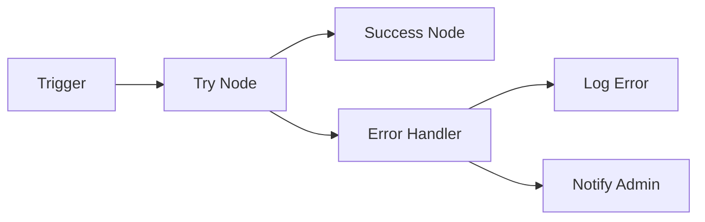
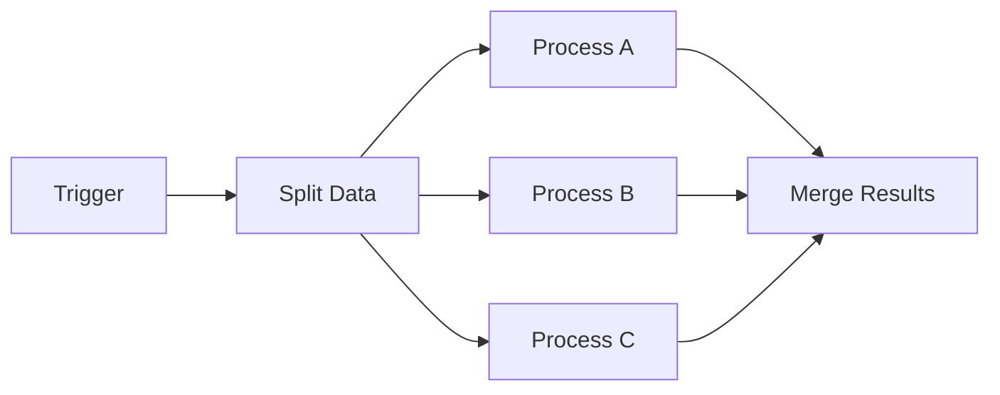
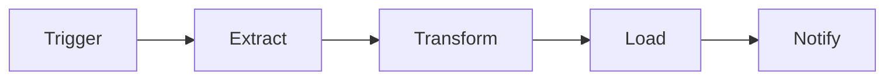
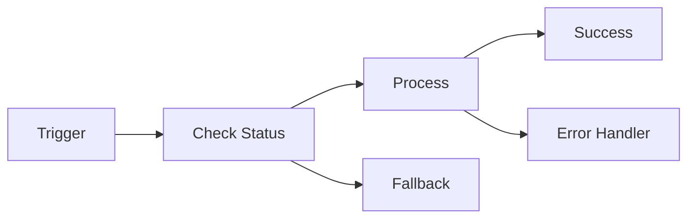

# <ion-icon name="git-network-outline" style={{ fontSize: '24px', color: '#ea4b71' }}></ion-icon> Conexões entre Nodes

As conexões são a base de qualquer workflow no n8n, definindo como os dados fluem de um node para outro e criando a lógica de execução da sua automação.

## <ion-icon name="information-circle-outline" style={{ fontSize: '24px', color: '#ea4b71' }}></ion-icon> O que são Conexões?

Conexões são linhas que conectam nodes, definindo:

- **Ordem de execução** dos nodes
- **Fluxo de dados** entre operações
- **Lógica condicional** do workflow
- **Tratamento de erros** e exceções

### Tipos de Conexões

#### Main Connection (Conexão Principal)

A conexão padrão que transporta dados de sucesso:

- **Cor**: Azul (padrão)
- **Função**: Passa dados de um node para outro
- **Uso**: Fluxo normal de execução

#### Error Connection (Conexão de Erro)

Trata falhas e exceções:

- **Cor**: Vermelha
- **Função**: Captura erros e falhas
- **Uso**: Tratamento de exceções

#### Optional Connection (Conexão Opcional)

Conexões que podem ou não ser executadas:

- **Cor**: Cinza
- **Função**: Fluxos condicionais
- **Uso**: Lógica alternativa

## <ion-icon name="chevron-forward-outline" style={{ fontSize: '24px', color: '#ea4b71' }}></ion-icon> Como Criar Conexões

### Método Visual

1. **Clique** no ponto de saída de um node
2. **Arraste** até o ponto de entrada de outro node
3. **Solte** para criar a conexão

### Método Rápido

1. **Selecione** o node de origem
2. **Pressione** `Ctrl/Cmd + K`
3. **Digite** o nome do node de destino
4. **Pressione** `Enter`

### Múltiplas Conexões

Um node pode ter múltiplas conexões de saída:

- **Conexões paralelas**: Execução simultânea
- **Conexões condicionais**: Baseadas em condições
- **Conexões de erro**: Para tratamento de falhas

## <ion-icon name="code-slash-outline" style={{ fontSize: '24px', color: '#ea4b71' }}></ion-icon> Tipos de Fluxo

### Fluxo Linear

A forma mais simples de conexão:

```
Trigger → Node A → Node B → Node C
```

**Características:**
- Execução sequencial
- Dados passam de um para outro
- Falha em qualquer node para o workflow

### Fluxo Paralelo

Múltiplas conexões saindo do mesmo node:

```
Trigger → Node A → Node B
        → Node C
        → Node D
```

**Características:**
- Execução simultânea
- Cada ramo processa independentemente
- Útil para operações independentes

### Fluxo Condicional

Conexões baseadas em condições:

```
Trigger → IF Node → Node A (se verdadeiro)
                → Node B (se falso)
```

**Características:**
- Decisões baseadas em dados
- Fluxos alternativos
- Lógica de negócio complexa

### Fluxo de Erro

Tratamento de falhas e exceções:

```
Trigger → Node A → Node B (sucesso)
        → Error Handler (falha)
```

**Características:**
- Captura erros automaticamente
- Permite recuperação
- Logging de falhas

## <ion-icon name="bulb-outline" style={{ fontSize: '24px', color: '#ea4b71' }}></ion-icon> Padrões de Conexão

### Padrão Try-Catch



### Padrão Fan-Out



### Padrão Pipeline



### Padrão Circuit Breaker



## <ion-icon name="settings-outline" style={{ fontSize: '24px', color: '#ea4b71' }}></ion-icon> Configurações de Conexão

### Condições de Conexão

Defina quando uma conexão deve ser executada:

```javascript
// Executar apenas se status for 'ativo'
{{ $json.status === 'ativo' }}

// Executar se valor for maior que 100
{{ $json.valor > 100 }}

// Executar se email existir
{{ $json.email && $json.email.includes('@') }}
```

### Múltiplas Condições

Combine condições com operadores lógicos:

```javascript
// E lógico (AND)
{{ $json.status === 'ativo' && $json.valor > 100 }}

// OU lógico (OR)
{{ $json.prioridade === 'alta' || $json.urgente === true }}

// Negação (NOT)
{{ !$json.processado }}
```

### Expressões Complexas

```javascript
// Verificar múltiplos campos
{{ $json.nome && $json.email && $json.telefone }}

// Validação de dados
{{ $json.idade >= 18 && $json.idade <= 65 }}

// Verificar tipo de dados
{{ typeof $json.valor === 'number' && $json.valor > 0 }}
```

## <ion-icon name="warning-outline" style={{ fontSize: '24px', color: '#ea4b71' }}></ion-icon> Problemas Comuns

### Conexões Circulares

**Problema:** Workflow entra em loop infinito

**Solução:**
- Evite conectar um node de volta a si mesmo
- Use condições para quebrar loops
- Implemente contadores de iteração

### Conexões Perdidas

**Problema:** Dados não chegam ao destino

**Solução:**
- Verifique se a conexão está ativa
- Confirme condições de conexão
- Teste com dados de exemplo

### Performance

**Problema:** Workflow lento ou travado

**Solução:**
- Limite conexões paralelas excessivas
- Use filtros para reduzir volume de dados
- Implemente timeouts adequados

## <ion-icon name="analytics-outline" style={{ fontSize: '24px', color: '#ea4b71' }}></ion-icon> Debugging de Conexões

### Verificar Fluxo

1. **Execute step by step** para ver o caminho dos dados
2. **Verifique dados** em cada node
3. **Analise logs** de execução
4. **Teste condições** individualmente

### Ferramentas de Debug

- **Execution Log**: Histórico completo
- **Data Viewer**: Visualizar dados em cada step
- **Connection Tester**: Validar conexões
- **Performance Monitor**: Identificar gargalos

### Logs de Conexão

```javascript
// Log no início de cada node
{{ console.log('Iniciando processamento:', $json.id) }}

// Log de dados importantes
{{ console.log('Dados recebidos:', JSON.stringify($json)) }}

// Log de condições
{{ console.log('Condição avaliada:', $json.status === 'ativo') }}
```

## <ion-icon name="trending-up-outline" style={{ fontSize: '24px', color: '#ea4b71' }}></ion-icon> Otimização

### Reduzir Complexidade

- **Simplifique** workflows muito complexos
- **Use subworkflows** para modularizar
- **Elimine** conexões desnecessárias
- **Documente** fluxos complexos

### Melhorar Performance

- **Processe em lotes** quando possível
- **Use filtros** para reduzir dados
- **Implemente cache** para dados repetitivos
- **Monitore** uso de recursos

### Manutenibilidade

- **Nomeie nodes** de forma descritiva
- **Use comentários** para explicar lógica
- **Organize** workflows logicamente
- **Version controle** suas mudanças

## <ion-icon name="arrow-forward-circle-outline" style={{ fontSize: '24px', color: '#ea4b71' }}></ion-icon> Próximos Passos

1. **[Execution Order](../01-flow-logic/execution-order)** - Entender ordem de execução
2. **[Error Handling](../01-flow-logic/error-handling)** - Tratamento robusto de erros
3. **[Subworkflows](../01-flow-logic/subworkflows)** - Modularização de workflows

## <ion-icon name="help-circle-outline" style={{ fontSize: '24px', color: '#ea4b71' }}></ion-icon> Recursos Úteis

### Documentação Relacionada

- **[Execution Order](../01-flow-logic/execution-order)** - Ordem de execução
- **[Error Handling](../01-flow-logic/error-handling)** - Tratamento de erros
- **[Subworkflows](../01-flow-logic/subworkflows)** - Workflows modulares

### Links Externos

- **[n8n Workflows](https://docs.n8n.io/workflows/)** - Documentação oficial
- **[n8n Community](https://community.n8n.io/)** - Fórum para dúvidas
- **[Workflow Examples](https://docs.n8n.io/workflows/examples/)** - Exemplos práticos

---

**<ion-icon name="git-network-outline" style={{ fontSize: '16px', color: '#ea4b71' }}></ion-icon> Conexões bem estruturadas criam workflows eficientes e confiáveis!** 