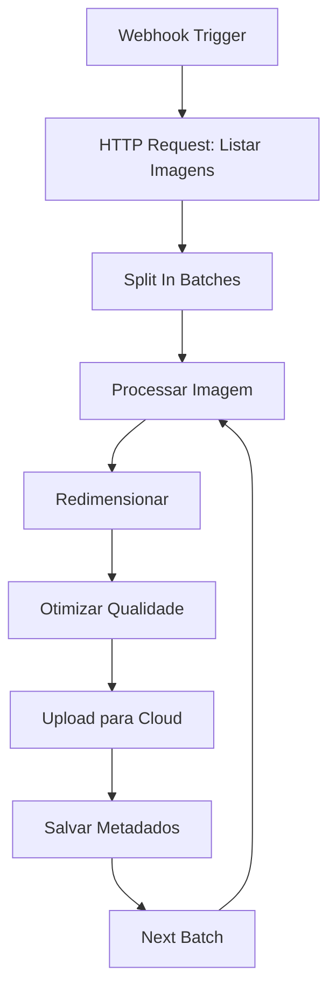
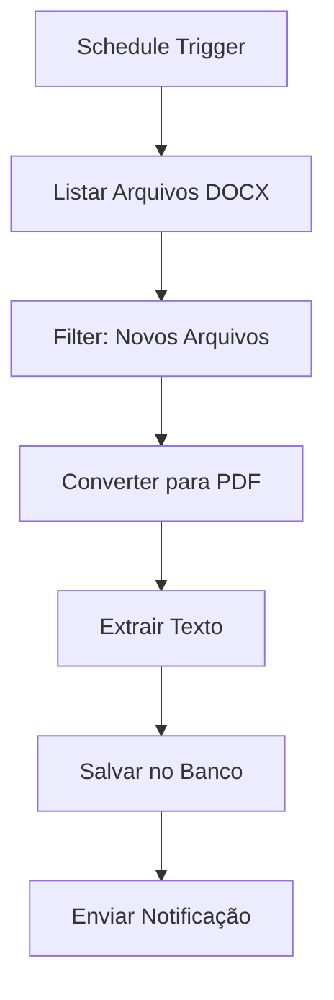

# Dados Binários e Arquivos

O n8n oferece suporte robusto para trabalhar com dados binários e arquivos, permitindo upload, download, processamento e manipulação de diversos tipos de arquivos. Esta seção aborda como trabalhar eficientemente com arquivos em seus workflows.

## Visão Geral

Dados binários são informações não-textuais como imagens, documentos, vídeos, arquivos ZIP e outros formatos. O n8n trata esses dados de forma especial para garantir integridade e performance durante o processamento.

## Tipos de Dados Binários Suportados

### Formatos Comuns

- **Imagens**: JPG, PNG, GIF, SVG, WebP
- **Documentos**: PDF, DOC, DOCX, XLS, XLSX, PPT, PPTX
- **Arquivos de Mídia**: MP3, MP4, AVI, MOV
- **Arquivos Compactados**: ZIP, RAR, 7Z, TAR.GZ
- **Dados Estruturados**: JSON, XML, CSV (como binário)
- **Arquivos de Sistema**: LOG, CONFIG, DAT

### Estrutura de Dados Binários

No n8n, dados binários são representados como objetos com propriedades específicas:

```json
{
  "data": "iVBORw0KGgoAAAANSUhEUgAAAAEAAAABCAYAAAAfFcSJAAAADUlEQVR42mNkYPhfDwAChwGA60e6kgAAAABJRU5ErkJggg==",
  "mimeType": "image/png",
  "fileName": "imagem.png",
  "directory": "/uploads/",
  "fileSize": 1024
}
```

## Upload e Download de Arquivos

### Upload de Arquivos

Configure nodes para receber uploads de arquivos:

```javascript
// Exemplo: Webhook para upload de arquivo
{
  "httpMethod": "POST",
  "path": "upload",
  "responseMode": "responseNode",
  "options": {
    "rawBody": true,
    "responseHeaders": {
      "Content-Type": "application/json"
    }
  }
}
```

### Download de Arquivos

Baixe arquivos de APIs e serviços externos:

```javascript
// Exemplo: Download de arquivo via HTTP Request
{
  "url": "https://api.exemplo.com/arquivos/123",
  "method": "GET",
  "options": {
    "response": {
      "response": {
        "responseFormat": "file"
      }
    }
  }
}
```

## Processamento de Arquivos

### Conversão de Formatos

Converta arquivos entre diferentes formatos:

```javascript
// Converter imagem para base64
const imagemBase64 = $input.first().json.data;
const buffer = Buffer.from(imagemBase64, 'base64');

// Converter para outro formato usando biblioteca externa
const sharp = require('sharp');
const imagemConvertida = await sharp(buffer)
  .resize(800, 600)
  .jpeg({ quality: 80 })
  .toBuffer();

return {
  data: imagemConvertida.toString('base64'),
  mimeType: 'image/jpeg',
  fileName: 'imagem_convertida.jpg'
};
```

### Compressão e Descompressão

Trabalhe com arquivos compactados:

```javascript
// Comprimir arquivos
const archiver = require('archiver');
const fs = require('fs');

const output = fs.createWriteStream('arquivos.zip');
const archive = archiver('zip', { zlib: { level: 9 }});

archive.pipe(output);
archive.file('documento.pdf', { name: 'documento.pdf' });
archive.file('imagem.jpg', { name: 'imagem.jpg' });
await archive.finalize();

// Descomprimir arquivos
const unzipper = require('unzipper');
const extract = await unzipper.Open.file('arquivos.zip');
const arquivos = await extract.files;
```

## Manipulação de Imagens

### Redimensionamento e Otimização

```javascript
// Redimensionar imagem mantendo proporção
const sharp = require('sharp');

const processarImagem = async (imagemBase64, largura, altura) => {
  const buffer = Buffer.from(imagemBase64, 'base64');
  
  const imagemProcessada = await sharp(buffer)
    .resize(largura, altura, {
      fit: 'inside',
      withoutEnlargement: true
    })
    .jpeg({ quality: 85, progressive: true })
    .toBuffer();
    
  return {
    data: imagemProcessada.toString('base64'),
    mimeType: 'image/jpeg',
    fileName: 'imagem_otimizada.jpg'
  };
};
```

### Aplicação de Filtros

```javascript
// Aplicar filtros em imagens
const aplicarFiltro = async (imagemBase64, filtro) => {
  const buffer = Buffer.from(imagemBase64, 'base64');
  let imagemProcessada = sharp(buffer);
  
  switch(filtro) {
    case 'grayscale':
      imagemProcessada = imagemProcessada.grayscale();
      break;
    case 'blur':
      imagemProcessada = imagemProcessada.blur(5);
      break;
    case 'sharpen':
      imagemProcessada = imagemProcessada.sharpen();
      break;
  }
  
  const resultado = await imagemProcessada.toBuffer();
  return {
    data: resultado.toString('base64'),
    mimeType: 'image/jpeg',
    fileName: `imagem_${filtro}.jpg`
  };
};
```

## Processamento de Documentos

### Extração de Texto

```javascript
// Extrair texto de PDF
const pdf = require('pdf-parse');

const extrairTextoPDF = async (pdfBase64) => {
  const buffer = Buffer.from(pdfBase64, 'base64');
  const data = await pdf(buffer);
  
  return {
    texto: data.text,
    paginas: data.numpages,
    info: data.info
  };
};
```

### Conversão de Documentos

```javascript
// Converter DOCX para PDF
const libre = require('libreoffice-convert');
const { promisify } = require('util');

const converter = promisify(libre.convert);

const converterParaPDF = async (docxBase64) => {
  const buffer = Buffer.from(docxBase64, 'base64');
  const pdfBuffer = await converter(buffer, 'pdf', undefined);
  
  return {
    data: pdfBuffer.toString('base64'),
    mimeType: 'application/pdf',
    fileName: 'documento.pdf'
  };
};
```

## Armazenamento e Gerenciamento

### Upload para Cloud Storage

```javascript
// Upload para AWS S3
const AWS = require('aws-sdk');
const s3 = new AWS.S3();

const uploadParaS3 = async (arquivoBase64, nomeArquivo, bucket) => {
  const buffer = Buffer.from(arquivoBase64, 'base64');
  
  const params = {
    Bucket: bucket,
    Key: nomeArquivo,
    Body: buffer,
    ContentType: 'application/octet-stream',
    ACL: 'private'
  };
  
  const resultado = await s3.upload(params).promise();
  return {
    url: resultado.Location,
    key: resultado.Key,
    etag: resultado.ETag
  };
};
```

### Validação de Arquivos

```javascript
// Validar tipo e tamanho de arquivo
const validarArquivo = (arquivoBase64, mimeType, tamanhoMaximo) => {
  const buffer = Buffer.from(arquivoBase64, 'base64');
  const tamanho = buffer.length;
  
  // Validar tamanho
  if (tamanho > tamanhoMaximo) {
    throw new Error(`Arquivo muito grande: ${tamanho} bytes (máximo: ${tamanhoMaximo})`);
  }
  
  // Validar tipo MIME
  const tiposPermitidos = [
    'image/jpeg', 'image/png', 'image/gif',
    'application/pdf', 'application/msword',
    'application/vnd.openxmlformats-officedocument.wordprocessingml.document'
  ];
  
  if (!tiposPermitidos.includes(mimeType)) {
    throw new Error(`Tipo de arquivo não permitido: ${mimeType}`);
  }
  
  return true;
};
```

## Workflows Práticos

### Workflow: Processamento de Imagens em Lote



### Workflow: Conversão de Documentos



## Configurações de Performance

### Otimização de Memória

```javascript
// Processar arquivos grandes em chunks
const processarArquivoGrande = async (arquivoBase64, chunkSize = 1024 * 1024) => {
  const buffer = Buffer.from(arquivoBase64, 'base64');
  const chunks = [];
  
  for (let i = 0; i < buffer.length; i += chunkSize) {
    const chunk = buffer.slice(i, i + chunkSize);
    chunks.push(chunk);
  }
  
  // Processar cada chunk
  const resultados = [];
  for (const chunk of chunks) {
    const resultado = await processarChunk(chunk);
    resultados.push(resultado);
  }
  
  return Buffer.concat(resultados);
};
```

### Cache de Arquivos

```javascript
// Implementar cache para arquivos frequentemente acessados
const cache = new Map();

const obterArquivoComCache = async (id, ttl = 3600000) => {
  const cacheKey = `arquivo_${id}`;
  
  if (cache.has(cacheKey)) {
    const cached = cache.get(cacheKey);
    if (Date.now() - cached.timestamp < ttl) {
      return cached.data;
    }
  }
  
  // Buscar do storage
  const arquivo = await buscarArquivo(id);
  cache.set(cacheKey, {
    data: arquivo,
    timestamp: Date.now()
  });
  
  return arquivo;
};
```

## Tratamento de Erros

### Erros Comuns e Soluções

```javascript
// Tratamento robusto de erros
const processarArquivoSeguro = async (arquivoBase64) => {
  try {
    // Validar entrada
    if (!arquivoBase64) {
      throw new Error('Dados do arquivo não fornecidos');
    }
    
    // Verificar formato base64 válido
    if (!/^[A-Za-z0-9+/]*={0,2}$/.test(arquivoBase64)) {
      throw new Error('Formato base64 inválido');
    }
    
    const buffer = Buffer.from(arquivoBase64, 'base64');
    
    // Verificar tamanho mínimo
    if (buffer.length < 10) {
      throw new Error('Arquivo muito pequeno');
    }
    
    return await processarArquivo(buffer);
    
  } catch (error) {
    console.error('Erro ao processar arquivo:', error.message);
    
    // Retornar erro estruturado
    return {
      success: false,
      error: error.message,
      timestamp: new Date().toISOString()
    };
  }
};
```

## Boas Práticas

### Segurança

- **Valide sempre** o tipo e tamanho dos arquivos
- **Use HTTPS** para transferência de arquivos
- **Implemente autenticação** para uploads
- **Sanitize nomes de arquivos** para evitar path traversal
- **Limite tipos de arquivo** permitidos

### Performance

- **Processe arquivos grandes** em chunks
- **Use streams** para arquivos muito grandes
- **Implemente cache** para arquivos frequentemente acessados
- **Comprima arquivos** antes do upload
- **Use CDN** para distribuição de arquivos

### Organização

- **Estruture pastas** logicamente
- **Use nomes descritivos** para arquivos
- **Implemente versionamento** de arquivos
- **Mantenha metadados** organizados
- **Faça backup regular** dos arquivos

## Recursos Adicionais

### Bibliotecas Úteis

- **Sharp**: Processamento de imagens
- **PDF-lib**: Manipulação de PDFs
- **Archiver**: Compressão de arquivos
- **Multer**: Upload de arquivos
- **File-type**: Detecção de tipo de arquivo

### APIs e Serviços

- **AWS S3**: Armazenamento em nuvem
- **Google Cloud Storage**: Armazenamento alternativo
- **Cloudinary**: Processamento de imagens
- **DocRaptor**: Conversão de documentos

---

**Próximo**: [Transformações de Dados](./transformacoes-dados) - Técnicas avançadas de transformação e manipulação de dados 