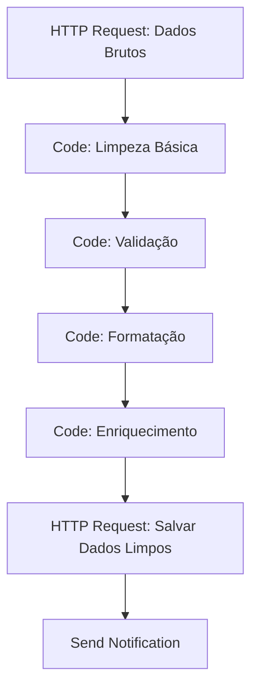
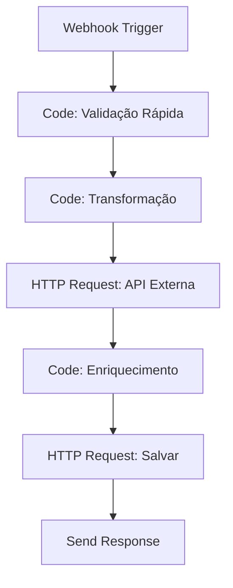

# Edição de Dados

A edição de dados é fundamental para transformar, limpar e preparar informações para uso em workflows. Esta seção aborda técnicas avançadas de edição, transformação e manipulação de dados no n8n.

## Visão Geral

A edição de dados envolve modificar, limpar e transformar informações para atender às necessidades específicas dos workflows. No n8n, você pode editar dados usando:

- **Transformações básicas** de tipos e formatos
- **Limpeza e normalização** de dados
- **Enriquecimento** com informações adicionais
- **Validação e correção** automática
- **Transformações complexas** com JavaScript

## Tipos de Edição

### Transformações Básicas

Operações fundamentais de transformação de dados:

```javascript
// Converter tipos de dados
const converterTipos = (dados) => {
  return dados.map(item => ({
    ...item,
    // Converter string para número
    valor: parseFloat(item.valor) || 0,
    // Converter string para boolean
    ativo: item.ativo === 'true' || item.ativo === true,
    // Converter string para data
    dataCriacao: new Date(item.dataCriacao),
    // Converter número para string
    id: item.id.toString()
  }));
};

// Formatar valores monetários
const formatarMoeda = (valor, moeda = 'BRL') => {
  return new Intl.NumberFormat('pt-BR', {
    style: 'currency',
    currency: moeda
  }).format(valor);
};

// Exemplo: Formatar preços
const produtosFormatados = produtos.map(produto => ({
  ...produto,
  precoFormatado: formatarMoeda(produto.preco),
  precoComDesconto: formatarMoeda(produto.preco * 0.9)
}));
```

### Limpeza de Dados

Remover inconsistências e padronizar dados:

```javascript
// Limpar e normalizar texto
const limparTexto = (texto) => {
  if (!texto) return '';
  
  return texto
    .trim()
    .toLowerCase()
    .normalize('NFD')
    .replace(/[\u0300-\u036f]/g, '') // Remove acentos
    .replace(/[^\w\s]/g, '') // Remove caracteres especiais
    .replace(/\s+/g, ' '); // Remove espaços múltiplos
};

// Limpar dados de clientes
const limparDadosCliente = (cliente) => {
  return {
    ...cliente,
    nome: limparTexto(cliente.nome),
    email: cliente.email?.toLowerCase().trim(),
    telefone: cliente.telefone?.replace(/[^\d]/g, ''),
    cpf: cliente.cpf?.replace(/[^\d]/g, ''),
    endereco: {
      ...cliente.endereco,
      cep: cliente.endereco?.cep?.replace(/[^\d]/g, ''),
      cidade: limparTexto(cliente.endereco?.cidade || ''),
      estado: cliente.endereco?.estado?.toUpperCase()
    }
  };
};

// Remover duplicatas
const removerDuplicatas = (dados, campo) => {
  const unicos = new Set();
  return dados.filter(item => {
    const valor = item[campo];
    if (unicos.has(valor)) {
      return false;
    }
    unicos.add(valor);
    return true;
  });
};

// Exemplo: Remover clientes duplicados por email
const clientesUnicos = removerDuplicatas(clientes, 'email');
```

### Enriquecimento de Dados

Adicionar informações complementares aos dados:

```javascript
// Enriquecer dados de endereço com informações do CEP
const enriquecerEndereco = async (dados) => {
  const dadosEnriquecidos = [];
  
  for (const item of dados) {
    if (item.endereco?.cep) {
      try {
        // Consultar API do ViaCEP
        const response = await fetch(`https://viacep.com.br/ws/${item.endereco.cep}/json/`);
        const cepData = await response.json();
        
        if (!cepData.erro) {
          dadosEnriquecidos.push({
            ...item,
            endereco: {
              ...item.endereco,
              bairro: cepData.bairro || item.endereco.bairro,
              cidade: cepData.localidade || item.endereco.cidade,
              estado: cepData.uf || item.endereco.estado,
              logradouro: cepData.logradouro || item.endereco.logradouro
            }
          });
        } else {
          dadosEnriquecidos.push(item);
        }
      } catch (error) {
        console.error(`Erro ao consultar CEP ${item.endereco.cep}:`, error);
        dadosEnriquecidos.push(item);
      }
    } else {
      dadosEnriquecidos.push(item);
    }
  }
  
  return dadosEnriquecidos;
};

// Enriquecer com dados de geolocalização
const enriquecerGeolocalizacao = async (dados) => {
  const dadosComGeo = [];
  
  for (const item of dados) {
    if (item.endereco?.cidade && item.endereco?.estado) {
      try {
        const endereco = `${item.endereco.logradouro}, ${item.endereco.cidade}, ${item.endereco.estado}`;
        const response = await fetch(`https://maps.googleapis.com/maps/api/geocode/json?address=${encodeURIComponent(endereco)}&key=YOUR_API_KEY`);
        const geoData = await response.json();
        
        if (geoData.results.length > 0) {
          const location = geoData.results[0].geometry.location;
          dadosComGeo.push({
            ...item,
            geolocalizacao: {
              latitude: location.lat,
              longitude: location.lng
            }
          });
        } else {
          dadosComGeo.push(item);
        }
      } catch (error) {
        console.error('Erro ao obter geolocalização:', error);
        dadosComGeo.push(item);
      }
    } else {
      dadosComGeo.push(item);
    }
  }
  
  return dadosComGeo;
};
```

## Edição de Dados Brasileiros

### Formatação de Documentos

```javascript
// Formatar CPF
const formatarCPF = (cpf) => {
  if (!cpf) return '';
  
  const numeros = cpf.replace(/[^\d]/g, '');
  if (numeros.length !== 11) return cpf;
  
  return numeros.replace(/(\d{3})(\d{3})(\d{3})(\d{2})/, '$1.$2.$3-$4');
};

// Formatar CNPJ
const formatarCNPJ = (cnpj) => {
  if (!cnpj) return '';
  
  const numeros = cnpj.replace(/[^\d]/g, '');
  if (numeros.length !== 14) return cnpj;
  
  return numeros.replace(/(\d{2})(\d{3})(\d{3})(\d{4})(\d{2})/, '$1.$2.$3/$4-$5');
};

// Formatar telefone brasileiro
const formatarTelefone = (telefone) => {
  if (!telefone) return '';
  
  const numeros = telefone.replace(/[^\d]/g, '');
  
  if (numeros.length === 11) {
    return numeros.replace(/(\d{2})(\d{5})(\d{4})/, '($1) $2-$3');
  } else if (numeros.length === 10) {
    return numeros.replace(/(\d{2})(\d{4})(\d{4})/, '($1) $2-$3');
  }
  
  return telefone;
};

// Formatar CEP
const formatarCEP = (cep) => {
  if (!cep) return '';
  
  const numeros = cep.replace(/[^\d]/g, '');
  if (numeros.length !== 8) return cep;
  
  return numeros.replace(/(\d{5})(\d{3})/, '$1-$2');
};

// Aplicar formatação em lote
const formatarDocumentos = (dados) => {
  return dados.map(item => ({
    ...item,
    cpf: formatarCPF(item.cpf),
    cnpj: formatarCNPJ(item.cnpj),
    telefone: formatarTelefone(item.telefone),
    endereco: {
      ...item.endereco,
      cep: formatarCEP(item.endereco?.cep)
    }
  }));
};
```

### Validação e Correção

```javascript
// Validar e corrigir CPF
const validarECorrigirCPF = (cpf) => {
  if (!cpf) return { valido: false, corrigido: null };
  
  const numeros = cpf.replace(/[^\d]/g, '');
  
  // Verificar se tem 11 dígitos
  if (numeros.length !== 11) {
    return { valido: false, corrigido: null };
  }
  
  // Verificar se não são todos iguais
  if (/^(\d)\1{10}$/.test(numeros)) {
    return { valido: false, corrigido: null };
  }
  
  // Calcular dígitos verificadores
  let soma = 0;
  for (let i = 0; i < 9; i++) {
    soma += parseInt(numeros[i]) * (10 - i);
  }
  const digito1 = ((soma * 10) % 11) % 10;
  
  soma = 0;
  for (let i = 0; i < 10; i++) {
    soma += parseInt(numeros[i]) * (11 - i);
  }
  const digito2 = ((soma * 10) % 11) % 10;
  
  const valido = parseInt(numeros[9]) === digito1 && parseInt(numeros[10]) === digito2;
  
  return {
    valido,
    corrigido: valido ? formatarCPF(numeros) : null
  };
};

// Validar e corrigir email
const validarECorrigirEmail = (email) => {
  if (!email) return { valido: false, corrigido: null };
  
  const emailLimpo = email.toLowerCase().trim();
  const regexEmail = /^[^\s@]+@[^\s@]+\.[^\s@]+$/;
  
  if (regexEmail.test(emailLimpo)) {
    return { valido: true, corrigido: emailLimpo };
  }
  
  // Tentar corrigir erros comuns
  const correcoes = [
    emailLimpo.replace(/\s+/g, ''), // Remove espaços
    emailLimpo.replace(/\.com\.br$/g, '.com.br'), // Corrige domínio
    emailLimpo.replace(/@gmail\.com$/g, '@gmail.com'), // Corrige Gmail
    emailLimpo.replace(/@hotmail\.com$/g, '@hotmail.com') // Corrige Hotmail
  ];
  
  for (const correcao of correcoes) {
    if (regexEmail.test(correcao)) {
      return { valido: true, corrigido: correcao };
    }
  }
  
  return { valido: false, corrigido: null };
};

// Aplicar validação e correção em lote
const validarECorrigirDados = (dados) => {
  const resultados = {
    validos: [],
    corrigidos: [],
    invalidos: []
  };
  
  dados.forEach(item => {
    const cpfResultado = validarECorrigirCPF(item.cpf);
    const emailResultado = validarECorrigirEmail(item.email);
    
    const itemCorrigido = {
      ...item,
      cpf: cpfResultado.corrigido || item.cpf,
      email: emailResultado.corrigido || item.email
    };
    
    if (cpfResultado.valido && emailResultado.valido) {
      resultados.validos.push(itemCorrigido);
    } else if (cpfResultado.corrigido || emailResultado.corrigido) {
      resultados.corrigidos.push(itemCorrigido);
    } else {
      resultados.invalidos.push(item);
    }
  });
  
  return resultados;
};
```

## Transformações Avançadas

### Transformações de Arrays

```javascript
// Agrupar dados por campo
const agruparPorCampo = (dados, campo) => {
  return dados.reduce((grupos, item) => {
    const valor = item[campo];
    if (!grupos[valor]) {
      grupos[valor] = [];
    }
    grupos[valor].push(item);
    return grupos;
  }, {});
};

// Exemplo: Agrupar clientes por estado
const clientesPorEstado = agruparPorCampo(clientes, 'estado');

// Transformar array em objeto
const arrayParaObjeto = (dados, chave, valor) => {
  return dados.reduce((obj, item) => {
    obj[item[chave]] = item[valor];
    return obj;
  }, {});
};

// Exemplo: Criar mapa de produtos por ID
const produtosMap = arrayParaObjeto(produtos, 'id', 'nome');

// Achatamento de arrays aninhados
const achatarArray = (dados, campo) => {
  return dados.reduce((resultado, item) => {
    const array = item[campo];
    if (Array.isArray(array)) {
      resultado.push(...array);
    }
    return resultado;
  }, []);
};

// Exemplo: Achatamento de pedidos
const todosOsItens = achatarArray(pedidos, 'itens');
```

### Transformações Condicionais

```javascript
// Aplicar transformações baseadas em condições
const transformarCondicional = (dados, condicoes) => {
  return dados.map(item => {
    let itemTransformado = { ...item };
    
    condicoes.forEach(condicao => {
      const { campo, valor, operador, transformacao } = condicao;
      
      let aplicar = false;
      switch (operador) {
        case '==':
          aplicar = item[campo] === valor;
          break;
        case '>':
          aplicar = parseFloat(item[campo]) > valor;
          break;
        case '<':
          aplicar = parseFloat(item[campo]) < valor;
          break;
        case 'contains':
          aplicar = item[campo].toLowerCase().includes(valor.toLowerCase());
          break;
      }
      
      if (aplicar) {
        itemTransformado = { ...itemTransformado, ...transformacao(item) };
      }
    });
    
    return itemTransformado;
  });
};

// Exemplo: Aplicar descontos baseados em valor
const produtosComDesconto = transformarCondicional(produtos, [
  {
    campo: 'preco',
    valor: 100,
    operador: '>',
    transformacao: (item) => ({
      precoComDesconto: item.preco * 0.9,
      desconto: '10%'
    })
  },
  {
    campo: 'preco',
    valor: 50,
    operador: '>',
    transformacao: (item) => ({
      precoComDesconto: item.preco * 0.95,
      desconto: '5%'
    })
  }
]);
```

### Transformações de Datas

```javascript
// Normalizar formatos de data
const normalizarData = (data) => {
  if (!data) return null;
  
  // Tentar diferentes formatos
  const formatos = [
    'YYYY-MM-DD',
    'DD/MM/YYYY',
    'MM/DD/YYYY',
    'DD-MM-YYYY',
    'MM-DD-YYYY'
  ];
  
  for (const formato of formatos) {
    try {
      const dataObj = new Date(data);
      if (!isNaN(dataObj.getTime())) {
        return dataObj.toISOString().split('T')[0];
      }
    } catch (error) {
      continue;
    }
  }
  
  return null;
};

// Calcular idade a partir da data de nascimento
const calcularIdade = (dataNascimento) => {
  if (!dataNascimento) return null;
  
  const hoje = new Date();
  const nascimento = new Date(dataNascimento);
  let idade = hoje.getFullYear() - nascimento.getFullYear();
  
  const mesAtual = hoje.getMonth();
  const mesNascimento = nascimento.getMonth();
  
  if (mesAtual < mesNascimento || 
      (mesAtual === mesNascimento && hoje.getDate() < nascimento.getDate())) {
    idade--;
  }
  
  return idade;
};

// Formatar data para português brasileiro
const formatarDataBR = (data) => {
  if (!data) return '';
  
  const dataObj = new Date(data);
  return dataObj.toLocaleDateString('pt-BR', {
    day: '2-digit',
    month: '2-digit',
    year: 'numeric'
  });
};

// Aplicar transformações de data
const transformarDatas = (dados) => {
  return dados.map(item => ({
    ...item,
    dataNascimento: normalizarData(item.dataNascimento),
    idade: calcularIdade(item.dataNascimento),
    dataFormatada: formatarDataBR(item.dataCriacao)
  }));
};
```

## Edição em Tempo Real

### Stream de Transformações

```javascript
// Processar dados em stream para grandes volumes
const processarStream = async (dados, transformacoes, tamanhoLote = 1000) => {
  const resultados = [];
  
  for (let i = 0; i < dados.length; i += tamanhoLote) {
    const lote = dados.slice(i, i + tamanhoLote);
    
    // Aplicar transformações no lote
    let loteProcessado = lote;
    for (const transformacao of transformacoes) {
      loteProcessado = await transformacao(loteProcessado);
    }
    
    resultados.push(...loteProcessado);
    
    // Log de progresso
    console.log(`Processados ${Math.min(i + tamanhoLote, dados.length)} de ${dados.length} registros`);
  }
  
  return resultados;
};

// Exemplo de uso
const transformacoes = [
  limparDadosCliente,
  formatarDocumentos,
  validarECorrigirDados
];

const dadosProcessados = await processarStream(clientes, transformacoes);
```

### Transformações Assíncronas

```javascript
// Transformações que requerem chamadas de API
const transformacoesAssincronas = async (dados) => {
  const resultados = [];
  
  // Processar em paralelo com limite de concorrência
  const limiteConcorrencia = 5;
  const chunks = [];
  
  for (let i = 0; i < dados.length; i += limiteConcorrencia) {
    chunks.push(dados.slice(i, i + limiteConcorrencia));
  }
  
  for (const chunk of chunks) {
    const promises = chunk.map(async (item) => {
      try {
        // Enriquecer com dados externos
        const dadosEnriquecidos = await enriquecerEndereco([item]);
        const dadosComGeo = await enriquecerGeolocalizacao(dadosEnriquecidos);
        
        return dadosComGeo[0];
      } catch (error) {
        console.error('Erro ao processar item:', error);
        return item;
      }
    });
    
    const chunkResultados = await Promise.all(promises);
    resultados.push(...chunkResultados);
  }
  
  return resultados;
};
```

## Validação de Transformações

### Verificação de Integridade

```javascript
// Verificar integridade após transformações
const verificarIntegridade = (dadosOriginais, dadosTransformados) => {
  const verificacoes = {
    totalRegistros: dadosOriginais.length === dadosTransformados.length,
    camposObrigatorios: true,
    tiposCorretos: true,
    valoresValidos: true,
    erros: []
  };
  
  // Verificar campos obrigatórios
  const camposObrigatorios = ['id', 'nome', 'email'];
  
  dadosTransformados.forEach((item, index) => {
    camposObrigatorios.forEach(campo => {
      if (!item[campo]) {
        verificacoes.camposObrigatorios = false;
        verificacoes.erros.push(`Campo obrigatório '${campo}' ausente no item ${index}`);
      }
    });
    
    // Verificar tipos
    if (typeof item.valor !== 'number') {
      verificacoes.tiposCorretos = false;
      verificacoes.erros.push(`Tipo incorreto para 'valor' no item ${index}`);
    }
    
    // Verificar valores válidos
    if (item.valor < 0) {
      verificacoes.valoresValidos = false;
      verificacoes.erros.push(`Valor negativo no item ${index}`);
    }
  });
  
  return verificacoes;
};

// Aplicar transformações com validação
const transformarComValidacao = async (dados, transformacoes) => {
  const dadosOriginais = [...dados];
  let dadosAtuais = dados;
  
  for (const transformacao of transformacoes) {
    dadosAtuais = await transformacao(dadosAtuais);
    
    // Validar após cada transformação
    const integridade = verificarIntegridade(dadosOriginais, dadosAtuais);
    
    if (!integridade.totalRegistros) {
      throw new Error('Perda de registros durante transformação');
    }
    
    if (integridade.erros.length > 0) {
      console.warn('Avisos de integridade:', integridade.erros);
    }
  }
  
  return dadosAtuais;
};
```

## Workflows de Edição

### Workflow: Pipeline de Limpeza de Dados



### Workflow: Transformação em Tempo Real



## Boas Práticas

### Performance

- **Processe em lotes** para grandes volumes
- **Use cache** para transformações repetitivas
- **Paralelize** operações independentes
- **Monitore uso de memória** durante transformações
- **Otimize loops** e operações custosas

### Qualidade

- **Valide dados** antes e depois das transformações
- **Mantenha logs** de todas as alterações
- **Teste transformações** com dados reais
- **Documente regras** de transformação
- **Implemente rollback** para transformações críticas

### Manutenibilidade

- **Modularize transformações** em funções reutilizáveis
- **Use configurações** para parâmetros de transformação
- **Implemente versionamento** de transformações
- **Crie testes unitários** para transformações
- **Documente dependências** entre transformações

## Recursos Adicionais

### Bibliotecas Úteis

- **Lodash**: Utilitários para manipulação de dados
- **Ramda**: Programação funcional para transformações
- **date-fns**: Manipulação avançada de datas
- **validator.js**: Validação robusta de dados

### Padrões de Transformação

- **Builder Pattern**: Construir transformações complexas
- **Pipeline Pattern**: Encadear transformações
- **Strategy Pattern**: Diferentes algoritmos de transformação
- **Observer Pattern**: Monitorar mudanças em dados

---

**Próximo**: [Agregações Estatísticas](./agregacoes-estatisticas) - Calcule métricas e estatísticas 