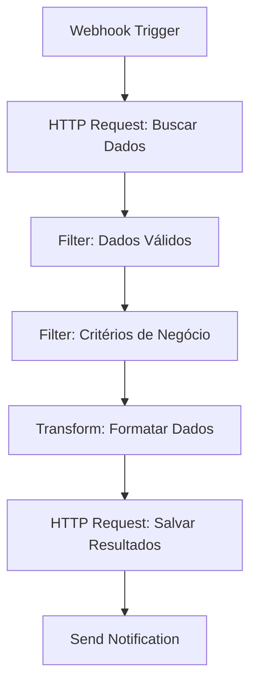
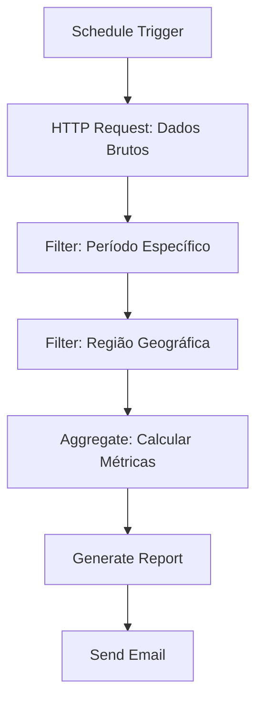

# Filtros de Dados

A filtragem de dados é uma operação fundamental para processar e analisar informações de forma eficiente. Esta seção aborda como aplicar filtros, criar condições complexas e otimizar o processamento de dados no n8n.

## Visão Geral

Filtros permitem selecionar dados específicos baseados em critérios definidos, reduzindo o volume de informações processadas e melhorando a performance dos workflows. No n8n, você pode filtrar dados usando:

- **Filtros simples** por valor
- **Condições complexas** com operadores lógicos
- **Filtros baseados em expressões** JavaScript
- **Filtros temporais** para datas
- **Filtros de texto** com regex

## Tipos de Filtros

### Filtros por Valor

Filtros básicos baseados em valores específicos:

```javascript
// Filtrar por valor exato
const filtrarPorValor = (dados, campo, valor) => {
  return dados.filter(item => item[campo] === valor);
};

// Exemplo: Filtrar clientes ativos
const clientesAtivos = filtrarPorValor(clientes, 'status', 'ativo');

// Filtrar por múltiplos valores
const filtrarPorValores = (dados, campo, valores) => {
  return dados.filter(item => valores.includes(item[campo]));
};

// Exemplo: Filtrar por estados específicos
const estadosFiltrados = filtrarPorValores(clientes, 'estado', ['SP', 'RJ', 'MG']);
```

### Filtros Numéricos

Filtros para valores numéricos com operadores de comparação:

```javascript
// Filtrar por faixa de valores
const filtrarPorFaixa = (dados, campo, min, max) => {
  return dados.filter(item => {
    const valor = parseFloat(item[campo]);
    return valor >= min && valor <= max;
  });
};

// Exemplo: Filtrar produtos por preço
const produtosBaratos = filtrarPorFaixa(produtos, 'preco', 0, 100);
const produtosCaros = filtrarPorFaixa(produtos, 'preco', 500, 9999);

// Filtrar por valor mínimo
const filtrarMinimo = (dados, campo, valor) => {
  return dados.filter(item => parseFloat(item[campo]) >= valor);
};

// Exemplo: Filtrar vendas acima de R$ 1000
const vendasAltas = filtrarMinimo(vendas, 'valor', 1000);
```

### Filtros de Texto

Filtros para processamento de strings e texto:

```javascript
// Filtrar por texto contido
const filtrarPorTexto = (dados, campo, texto) => {
  return dados.filter(item => 
    item[campo].toLowerCase().includes(texto.toLowerCase())
  );
};

// Exemplo: Filtrar produtos por nome
const produtosEletronicos = filtrarPorTexto(produtos, 'nome', 'eletrônico');

// Filtrar por regex
const filtrarPorRegex = (dados, campo, padrao) => {
  const regex = new RegExp(padrao, 'i');
  return dados.filter(item => regex.test(item[campo]));
};

// Exemplo: Filtrar emails válidos
const emailsValidos = filtrarPorRegex(clientes, 'email', '^[^@]+@[^@]+\\.[^@]+$');

// Filtrar por início de texto
const filtrarPorInicio = (dados, campo, prefixo) => {
  return dados.filter(item => 
    item[campo].toLowerCase().startsWith(prefixo.toLowerCase())
  );
};

// Exemplo: Filtrar clientes por nome
const clientesJoao = filtrarPorInicio(clientes, 'nome', 'João');
```

### Filtros Temporais

Filtros para datas e timestamps:

```javascript
// Filtrar por período
const filtrarPorPeriodo = (dados, campo, inicio, fim) => {
  const dataInicio = new Date(inicio);
  const dataFim = new Date(fim);
  
  return dados.filter(item => {
    const data = new Date(item[campo]);
    return data >= dataInicio && data <= dataFim;
  });
};

// Exemplo: Filtrar vendas do último mês
const hoje = new Date();
const inicioMes = new Date(hoje.getFullYear(), hoje.getMonth(), 1);
const vendasMes = filtrarPorPeriodo(vendas, 'data', inicioMes, hoje);

// Filtrar por data específica
const filtrarPorData = (dados, campo, data) => {
  const dataFiltro = new Date(data);
  return dados.filter(item => {
    const itemData = new Date(item[campo]);
    return itemData.toDateString() === dataFiltro.toDateString();
  });
};

// Filtrar por período relativo
const filtrarPeriodoRelativo = (dados, campo, dias) => {
  const hoje = new Date();
  const inicio = new Date(hoje.getTime() - (dias * 24 * 60 * 60 * 1000));
  
  return dados.filter(item => {
    const data = new Date(item[campo]);
    return data >= inicio && data <= hoje;
  });
};

// Exemplo: Filtrar registros dos últimos 7 dias
const registrosRecentes = filtrarPeriodoRelativo(registros, 'dataCriacao', 7);
```

## Filtros Complexos

### Filtros com Múltiplas Condições

Combine diferentes critérios usando operadores lógicos:

```javascript
// Filtro AND (todas as condições devem ser verdadeiras)
const filtrarAND = (dados, condicoes) => {
  return dados.filter(item => {
    return condicoes.every(condicao => {
      const { campo, operador, valor } = condicao;
      
      switch (operador) {
        case '==':
          return item[campo] === valor;
        case '!=':
          return item[campo] !== valor;
        case '>':
          return parseFloat(item[campo]) > valor;
        case '<':
          return parseFloat(item[campo]) < valor;
        case '>=':
          return parseFloat(item[campo]) >= valor;
        case '<=':
          return parseFloat(item[campo]) <= valor;
        case 'contains':
          return item[campo].toLowerCase().includes(valor.toLowerCase());
        case 'startsWith':
          return item[campo].toLowerCase().startsWith(valor.toLowerCase());
        default:
          return false;
      }
    });
  });
};

// Exemplo: Filtrar clientes ativos de SP com valor > 1000
const clientesFiltrados = filtrarAND(clientes, [
  { campo: 'status', operador: '==', valor: 'ativo' },
  { campo: 'estado', operador: '==', valor: 'SP' },
  { campo: 'valor', operador: '>', valor: 1000 }
]);

// Filtro OR (pelo menos uma condição deve ser verdadeira)
const filtrarOR = (dados, condicoes) => {
  return dados.filter(item => {
    return condicoes.some(condicao => {
      const { campo, operador, valor } = condicao;
      
      switch (operador) {
        case '==':
          return item[campo] === valor;
        case '!=':
          return item[campo] !== valor;
        case '>':
          return parseFloat(item[campo]) > valor;
        case '<':
          return parseFloat(item[campo]) < valor;
        case 'contains':
          return item[campo].toLowerCase().includes(valor.toLowerCase());
        default:
          return false;
      }
    });
  });
};

// Exemplo: Filtrar clientes de SP ou RJ
const clientesSPouRJ = filtrarOR(clientes, [
  { campo: 'estado', operador: '==', valor: 'SP' },
  { campo: 'estado', operador: '==', valor: 'RJ' }
]);
```

### Filtros Aninhados

Filtros para estruturas de dados complexas:

```javascript
// Filtrar por propriedades aninhadas
const filtrarAninhado = (dados, caminho, valor) => {
  return dados.filter(item => {
    const valorAninhado = obterValorAninhado(item, caminho);
    return valorAninhado === valor;
  });
};

const obterValorAninhado = (objeto, caminho) => {
  return caminho.split('.').reduce((obj, prop) => obj?.[prop], objeto);
};

// Exemplo: Filtrar por cidade do endereço
const clientesSaoPaulo = filtrarAninhado(clientes, 'endereco.cidade', 'São Paulo');

// Filtrar arrays aninhados
const filtrarArrayAninhado = (dados, campoArray, criterio) => {
  return dados.filter(item => {
    const array = item[campoArray];
    if (!Array.isArray(array)) return false;
    
    return array.some(elemento => {
      return Object.entries(criterio).every(([campo, valor]) => 
        elemento[campo] === valor
      );
    });
  });
};

// Exemplo: Filtrar clientes que têm pedido com status "pendente"
const clientesComPedidoPendente = filtrarArrayAninhado(clientes, 'pedidos', {
  status: 'pendente'
});
```

## Filtros Específicos para Dados Brasileiros

### Filtros de CPF/CNPJ

```javascript
// Filtrar por tipo de documento
const filtrarPorTipoDocumento = (dados, campo, tipo) => {
  return dados.filter(item => {
    const documento = item[campo].replace(/[^\d]/g, '');
    
    if (tipo === 'CPF') {
      return documento.length === 11;
    } else if (tipo === 'CNPJ') {
      return documento.length === 14;
    }
    
    return false;
  });
};

// Exemplo: Separar pessoas físicas e jurídicas
const pessoasFisicas = filtrarPorTipoDocumento(clientes, 'documento', 'CPF');
const pessoasJuridicas = filtrarPorTipoDocumento(clientes, 'documento', 'CNPJ');

// Filtrar por estado baseado no CPF
const filtrarPorEstadoCPF = (dados, campo, estado) => {
  const codigosEstado = {
    'SP': [1, 2, 3, 4, 5, 6, 7, 8, 9],
    'RJ': [20, 21, 22, 23, 24],
    'MG': [30, 31, 32, 33, 34, 35, 36, 37, 38, 39],
    'RS': [40, 41, 42, 43, 44, 45, 46, 47, 48, 49]
  };
  
  const codigos = codigosEstado[estado] || [];
  
  return dados.filter(item => {
    const cpf = item[campo].replace(/[^\d]/g, '');
    const codigo = parseInt(cpf.substring(8, 10));
    return codigos.includes(codigo);
  });
};
```

### Filtros de CEP

```javascript
// Filtrar por região baseada no CEP
const filtrarPorRegiaoCEP = (dados, campo, regiao) => {
  const regioesCEP = {
    'Norte': ['69', '68', '67', '66', '65', '64', '63'],
    'Nordeste': ['59', '58', '57', '56', '55', '54', '53', '52', '51', '50', '49', '48', '47', '46', '45', '44', '43', '42', '41', '40'],
    'Centro-Oeste': ['79', '78', '77', '76', '75', '74', '73', '72', '71', '70'],
    'Sudeste': ['39', '38', '37', '36', '35', '34', '33', '32', '31', '30', '29', '28', '27', '26', '25', '24', '23', '22', '21', '20'],
    'Sul': ['99', '98', '97', '96', '95', '94', '93', '92', '91', '90', '89', '88', '87', '86', '85', '84', '83', '82', '81', '80']
  };
  
  const prefixos = regioesCEP[regiao] || [];
  
  return dados.filter(item => {
    const cep = item[campo].replace(/[^\d]/g, '');
    const prefixo = cep.substring(0, 2);
    return prefixos.includes(prefixo);
  });
};

// Exemplo: Filtrar clientes do Sudeste
const clientesSudeste = filtrarPorRegiaoCEP(clientes, 'endereco.cep', 'Sudeste');
```

## Otimização de Filtros

### Filtros em Lote

Processe grandes volumes de dados eficientemente:

```javascript
// Filtrar em lotes para melhor performance
const filtrarEmLotes = (dados, filtro, tamanhoLote = 1000) => {
  const resultados = [];
  
  for (let i = 0; i < dados.length; i += tamanhoLote) {
    const lote = dados.slice(i, i + tamanhoLote);
    const loteFiltrado = lote.filter(filtro);
    resultados.push(...loteFiltrado);
  }
  
  return resultados;
};

// Exemplo: Filtrar grandes volumes de dados
const dadosGrandes = Array.from({length: 100000}, (_, i) => ({
  id: i,
  valor: Math.random() * 1000,
  status: Math.random() > 0.5 ? 'ativo' : 'inativo'
}));

const dadosFiltrados = filtrarEmLotes(dadosGrandes, item => 
  item.status === 'ativo' && item.valor > 500
);
```

### Filtros com Cache

Use cache para filtros frequentemente aplicados:

```javascript
// Cache de filtros
const cacheFiltros = new Map();

const filtrarComCache = (dados, criterios, chaveCache) => {
  // Verificar cache
  if (cacheFiltros.has(chaveCache)) {
    const { resultado, timestamp } = cacheFiltros.get(chaveCache);
    const agora = Date.now();
    
    // Cache válido por 5 minutos
    if (agora - timestamp < 5 * 60 * 1000) {
      return resultado;
    }
  }
  
  // Aplicar filtro
  const resultado = dados.filter(item => {
    return criterios.every(criterio => {
      const { campo, operador, valor } = criterio;
      
      switch (operador) {
        case '==':
          return item[campo] === valor;
        case '>':
          return parseFloat(item[campo]) > valor;
        case 'contains':
          return item[campo].toLowerCase().includes(valor.toLowerCase());
        default:
          return false;
      }
    });
  });
  
  // Salvar no cache
  cacheFiltros.set(chaveCache, {
    resultado,
    timestamp: Date.now()
  });
  
  return resultado;
};

// Exemplo: Filtrar com cache
const clientesAtivosSP = filtrarComCache(
  clientes,
  [
    { campo: 'status', operador: '==', valor: 'ativo' },
    { campo: 'estado', operador: '==', valor: 'SP' }
  ],
  'clientes_ativos_sp'
);
```

## Filtros Avançados

### Filtros Fuzzy

Filtros que toleram erros de digitação:

```javascript
// Filtro fuzzy para texto
const filtrarFuzzy = (dados, campo, termo, tolerancia = 0.8) => {
  return dados.filter(item => {
    const valor = item[campo].toLowerCase();
    const termoBusca = termo.toLowerCase();
    
    // Calcular similaridade
    const similaridade = calcularSimilaridade(valor, termoBusca);
    return similaridade >= tolerancia;
  });
};

// Algoritmo de similaridade simples (Levenshtein)
const calcularSimilaridade = (str1, str2) => {
  const matrix = [];
  
  for (let i = 0; i <= str2.length; i++) {
    matrix[i] = [i];
  }
  
  for (let j = 0; j <= str1.length; j++) {
    matrix[0][j] = j;
  }
  
  for (let i = 1; i <= str2.length; i++) {
    for (let j = 1; j <= str1.length; j++) {
      if (str2.charAt(i - 1) === str1.charAt(j - 1)) {
        matrix[i][j] = matrix[i - 1][j - 1];
      } else {
        matrix[i][j] = Math.min(
          matrix[i - 1][j - 1] + 1,
          matrix[i][j - 1] + 1,
          matrix[i - 1][j] + 1
        );
      }
    }
  }
  
  const distancia = matrix[str2.length][str1.length];
  const maxLength = Math.max(str1.length, str2.length);
  
  return 1 - (distancia / maxLength);
};

// Exemplo: Busca fuzzy por nome
const clientesJoao = filtrarFuzzy(clientes, 'nome', 'João', 0.7);
```

### Filtros Temporais Avançados

```javascript
// Filtrar por dia da semana
const filtrarPorDiaSemana = (dados, campo, dias) => {
  return dados.filter(item => {
    const data = new Date(item[campo]);
    const diaSemana = data.getDay(); // 0 = Domingo, 1 = Segunda, etc.
    return dias.includes(diaSemana);
  });
};

// Exemplo: Filtrar vendas de segunda a sexta
const vendasSemana = filtrarPorDiaSemana(vendas, 'data', [1, 2, 3, 4, 5]);

// Filtrar por horário
const filtrarPorHorario = (dados, campo, horaInicio, horaFim) => {
  return dados.filter(item => {
    const data = new Date(item[campo]);
    const hora = data.getHours();
    return hora >= horaInicio && hora <= horaFim;
  });
};

// Exemplo: Filtrar transações em horário comercial
const transacoesComerciais = filtrarPorHorario(transacoes, 'timestamp', 8, 18);
```

## Workflows de Filtragem

### Workflow: Filtro de Dados em Tempo Real



### Workflow: Análise de Dados Filtrados



## Boas Práticas

### Performance

- **Aplique filtros cedo** no pipeline de dados
- **Use índices** para campos frequentemente filtrados
- **Processe em lotes** para grandes volumes
- **Cache resultados** de filtros complexos
- **Monitore performance** de filtros

### Manutenibilidade

- **Documente critérios** de filtro
- **Use constantes** para valores mágicos
- **Crie funções reutilizáveis** para filtros comuns
- **Teste filtros** com dados reais
- **Valide resultados** de filtros

### Flexibilidade

- **Torne filtros configuráveis** via parâmetros
- **Suporte múltiplos formatos** de entrada
- **Permita combinação** de filtros
- **Forneça valores padrão** para filtros opcionais
- **Implemente fallbacks** para casos especiais

## Recursos Adicionais

### Ferramentas Úteis

- **Lodash**: Biblioteca com funções de filtragem avançadas
- **Ramda**: Biblioteca funcional para manipulação de dados
- **date-fns**: Biblioteca para manipulação de datas
- **validator.js**: Validação de dados

### Padrões de Filtro

- **Builder Pattern**: Construir filtros complexos
- **Strategy Pattern**: Diferentes algoritmos de filtro
- **Chain of Responsibility**: Pipeline de filtros
- **Observer Pattern**: Notificações de mudanças

---

**Próximo**: [Edição de Dados](./data-editing) - Modifique e transforme dados 