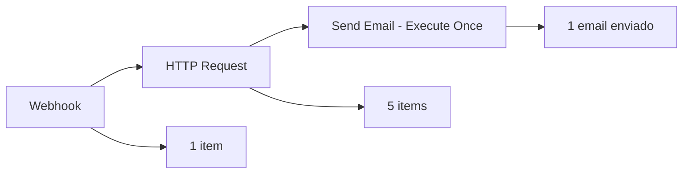
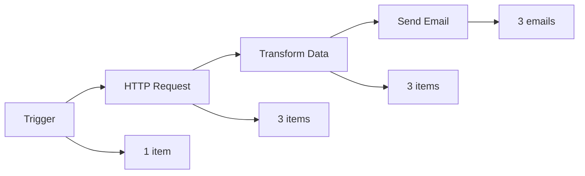
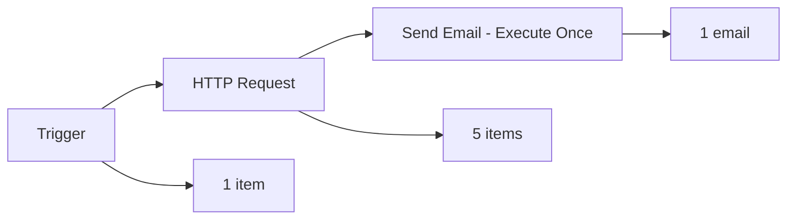
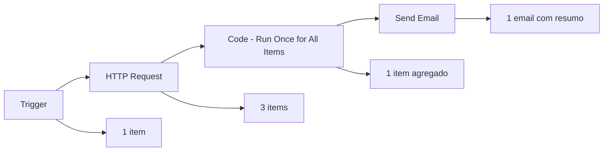

# <ion-icon name="git-network-outline" style={{ fontSize: '32px', color: '#ea4b71' }}></ion-icon> Fluxo de Dados Dentro dos Nodes

O n8n processa dados como uma série de itens. Cada item é um objeto que contém os dados que você está trabalhando. Entender como esses itens fluem através dos nodes é fundamental para criar workflows eficientes.

## <ion-icon name="chevron-forward-outline" style={{ fontSize: '24px', color: '#ea4b71' }}></ion-icon> Como os Itens Fluem

### Processamento Padrão

Por padrão, cada node processa **todos os itens** que recebe. Se um node recebe 5 itens, ele executará 5 vezes - uma vez para cada item.

### Exemplo Prático

Imagine que você tem um node que retorna uma lista de clientes:

```json
[
 {"json": {"nome": "João", "email": "joao@email.com"}},
 {"json": {"nome": "Maria", "email": "maria@email.com"}},
 {"json": {"nome": "Pedro", "email": "pedro@email.com"}}
]
```

Se você conectar um node de email a este, ele enviará **3 emails** - um para cada cliente.

## <ion-icon name="settings-outline" style={{ fontSize: '24px', color: '#ea4b71' }}></ion-icon> Configurações de Execução

### Execute Once

Alguns nodes têm a opção **Execute Once** nas configurações. Quando ativada:

- O node processa apenas o **primeiro item** recebido
- Ignora todos os outros itens
- Útil para operações que devem acontecer apenas uma vez

### Exemplo de Uso



## <ion-icon name="code-slash-outline" style={{ fontSize: '24px', color: '#ea4b71' }}></ion-icon> Nodes com Comportamento Especial

### Code Node

O Code node tem duas modalidades:

**Run Once for All Items (Padrão):**

- Processa todos os itens de uma vez
- Útil para operações que precisam ver todos os dados

**Run Once for Each Item:**

- Processa cada item individualmente
- Comportamento padrão da maioria dos nodes

### HTTP Request Node

- Processa cada item individualmente
- Cada item gera uma requisição HTTP separada
- Útil para APIs que precisam de dados específicos por requisição

### Database Nodes

- **Insert/Update/Delete:** Executam uma vez para todos os itens
- **Select:** Processam cada item individualmente

## <ion-icon name="grid-outline" style={{ fontSize: '24px', color: '#ea4b71' }}></ion-icon> Exemplos de Fluxo

### Exemplo 1: Processamento Individual



### Exemplo 2: Execute Once



### Exemplo 3: Code Node - Run Once for All Items



## <ion-icon name="warning-outline" style={{ fontSize: '24px', color: '#ea4b71' }}></ion-icon> Considerações Importantes

### Performance

- **Processamento individual:** Pode ser mais lento para muitos itens
- **Execute Once:** Mais rápido, mas processa menos dados
- **Code node:** Flexível, mas requer mais conhecimento

### Rate Limits

- APIs podem ter limites de requisições
- Use **Execute Once** ou **batching** quando necessário
- Considere usar **Wait** nodes para pausas

### Dados Perdidos

- **Execute Once** pode fazer você perder dados
- Sempre teste com diferentes volumes de dados
- Monitore os logs de execução

## <ion-icon name="chevron-forward-outline" style={{ fontSize: '24px', color: '#ea4b71' }}></ion-icon> Boas Práticas

### Para Muitos Itens

1. **Use Execute Once** para operações que não precisam de todos os itens
2. **Implemente batching** para APIs com rate limits
3. **Monitore performance** e ajuste conforme necessário

### Para Dados Críticos

1. **Evite Execute Once** quando todos os dados são importantes
2. **Use logs** para verificar o processamento
3. **Teste com dados reais** antes de produção

### Para APIs

1. **Verifique rate limits** da API
2. **Use Wait nodes** se necessário
3. **Implemente retry logic** para falhas

## <ion-icon name="arrow-forward-circle-outline" style={{ fontSize: '24px', color: '#ea4b71' }}></ion-icon> Próximos Passos

1. **Aprenda sobre [Looping](../01-flow-logic/looping)** para processamento repetitivo
2. **Explore [Error Handling](../01-flow-logic/error-handling)** para lidar com falhas
3. **Entenda [Data Structure](./data-structure)** para estrutura de dados

## <ion-icon name="school-outline" style={{ fontSize: '24px', color: '#ea4b71' }}></ion-icon> Recursos Relacionados

- **[Data Structure](./data-structure)** - Estrutura fundamental dos dados
- **[Looping](../01-flow-logic/looping)** - Processamento repetitivo
- **[Error Handling](../01-flow-logic/error-handling)** - Tratamento de erros
- **[Core Nodes](../integracoes/builtin-nodes/core-nodes/)** - Nodes fundamentais
