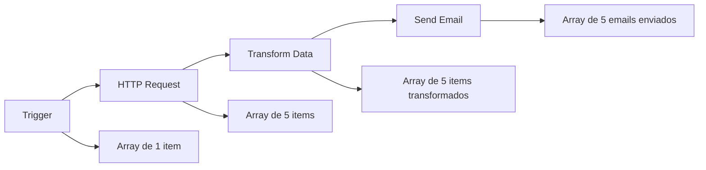

# <ion-icon name="document-outline" style={{ fontSize: '32px', color: '#ea4b71' }}></ion-icon> Estrutura de Dados

No n8n, todos os dados passados entre nodes são um array de objetos. Eles seguem a seguinte estrutura:

## <ion-icon name="code-slash-outline" style={{ fontSize: '24px', color: '#ea4b71' }}></ion-icon> Estrutura Básica

```json
[
 {
  // Para a maioria dos dados:
  // Envolva cada item em outro objeto, com a chave 'json'
  "json": {
   // Exemplo de dados
   "nome": "João Silva",
   "idade": 30,
   "endereco": {
    "rua": "Rua das Flores",
    "numero": 123
   }
  },
  // Para dados binários:
  // Envolva cada item em outro objeto, com a chave 'binary'
  "binary": {
   // Exemplo de dados
   "foto-perfil": {
    "data": "....", // Dados binários codificados em Base64 (obrigatório)
    "mimeType": "image/png", // Boa prática definir se possível (opcional)
    "fileExtension": "png", // Boa prática definir se possível (opcional)
    "fileName": "perfil.png", // Boa prática definir se possível (opcional)
   }
  }
 },
]
```

## <ion-icon name="information-circle-outline" style={{ fontSize: '24px', color: '#ea4b71' }}></ion-icon> Processamento de Itens de Dados

:::tip **Pular a chave `json` e sintaxe de array**
A partir da versão 0.166.0, ao usar o Function node ou Code node, o n8n adiciona automaticamente a chave `json` se estiver faltando. Ele também envolve automaticamente seus itens em um array (`[]`) se necessário. Isso só acontece ao usar os Function ou Code nodes. Ao construir seus próprios nodes, você ainda deve garantir que o node retorne dados com a chave `json`.
:::

## <ion-icon name="grid-outline" style={{ fontSize: '24px', color: '#ea4b71' }}></ion-icon> Exemplos Práticos

### Dados Simples

```json
[
 {
  "json": {
   "id": 1,
   "nome": "Produto A",
   "preco": 29.99
  }
 },
 {
  "json": {
   "id": 2,
   "nome": "Produto B", 
   "preco": 49.99
  }
 }
]
```

### Dados Aninhados

```json
[
 {
  "json": {
   "cliente": {
    "id": "C001",
    "nome": "Maria Santos",
    "contato": {
     "email": "maria@email.com",
     "telefone": "(11) 99999-9999"
    }
   },
   "pedidos": [
    {"id": "P001", "valor": 150.00},
    {"id": "P002", "valor": 75.50}
   ]
  }
 }
]
```

### Dados Binários

```json
[
 {
  "json": {
   "nome": "documento.pdf"
  },
  "binary": {
   "arquivo": {
    "data": "JVBERi0xLjQKJcOkw7zDtsO...",
    "mimeType": "application/pdf",
    "fileExtension": "pdf",
    "fileName": "documento.pdf"
   }
  }
 }
]
```

## <ion-icon name="chevron-forward-outline" style={{ fontSize: '24px', color: '#ea4b71' }}></ion-icon> Como os Dados Fluem

Cada node no n8n:

1. **Recebe** dados no formato array de objetos
2. **Processa** cada item individualmente (por padrão)
3. **Retorna** dados no mesmo formato

### Exemplo de Fluxo



## <ion-icon name="settings-outline" style={{ fontSize: '24px', color: '#ea4b71' }}></ion-icon> Configurações de Execução

### Execute Once

Para situações onde você não quer que um node processe todos os itens recebidos, você pode ativar o parâmetro **Execute Once** na aba **Settings** do node. Isso é útil quando os dados de entrada contêm múltiplos itens e você quer processar apenas o primeiro.

### Processamento em Lote

Alguns nodes podem processar todos os itens de uma vez, enquanto outros processam item por item. Isso depende da configuração do node e do tipo de operação.

## <ion-icon name="arrow-forward-circle-outline" style={{ fontSize: '24px', color: '#ea4b71' }}></ion-icon> Próximos Passos

1. **Entenda [Data Flow](./data-flow-nodes)** para ver como os dados se movem entre nodes
2. **Aprenda [Transforming Data](./transformacoes-dados)** para modificar a estrutura dos dados
3. **Explore [Data Mapping](./data-mapping-avancado)** para mapear dados entre nodes

## <ion-icon name="school-outline" style={{ fontSize: '24px', color: '#ea4b71' }}></ion-icon> Recursos Relacionados

- **[Data Flow](./data-flow-nodes)** - Como os dados fluem entre nodes
- **[Transforming Data](./transformacoes-dados)** - Transformar estrutura de dados
- **[Binary Data](./binary-data)** - Trabalhar com arquivos e dados binários
- **[Core Nodes](../integracoes/builtin-nodes/core-nodes/)** - Nodes para manipulação de dados
