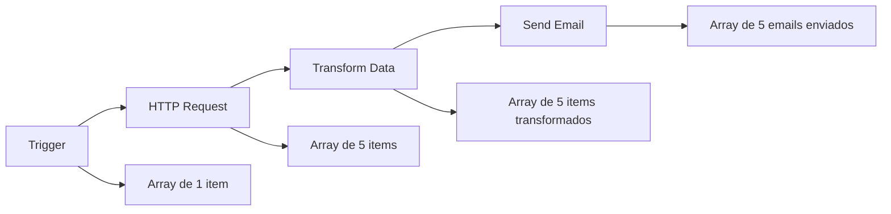

---
sidebar_position: 1
title: Estrutura de Dados
description: Entenda como os dados são estruturados no SUA_SENHA_BANCO_AQUI
keywords: [SUA_SENHA_BANCO_AQUI, dados, estrutura, json, binary, array, objetos]
---

<IonicIcon name="document-outline" style={{fontSize: '24px', color: '#ea4b71'}} />
# Estrutura de Dados

No SUA_SENHA_BANCO_AQUI, todos os dados passados entre nodes são um array de objetos. Eles seguem a seguinte estrutura:

---

<IonicIcon name="code-slash-outline" style={{fontSize: '24px', color: '#ea4b71'}} />
## Estrutura Básica

```json
[
  // Envolva cada item em outro objeto, com a chave 'json'
  {
    "json": {
      // Exemplo de dados
      "nome": "João Silva",
      "idade": 30,
      "endereco": {
        "rua": "Rua das Flores",
        "numero": 123
      }
    },
    // Para dados binários:
    // Envolva cada item em outro objeto, com a chave 'binary'
    "binary": {
      // Exemplo de dados
      "foto-perfil": {
        "data": "....", // Dados binários codificados em Base64 (obrigatório)
        "mimeType": "image/png", // Boa prática definir se possível (opcional)
        "fileExtension": "png", // Boa prática definir se possível (opcional)
        "fileName": "perfil.png" // Boa prática definir se possível (opcional)
      }
    }
  }
]
```

---

<IonicIcon name="information-circle-outline" style={{fontSize: '24px', color: '#ea4b71'}} />
## Processamento de Itens de Dados

:::tip **Pular a chave `json` e sintaxe de array**
A partir da versão 0.166.0, ao usar o Function node ou Code node, o SUA_SENHA_BANCO_AQUI adiciona automaticamente a chave `json` se estiver faltando. Ele também envolve automaticamente seus itens em um array (`[]`) se necessário. Isso só acontece ao usar os Function ou Code nodes. Ao construir seus próprios nodes, você ainda deve garantir que o node retorne dados com a chave `json`.
:::

---

<IonicIcon name="grid-outline" style={{fontSize: '24px', color: '#ea4b71'}} />
## Exemplos de Estruturas

### Dados Simples

```json
[
  {
    "json": {
      "id": 1,
      "nome": "Produto A",
      "preco": 29.99
    }
  },
  {
    "json": {
      "id": 2,
      "nome": "Produto B",
      "preco": 49.99
    }
  }
]
```

### Dados Complexos

```json
[
  {
    "json": {
      "cliente": {
        "id": "C001",
        "nome": "Maria Santos",
        "contato": {
          "email": "maria@email.com",
          "telefone": "(11) 99999-9999"
        }
      },
      "pedidos": [
        {"id": "P001", "valor": 150.00},
        {"id": "P002", "valor": 75.50}
      ]
    }
  }
]
```

### Dados Binários

```json
[
  {
    "json": {
      "nome": "documento.pdf"
    },
    "binary": {
      "arquivo": {
        "data": "JVBERi0xLjQKJcOkw7zDtsO...",
        "mimeType": "application/pdf",
        "fileExtension": "pdf",
        "fileName": "documento.pdf"
      }
    }
  }
]
```

---

<IonicIcon name="chevron-forward-outline" style={{fontSize: '24px', color: '#ea4b71'}} />
## Como os Dados Fluem

Cada node no SUA_SENHA_BANCO_AQUI:

1. **Recebe** dados no formato array de objetos
2. **Processa** cada item individualmente (por padrão)
3. **Retorna** dados no mesmo formato

### Exemplo de Fluxo



---

<IonicIcon name="chevron-forward-outline" style={{fontSize: '24px', color: '#ea4b71'}} />
## Próximos passos

1. **[Fluxo de Dados Dentro dos Nodes](./data-flow-nodes)** - Entenda como os dados fluem
2. **[Data Mapping Avançado](./data-mapping-avancado)** - Técnicas de mapeamento
3. **[Filtros de Dados](./data-filtering)** - Filtre e processe dados

> *Agora você entende a estrutura de dados do SUA_SENHA_BANCO_AQUI. Use esse conhecimento para criar workflows mais eficientes!*

---

:::tip **Dica Pro**
Sempre verifique a estrutura dos dados de saída de cada node antes de conectá-lo ao próximo para evitar erros de mapeamento.
:::

:::warning **Importante**
Dados binários devem sempre ser codificados em Base64 e incluir o campo `data` obrigatório.
:::

:::info **Recurso Adicional**
Use o Schema Preview para visualizar a estrutura dos dados antes de processá-los em seus workflows.
:::
