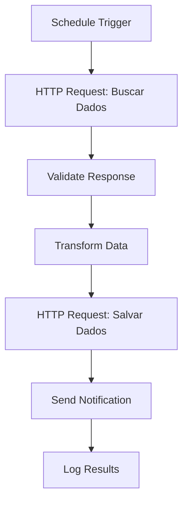
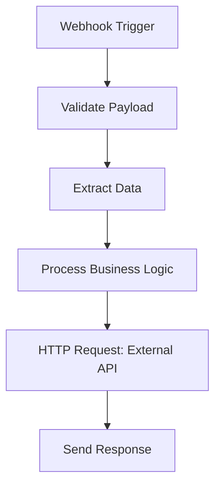

---
sidebar_position: 4
title: Integração com APIs
description: Técnicas para mapeamento e processamento de respostas de API no n8n
keywords: [n8n, APIs, integração, mapeamento, respostas, HTTP]
---

<IonicIcon name="cloud-outline" style={{fontSize: '24px', color: '#ea4b71'}} />
# Integração com APIs

A integração com APIs é fundamental para conectar o n8n com sistemas externos e serviços. Esta seção aborda técnicas avançadas para mapear, processar e transformar respostas de API de forma eficiente.

---

<IonicIcon name="information-circle-outline" style={{fontSize: '24px', color: '#ea4b71'}} />
## Visão Geral

APIs (Application Programming Interfaces) permitem que o n8n se comunique com sistemas externos, bancos de dados, serviços em nuvem e outras aplicações. O mapeamento correto das respostas de API é essencial para workflows eficientes.

### Tipos de APIs

- **REST APIs**: Interfaces web padrão usando HTTP
- **GraphQL APIs**: Consultas flexíveis e eficientes
- **SOAP APIs**: Protocolo XML para serviços web
- **Webhooks**: Notificações em tempo real
- **OAuth APIs**: Autenticação segura

---

<IonicIcon name="code-slash-outline" style={{fontSize: '24px', color: '#ea4b71'}} />
## Mapeamento de Respostas

### Estrutura de Resposta Típica

```json
{
  "status": "success",
  "data": {
    "users": [
      {
        "id": 1,
        "name": "João Silva",
        "email": "joao@exemplo.com",
        "created_at": "2024-01-15T10:30:00Z"
      }
    ],
    "pagination": {
      "page": 1,
      "total_pages": 5,
      "total_items": 100
    }
  },
  "meta": {
    "timestamp": "2024-01-15T10:30:00Z",
    "version": "1.0"
  }
}
```

### Extração de Dados

```javascript
// Extrair lista de usuários
{{ $json.data.users }}

// Extrair informações de paginação
{{ $json.data.pagination }}

// Extrair metadados
{{ $json.meta }}

// Acessar propriedades aninhadas
{{ $json.data.users[0].name }}

// Filtrar dados
{{ $json.data.users.filter(user => user.email.includes('@exemplo.com')) }}
```

---

<IonicIcon name="settings-outline" style={{fontSize: '24px', color: '#ea4b71'}} />
## Configuração de APIs

### Headers de Autenticação

```javascript
// Bearer Token
{
  "Authorization": "Bearer YOUR_TOKEN_HERE"
}

// API Key
{
  "X-API-Key": "YOUR_API_KEY_HERE"
}

// Basic Auth
{
  "Authorization": "Basic " + btoa("username:password")
}
```

### Parâmetros de Query

```javascript
// Parâmetros básicos
{
  "page": 1,
  "limit": 50,
  "sort": "created_at",
  "order": "desc"
}

// Filtros avançados
{
  "status": "active",
  "created_after": "2024-01-01",
  "category": ["tech", "business"]
}
```

---

<IonicIcon name="analytics-outline" style={{fontSize: '24px', color: '#ea4b71'}} />
## Processamento de Respostas

### Validação de Resposta

```javascript
// Verificar status da resposta
{{ $json.status === 'success' ? 'Sucesso' : 'Erro' }}

// Verificar códigos HTTP
{{ $json.statusCode === 200 ? 'OK' : 'Erro' }}

// Validar estrutura de dados
{{ $json.data && $json.data.users ? 'Dados válidos' : 'Estrutura inválida' }}
```

### Transformação de Dados

```javascript
// Mapear dados para formato interno
{{ $json.data.users.map(user => ({
  id: user.id,
  nome: user.name,
  email: user.email,
  dataCriacao: new Date(user.created_at).toLocaleDateString('pt-BR')
})) }}

// Adicionar campos calculados
{{ $json.data.users.map(user => ({
  ...user,
  nomeCompleto: user.first_name + ' ' + user.last_name,
  idade: calcularIdade(user.birth_date)
})) }}
```

---

<IonicIcon name="warning-outline" style={{fontSize: '24px', color: '#ea4b71'}} />
## Tratamento de Erros

### Erros Comuns

```javascript
// Erro de autenticação
if ($json.statusCode === 401) {
  return { error: 'Token inválido ou expirado' };
}

// Erro de rate limiting
if ($json.statusCode === 429) {
  return { error: 'Limite de requisições excedido' };
}

// Erro de servidor
if ($json.statusCode >= 500) {
  return { error: 'Erro interno do servidor' };
}
```

### Retry Logic

```javascript
// Implementar retry automático
const maxRetries = 3;
const retryDelay = 1000; // 1 segundo

for (let attempt = 1; attempt <= maxRetries; attempt++) {
  try {
    const response = await fetch(apiUrl, options);
    if (response.ok) {
      return await response.json();
    }
  } catch (error) {
    if (attempt === maxRetries) {
      throw new Error('Falha após todas as tentativas');
    }
    await new Promise(resolve => setTimeout(resolve, retryDelay * attempt));
  }
}
```

---

<IonicIcon name="git-network-outline" style={{fontSize: '24px', color: '#ea4b71'}} />
## Workflows de Integração

### Workflow: Sincronização de Dados



### Workflow: Webhook Processing



---

<IonicIcon name="chevron-forward-outline" style={{fontSize: '24px', color: '#ea4b71'}} />
## Próximos passos

1. **[Otimização de Performance](./otimizacao-performance)** - Melhore eficiência
2. **[Visualização de Dados](./visualizacao-dados)** - Crie dashboards
3. **[Schema Preview](./schema-preview)** - Entenda estruturas de dados

> *Agora você domina técnicas de integração com APIs. Use essas habilidades para conectar o n8n com sistemas externos de forma eficiente!*

---

:::tip **Dica Pro**
Sempre valide as respostas de API antes de processá-las para evitar erros em cascata nos seus workflows.
:::

:::warning **Importante**
Implemente tratamento de erros robusto para APIs externas, pois elas podem estar indisponíveis ou retornar dados inesperados.
:::

:::info **Recurso Adicional**
Use o Schema Preview para entender a estrutura das respostas de API antes de mapeá-las em seus workflows.
:::
