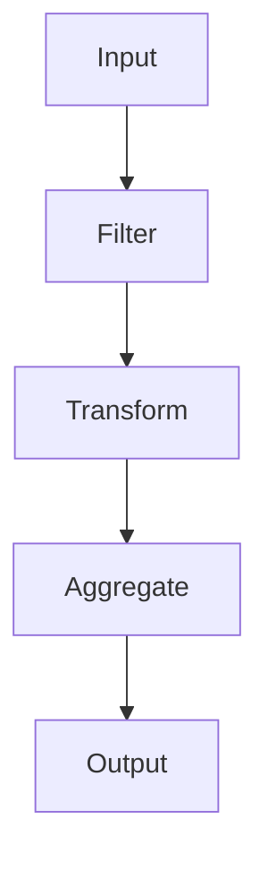
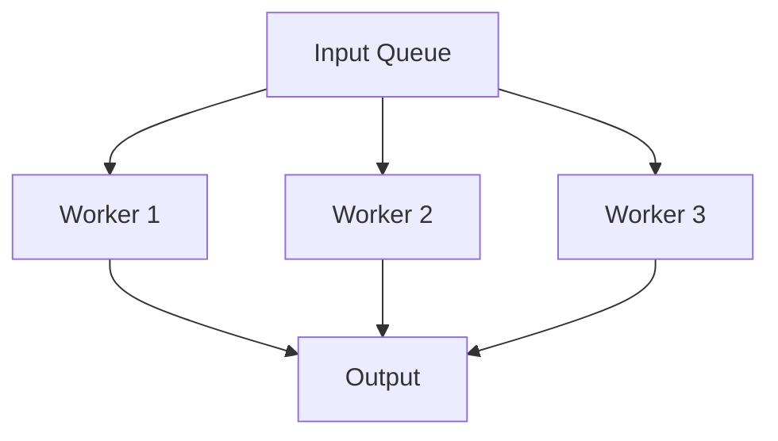
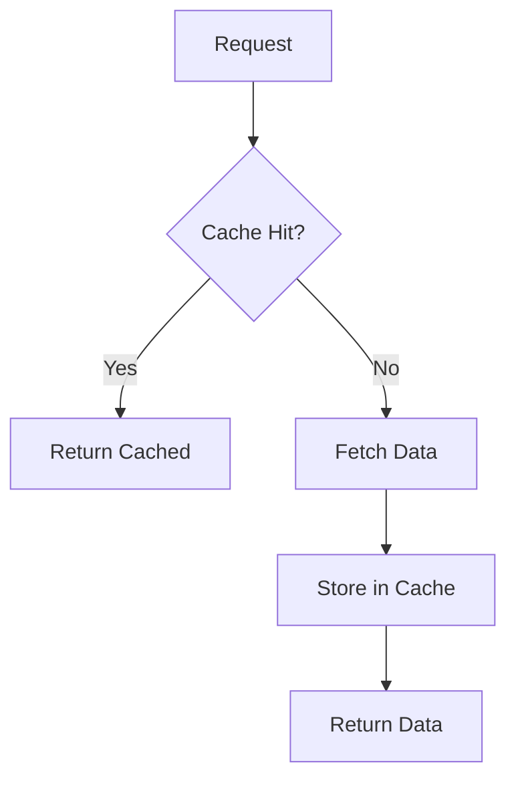

# Otimização de Performance

A otimização de performance é essencial para workflows que processam grandes volumes de dados ou executam operações complexas no n8n.

## Conceitos Fundamentais

### Métricas de Performance

#### Tempo de Execução
- **Tempo total**: Duração completa do workflow
- **Tempo por node**: Tempo gasto em cada operação
- **Latência**: Tempo de resposta para operações individuais
- **Throughput**: Quantidade de dados processados por unidade de tempo

#### Uso de Recursos
- **CPU**: Utilização do processador
- **Memória**: Consumo de RAM
- **Rede**: Largura de banda utilizada
- **I/O**: Operações de entrada/saída

#### Escalabilidade
- **Linear**: Performance proporcional ao volume de dados
- **Logarítmica**: Performance que diminui com o crescimento dos dados
- **Exponencial**: Performance que degrada rapidamente

## Estratégias de Otimização

### Otimização de Dados

#### Paginação
Processe dados em lotes menores para reduzir uso de memória:

```javascript
// Exemplo: Paginação manual
const pageSize = 100;
const totalItems = 10000;
const pages = Math.ceil(totalItems / pageSize);

for (let page = 0; page < pages; page++) {
  const startIndex = page * pageSize;
  const endIndex = Math.min(startIndex + pageSize, totalItems);
  
  // Processar lote
  const batch = await fetchBatch(startIndex, endIndex);
  await processBatch(batch);
}
```

#### Streaming
Processe dados conforme são recebidos:

```javascript
// Exemplo: Processamento em streaming
const items = $input.all();
const processed = [];

for (const item of items) {
  // Processar item individualmente
  const processedItem = await processItem(item.json);
  processed.push(processedItem);
  
  // Liberar memória
  if (processed.length % 100 === 0) {
    console.log(`Processados ${processed.length} itens`);
  }
}

return processed;
```

#### Cache
Armazene resultados para evitar reprocessamento:

```javascript
// Exemplo: Cache simples
const cache = new Map();
const items = $input.all();

for (const item of items) {
  const key = item.json.id;
  
  if (cache.has(key)) {
    // Usar resultado em cache
    return cache.get(key);
  } else {
    // Processar e armazenar
    const result = await expensiveOperation(item.json);
    cache.set(key, result);
    return result;
  }
}
```

### Otimização de Nodes

#### Configuração de Nodes
Ajuste configurações para melhor performance:

```javascript
// Exemplo: Configuração otimizada do HTTP Request
{
  "method": "GET",
  "url": "https://api.exemplo.com/data",
  "options": {
    "timeout": 30000,
    "keepAlive": true,
    "maxRedirects": 5,
    "headers": {
      "Accept": "application/json",
      "User-Agent": "n8n-workflow"
    }
  }
}
```

#### Paralelização
Execute operações independentes simultaneamente:

```javascript
// Exemplo: Processamento paralelo
const items = $input.all();
const promises = items.map(async (item) => {
  return await processItem(item.json);
});

// Aguardar todas as operações
const results = await Promise.all(promises);
return results;
```

#### Lazy Loading
Carregue dados apenas quando necessário:

```javascript
// Exemplo: Carregamento sob demanda
const items = $input.all();
const results = [];

for (const item of items) {
  // Verificar se precisa carregar dados adicionais
  if (item.json.needsDetails) {
    const details = await fetchDetails(item.json.id);
    item.json.details = details;
  }
  
  results.push(item.json);
}

return results;
```

## Técnicas Avançadas

### Otimização de Queries

#### Índices e Filtros
Use filtros eficientes para reduzir volume de dados:

```javascript
// Exemplo: Filtros otimizados
const items = $input.all();
const filtered = items.filter(item => {
  const data = item.json;
  
  // Aplicar filtros em ordem de seletividade
  if (data.status !== 'active') return false;
  if (data.createdAt < '2024-01-01') return false;
  if (data.amount < 100) return false;
  
  return true;
});

return filtered;
```

#### Agregações Eficientes
Use agregações nativas quando possível:

```javascript
// Exemplo: Agregação otimizada
const items = $input.all();
const stats = {
  total: 0,
  count: 0,
  min: Infinity,
  max: -Infinity
};

for (const item of items) {
  const value = parseFloat(item.json.amount) || 0;
  stats.total += value;
  stats.count += 1;
  stats.min = Math.min(stats.min, value);
  stats.max = Math.max(stats.max, value);
}

stats.average = stats.total / stats.count;
return stats;
```

### Otimização de Memória

#### Garbage Collection
Libere memória explicitamente:

```javascript
// Exemplo: Gerenciamento de memória
const items = $input.all();
const results = [];

for (let i = 0; i < items.length; i++) {
  const item = items[i];
  const result = await processItem(item.json);
  results.push(result);
  
  // Liberar referências desnecessárias
  if (i % 1000 === 0) {
    items[i] = null;
    global.gc && global.gc(); // Forçar garbage collection
  }
}

return results;
```

#### Estruturas de Dados Eficientes
Use estruturas apropriadas para o caso de uso:

```javascript
// Exemplo: Estruturas otimizadas
const items = $input.all();

// Para busca rápida
const lookupMap = new Map();
items.forEach(item => {
  lookupMap.set(item.json.id, item.json);
});

// Para agrupamento
const grouped = {};
items.forEach(item => {
  const key = item.json.category;
  if (!grouped[key]) grouped[key] = [];
  grouped[key].push(item.json);
});

return { lookupMap, grouped };
```

## Monitoramento de Performance

### Métricas de Monitoramento

```javascript
// Exemplo: Coleta de métricas
const startTime = Date.now();
const items = $input.all();

// Processar dados
const results = await processItems(items);

const endTime = Date.now();
const duration = endTime - startTime;

return {
  results: results,
  metrics: {
    totalItems: items.length,
    processingTime: duration,
    itemsPerSecond: items.length / (duration / 1000),
    memoryUsage: process.memoryUsage()
  }
};
```

### Profiling
Identifique gargalos de performance:

```javascript
// Exemplo: Profiling de operações
const timings = {};

function profile(operation, fn) {
  const start = Date.now();
  const result = fn();
  const end = Date.now();
  
  if (!timings[operation]) {
    timings[operation] = { count: 0, totalTime: 0 };
  }
  
  timings[operation].count += 1;
  timings[operation].totalTime += (end - start);
  
  return result;
}

// Usar profiling
const items = $input.all();
const results = [];

for (const item of items) {
  const processed = profile('processItem', () => {
    return processItem(item.json);
  });
  
  results.push(processed);
}

console.log('Timings:', timings);
return results;
```

## Padrões de Otimização

### Padrão de Pipeline


### Padrão de Worker Pool


### Padrão de Cache-Aside


## Boas Práticas

### Desenvolvimento
1. **Meça performance** antes e depois de otimizações
2. **Use profiling** para identificar gargalos
3. **Teste com dados reais** em volumes apropriados
4. **Documente trade-offs** entre performance e funcionalidade

### Produção
1. **Monitore métricas** em tempo real
2. **Configure alertas** para degradação de performance
3. **Implemente circuit breakers** para operações custosas
4. **Use load balancing** para distribuir carga

### Manutenção
1. **Revise otimizações** regularmente
2. **Atualize benchmarks** conforme dados mudam
3. **Refatore código** quando necessário
4. **Teste regressões** de performance

## Recursos Relacionados

- **[Data Processing](./data-filtering)** - Processamento eficiente de dados
- **[Aggregate Node](../../integracoes/builtin-nodes/data-processing/aggregate)** - Agregações otimizadas
- **[Function Node](../../integracoes/builtin-nodes/core-nodes/function)** - Código customizado otimizado
- **[Monitoring](/usando-n8n/monitoring/analisar-logs)** - Monitoramento de performance
- **[Error Handling](../flow-logic/error-handling)** - Tratamento de erros de performance 