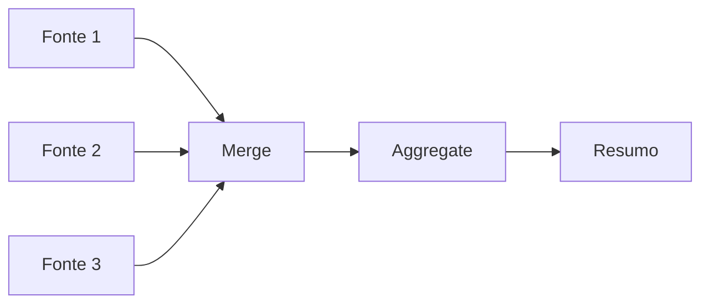

---
sidebar_position: 3
title: Transformando Dados
description: Como transformar dados no n8n para diferentes formatos e estruturas
keywords: [n8n, transformar, dados, estrutura, formatos, nodes]
---

#ionicicon-nameswap-horizontal-outline-style-fontsize-24px color: '#cor-ea4b71-transformando-dados

O n8n usa uma [estrutura de dados predefinida](./data-structure) que permite que todos os nodes processem dados de entrada corretamente. Seus dados de entrada podem ter uma estrutura diferente, caso em que você precisará transformá-los para permitir que cada item seja processado individualmente.

#ionicicon-namechevron-forward-outline-style-fontsize-24px color: '#cor-ea4b71-quando-transformar Dados

#estrutura-incompatvel-por-exemplo-quando um node [HTTP Request](../integracoes/builtin-nodes/http-requests/http-request) retorna dados incompatíveis com a estrutura de dados do n8n, você pode ver que apenas um item foi retornado, mesmo que a API tenha retornado múltiplos registros.

Para transformar esse tipo de estrutura na estrutura de dados do n8n, você pode usar os nodes de transformação de dados:

#ionicicon-namegrid-outline-style-fontsize-24px color: '#cor-ea4b71-nodes-de Transformação

#aggregateintegracoesbuiltin-nodesdata-processingaggregate-agrupa-itens-separados-ou porções deles, em itens individuais.

**Exemplo:**

```json
// Entrada
[
 {"json": {"categoria": "frutas", "item": "maçã"}},
 {"json": {"categoria": "frutas", "item": "banana"}},
 {"json": {"categoria": "verduras", "item": "alface"}}
]

// Saída
[
 {"json": {"categoria": "frutas", "itens": ["maçã", "banana"]}},
 {"json": {"categoria": "verduras", "itens": ["alface"]}}
]
```

#limit-remove-itens-alm-de um número máximo definido.

**Exemplo:**

```json
// Entrada (10 itens)
// Saída (apenas os primeiros 5 itens)
```

#remove-duplicates-identifica-e-remove itens que são idênticos em todos os campos ou um subconjunto de campos.

**Exemplo:**

```json
// Entrada
[
 {"json": {"email": "joao@email.com", "nome": "João"}},
 {"json": {"email": "joao@email.com", "nome": "João Silva"}},
 {"json": {"email": "maria@email.com", "nome": "Maria"}}
]

// Saída (remove duplicatas por email)
[
 {"json": {"email": "joao@email.com", "nome": "João"}},
 {"json": {"email": "maria@email.com", "nome": "Maria"}}
]
```

#sort-organiza-listas-em-uma ordem desejada ou gera uma seleção aleatória.

**Exemplo:**

```json
// Entrada
[
 {"json": {"nome": "Carlos", "idade": 25}},
 {"json": {"nome": "Ana", "idade": 30}},
 {"json": {"nome": "Bruno", "idade": 22}}
]

// Saída (ordenado por idade)
[
 {"json": {"nome": "Bruno", "idade": 22}},
 {"json": {"nome": "Carlos", "idade": 25}},
 {"json": {"nome": "Ana", "idade": 30}}
]
```

#split-out-separa-um-nico item de dados contendo uma lista em múltiplos itens.

**Exemplo:**

```json
// Entrada
[
 {"json": {"categoria": "frutas", "itens": ["maçã", "banana", "laranja"]}}
]

// Saída
[
 {"json": {"categoria": "frutas", "item": "maçã"}},
 {"json": {"categoria": "frutas", "item": "banana"}},
 {"json": {"categoria": "frutas", "item": "laranja"}}
]
```

#summarize-agrega-itens-juntos-de maneira similar às tabelas dinâmicas do Excel.

**Exemplo:**

```json
// Entrada
[
 {"json": {"categoria": "frutas", "valor": 10}},
 {"json": {"categoria": "frutas", "valor": 15}},
 {"json": {"categoria": "verduras", "valor": 8}}
]

// Saída
[
 {"json": {"categoria": "frutas", "total": 25, "quantidade": 2}},
 {"json": {"categoria": "verduras", "total": 8, "quantidade": 1}}
]
```

#ionicicon-namecode-slash-outline-style-fontsize-24px color: '#cor-ea4b71-transformao-com Code Node

Para transformações mais complexas, você pode usar o [Code node](../integracoes/builtin-nodes/core-nodes/code):

```javascript
// Exemplo: Transformar dados de API externa
const items = $input.all();

const transformedItems = items.map(item => {
  const data = item.json;
  
  return {
    json: {
      id: data.id,
      nome: data.name,
      email: data.email_address,
      data_criacao: new Date(data.created_at).toISOString(),
      ativo: data.status === 'active'
    }
  };
});

return transformedItems;
```

#ionicicon-namesettings-outline-style-fontsize-24px color: '#cor-ea4b71-transformao-com Set Node

O [Set node](../integracoes/builtin-nodes/data-processing/set) permite adicionar, modificar ou remover campos:

**Adicionar campos:**

```json
// Configuração do Set node
{
  "nome_completo": "={{ $json.nome }} {{ $json.sobrenome }}",
  "data_processamento": "={{ new Date().toISOString() }}",
  "status": "processado"
}
```

**Remover campos:**

```json
// Configuração do Set node (modo: Remove)
["campo_antigo", "dados_temporarios"]
```

#ionicicon-namechevron-forward-outline-style-fontsize-24px color: '#cor-ea4b71-casos-de Uso Comuns

#normalizar-dados-de-apis-mermaid
graph LR
    A[HTTP Request] --> B[Code Node]
    B --> C[Set Node]
    C --> D[Processamento]
    
    A --> A1[Dados da API]
    B --> B1[Transformação]
    C --> C1[Normalização]
    D --> D1[Dados padronizados]
```

#agregar-dados-de-mltiplas-fontes



#limpar-e-validar-dados-mermaid
graph LR
    A[Dados Brutos] --> B[Remove Duplicates]
    B --> C[Filter]
    C --> D[Set Node]
    D --> E[Dados Limpos]
```

#ionicicon-namewarning-outline-style-fontsize-24px color: '#cor-ea4b71-consideraes-importantes

#performance-transformaes-simples-use nodes especializados (Set, Aggregate, etc.)
- **Transformações complexas:** Use Code node
- **Grandes volumes:** Considere processamento em lotes

#validao-sempre-teste-transformaes com dados reais
- Verifique se a estrutura de saída está correta
- Monitore logs para erros de transformação

#manuteno-documente-transformaes-complexas
- Use nomes descritivos para campos
- Mantenha consistência nas transformações

#ionicicon-namearrow-forward-circle-outline-style-fontsize-24px color: '#cor-ea4b71-prximos-passos

1. **Aprenda [Data Mapping](./data-mapping-avancado)** para mapeamento avançado
2. **Explore [Data Structure](./data-structure)** para entender a estrutura fundamental
3. **Entenda [Data Flow](./data-flow-nodes)** para fluxo de dados

#ionicicon-nameschool-outline-style-fontsize-24px color: '#cor-ea4b71-recursos-relacionados

- **[Data Structure](./data-structure)** - Estrutura fundamental dos dados
- **[Data Mapping](./data-mapping-avancado)** - Mapeamento avançado de dados
- **[Code Node](../integracoes/builtin-nodes/core-nodes/code)** - Transformações customizadas
- **[Data Processing Nodes](../integracoes/builtin-nodes/data-processing/)** - Nodes especializados

