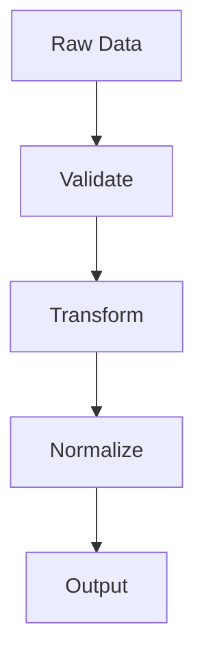
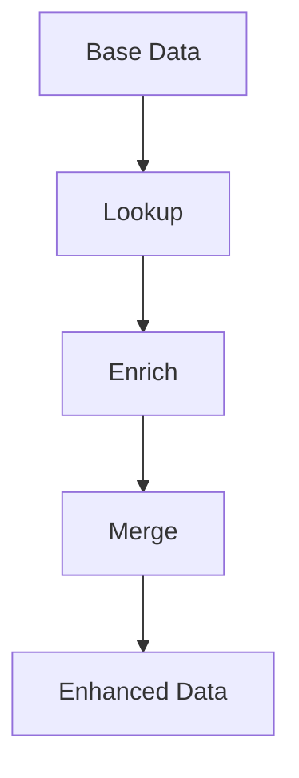
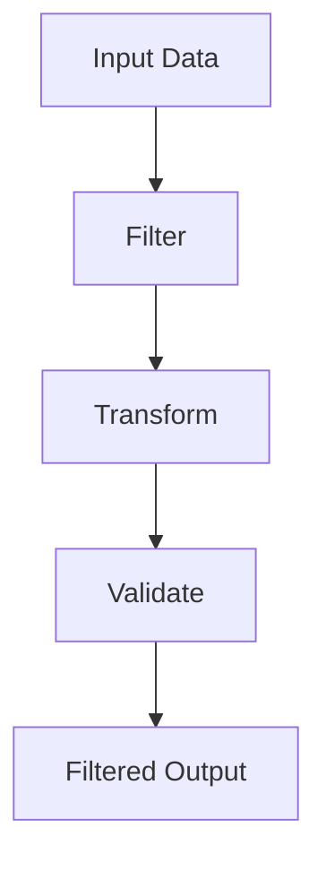

# Transformações de Dados

As transformações de dados são operações que modificam a estrutura, formato ou conteúdo dos dados durante o processamento no n8n.

## Conceitos Fundamentais

### Tipos de Transformações

#### Transformações Estruturais
Modificam a organização dos dados:

- **Flattening**: Achatamento de objetos aninhados
- **Nesting**: Criação de estruturas hierárquicas
- **Pivoting**: Rotação de dados de linha para coluna
- **Aggregation**: Agrupamento e consolidação

#### Transformações de Tipo
Alteram o tipo de dados:

- **Type Conversion**: Conversão entre tipos (string, number, boolean)
- **Date Formatting**: Formatação de datas e timestamps
- **Encoding**: Codificação de caracteres especiais
- **Serialization**: Conversão para JSON, XML, etc.

#### Transformações de Conteúdo
Modificam o valor dos dados:

- **String Operations**: Concatenação, substituição, extração
- **Mathematical Operations**: Cálculos e fórmulas
- **Conditional Logic**: Aplicação de regras condicionais
- **Data Validation**: Verificação de integridade

## Nodes de Transformação

### Set Node
O node **Set** é a principal ferramenta para transformações:

```javascript
// Exemplo: Transformar dados de entrada
{
  "id": "{{ $json.id }}",
  "name": "{{ $json.firstName }} {{ $json.lastName }}",
  "email": "{{ $json.email.toLowerCase() }}",
  "created": "{{ new Date().toISOString() }}"
}
```

### Function Node
Para transformações complexas, use o **Function** node:

```javascript
// Exemplo: Transformação avançada
const items = $input.all();
const transformed = [];

for (const item of items) {
  const data = item.json;
  
  // Transformar estrutura
  const transformedItem = {
    id: data.id,
    fullName: `${data.firstName} ${data.lastName}`,
    email: data.email.toLowerCase(),
    age: new Date().getFullYear() - new Date(data.birthDate).getFullYear(),
    status: data.active ? 'active' : 'inactive'
  };
  
  transformed.push(transformedItem);
}

return transformed;
```

### Code Node
Para lógica personalizada complexa:

```javascript
// Exemplo: Transformação com validação
const inputData = $input.first().json;

// Validar dados obrigatórios
if (!inputData.email || !inputData.name) {
  throw new Error('Dados obrigatórios não fornecidos');
}

// Transformar e validar email
const email = inputData.email.toLowerCase();
const emailRegex = /^[^\s@]+@[^\s@]+\.[^\s@]+$/;
if (!emailRegex.test(email)) {
  throw new Error('Email inválido');
}

// Retornar dados transformados
return {
  id: inputData.id,
  name: inputData.name.trim(),
  email: email,
  createdAt: new Date().toISOString(),
  isValid: true
};
```

## Padrões Comuns

### Padrão de Normalização


### Padrão de Enriquecimento


### Padrão de Filtragem


## Técnicas Avançadas

### Transformações Condicionais
Use expressões para aplicar transformações baseadas em condições:

```javascript
// Exemplo: Transformação condicional
{
  "status": "{{ $json.value > 100 ? 'high' : 'low' }}",
  "category": "{{ $json.type === 'premium' ? 'vip' : 'standard' }}",
  "priority": "{{ $json.urgent ? 'high' : 'normal' }}"
}
```

### Transformações em Lote
Processe múltiplos itens simultaneamente:

```javascript
// Exemplo: Transformação em lote
const items = $input.all();
const batchSize = 100;
const batches = [];

for (let i = 0; i < items.length; i += batchSize) {
  const batch = items.slice(i, i + batchSize);
  const transformedBatch = batch.map(item => ({
    ...item.json,
    processedAt: new Date().toISOString(),
    batchId: Math.floor(i / batchSize)
  }));
  batches.push(transformedBatch);
}

return batches.flat();
```

### Transformações Recursivas
Para estruturas de dados aninhadas:

```javascript
// Exemplo: Transformação recursiva
function transformNestedData(data) {
  if (Array.isArray(data)) {
    return data.map(item => transformNestedData(item));
  }
  
  if (typeof data === 'object' && data !== null) {
    const transformed = {};
    for (const [key, value] of Object.entries(data)) {
      transformed[key.toLowerCase()] = transformNestedData(value);
    }
    return transformed;
  }
  
  return data;
}

return transformNestedData($input.first().json);
```

## Boas Práticas

### Performance
1. **Use operações nativas** quando possível
2. **Evite loops desnecessários** em grandes datasets
3. **Implemente paginação** para datasets muito grandes
4. **Cache resultados** de transformações custosas

### Manutenibilidade
1. **Documente transformações complexas** com comentários
2. **Use nomes descritivos** para variáveis e funções
3. **Separe lógica de negócio** de transformações técnicas
4. **Teste transformações** com dados de exemplo

### Validação
1. **Valide dados de entrada** antes de transformar
2. **Implemente tratamento de erros** robusto
3. **Verifique tipos de dados** após transformações
4. **Teste casos extremos** e dados inválidos

## Recursos Relacionados

- **[Data Mapping Avançado](./data-mapping-avancado)** - Mapeamento complexo de dados
- **[Data Filtering](./data-filtering)** - Filtragem e seleção de dados
- **[Data Editing](./data-editing)** - Edição e manipulação de dados
- **[Expressões](../expressoes)** - Lógica avançada com expressões
- **[Function Node](../../integracoes/builtin-nodes/core-nodes/function)** - Node para código personalizado 