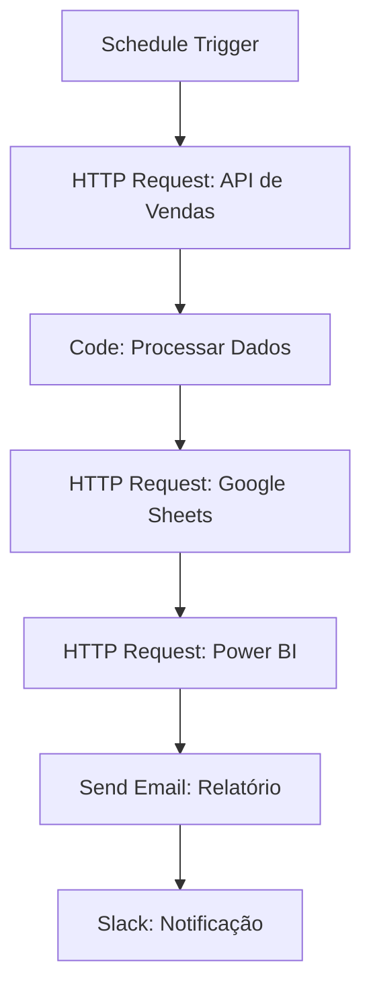
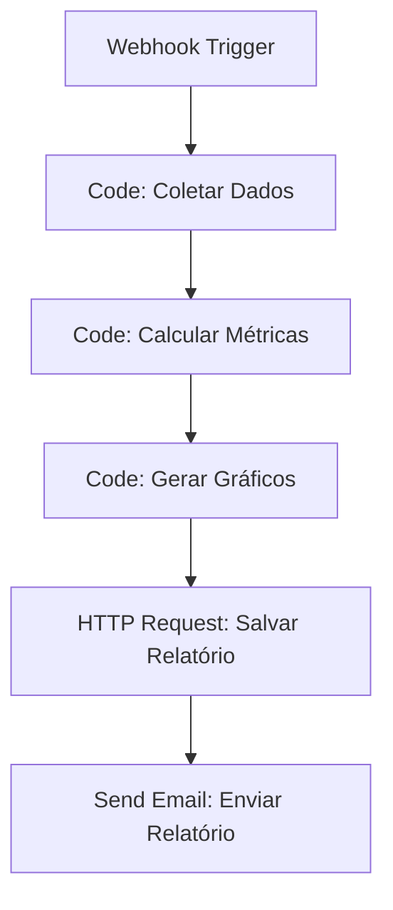

---
sidebar_position: 6
title: Visualização de Dados
description: Técnicas para criar dashboards e visualizações de dados no n8n
keywords: [n8n, visualização, dashboards, gráficos, relatórios, dados]
---

<IonicIcon name="bar-chart-outline" style={{fontSize: '24px', color: '#ea4b71'}} />
# Visualização de Dados

A visualização de dados é fundamental para transformar informações complexas em insights acionáveis. Esta seção aborda como criar dashboards, gráficos e relatórios eficazes no n8n.

---

<IonicIcon name="information-circle-outline" style={{fontSize: '24px', color: '#ea4b71'}} />
## Visão Geral

A visualização de dados permite comunicar informações de forma clara e eficaz, facilitando a tomada de decisões baseadas em dados. No n8n, você pode integrar com ferramentas de visualização para criar dashboards dinâmicos e relatórios automatizados.

### Benefícios da Visualização

- **Comunicação clara** de insights complexos
- **Identificação rápida** de tendências e padrões
- **Tomada de decisão** baseada em dados
- **Monitoramento em tempo real** de métricas
- **Relatórios automatizados** para stakeholders

---

<IonicIcon name="analytics-outline" style={{fontSize: '24px', color: '#ea4b71'}} />
## Tipos de Visualização

### Gráficos de Linha

Ideal para mostrar tendências ao longo do tempo:

```javascript
// Dados para gráfico de linha
const dadosTendencia = [
  { data: '2024-01', vendas: 1500 },
  { data: '2024-02', vendas: 1800 },
  { data: '2024-03', vendas: 2200 },
  { data: '2024-04', vendas: 2100 },
  { data: '2024-05', vendas: 2500 }
];

// Configuração do gráfico
const configuracaoGrafico = {
  tipo: 'line',
  dados: dadosTendencia,
  eixoX: 'data',
  eixoY: 'vendas',
  titulo: 'Tendência de Vendas'
};
```

### Gráficos de Barras

Perfeitos para comparações entre categorias:

```javascript
// Dados para gráfico de barras
const dadosCategorias = [
  { categoria: 'Eletrônicos', vendas: 4500 },
  { categoria: 'Roupas', vendas: 3200 },
  { categoria: 'Livros', vendas: 1800 },
  { categoria: 'Esportes', vendas: 2100 }
];

// Configuração do gráfico
const configuracaoBarras = {
  tipo: 'bar',
  dados: dadosCategorias,
  eixoX: 'categoria',
  eixoY: 'vendas',
  titulo: 'Vendas por Categoria'
};
```

### Gráficos de Pizza

Excelentes para mostrar proporções:

```javascript
// Dados para gráfico de pizza
const dadosProporcao = [
  { item: 'Produto A', valor: 35 },
  { item: 'Produto B', valor: 25 },
  { item: 'Produto C', valor: 20 },
  { item: 'Produto D', valor: 20 }
];

// Configuração do gráfico
const configuracaoPizza = {
  tipo: 'pie',
  dados: dadosProporcao,
  rotulo: 'item',
  valor: 'valor',
  titulo: 'Distribuição de Vendas'
};
```

---

<IonicIcon name="cloud-outline" style={{fontSize: '24px', color: '#ea4b71'}} />
## Integração com Ferramentas

### Google Sheets

```javascript
// Enviar dados para Google Sheets
const enviarParaSheets = async (dados, planilhaId) => {
  const configuracao = {
    url: `https://sheets.googleapis.com/v4/spreadsheets/${planilhaId}/values/A1:Z1000`,
    method: 'PUT',
    headers: {
      'Authorization': `Bearer ${process.env.GOOGLE_ACCESS_TOKEN}`,
      'Content-Type': 'application/json'
    },
    body: {
      values: dados.map(item => [
        item.data,
        item.valor,
        item.categoria
      ])
    }
  };
  
  return await fetch(configuracao.url, configuracao);
};
```

### Power BI

```javascript
// Preparar dados para Power BI
const prepararParaPowerBI = (dados) => {
  return dados.map(item => ({
    Data: new Date(item.data),
    Valor: parseFloat(item.valor),
    Categoria: item.categoria,
    Regiao: item.regiao || 'N/A'
  }));
};
```

### Tableau

```javascript
// Exportar dados para Tableau
const exportarParaTableau = (dados, formato = 'csv') => {
  if (formato === 'csv') {
    const headers = Object.keys(dados[0]).join(',');
    const linhas = dados.map(item => 
      Object.values(item).join(',')
    );
    return [headers, ...linhas].join('\n');
  }
  
  return JSON.stringify(dados, null, 2);
};
```

---

<IonicIcon name="git-network-outline" style={{fontSize: '24px', color: '#ea4b71'}} />
## Workflows de Visualização

### Workflow: Dashboard de Vendas



### Workflow: Relatório Automático



---

<IonicIcon name="settings-outline" style={{fontSize: '24px', color: '#ea4b71'}} />
## Configuração de Dashboards

### Dashboard em Tempo Real

```javascript
// Configurar atualizações automáticas
const configuracaoDashboard = {
  intervaloAtualizacao: 300000, // 5 minutos
  fontesDados: [
    'api-vendas',
    'api-inventario',
    'api-clientes'
  ],
  metricas: [
    'vendas-totais',
    'clientes-ativos',
    'produtos-populares'
  ],
  alertas: {
    vendasBaixas: 1000,
    estoqueBaixo: 10
  }
};
```

### Relatórios Personalizados

```javascript
// Gerar relatório personalizado
const gerarRelatorio = (dados, configuracao) => {
  const relatorio = {
    titulo: configuracao.titulo,
    periodo: configuracao.periodo,
    metricas: {},
    graficos: [],
    resumo: ''
  };
  
  // Calcular métricas
  relatorio.metricas = calcularMetricas(dados);
  
  // Gerar gráficos
  relatorio.graficos = gerarGraficos(dados, configuracao.graficos);
  
  // Criar resumo
  relatorio.resumo = criarResumo(relatorio.metricas);
  
  return relatorio;
};
```

---

<IonicIcon name="chevron-forward-outline" style={{fontSize: '24px', color: '#ea4b71'}} />
## Próximos passos

1. **[Schema Preview](./schema-preview)** - Entenda estruturas de dados
2. **[Otimização de Performance](./otimizacao-performance)** - Melhore eficiência
3. **[Data Mapping Avançado](./data-mapping-avancado)** - Calcule métricas

> *Agora você domina técnicas de visualização de dados. Use essas habilidades para criar dashboards informativos e relatórios eficazes!*

---

:::tip **Dica Pro**
Escolha o tipo de visualização mais apropriado para seus dados e público-alvo para maximizar o impacto da comunicação.
:::

:::warning **Importante**
Sempre valide a precisão dos dados antes de criar visualizações para evitar comunicar informações incorretas.
:::

:::info **Recurso Adicional**
Use ferramentas como Google Data Studio, Power BI ou Tableau para criar dashboards interativos e profissionais.
:::
