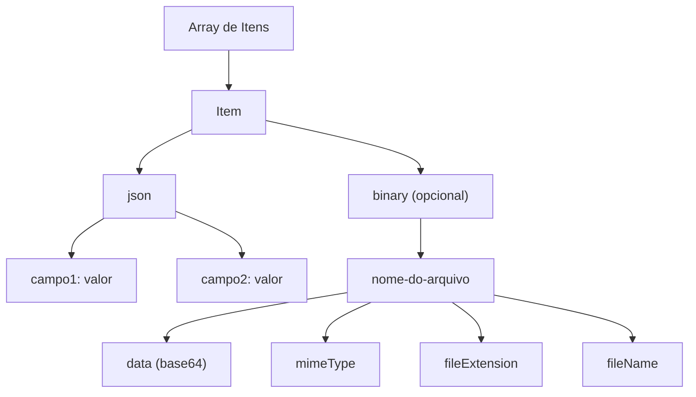

# <ion-icon name="cube-outline" style={{ fontSize: '24px', color: '#ea4b71' }}></ion-icon> Estrutura de Dados no n8n: Guia Completo

No n8n, **todos os dados trafegam entre os nós como um array de objetos**. Cada objeto representa um item de dados processado pelo workflow, podendo conter informações em formato JSON e/ou binário.

## Estrutura Padrão de Item

Cada item do array possui, no mínimo, a chave `json`. Se houver arquivos ou dados binários, a chave `binary` também estará presente.

```json
[
  {
    "json": {
      "nome": "João",
      "idade": 30,
      "ativo": true
    },
    "binary": {
      "meuarquivo": {
        "data": "base64...",
        "mimeType": "image/png",
        "fileExtension": "png",
        "fileName": "foto-perfil.png"
      }
    }
  }
]
```

### Explicação dos Campos

- **json**: Objeto com dados estruturados (campos, valores, objetos aninhados).
- **binary**: Objeto opcional, presente apenas quando há arquivos ou dados binários.
  - **data**: Conteúdo do arquivo em base64.
  - **mimeType**: Tipo MIME do arquivo (ex: `image/png`, `application/pdf`).
  - **fileExtension**: Extensão do arquivo (ex: `png`, `pdf`).
  - **fileName**: Nome do arquivo original.

## Boas Práticas

- Sempre defina `mimeType`, `fileExtension` e `fileName` ao manipular dados binários. Isso garante compatibilidade entre nós e facilita o download ou visualização dos arquivos.
- Estruture o objeto `json` de forma clara, utilizando nomes de campos descritivos e, se necessário, objetos aninhados para dados complexos.
- Lembre-se: mesmo que um nó processe apenas um item, o dado será sempre um array de objetos.

## Exemplo Prático

Imagine um workflow que recebe dados de um formulário e um upload de imagem:

```json
[
  {
    "json": {
      "nome": "Maria",
      "email": "maria@exemplo.com"
    },
    "binary": {
      "foto": {
        "data": "base64...",
        "mimeType": "image/jpeg",
        "fileExtension": "jpg",
        "fileName": "maria.jpg"
      }
    }
  }
]
```

## Visualização em Mermaid.js



---

> **Nota importante:**
> O padrão de dados do n8n garante flexibilidade e integração entre diferentes nós, facilitando a automação de processos complexos e o tratamento de arquivos em workflows empresariais. 