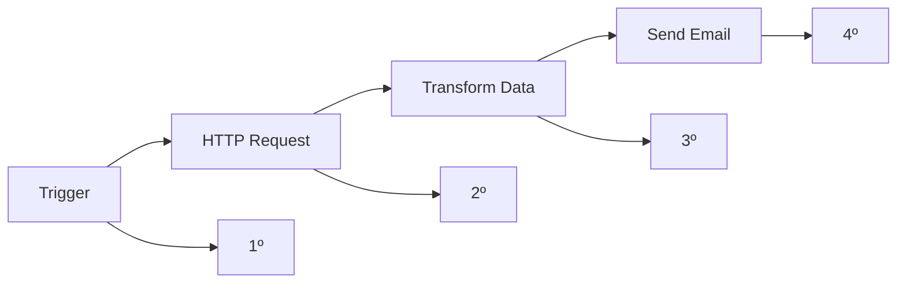
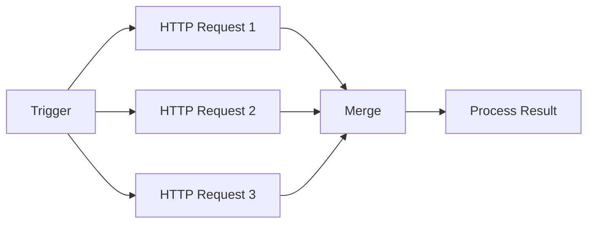
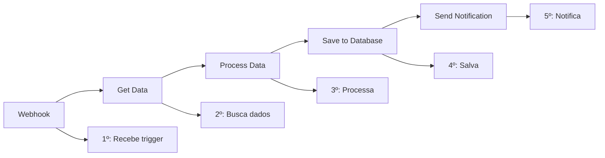
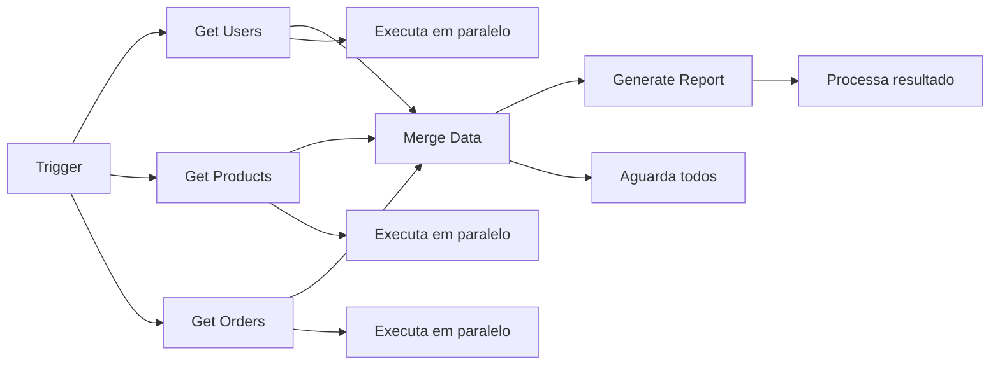
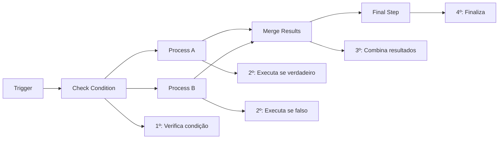

# <ion-icon name="play-forward-outline" style={{ fontSize: '24px', color: '#ea4b71' }}></ion-icon> Ordem de Execução

O n8n determina a ordem de execução dos nodes baseado nas conexões que você cria no workflow. Entender como isso funciona é fundamental para criar workflows eficientes e previsíveis.

## <ion-icon name="chevron-forward-outline" style={{ fontSize: '24px', color: '#ea4b71' }}></ion-icon> Como a Ordem é Determinada

### Fluxo Sequencial

Por padrão, o n8n executa os nodes em **ordem sequencial** baseado nas conexões:

### Execução Paralela

Quando múltiplos nodes não dependem um do outro, eles podem executar em **paralelo**:

## <ion-icon name="settings-outline" style={{ fontSize: '24px', color: '#ea4b71' }}></ion-icon> Tipos de Conexões

### Conexão Simples

- Um node conecta diretamente ao próximo
- Execução sequencial garantida
- Dados fluem de um para o outro

### Conexões Múltiplas

- Um node pode conectar a múltiplos nodes
- Todos os nodes conectados executam
- Útil para processamento paralelo

### Conexões Condicionais

- Usando nodes como IF ou Switch
- Apenas o caminho condicional executará
- Permite lógica de decisão no workflow

## <ion-icon name="code-slash-outline" style={{ fontSize: '24px', color: '#ea4b71' }}></ion-icon> Exemplos de Ordem de Execução

### Exemplo 1: Fluxo Linear

### Exemplo 2: Processamento Paralelo

### Exemplo 3: Fluxo Condicional

## <ion-icon name="warning-outline" style={{ fontSize: '24px', color: '#ea4b71' }}></ion-icon> Considerações Importantes

### Dependências

- Nodes só executam quando **todos os inputs** estão prontos
- Se um node falha, os nodes dependentes não executam
- Use **Error Handling** para tratar falhas

### Performance

- **Execução paralela** pode melhorar performance
- **Execução sequencial** é mais previsível
- Monitore tempo de execução de cada node

### Recursos

- Cada execução consome recursos do sistema
- Muitas execuções paralelas podem sobrecarregar
- Use **Rate Limiting** quando necessário

## <ion-icon name="chevron-forward-outline" style={{ fontSize: '24px', color: '#ea4b71' }}></ion-icon> Boas Práticas

### Para Workflows Simples

1. **Mantenha fluxo linear** quando possível
2. **Use nomes descritivos** para nodes
3. **Documente dependências** importantes

### Para Workflows Complexos

1. **Separe em sub-workflows** para melhor organização
2. **Use Merge nodes** para combinar fluxos paralelos
3. **Implemente error handling** em pontos críticos

### Para Performance

1. **Execute em paralelo** quando possível
2. **Use Execute Once** para operações únicas
3. **Monitore logs** para identificar gargalos

## <ion-icon name="arrow-forward-circle-outline" style={{ fontSize: '24px', color: '#ea4b71' }}></ion-icon> Próximos Passos

1. **Aprenda sobre [Error Handling](./error-handling)** para tratar falhas
2. **Explore [Merging](./merging)** para combinar fluxos
3. **Entenda [Subworkflows](./subworkflows)** para organização

## <ion-icon name="school-outline" style={{ fontSize: '24px', color: '#ea4b71' }}></ion-icon> Recursos Relacionados

- **[Error Handling](./error-handling)** - Tratamento de erros
- **[Merging](./merging)** - Combinar fluxos de dados
- **[Subworkflows](./subworkflows)** - Organizar workflows complexos
- **[Core Nodes](../integracoes/builtin-nodes/core-nodes/)** - Nodes fundamentais
