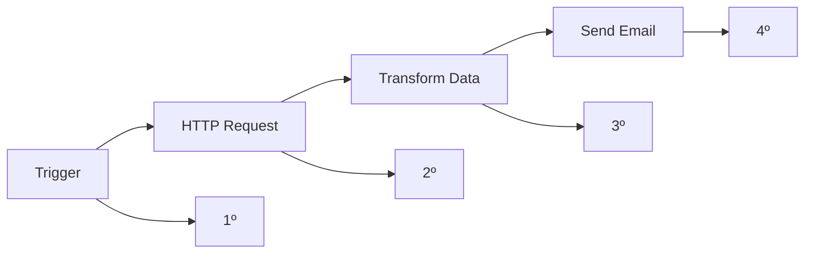
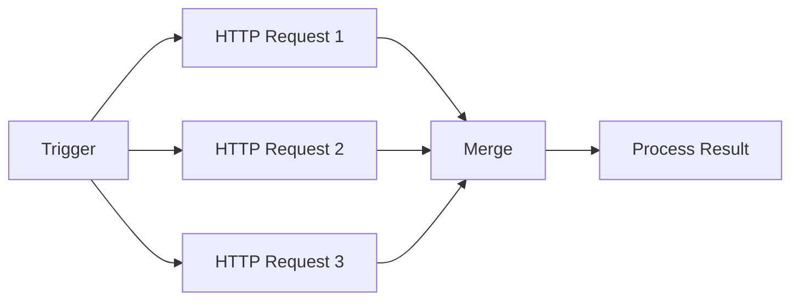

---
sidebar_position: 7
title: Ordem de Execução
description: Entenda como o n8n determina a ordem de execução dos nodes
keywords: [n8n, execução, ordem, sequência, workflow, nodes]
---

#ionicicon-nameplay-forward-outline-style-fontsize-24px color: '#cor-ea4b71-ordem-de Execução

O n8n determina a ordem de execução dos nodes baseado nas conexões que você cria no workflow. Entender como isso funciona é fundamental para criar workflows eficientes e previsíveis.

#ionicicon-namechevron-forward-outline-style-fontsize-24px color: '#cor-ea4b71-como-a Ordem é Determinada

#fluxo-sequencial-por-padro-o n8n executa os nodes em **ordem sequencial** baseado nas conexões:



#execuo-paralela-quando-mltiplos-nodes não dependem um do outro, eles podem executar em **paralelo**:



#ionicicon-namesettings-outline-style-fontsize-24px color: '#cor-ea4b71-tipos-de Conexões

#conexo-simples-um-node conecta diretamente ao próximo
- Execução sequencial garantida
- Dados fluem de um para o outro

#conexes-mltiplas-um-node pode conectar a múltiplos nodes
- Todos os nodes conectados executam
- Útil para processamento paralelo

#conexes-condicionais-usando-nodes como IF ou Switch
- Apenas o caminho condicional executará
- Permite lógica de decisão no workflow

#ionicicon-namecode-slash-outline-style-fontsize-24px color: '#cor-ea4b71-exemplos-de Ordem de Execução

#exemplo-1-fluxo-linear-mermaid
graph LR
    A[Webhook] --> B[Get Data]
    B --> C[Process Data]
    C --> D[Save to Database]
    D --> E[Send Notification]
    
    A --> A1[1º: Recebe trigger]
    B --> B1[2º: Busca dados]
    C --> C1[3º: Processa]
    D --> D1[4º: Salva]
    E --> E1[5º: Notifica]
```

#exemplo-2-processamento-paralelo-mermaid
graph LR
    A[Trigger] --> B[Get Users]
    A --> C[Get Products]
    A --> D[Get Orders]
    
    B --> E[Merge Data]
    C --> E
    D --> E
    E --> F[Generate Report]
    
    B --> B1[Executa em paralelo]
    C --> C1[Executa em paralelo]
    D --> D1[Executa em paralelo]
    E --> E1[Aguarda todos]
    F --> F1[Processa resultado]
```

#exemplo-3-fluxo-condicional-mermaid
graph LR
    A[Trigger] --> B[Check Condition]
    B --> C[Process A]
    B --> D[Process B]
    
    C --> E[Merge Results]
    D --> E
    E --> F[Final Step]
    
    B --> B1[1º: Verifica condição]
    C --> C1[2º: Executa se verdadeiro]
    D --> D1[2º: Executa se falso]
    E --> E1[3º: Combina resultados]
    F --> F1[4º: Finaliza]
```

#ionicicon-namewarning-outline-style-fontsize-24px color: '#cor-ea4b71-consideraes-importantes

#dependncias-nodes-s-executam quando **todos os inputs** estão prontos
- Se um node falha, os nodes dependentes não executam
- Use **Error Handling** para tratar falhas

#performance-execuo-paralela-pode melhorar performance
- **Execução sequencial** é mais previsível
- Monitore tempo de execução de cada node

#recursos-cada-execuo-consome recursos do sistema
- Muitas execuções paralelas podem sobrecarregar
- Use **Rate Limiting** quando necessário

#ionicicon-namechevron-forward-outline-style-fontsize-24px color: '#cor-ea4b71-boas-prticas

#para-workflows-simples-1-mantenha fluxo linear** quando possível
2. **Use nomes descritivos** para nodes
3. **Documente dependências** importantes

#para-workflows-complexos-1-separe em sub-workflows** para melhor organização
2. **Use Merge nodes** para combinar fluxos paralelos
3. **Implemente error handling** em pontos críticos

#para-performance-1-execute-em paralelo** quando possível
2. **Use Execute Once** para operações únicas
3. **Monitore logs** para identificar gargalos

#ionicicon-namearrow-forward-circle-outline-style-fontsize-24px color: '#cor-ea4b71-prximos-passos

1. **Aprenda sobre [Error Handling](./error-handling)** para tratar falhas
2. **Explore [Merging](./merging)** para combinar fluxos
3. **Entenda [Subworkflows](./subworkflows)** para organização

#ionicicon-nameschool-outline-style-fontsize-24px color: '#cor-ea4b71-recursos-relacionados

- **[Error Handling](./error-handling)** - Tratamento de erros
- **[Merging](./merging)** - Combinar fluxos de dados
- **[Subworkflows](./subworkflows)** - Organizar workflows complexos
- **[Core Nodes](../integracoes/builtin-nodes/core-nodes/)** - Nodes fundamentais

