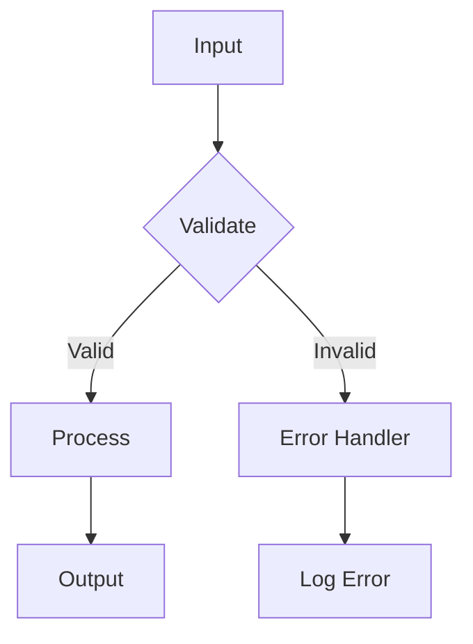
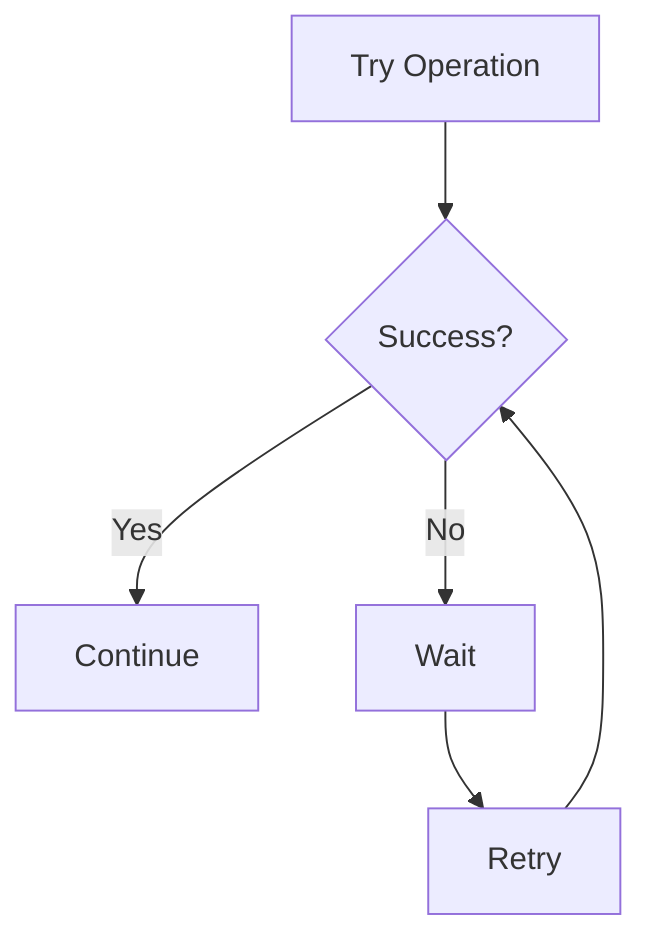
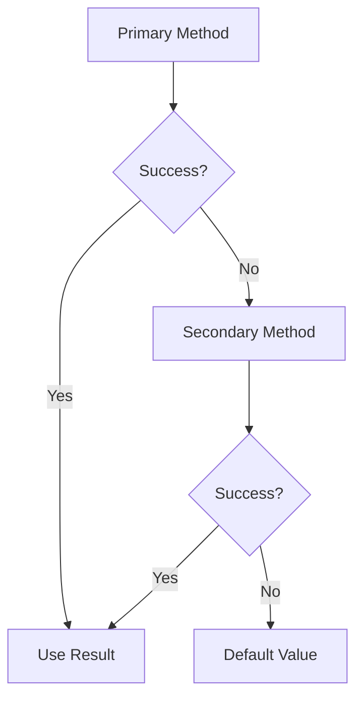

# Lógica de Fluxo

A lógica de fluxo no n8n determina como os dados fluem entre os nodes e como as decisões são tomadas durante a execução de um workflow.

## Conceitos Fundamentais

### Controle de Execução

O n8n oferece diversos mecanismos para controlar o fluxo de execução:

- **Sequencial**: Execução linear de um node para o próximo
- **Condicional**: Execução baseada em condições específicas
- **Paralela**: Execução simultânea de múltiplos caminhos
- **Iterativa**: Repetição de operações sobre conjuntos de dados

### Tipos de Controle

#### Controle Condicional
Utilize nodes como **IF** e **Switch** para criar ramificações baseadas em condições:

```javascript
// Exemplo de condição simples
if (data.status === 'active') {
  // Executar ação A
} else {
  // Executar ação B
}
```

#### Controle Iterativo
Nodes como **Split In Batches** e **Loop** permitem processar dados em lotes:

- **Split In Batches**: Divide grandes conjuntos de dados
- **Loop**: Repete operações sobre cada item
- **Merge**: Combina resultados de múltiplas iterações

#### Controle de Tempo
Nodes de tempo controlam quando as operações são executadas:

- **Wait**: Pausa a execução por um período específico
- **Schedule Trigger**: Executa workflows em horários programados
- **Cron**: Agendamento avançado com expressões cron

## Padrões Comuns

### Padrão de Validação


### Padrão de Retry


### Padrão de Fallback


## Boas Práticas

### Estrutura de Decisões
1. **Simplifique condições complexas** em múltiplos nodes IF
2. **Use nomes descritivos** para branches de decisão
3. **Documente a lógica** com comentários nos nodes

### Tratamento de Erros
1. **Sempre implemente error handling** para operações críticas
2. **Use nodes de erro** para capturar e processar falhas
3. **Implemente retry logic** para operações que podem falhar temporariamente

### Performance
1. **Evite loops desnecessários** - use operações em lote quando possível
2. **Limite o número de branches** para manter workflows legíveis
3. **Use subworkflows** para lógica complexa reutilizável

## Próximos Passos

Explore os tópicos específicos de controle de fluxo:

- **[Looping](./looping)** - Repetições e iterações
- **[Merging](./merging)** - Combinando dados de múltiplas fontes
- **[Splitting](./splitting)** - Dividindo dados para processamento
- **[Subworkflows](./subworkflows)** - Workflows aninhados
- **[Waiting](./waiting)** - Controle de tempo e pausas

## Recursos Relacionados

- **[Expressões](../expressoes)** - Lógica avançada com expressões
- **[Tratamento de Erros](./error-handling)** - Gerenciamento de falhas
- **[Debugging](./debugging)** - Identificação e correção de problemas
- **[Performance](../data/otimizacao-performance)** - Otimização de workflows 