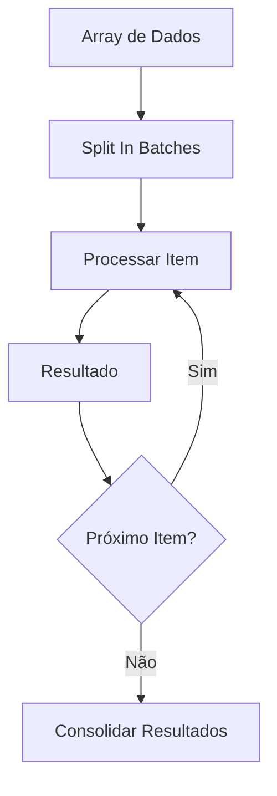
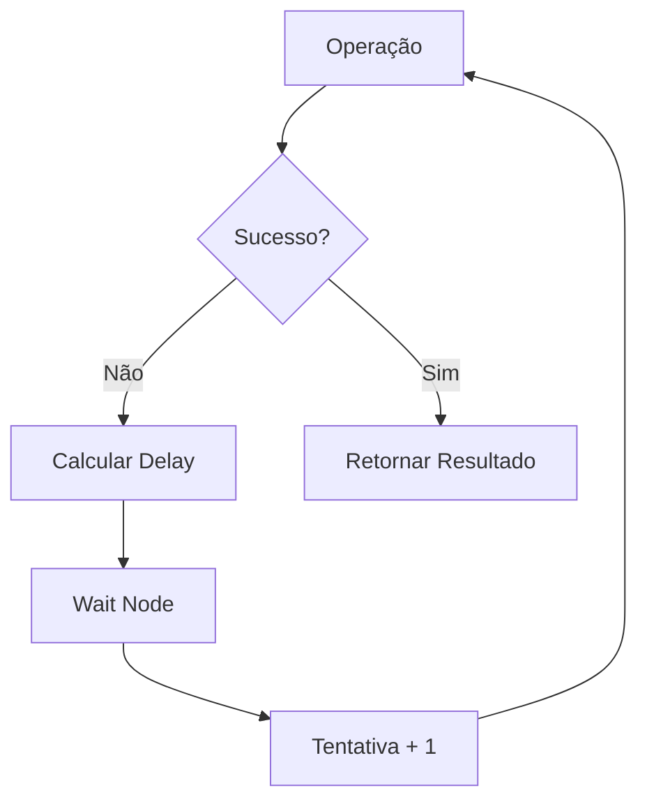
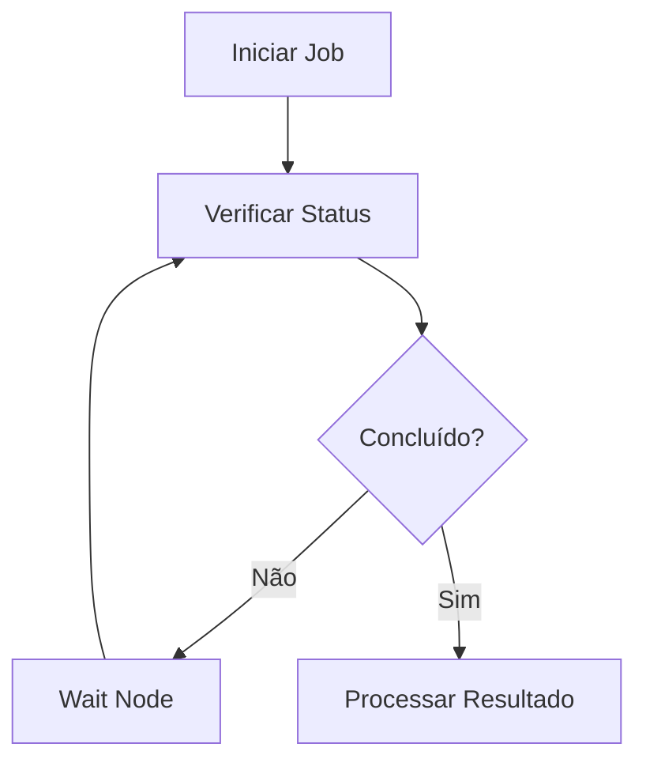
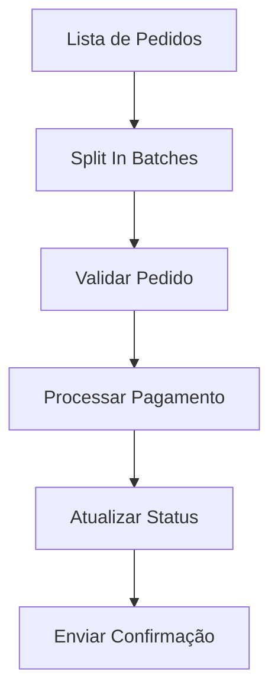
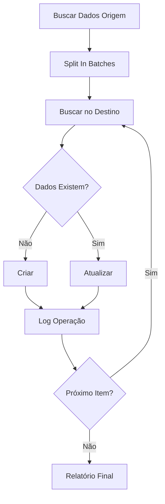
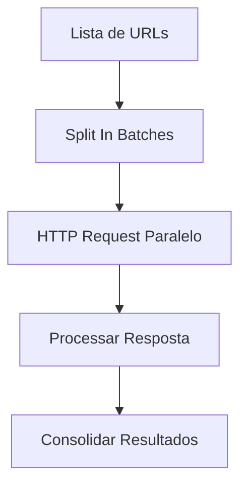
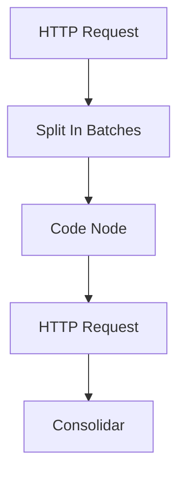

---
sidebar_position: 3
title: Looping no n8n
description: Como criar loops e repetições em workflows n8n
keywords: [n8n, loop, repetição, lógica, fluxo, iteração, array]
---

<IonicIcon name="repeat-outline" style={{fontSize: '24px', color: '#ea4b71'}} />
**Looping no n8n**

Looping é uma técnica fundamental para processar dados repetitivos, iterar sobre arrays e criar workflows dinâmicos. O n8n oferece várias estratégias para implementar loops eficientes e controlados.

<IonicIcon name="information-circle-outline" style={{fontSize: '24px', color: '#ea4b71'}} />
**Configuração Básica**

**Configuração básica:**

```json
{
  "batchSize": 10,
  "options": {
    "reset": false
  }
}
```

### Configuração Avançada

**Configuração avançada:**

```json
{
  "batchSize": "={{$json.items.length > 100 ? 50 : 10}}",
  "options": {
    "reset": true,
    "waitBetweenBatches": 1000
  }
}
```

## Code Node para Loops Customizados

Para loops complexos, use o Code Node.

```javascript
// Loop simples sobre array
const items = $json.items;
const resultados = [];

for (let i = 0; i < items.length; i++) {
  const item = items[i];
  const processado = await processarItem(item);
  resultados.push(processado);
}

return resultados;
```

```javascript
/ Loop com condição
const dados = $json;
const resultados = [];
let i = 0;

while (i < dados.length && dados[i].status !== 'erro') {
  const resultado = await processarDado(dados[i]);
  resultados.push(resultado);
  i++;
}

return resultados;
```
<IonicIcon name="code-outline" style={{fontSize: '24px', color: '#ea4b71'}} />
## Padrões de Loop

### Processamento de Array

Processa cada elemento de um array.



**Implementação:**

```javascript
// Dados de entrada
const clientes = [
  { id: 1, nome: 'João', email: 'joao@exemplo.com' },
  { id: 2, nome: 'Maria', email: 'maria@exemplo.com' },
  { id: 3, nome: 'Pedro', email: 'pedro@exemplo.com' }
];

// Processar cada cliente
const clientesProcessados = clientes.map(async cliente => {
  // Enriquecer dados
  const dadosEnriquecidos = await enriquecerDados(cliente);
  
  // Validar dados
  const validacao = validarCliente(dadosEnriquecidos);
  
  return {
    ...dadosEnriquecidos,
    validacao,
    processado_em: $now
  };
});

return await Promise.all(clientesProcessados);
```

### Retry com Backoff

Tenta uma operação múltiplas vezes com delays crescentes.



**Implementação:**

```javascript
// Retry com backoff exponencial
const maxTentativas = 5;

const operacao = async () => {
  const response = await fetch('https://api.exemplo.com/dados');
  if (!response.ok) {
    throw new Error(`HTTP ${response.status}`);
  }
  return response.json();
};

let tentativa = 0;
let resultado;

while (tentativa < maxTentativas) {
  try {
    resultado = await operacao();
    break; // Sucesso, sair do loop
  } catch (error) {
    tentativa++;
        if (tentativa >= maxTentativas) {
      throw new Error(`Falha após ${maxTentativas} tentativas: ${error.message}`);
    }

    // Backoff exponencial
    const delay = Math.pow(2, tentativa) * 1000;
    await new Promise(resolve => setTimeout(resolve, delay));
  }
}

return resultado;
```

### Polling

Verifica status periodicamente até uma condição ser atendida.



**Implementação:**

```javascript
// Polling com timeout
const maxTentativas = 20;
const intervalo = 5000; // 5 segundos
let tentativa = 0;

while (tentativa < maxTentativas) {
  const status = await verificarStatus($json.job_id);
  
  if (status.status === 'completed') {
    return {
      status: 'sucesso',
      resultado: status.resultado,
      tentativas: tentativa + 1
    };
  }

  if (status.status === 'failed') {
    throw new Error(`Job falhou: ${status.erro}`);
  }

  tentativa++;
  
  if (tentativa < maxTentativas) {    await new Promise(resolve => setTimeout(resolve, intervalo));
  }
}

throw new Error(`Timeout: Job não foi concluído em ${maxTentativas * intervalo / 1000} segundos`);
```

<IonicIcon name="construct-outline" style={{fontSize: '24px', color: '#ea4b71'}} />
## Casos de Uso Práticos

### Processamento de Pedidos em Lote

**Cenário**: Processar múltiplos pedidos de uma vez.



**Implementação:**

```javascript
// Code Node - Processar lote de pedidos
const pedidos = $json;

const resultados = await Promise.all(
  pedidos.map(async pedido => {
    try {
      // Validar pedido
      const validacao = await validarPedido(pedido);
      if (!validacao.valido) {
        return {
          pedido_id: pedido.id,
          status: 'invalido',
          erro: validacao.erro
        };
      }

      // Processar pagamento
      const pagamento = await processarPagamento(pedido);
      
      // Atualizar status
      await atualizarStatus(pedido.id, 'pago');
      
      // Enviar confirmação
      await enviarConfirmacao(pedido.cliente_email);
      
      return {
        pedido_id: pedido.id,
        status: 'processado',
        pagamento_id: pagamento.id
      };
    } catch (error) {
      return {
        pedido_id: pedido.id,
        status: 'erro',
        erro: error.message
      };
    }
  })
);

return {
  total_pedidos: pedidos.length,
  sucessos: resultados.filter(r => r.status === 'processado').length,
  erros: resultados.filter(r => r.status === 'erro').length,
  resultados
};
```

### Sincronização de Dados

**Cenário**: Sincronizar dados entre sistemas diferentes.



**Implementação:**

```javascript
// Code Node - Sincronização de dados
const dadosOrigem = $json;

const operacoes = await Promise.all(
  dadosOrigem.map(async item => {
    try {
      // Buscar no sistema destino
      const existente = await buscarNoDestino(item.id);
      
      if (!existente) {
        // Criar novo
        const resultado = await criarNoDestino(item);
        return {
          id: item.id,
          operacao: 'criado',
          resultado: resultado.id
        };
      } else {
        // Atualizar existente
        const resultado = await atualizarNoDestino(item.id, item);
        return {
          id: item.id,
          operacao: 'atualizado',
          resultado: resultado.id
        };
      }
    } catch (error) {
      return {
        id: item.id,
        operacao: 'erro',
        erro: error.message
      };
    }
  })
);

return {
  total_items: dadosOrigem.length,
  criados: operacoes.filter(op => op.operacao === 'criado').length,
  atualizados: operacoes.filter(op => op.operacao === 'atualizado').length,
  erros: operacoes.filter(op => op.operacao === 'erro').length,
  operacoes
};
```

### Processamento Paralelo

**Cenário**: Executar múltiplas operações simultaneamente.



**Implementação:**

```javascript
// Code Node - Processamento paralelo
const urls = $json;

// Processar URLs em paralelo
const resultados = await Promise.all(
  urls.map(async url => {
    try {
      const startTime = $now;
      const response = await fetch(url);
      const endTime = $now;
      
      return {
        url,
        status: response.status,
        tempo_resposta: endTime - startTime,
        tamanho: response.headers.get('content-length') || 0
      };
    } catch (error) {
      return {
        url,
        status: 'erro',
        erro: error.message
      };
    }
  })
);

// Calcular estatísticas
const estatisticas = {
  total_urls: urls.length,
  sucessos: resultados.filter(r => r.status === 200).length,
  erros: resultados.filter(r => r.status === 'erro').length,
  tempo_medio: resultados
    .filter(r => r.tempo_resposta)
    .reduce((sum, r) => sum + r.tempo_resposta, 0) / 
    resultados.filter(r => r.tempo_resposta).length
};

return {
  estatisticas,
  resultados
};
```

<IonicIcon name="flash-outline" style={{fontSize: '24px', color: '#ea4b71'}} />
## Expressões e Data Mapping

### Loops Dinâmicos

```javascript
// Tamanho do batch baseado em dados
const batchSize = $json.items.length > 1000 ? 100 : 10;

return {
  "batchSize": batchSize
};
```

### Loops Condicionais

```javascript
// Loop baseado em condição
const dados = $json;
const resultados = [];

for (const item of dados) {
  if (item.status === 'pendente') {
    const processado = await processarItem(item);
    resultados.push(processado);
  }
}

return resultados;
```

### Loops com Controle

```javascript
// Loop com break condicional
const dados = $json;
const resultados = [];

for (const item of dados) {
  if (item.prioridade === 'alta') {
    const processado = await processarItem(item);
    resultados.push(processado);

    if (processado.status === 'erro') {
      break; // Parar se encontrar erro em item de alta prioridade
    }
  }
}

return resultados;
```

<IonicIcon name="warning-outline" style={{fontSize: '24px', color: '#ea4b71'}} />
## Tratamento de Erros

### Loop com Error Handling

```javascript
// Loop com tratamento de erro individual
const dados = $json;
const resultados = [];
const erros = [];

for (const item of dados) {
  try {
    const resultado = await processarItem(item);
    resultados.push({
      id: item.id,
      status: 'sucesso',
      resultado
    });
  } catch (error) {
    erros.push({
      id: item.id,
      erro: error.message
    });
    
    // Continuar processando outros itens
    console.error(`Erro processando item ${item.id}:`, error);
  }
}

return {
  sucessos: resultados,
  erros,
  total_processados: dados.length
};
```

### Loop com Retry

```javascript
// Loop com retry para itens que falham
const dados = $json;
const maxTentativas = 3;

const processarComRetry = async (item) => {
  for (let tentativa = 1; tentativa <= maxTentativas; tentativa++) {
    try {
      return await processarItem(item);
    } catch (error) {
      if (tentativa === maxTentativas) {
        throw error;
      }
      
      // Aguardar antes da próxima tentativa      await new Promise(resolve => setTimeout(resolve, 1000 * tentativa));
    }
  }
};

const resultados = await Promise.all(
  dados.map(async item => {
    try {
      const resultado = await processarComRetry(item);
      return {
        id: item.id,
        status: 'sucesso',
        resultado
      };
    } catch (error) {
      return {
        id: item.id,
        status: 'erro',
        erro: error.message
      };
    }
  })
);

return resultados;
```

<IonicIcon name="speedometer-outline" style={{fontSize: '24px', color: '#ea4b71'}} />
## Performance e Otimização

### Boas Práticas

1. **Otimize Batch Size**
   - Use batches apropriados para o volume de dados
   - Considere rate limits das APIs
   - Balanceie performance e uso de recursos

2. **Use Processamento Paralelo**
   - Execute operações independentes simultaneamente
   - Evite loops sequenciais desnecessários
   - Monitore uso de recursos

3. **Implemente Rate Limiting**
   - Respeite limites das APIs externas
   - Use delays entre operações
   - Implemente backoff exponencial

### Exemplo de Otimização

```javascript
// Loop otimizado com rate limiting
const dados = $json;
const resultados = [];
const rateLimit = 10; // operações por segundo
const delay = 1000 / rateLimit;

for (let i = 0; i < dados.length; i++) {
  const item = dados[i];
  
  // Processar item
  const resultado = await processarItem(item);
  resultados.push(resultado);
  
  // Rate limiting
  if (i < dados.length - 1) {    await new Promise(resolve => setTimeout(resolve, delay));
  }
}

return resultados;
```

<IonicIcon name="help-circle-outline" style={{fontSize: '24px', color: '#ea4b71'}} />
## Troubleshooting

### Problemas Comuns

**Erro: "Timeout"**
- Reduza tamanho do batch
- Implemente rate limiting
- Use processamento paralelo

**Erro: "Memory limit exceeded"**
- Processe dados em batches menores
- Implemente streaming para dados grandes
- Use paginação

**Erro: "Rate limit exceeded"**
- Implemente delays entre operações
- Use backoff exponencial
- Distribua carga ao longo do tempo

### Debug com Logging

```javascript
// Loop com debugging
const dados = $json;
const resultados = [];
const debug = {
  total_items: dados.length,
  processados: 0,
  erros: 0,
  start_time: $now
};

for (const item of dados) {
  try {
    console.log(`Processando item ${item.id} (${debug.processados + 1}/${dados.length})`);
    
    const resultado = await processarItem(item);
    resultados.push(resultado);
    debug.processados++;
  } catch (error) {
    console.error(`Erro processando item ${item.id}:`, error);
    debug.erros++;
  }
}

debug.end_time = $now;
debug.tempo_total = debug.end_time - debug.start_time;

console.log('Loop Debug:', debug);

return {
  resultados,
  debug
};
```

<IonicIcon name="link-outline" style={{fontSize: '24px', color: '#ea4b71'}} />
## Integração com Outros Nós

### Fluxo Típico



### Exemplo Completo

```javascript
// 1. HTTP Request - Buscar dados
{
  "url": "https://api.exemplo.com/items",
  "method": "GET"
}

// 2. Split In Batches - Dividir em lotes
{
  "batchSize": 10
}

// 3. Code Node - Processar lote
const items = $json;
const resultados = [];

for (const item of items) {
  const processado = await processarItem(item);
  resultados.push(processado);
}

return resultados;

// 4. HTTP Request - Enviar dados processados
{
  "url": "https://api.exemplo.com/processados",
  "method": "POST",
  "body": $json
}

// 5. Code Node - Consolidar resultados
const todosResultados = $input.all();
const consolidado = {
  total_processados: todosResultados.length,
  sucessos: todosResultados.filter(r => r.status === 'sucesso').length,
  erros: todosResultados.filter(r => r.status === 'erro').length,
  resultados: todosResultados
};

return consolidado;
```

<IonicIcon name="document-text-outline" style={{fontSize: '24px', color: '#ea4b71'}} />
## Referências

- **[Split In Batches](../../integracoes/builtin-nodes/data-processing/split-in-batches)** - Nó específico para loops
- **[Wait Node](../../integracoes/builtin-nodes/logic-control/wait)** - Delays em loops
- **[Error Handling](./error-handling)** - Tratamento de erros em loops
- **[Data Processing](../../integracoes/builtin-nodes/data-processing/split-in-batches.mdx)** - Processamento de dados

---

:::warning **Nota de Atenção**
Esta documentação está em processo de validação. Os exemplos práticos e configurações de nós apresentados precisam ser testados e validados em ambientes reais. A intenção é sempre fornecer práticas e exemplos que funcionem corretamente em produção. Se encontrar inconsistências ou problemas, por favor, reporte para que possamos melhorar a qualidade da documentação.
:::

<IonicIcon name="bulb-outline" style={{fontSize: '18px', color: '#ea4b71'}} />
**Dica**: Use o Debug Helper para inspecionar dados em cada etapa do loop e identificar problemas rapidamente.
