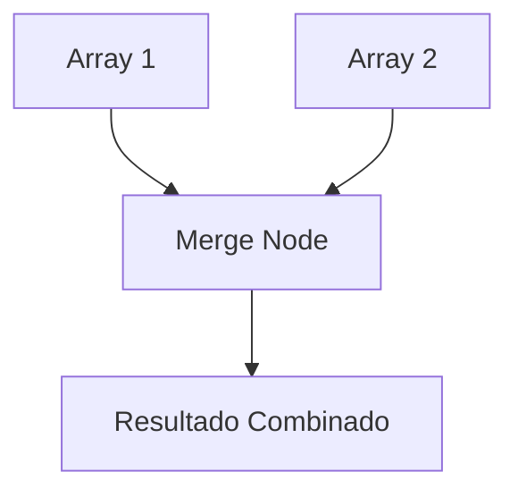
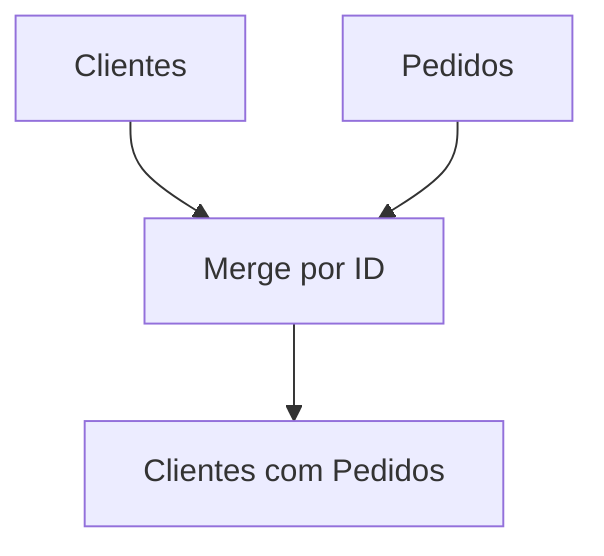
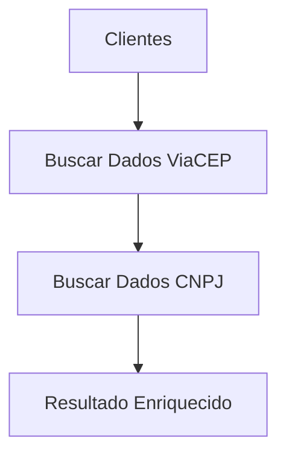
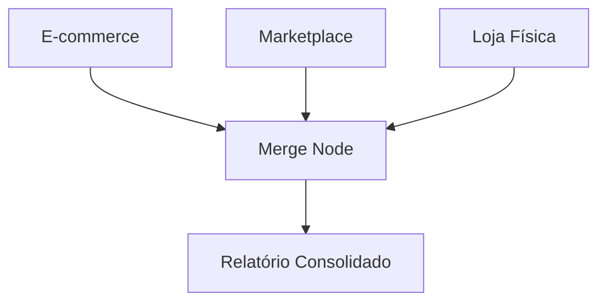
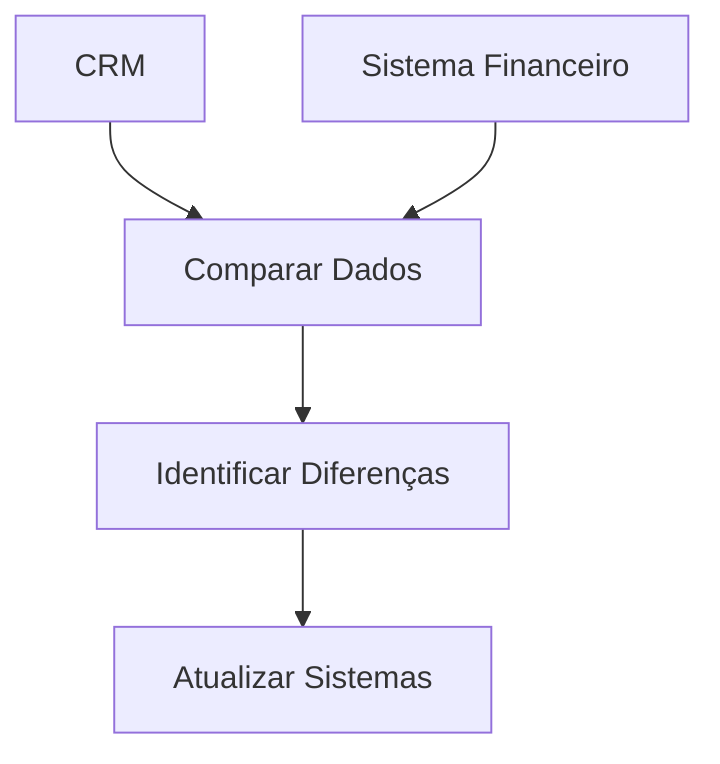
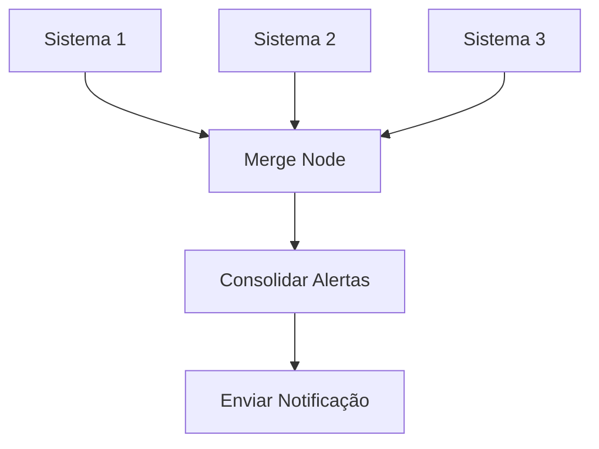
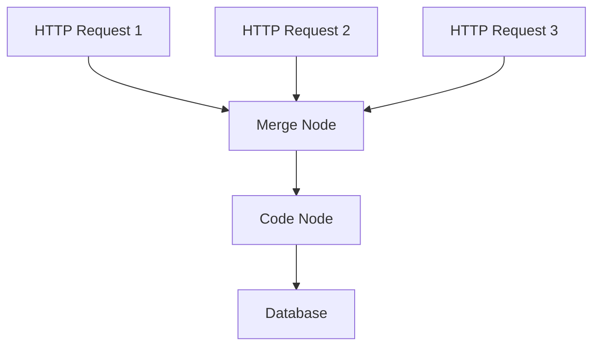

---
sidebar_position: 2
title: Merging de Dados
description: Como combinar e mesclar dados de múltiplas fontes no n8n
keywords: [n8n, merge, combinar, dados, junção, sincronização, join]
---

# <IonicIcon name="analytics-outline" style={{ fontSize: '24px', color: '#ea4b71' }} /> Merging de Dados

O merging de dados é uma técnica fundamental para combinar informações de múltiplas fontes, criar visões unificadas e consolidar dados dispersos. O n8n oferece várias estratégias para realizar merges eficientes e precisos.

## <IonicIcon name="information-circle-outline" style={{ fontSize: '24px', color: '#ea4b71' }} /> Conceitos Fundamentais

### O que é Merging de Dados?

Merging é o processo de **combinar dados** de diferentes fontes em um resultado único, permitindo:

- **Consolidação**: Unir dados de múltiplas APIs
- **Enriquecimento**: Adicionar informações de fontes externas
- **Sincronização**: Manter dados atualizados entre sistemas
- **Relatórios**: Criar visões unificadas de informações
- **Integração**: Conectar sistemas diferentes

### Tipos de Merge

1. **Concatenation**: Juntar dados sequencialmente
2. **Join**: Combinar baseado em chaves comuns
3. **Union**: Unir datasets similares
4. **Intersection**: Manter apenas dados comuns
5. **Enrichment**: Adicionar dados de fontes externas

## <IonicIcon name="settings-outline" style={{ fontSize: '24px', color: '#ea4b71' }} /> Implementação

### 1. Merge Node

O **Merge Node** é a forma mais direta de combinar dados.

**Configuração básica:**
```json
{
  "mode": "combine",
  "combineBy": "position"
}
```

**Configuração avançada:**
```json
{
  "mode": "combine",
  "combineBy": "key",
  "key1": "id",
  "key2": "user_id"
}
```

### 2. Code Node para Merge Customizado

Para merges complexos, use o Code Node.

```javascript
// Merge simples de arrays
const dados1 = $('API 1').json;
const dados2 = $('API 2').json;

const dadosCombinados = [...dados1, ...dados2];

return dadosCombinados;
```

```javascript
// Merge baseado em chave
const usuarios = $('API Usuarios').json;
const pedidos = $('API Pedidos').json;

const usuariosComPedidos = usuarios.map(usuario => {
  const pedidosUsuario = pedidos.filter(pedido => 
    pedido.user_id === usuario.id
  );
  
  return {
    ...usuario,
    pedidos: pedidosUsuario,
    total_pedidos: pedidosUsuario.length
  };
});

return usuariosComPedidos;
```

## <IonicIcon name="code-outline" style={{ fontSize: '24px', color: '#ea4b71' }} /> Padrões de Merge

### 1. Merge por Posição

Combina dados baseado na posição nos arrays.



**Implementação:**
```javascript
// Dados de entrada
const clientes = [
  { id: 1, nome: 'João' },
  { id: 2, nome: 'Maria' }
];

const emails = [
  { email: 'joao@exemplo.com' },
  { email: 'maria@exemplo.com' }
];

// Merge por posição
const resultado = clientes.map((cliente, index) => ({
  ...cliente,
  email: emails[index]?.email
}));

return resultado;
```

### 2. Merge por Chave

Combina dados baseado em chaves comuns.



**Implementação:**
```javascript
// Dados de entrada
const clientes = [
  { id: 1, nome: 'João', email: 'joao@exemplo.com' },
  { id: 2, nome: 'Maria', email: 'maria@exemplo.com' }
];

const pedidos = [
  { id: 1, cliente_id: 1, valor: 100 },
  { id: 2, cliente_id: 1, valor: 200 },
  { id: 3, cliente_id: 2, valor: 150 }
];

// Merge por chave
const clientesComPedidos = clientes.map(cliente => {
  const pedidosCliente = pedidos.filter(pedido => 
    pedido.cliente_id === cliente.id
  );
  
  return {
    ...cliente,
    pedidos: pedidosCliente,
    total_pedidos: pedidosCliente.length,
    valor_total: pedidosCliente.reduce((sum, p) => sum + p.valor, 0)
  };
});

return clientesComPedidos;
```

### 3. Merge com Enriquecimento

Adiciona dados de fontes externas.



**Implementação:**
```javascript
// Dados base
const clientes = [
  { nome: 'João', cep: '01001-000' },
  { nome: 'Maria', cep: '20000-000' }
];

// Enriquecer com dados do ViaCEP
const clientesEnriquecidos = await Promise.all(
  clientes.map(async cliente => {
    try {
      const response = await fetch(
        `https://viacep.com.br/ws/${cliente.cep}/json/`
      );
      const dadosCep = await response.json();
      
      return {
        ...cliente,
        endereco: {
          logradouro: dadosCep.logradouro,
          bairro: dadosCep.bairro,
          cidade: dadosCep.localidade,
          uf: dadosCep.uf
        }
      };
    } catch (error) {
      return {
        ...cliente,
        endereco: null,
        erro: error.message
      };
    }
  })
);

return clientesEnriquecidos;
```

## <IonicIcon name="construct-outline" style={{ fontSize: '24px', color: '#ea4b71' }} /> Casos de Uso Práticos

### 1. Relatório de Vendas Consolidado

**Cenário**: Consolidar dados de vendas de múltiplas plataformas.



**Implementação:**
```javascript
// Dados de diferentes fontes
const vendasEcommerce = $('E-commerce API').json;
const vendasMarketplace = $('Marketplace API').json;
const vendasLoja = $('Loja Física API').json;

// Normalizar dados
const normalizarVenda = (venda, origem) => ({
  id: venda.id,
  data: new Date(venda.data),
  valor: parseFloat(venda.valor),
  cliente: venda.cliente,
  origem: origem,
  produtos: venda.produtos || []
});

// Consolidar vendas
const vendasConsolidadas = [
  ...vendasEcommerce.map(v => normalizarVenda(v, 'ecommerce')),
  ...vendasMarketplace.map(v => normalizarVenda(v, 'marketplace')),
  ...vendasLoja.map(v => normalizarVenda(v, 'loja_fisica'))
];

// Calcular métricas
const relatorio = {
  total_vendas: vendasConsolidadas.length,
  valor_total: vendasConsolidadas.reduce((sum, v) => sum + v.valor, 0),
  por_origem: {
    ecommerce: vendasConsolidadas.filter(v => v.origem === 'ecommerce').length,
    marketplace: vendasConsolidadas.filter(v => v.origem === 'marketplace').length,
    loja_fisica: vendasConsolidadas.filter(v => v.origem === 'loja_fisica').length
  },
  vendas: vendasConsolidadas
};

return relatorio;
```

### 2. Sincronização de Clientes

**Cenário**: Sincronizar dados de clientes entre CRM e sistema financeiro.



**Implementação:**
```javascript
// Dados dos sistemas
const clientesCRM = $('CRM API').json;
const clientesFinanceiro = $('Sistema Financeiro API').json;

// Função para comparar clientes
;
  
  if (crm.nome !== financeiro.nome) {
    diferencas.nome = { crm: crm.nome, financeiro: financeiro.nome };
  }
  
  if (crm.email !== financeiro.email) {
    diferencas.email = { crm: crm.email, financeiro: financeiro.email };
  }
  
  return Object.keys(diferencas).length > 0 ? diferencas : null;
};

// Sincronizar dados
const sincronizacoes = [];

clientesCRM.forEach(clienteCRM => {
  const clienteFinanceiro = clientesFinanceiro.find(
    cf => cf.id === clienteCRM.id
  );
  
  if (clienteFinanceiro) {
    const diferencas = compararClientes(clienteCRM, clienteFinanceiro);
    if (diferencas) {
      sincronizacoes.push({
        cliente_id: clienteCRM.id,
        diferencas,
        acao: 'atualizar'
      });
    }
  } else {
    sincronizacoes.push({
      cliente_id: clienteCRM.id,
      dados: clienteCRM,
      acao: 'criar'
    });
  }
});

return {
  total_sincronizacoes: sincronizacoes.length,
  sincronizacoes
};
```

### 3. Merge de Dados de Monitoramento

**Cenário**: Consolidar alertas de diferentes sistemas de monitoramento.



**Implementação:**
```javascript
// Alertas de diferentes sistemas
const alertasSistema1 = $('Sistema 1').json;
const alertasSistema2 = $('Sistema 2').json;
const alertasSistema3 = $('Sistema 3').json;

// Consolidar alertas
const todosAlertas = [
  ...alertasSistema1.map(a => ({ ...a, origem: 'sistema1' })),
  ...alertasSistema2.map(a => ({ ...a, origem: 'sistema2' })),
  ...alertasSistema3.map(a => ({ ...a, origem: 'sistema3' }))
];

// Agrupar por severidade
const alertasPorSeveridade = todosAlertas.reduce((acc, alerta) => {
  const severidade = alerta.severidade || 'baixa';
  if (!acc[severidade]) {
    acc[severidade] = [];
  }
  acc[severidade].push(alerta);
  return acc;
}, {});

// Resumo consolidado
const resumo = {
  total_alertas: todosAlertas.length,
  por_severidade: {
    critico: alertasPorSeveridade.critico?.length || 0,
    alto: alertasPorSeveridade.alto?.length || 0,
    medio: alertasPorSeveridade.medio?.length || 0,
    baixo: alertasPorSeveridade.baixo?.length || 0
  },
  por_sistema: {
    sistema1: alertasSistema1.length,
    sistema2: alertasSistema2.length,
    sistema3: alertasSistema3.length
  },
  alertas: todosAlertas
};

return resumo;
```

## <IonicIcon name="flash-outline" style={{ fontSize: '24px', color: '#ea4b71' }} /> Expressões e Data Mapping

### Merge Dinâmico

```javascript
// Merge baseado em configuração
const configuracao = $('Config Node').json;
const dados = $json;

const resultado = configuracao.fontes.map(fonte => {
  const dadosFonte = dados[fonte.nome];
  return dadosFonte.map(item => ({
    ...item,
    origem: fonte.nome,
    prioridade: fonte.prioridade
  }));
}).flat();

return resultado;
```

### Merge Condicional

```javascript
// Merge apenas se dados existirem
const dados1 = $('Fonte 1').json;
const dados2 = $('Fonte 2').json;

let resultado = [];

if (dados1 && dados1.length > 0) {
  resultado = [...resultado, ...dados1];
}

if (dados2 && dados2.length > 0) {
  resultado = [...resultado, ...dados2];
}

return resultado;
```

## <IonicIcon name="warning-outline" style={{ fontSize: '24px', color: '#ea4b71' }} /> Tratamento de Erros

### Merge com Tratamento de Erros

```javascript
// Merge com validação de dados
const dados1 = $('Fonte 1').json;
const dados2 = $('Fonte 2').json;

`);
    return [];
  }
  return dados;
};

const dadosValidados1 = validarDados(dados1, 'fonte1');
const dadosValidados2 = validarDados(dados2, 'fonte2');

const resultado = [...dadosValidados1, ...dadosValidados2];

return {
  dados: resultado,
  estatisticas: {
    fonte1: dadosValidados1.length,
    fonte2: dadosValidados2.length,
    total: resultado.length
  }
};
```

### Merge com Fallback

```javascript
// Merge com dados de fallback
const dadosPrincipais = $('Fonte Principal').json;
const dadosFallback = $('Fonte Fallback').json;


  
  console.log('Usando dados de fallback');
  return fallback || [];
};

const resultado = mergeComFallback(dadosPrincipais, dadosFallback);

return resultado;
```

## <IonicIcon name="speedometer-outline" style={{ fontSize: '24px', color: '#ea4b71' }} /> Performance e Otimização

### Boas Práticas

1. **Otimize Consultas**
   - Use filtros para reduzir volume de dados
   - Implemente paginação quando necessário
   - Cache dados frequentemente acessados

2. **Estruture Dados**
   - Use chaves consistentes para joins
   - Normalize dados antes do merge
   - Valide estrutura dos dados

3. **Monitore Performance**
   - Acompanhe tempo de merge
   - Identifique gargalos
   - Use merge incremental quando possível

### Exemplo de Otimização

```javascript
// Merge otimizado com cache
const cacheKey = `merge_${$json.timestamp}`;
const cached = await cache.get(cacheKey);

if (cached) {
  return cached;
}

// Realizar merge
const resultado = await realizarMerge($json);

// Cache resultado
await cache.set(cacheKey, resultado, 300); // 5 minutos

return resultado;
```

## <IonicIcon name="help-circle-outline" style={{ fontSize: '24px', color: '#ea4b71' }} /> Troubleshooting

### Problemas Comuns

**Erro: "Dados não compatíveis"**
- Verifique estrutura dos dados
- Normalize dados antes do merge
- Use validação de schema

**Erro: "Performance lenta"**
- Otimize consultas às fontes
- Implemente cache
- Use merge incremental

**Erro: "Dados duplicados"**
- Implemente deduplicação
- Use chaves únicas
- Valide dados antes do merge

### Debugging

```javascript
// Debug de merge
const debug = {
  "dados_entrada": {
    "fonte1": $('Fonte 1').json?.length || 0,
    "fonte2": $('Fonte 2').json?.length || 0
  },
  "resultado": resultado.length,
  "timestamp": $now
};

console.log('Merge Debug:', JSON.stringify(debug, null, 2));

return {
  ...resultado,
  debug
};
```

## <IonicIcon name="link-outline" style={{ fontSize: '24px', color: '#ea4b71' }} /> Integração com Outros Nós

### Fluxo Típico



### Exemplo Completo

```javascript
// 1. HTTP Request - Buscar clientes
{
  "url": "https://api.exemplo.com/clientes",
  "method": "GET"
}

// 2. HTTP Request - Buscar pedidos
{
  "url": "https://api.exemplo.com/pedidos",
  "method": "GET"
}

// 3. Merge Node - Combinar dados
{
  "mode": "combine",
  "combineBy": "key",
  "key1": "id",
  "key2": "cliente_id"
}

// 4. Code Node - Processar dados combinados
const dadosCombinados = $json;
const relatorio = {
  total_clientes: dadosCombinados.length,
  total_pedidos: dadosCombinados.reduce((sum, c) => sum + c.pedidos.length, 0),
  valor_total: dadosCombinados.reduce((sum, c) => 
    sum + c.pedidos.reduce((s, p) => s + p.valor, 0), 0
  ),
  clientes: dadosCombinados
};

return relatorio;

// 5. Database - Salvar relatório
{
  "operation": "insert",
  "table": "relatorios",
  "data": $json
}
```

## <IonicIcon name="document-text-outline" style={{ fontSize: '24px', color: '#ea4b71' }} /> Referências

- **[Merge Node](../../integracoes/builtin-nodes/logic-control/merge)** - Nó específico para merge
- **[Data Mapping](../../logica-e-dados/data/data-mapping-avancado)** - Mapeamento avançado de dados
- **[Aggregate Node](../../integracoes/builtin-nodes/data-processing/aggregate)** - Agregação de dados
- **[Set Node](../../integracoes/builtin-nodes/data-processing/set)** - Transformação de dados

---

> <IonicIcon name="bulb-outline" style={{ fontSize: '18px', color: '#ea4b71' }} /> **Dica**: Use merge de dados para criar visões unificadas e consolidadas de informações dispersas. Lembre-se de sempre validar e normalizar dados antes do merge para garantir consistência e qualidade.

---

:::warning **Nota de Atenção**
Esta documentação está em processo de validação. Os exemplos práticos e configurações de nós apresentados precisam ser testados e validados em ambientes reais. A intenção é sempre fornecer práticas e exemplos que funcionem corretamente em produção. Se encontrar inconsistências ou problemas, por favor, reporte para que possamos melhorar a qualidade da documentação.
:::


