---
sidebar_position: 1
title: Splitting de Dados
description: Como dividir e distribuir dados em workflows n8n usando conditionals
keywords: [n8n, split, dividir, dados, distribuição, conditionals, if, switch, ramificação]
---

<IonicIcon name="git-branch-outline" style={{fontSize: '24px', color: '#ea4b71'}} />
**Splitting de Workflows: Criando Lógica Condicional no n8n**

<IonicIcon name="grid-outline" style={{fontSize: '24px', color: '#ea4b71'}} />

:::info **📚 Objetivos de Aprendizado**
1. **Definir** o que é *splitting* (ramificação condicional) no n8n
2. **Identificar** por que e quando aplicar essa técnica
3. **Conhecer** os nós essenciais – **IF**, **Switch** e **Merge** – e suas configurações críticas
4. **Construir** um fluxo multi‑ramo, passo a passo, a partir de um fluxo linear
5. **Controlar** a ordem de execução, paralelismo e a opção **Always Output Data**
6. **Aplicar** boas práticas e evitar armadilhas comuns em ambientes de produção
:::

<IonicIcon name="chevron-forward-outline" style={{fontSize: '24px', color: '#ea4b71'}} />

## Por que e Quando Usar Splitting?

:::tip **💡 Analogia Prática**
Splitting em workflows é como criar um **ponto de decisão** em um processo automatizado. Imagine que você é um gerente de atendimento ao cliente que precisa distribuir tickets de suporte: tickets simples vão para o nível 1, problemas técnicos vão para especialistas, e reclamações urgentes vão direto para supervisores.

**No n8n, splitting funciona exatamente assim** - você cria pontos onde o workflow "decide" qual caminho seguir baseado em condições específicas.
:::

## O que é Splitting de Workflow?

No n8n, um [workflow](../primeiros-passos/primeiro-workflow) percorre naturalmente um **único caminho sequencial**. *Splitting* transforma esse caminho em **ramificações paralelas**: cada item é avaliado por um nó condicional ([*IF*](../../integracoes/builtin-nodes/logic-control/if) ou [*Switch*](../../integracoes/builtin-nodes/logic-control/switch)) e roteado ao ramo que corresponde aos seus dados.

:::warning **⚠️ Importante: Não confunda com Split Out**
**Splitting** ≠ **Split Out**

- **Split Out**: Quebra uma lista em itens individuais para [processamento em loop](./looping)
- **Splitting condicional**: Mantém o item intacto e decide *qual* caminho ele seguirá

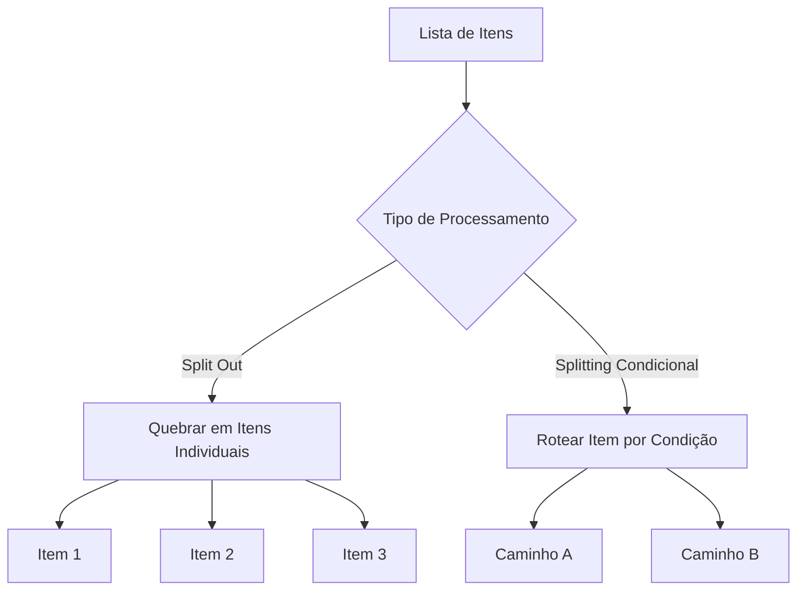
:::

## Por que e Quando Usar Splitting?

| **Situação** | **Benefício do Splitting** |
|-------------|---------------------------|
| **Filas de suporte com múltiplos SLAs** | Priorização automática conforme urgência e plano |
| **Campanhas de marketing multilíngues** | Mensagens corretas por país ou segmento sem scripts extras |
| **Processamento de pagamentos** | Diferenciar rotas de antifraude para valores altos ou clientes novos |
| **Aprovações corporativas** | Automação de fluxos de aprovação baseados em valor e categoria |
| **Triagem de leads** | Distribuição automática para equipes especializadas |

### Antes vs Depois

**Workflow Linear**


- Não há personalização baseada em dados
- Lógica rígida e inflexível
- Retrabalho e atrasos
- Falta de personalização

**Workflow Inteligente**

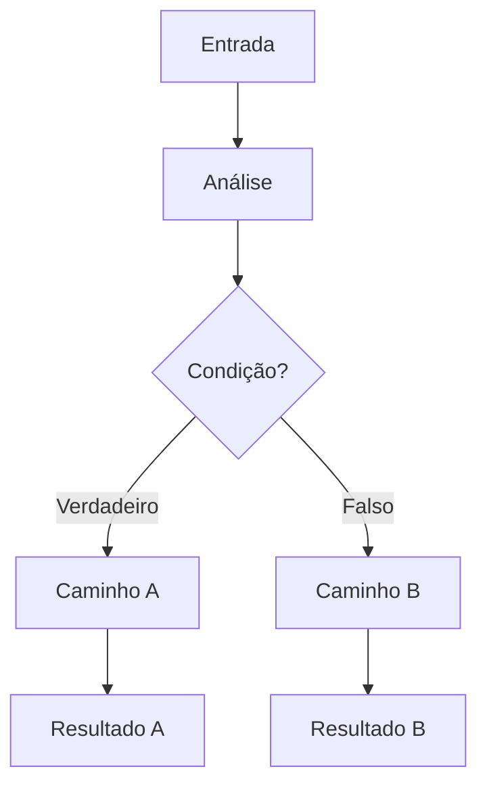

- Múltiplos caminhos de processamento
- Automação inteligente e personalizada
- Escalabilidade aumentada
- Eliminação de lógica manual

<IonicIcon name="sparkles-outline" style={{fontSize: '24px', color: '#ea4b71'}} />
## Nós Essenciais para Splitting

| **Nó** | **Finalidade** | **Saídas** | **Dicas Rápidas** |
|--------|---------------|------------|------------------|
| **[IF](../../integracoes/builtin-nodes/logic-control/if)** | Decisão binária | `true`, `false` | Combine condições com **AND/OR**; ative **Always Output Data** se for fazer [merge](./merging) depois |
| **[Switch](../../integracoes/builtin-nodes/logic-control/switch)** | Seleção multicondicional | `Case n`, `Default` | Dois modos: **Rules** (comparação direta) ou **Expression** ([lógica JavaScript](../referencia/recursos/glossario)) |
| **[Merge](./merging)** | Reunir ramificações | — | Estratégias *Wait → All* ou *Merge By Key* garantem dados completos |

### Node IF - Decisões Simples

**Quando usar**: Para condições binárias simples onde você precisa de apenas dois caminhos.

:::tip **Exemplo prático**
"Se o valor do pedido for maior que R$ 1000, envie para aprovação manual. Caso contrário, processe automaticamente."
:::

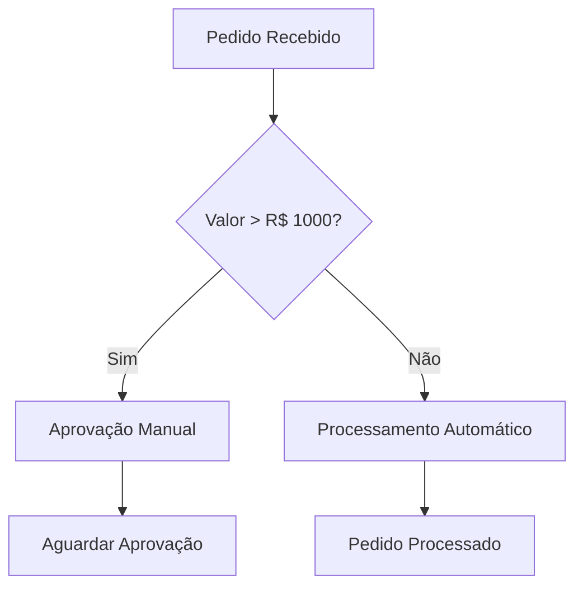

**Lógica do node IF:**

```javascript
// Lógica do node IF
if (valor_pedido > 1000) {
    // Caminho "true" - Aprovação manual
    enviarParaAprovacao();
} else {
    // Caminho "false" - Processamento automático
    processarAutomaticamente();
}
```

### Node Switch - Decisões Múltiplas

**Quando usar**: Para múltiplas condições onde você precisa de vários caminhos diferentes.

:::tip **Exemplo prático: Classificar leads por origem**
- Google Ads → Equipe de Marketing Pago
- Redes Sociais → Equipe de Social Media  
- Website → Equipe de Vendas Inbound
- Indicação → Equipe de Relacionamento
:::

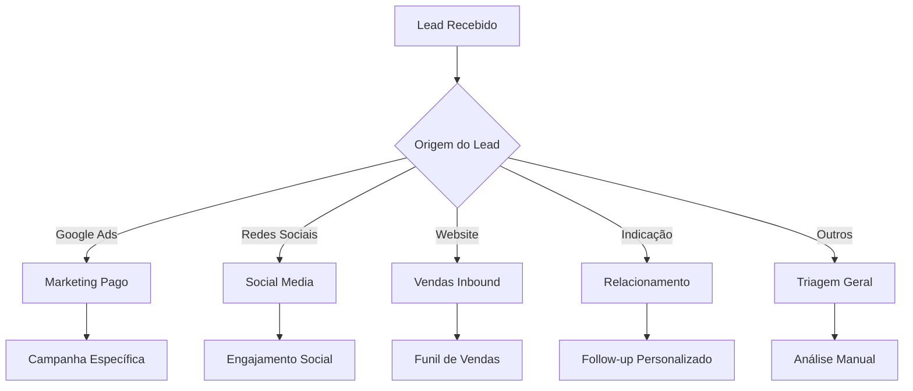

**Lógica do node Switch:**

```javascript
// Lógica do node Switch
switch (origem_lead) {
    case "google_ads":
        // Caminho 1
        enviarParaMarketingPago();
        break;
    case "redes_sociais":
        // Caminho 2
        enviarParaSocialMedia();
        break;
    case "website":
        // Caminho 3
        enviarParaVendasInbound();
        break;
    case "indicacao":
        // Caminho 4
        enviarParaRelacionamento();
        break;
    default:
        // Caminho padrão
        enviarParaTriagem();
}
```

### Node Merge - Reunindo Ramificações

**Quando usar**: Quando diferentes caminhos precisam convergir para uma ação final comum.

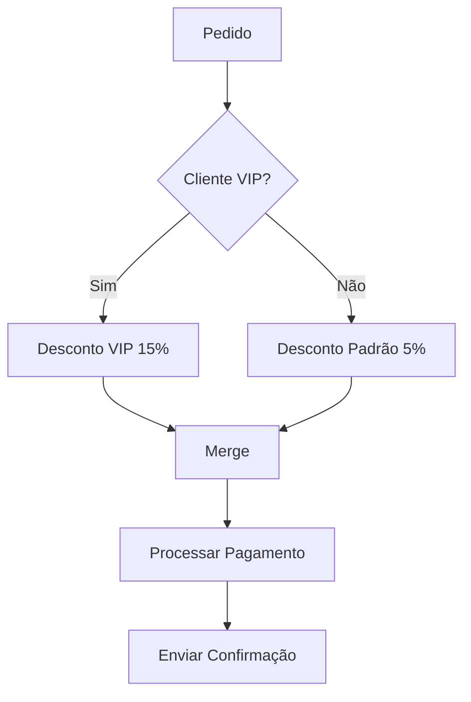

- **Wait → All**: Aguarda todos os ramos terminarem
- **Merge By Key**: Combina dados baseado em chaves específicas
- **Append**: Adiciona dados sequencialmente

<IonicIcon name="bulb-outline" style={{fontSize: '24px', color: '#ea4b71'}} />
## Implementação Prática - Exemplo Completo

### Cenário: Sistema de Aprovação de Despesas

Vamos criar um workflow que automatiza a aprovação de despesas corporativas com base em valor e categoria:

:::info **Regras de negócio**
- Despesas até R$ 500: Aprovação automática
- Despesas R$ 501-2000: Aprovação do supervisor
- Despesas acima de R$ 2000: Aprovação da diretoria
- Categoria "Viagem": Sempre vai para RH (independente do valor)
:::

### Diagrama Completo do Workflow

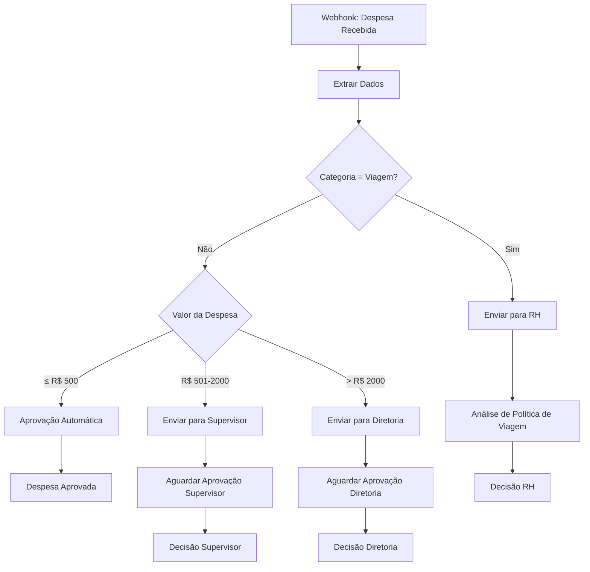

### Construção Passo a Passo

#### 1. Webhook/Trigger - Receber Dados

**Objetivo**: O usuário envia um ticket de despesa, disparando o workflow.

```json
{
  "funcionario": "João Silva",
  "valor": 1500.00,
  "categoria": "Material de Escritório",
  "descricao": "Notebooks para equipe",
  "data": "2024-01-15",
  "prioridade": "normal",
  "plano_suporte": "Premium"
}
```

#### 2. Set Function - Extrair Dados Essenciais

**Objetivo**: Extrair `priority`, `supportPlan`, `description`, `valor`, `categoria`.

```javascript
// Extrair dados essenciais
const dados = {
  funcionario: $json.funcionario,
  valor: parseFloat($json.valor),
  categoria: $json.categoria?.toLowerCase(),
  prioridade: $json.prioridade || 'normal',
  descricao: $json.descricao,
  data: $json.data
};

return dados;
```

#### 3. IF Categoria - Verificar se é Viagem

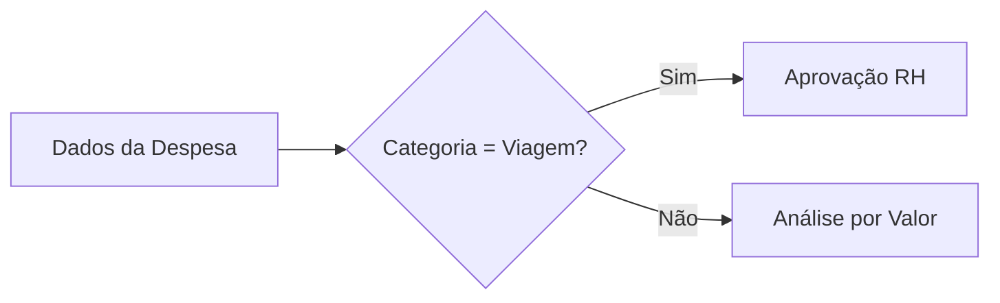

- **Condition**: `{{$json.categoria === "viagem"}}`
- **Always Output Data**: ✅ Ativado
- **true** → Caminho RH
- **false** → Continua análise por valor

#### 4. Switch Valor - Análise por Valor

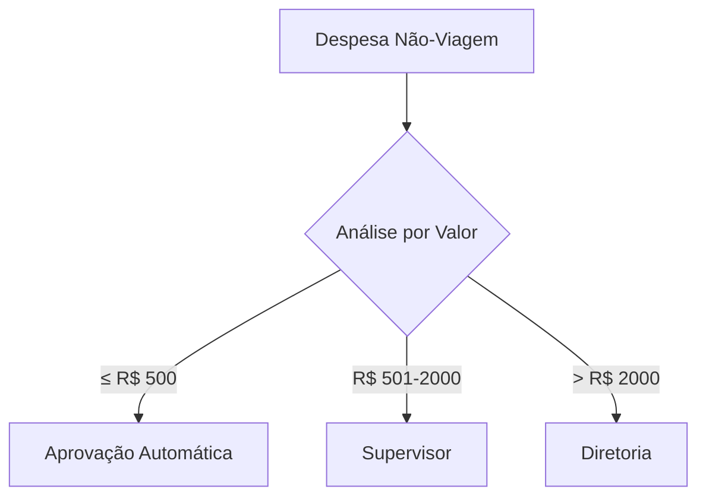

- **Rule 1**: `{{$json.valor <= 500}}` → **Aprovação Automática**- **Rule 2**: `{{$json.valor > 500 && $json.valor <= 2000}}` → **Supervisor**- **Rule 3**: `{{$json.valor > 2000}}` → **Diretoria**

#### 5. Ações Finais - Processar Cada Caminho

**Caminho RH (Viagens):**


```json
{
  "aprovador": "RH",
  "mensagem": "Despesa de viagem para análise de política corporativa",
  "prioridade": "normal",
  "sla": "2 dias úteis"
}
```

**Caminho Aprovação Automática:**


```json
{
  "status": "aprovado",
  "aprovador": "sistema",
  "data_aprovacao": "{{$now}}",
  "observacao": "Aprovação automática - valor dentro do limite"
}
```

**Caminho Supervisor:**


```json
{
  "aprovador": "supervisor",
  "email_destino": "supervisor@empresa.com",
  "template": "aprovacao_supervisor",
  "dados_despesa": "{{$json}}",
  "sla": "1 dia útil"
}
```

**Caminho Diretoria:**


```json
{
  "aprovador": "diretoria",
  "email_destino": "diretoria@empresa.com",
  "template": "aprovacao_diretoria",
  "urgencia": "alta",
  "dados_despesa": "{{$json}}",
  "sla": "4 horas"
}
```

#### 6. Merge (Opcional) - Reunir Resultados

**Objetivo**: Se etapas posteriores exigirem o conjunto completo de itens, configure *Wait → All*.

**Configurações importantes**:

- **Mode**: Wait
- **Strategy**: All
- **Timeout**: 30 minutos (para aprovações)

**Ações finais após merge**:

- Atualizar CRM
- Logar métricas
- Enviar notificação final
- Encerrar execução

<IonicIcon name="chevron-forward-outline" style={{fontSize: '24px', color: '#ea4b71'}} />
## Lógica de Execução e Controle

### Entendendo a Ordem de Execução

:::info **Como o n8n executa ramificações**
- **Ordem**: O n8n executa o primeiro ramo que finalizar
- **Paralelismo**: Ramos são executados em paralelo por padrão
- **Sincronização**: Use **Merge** se precisar aguardar todos os ramos
- **Timeout**: Configure timeouts para evitar execuções infinitas
:::

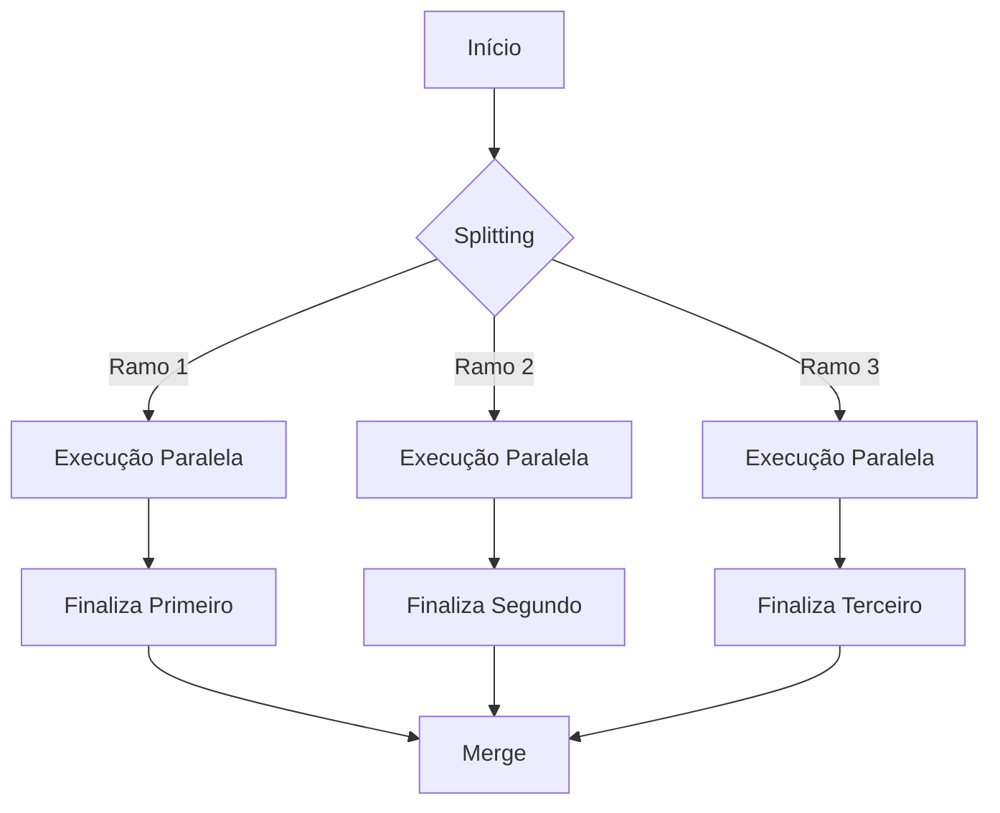

### Always Output Data

Garante que mesmo um ramo "vazio" produza um item, evitando falhas na junção.

:::warning **Quando usar Always Output Data**
✅ **Use quando:**
- Vai fazer [merge](./merging) depois
- Precisa garantir continuidade do fluxo
- Alguns ramos podem não ter dados

❌ **Não use quando:**
- Quer que ramos vazios parem a execução
- Dados vazios causariam problemas downstream
:::

**Exemplo prático:**

```javascript
// Sem Always Output Data
if (condicao_raramente_verdadeira) {
    return dados; // Só executa se condição for verdadeira
}
// Ramo pode ficar "vazio" e quebrar o merge

// Com Always Output Data
if (condicao_raramente_verdadeira) {
    return dados;
} else {
    return {}; // Sempre retorna algo, mesmo vazio
}
```

### Sintaxe JavaScript em Expressões

:::tip **💡 Boas Práticas para Expressões**
**Sintaxe Recomendada:**

```javascript
// ✅ Sintaxe padrão (mais limpa)
{{$json.valor > 1000}}

// ✅ Sintaxe com brackets (necessária para propriedades especiais)
{{$json["valor-especial"] > 1000}}

// ✅ Tratamento de tipos
{{parseInt($json.valor) > 1000}}

// ✅ Tratamento de valores nulos/undefined
{{($json.valor || 0) > 1000}}

// ✅ Verificação de existência
{{$json.valor !== undefined && $json.valor > 1000}}
```

**Evite:**

```javascript
// ❌ Pode causar erros com propriedades undefined
{{$json.valor_inexistente > 1000}}

// ❌ Sem tratamento de tipos
{{$json.valor_string > 1000}}

// ❌ Sem verificações de segurança
{{$json.nested.deep.property}}
```
:::

<IonicIcon name="bug-outline" style={{fontSize: '24px', color: '#ea4b71'}} />
## Troubleshooting - Problemas Comuns

### Problema: Workflow Para na Condição

:::warning **Sintomas**
O workflow executa até o node de splitting e não continua.
:::

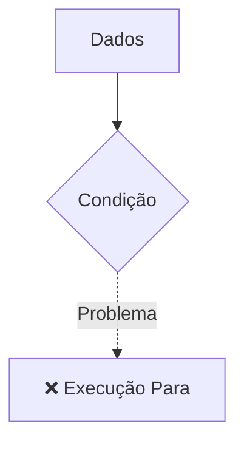

**Solução**:

**❌ Incorreto:**
```javascript
{{$json.valor > "1000"}}  // Comparando número com string
```

**✅ Correto:**
```javascript
{{$json.valor > 1000}}    // Comparando número com número
```

### Problema: Caminho Errado Sendo Executado

:::warning **Sintomas**
Os dados seguem por um caminho diferente do esperado.
:::

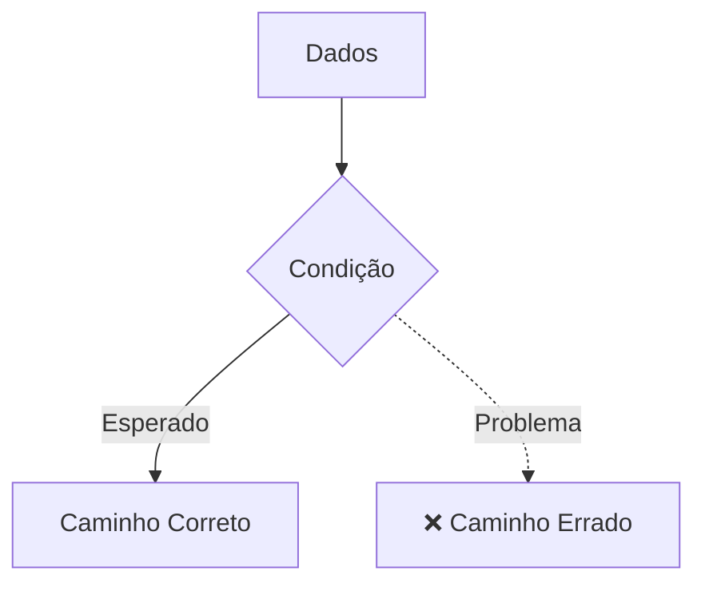

**Debug com Set Node:**

```json
{
  "debug_valor": "{{$json.valor}}",
  "debug_tipo": "{{typeof $json.valor}}",
  "debug_condicao": "{{$json.valor > 1000}}"
}
```

**Soluções comuns**:

- Converta tipos: `{{parseInt($json.valor) > 1000}}`
- Trate valores nulos: `{{($json.valor || 0) > 1000}}`
- Use trim para strings: `{{$json.categoria.trim() === "Viagem"}}`

<IonicIcon name="bulb-outline" style={{fontSize: '24px', color: '#ea4b71'}} />
## Casos de Uso Comuns

### E-commerce - Processamento de Pedidos

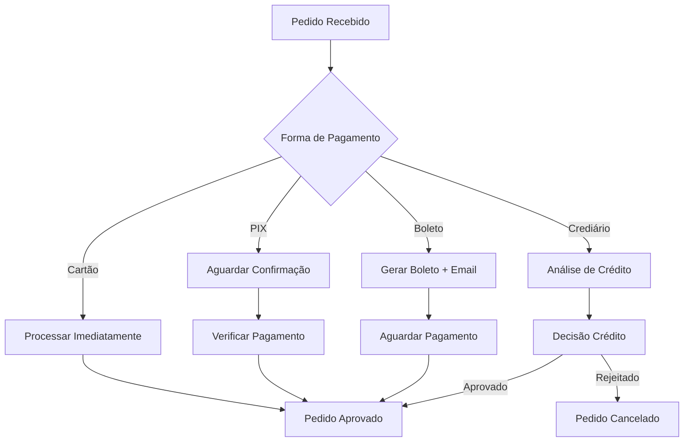

### Marketing - Segmentação de Leads

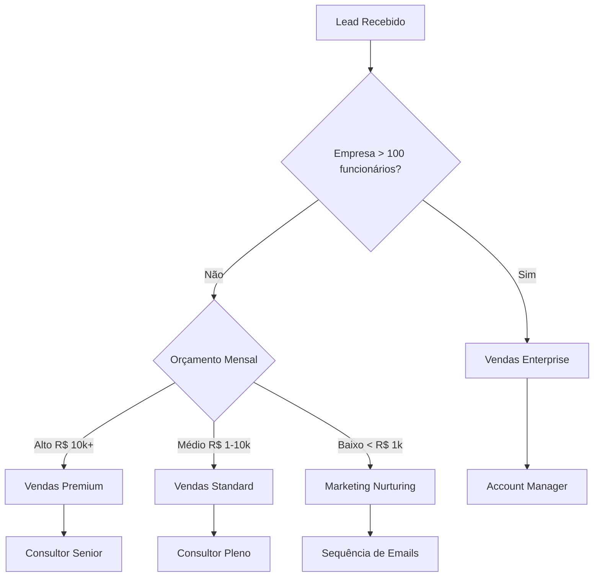

### Suporte - Triagem de Tickets

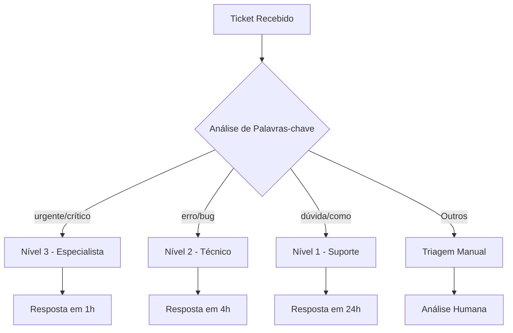

<IonicIcon name="chevron-forward-outline" style={{fontSize: '24px', color: '#ea4b71'}} />
## Boas Práticas e Armadilhas

### ✅ Boas Práticas Essenciais

:::tip **🎯 Práticas Recomendadas**
**Nomenclatura e Documentação:**
- **Nomeie nós de forma autoexplicativa** (`IF Urgente?`, `SW Plano Suporte`)
- **Documente regras no Description** do nó para facilitar auditorias
- **Use comentários** para explicar lógicas complexas

**Estrutura e Organização:**

- **Evite aninhar IF dentro de IF**: prefira **Switch** quando houver >2 caminhos
- **Split Out antes de splitting** quando precisar percorrer cada linha de uma lista separadamente
- **Centralize regras de negócio** em nodes dedicados para facilitar manutenção

**Testes e Validação:**

- **Teste cenários extremos** (valores nulos, caminhos sem saída) antes de mover para produção
- **Valide tipos de dados** antes de fazer comparações
- **Configure timeouts** apropriados para cada tipo de processo
:::

### ❌ Armadilhas a Evitar

:::danger **🚨 Cuidados Importantes**
**Problemas de Estrutura:**
- **Não aninhhe IFs excessivamente**: Torna o workflow difícil de manter
- **Evite splitting excessivo**: Máximo 3-4 níveis de profundidade
- **Não ignore o Always Output Data**: Pode quebrar merges

**Problemas de Dados:**

- **Não compare tipos diferentes**: `"100" !== 100`
- **Não assuma dados sempre existem**: Trate valores nulos/undefined
- **Não ignore case sensitivity**: `"VIAGEM" !== "viagem"`

**Problemas de Performance:**

- **Não crie nodes desnecessários**: Use Switch ao invés de múltiplos IFs
- **Não deixe execuções infinitas**: Configure timeouts
- **Não ignore recursos de paralelismo**: Use filas quando apropriado
:::

<IonicIcon name="arrow-forward-circle-outline" style={{fontSize: '24px', color: '#ea4b71'}} />
## Próximos Passos

:::info **Agora que você domina splitting básico, explore:**
1. **[Merge Nodes](/logica-e-dados/flow-logic/merging)**: Como reunir fluxos divididos
2. **[Error Handling](/logica-e-dados/flow-logic/error-handling)**: Tratamento de erros em fluxos condicionais  
3. **[Looping](/logica-e-dados/flow-logic/looping)**: Lógica de repetição em workflows
4. **[Sub-workflows](/logica-e-dados/flow-logic/subworkflows)**: Workflows aninhados
5. **[Waiting](/logica-e-dados/flow-logic/waiting)**: Controle de tempo e aguardo
6. **[Execute Sub-workflow](/integracoes/builtin-nodes/core-nodes/execute-sub-workflow)**: Modularização avançada
:::

:::tip **Desafio**
**Crie um workflow de aprovação de férias que:**
- Funcionários CLT: Máximo 30 dias, aprovação do supervisor
- Funcionários PJ: Sem limite, apenas notificação
- Períodos de alta temporada: Sempre requer aprovação da diretoria
- Solicitações com menos de 30 dias de antecedência: Aprovação expressa

*Dica*: Use [Switch aninhados](../../integracoes/builtin-nodes/logic-control) e considere múltiplas condições simultâneas.
:::

<IonicIcon name="speedometer-outline" style={{fontSize: '24px', color: '#ea4b71'}} />

:::success **🎯 Pontos-Chave para Dominar Splitting**
**Conceitos Fundamentais:**
- **Splitting** = usar **IF** e **Switch** para criar múltiplos caminhos de execução
- Escolha **IF** para decisões binárias; **Switch** para múltiplos casos
- **Não confunda** com Split Out (que quebra listas em itens individuais)

**Implementação Prática:**

- Combine ramificações com **Merge** quando necessário, mantendo integridade dos dados
- Ative **Always Output Data** em ramos críticos para evitar execuções "mortas"
- Configure **timeouts** e **retry policies** apropriados

**Boas Práticas:**

- **Nomeie nós claramente** para facilitar manutenção
- **Documente regras complexas** no Description
- **Teste cenários extremos** antes de produção
- **Use paralelismo** para alta performance

**Ordem de Execução:**

- O n8n executa ramos em **paralelo** por padrão
- Use **Merge** se precisar aguardar todos os ramos
- Configure **filas Redis/RabbitMQ** para processamento distribuído
:::

---

:::note **📚 Recursos Adicionais**
- [Documentação Oficial - Switch Node](https://docs.n8n.io/integrations/builtin/core-nodes/n8n-nodes-base.switch/)
- [Documentação Oficial - IF Node](https://docs.n8n.io/integrations/builtin/core-nodes/n8n-nodes-base.if/)
- [Documentação Oficial - Merge Node](https://docs.n8n.io/integrations/builtin/core-nodes/n8n-nodes-base.merge/)
- [Error Trigger Node](../../integracoes/builtin-nodes/core-nodes/error-trigger)
- [Execute Sub-workflow Node](../../integracoes/builtin-nodes/core-nodes/execute-sub-workflow)
- [Expressões JavaScript no n8n](/referencia/recursos/glossario)
- [Exemplos de Workflows](/catalogo)
- [Integrações Brasileiras](/integracoes-br)
- [Guia de Instalação](/hosting-n8n/instalacao)
:::

