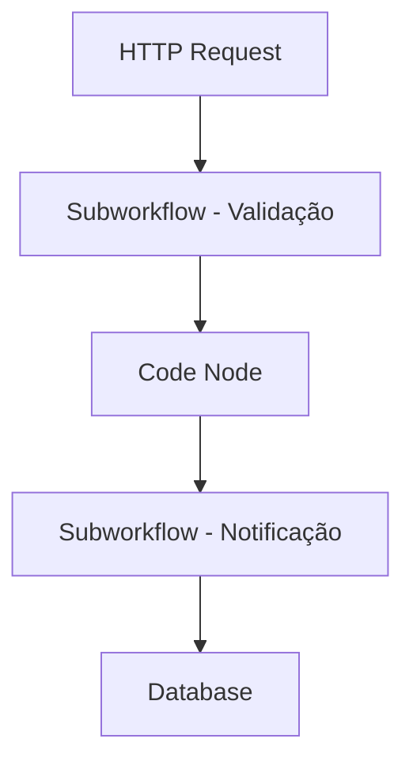

<IonicIcon name="git-branch-outline" style={{fontSize: '24px', color: '#ea4b71'}} />
## O que são Subworkflows?

Subworkflows são workflows menores e especializados que podem ser executados por outros workflows, permitindo modularização, reutilização e organização de automações complexas. Esta abordagem facilita a manutenção, teste e escalabilidade de projetos SUA_SENHA_BANCO_AQUI.

<IonicIcon name="information-circle-outline" style={{fontSize: '24px', color: '#ea4b71'}} />

### Configuração Básica

```json
{
  "name": "validacao_cliente",
  "description": "Valida dados de cliente e retorna status"
}
```

## Workflow Trigger Node

O **Workflow Trigger** é o ponto de entrada de um subworkflow.

**Configuração:**

```json
{
  "workflowId": "workflow_123456",
  "name": "Validar Cliente",
  "description": "Valida dados de cliente"
}
```

**Dados de entrada esperados:**

```json
{
  "cliente": {
    "nome": "João Silva",
    "email": "joao@exemplo.com",
    "cpf": "123.456.789-00"
  }
}
```

## Executando Subworkflows

### Configuração Básica

**Configuração básica:**

```json
{
  "workflowId": "validacao_cliente",
  "waitForWorkflow": true,
  "options": {
    "pinData": {}
  }
}
```

### Configuração Avançada

**Configuração avançada:**

```json
{
  "workflowId": "{{$json.workflow_id}}",
  "waitForWorkflow": true,
  "options": {
    "pinData": {},
    "dados": "{{$json}}",
    "contexto": {}
  },
  "startNodes": ["node_1", "node_2"]
}
```

<IonicIcon name="code-outline" style={{fontSize: '24px', color: '#ea4b71'}} />
## Padrões de Design

### Subworkflow de Validação

**Cenário:** Validar dados de entrada antes do processamento.


**Implementação:**

```javascript
// Code Node - Validação de email
const email = $json.cliente.email;
const emailRegex = /^[^\s@]+@[^\s@]+\.[^\s@]+$/;

if (!emailRegex.test(email)) {
  return {
    status: 'erro',
    campo: 'email',
    mensagem: 'Email inválido'
  };
}

return {
  ...$json,
  validacoes: {
    ...$json.validacoes,
    email: 'valido'
  }
};
```

### Subworkflow de Notificação

**Cenário:** Enviar notificações através de múltiplos canais.


**Implementação:**

```javascript
// Code Node - Determinar canais de notificação
const prioridade = $json.prioridade;
const canais = ['email', 'slack'];

if (prioridade === 'alta') {
  canais.push('sms');
}

return {
  ...$json,
  canais_notificacao: canais
};
```

### Subworkflow de Processamento de Dados

**Cenário**: Transformar e enriquecer dados.


**Implementação:**

```javascript
// Code Node - Processamento de dados
const dados = $json;

// Limpar dados
const dadosLimpos = {
  nome: dados.nome.trim(),
  email: dados.email.toLowerCase(),
  telefone: dados.telefone.replace(/\D/g, '')
};

// Enriquecer
const dadosEnriquecidos = {
  ...dadosLimpos,
  timestamp_processamento: $now,
  origem: 'subworkflow_processamento'
};

return dadosEnriquecidos;
```

<IonicIcon name="construct-outline" style={{fontSize: '24px', color: '#ea4b71'}} />
## Casos de Uso Práticos

### Sistema de Aprovações

**Cenário**: Workflow principal que usa subworkflows para diferentes tipos de aprovação.


**Workflow Principal:**

```javascript
// 1. Subworkflow - Validação
{
  "workflowId": "validacao_pedido",
  "waitForWorkflow": true,
  "options": {
    "pinData": {
      "pedido": $json
    }
  }
}

// 2. Subworkflow - Aprovação Financeira
{
  "workflowId": "aprovacao_financeira",
  "waitForWorkflow": true,
  "options": {
    "pinData": {
      "pedido": $json.pedido,
      "validacao": $json.validacao
    }
  }
}
```

### Pipeline de Dados

**Cenário**: Processamento de dados em etapas modulares.


**Implementação:**

```javascript
// Subworkflow - Limpeza
const dados = $json;
const dadosLimpos = dados.map(item => ({
  ...item,
  nome: item.nome.trim(),
  email: item.email.toLowerCase(),
  telefone: item.telefone.replace(/\D/g, '')
}));

return {
  dados: dadosLimpos,
  estatisticas: {
    total: dados.length,
    limpos: dadosLimpos.length
  }
};
```

### Sistema de Monitoramento

**Cenário**: Monitoramento modular de diferentes sistemas.


**Implementação:**

```javascript
// Subworkflow - Monitorar API
const apis = ['api1', 'api2', 'api3'];
const resultados = [];

for (const api of apis) {
  try {
    const response = await fetch(`https://${api}.exemplo.com/health`);
    resultados.push({
      api,
      status: response.ok ? 'ok' : 'erro',
      tempo_resposta: response.time
    });
  } catch (error) {
    resultados.push({
      api,
      status: 'erro',
      erro: error.message
    });
  }
}

return {
  timestamp: $now,
  resultados
};
```

<IonicIcon name="flash-outline" style={{fontSize: '24px', color: '#ea4b71'}} />
## Passagem de Dados

```javascript
// Dados passados para o subworkflow
{
  "cliente": {
    "nome": "João Silva",
    "email": "joao@exemplo.com",
    "cpf": "123.456.789-00"
  },
  "contexto": {
    "origem": "workflow_principal",
    "timestamp": "2024-01-15T10:30:00.000Z"
  }
}
```

```javascript
// Dados retornados pelo subworkflow
{
  "status": "sucesso",
  "validacoes": {
    "nome": "valido",
    "email": "valido",
    "cpf": "valido"
  },
  "metadata": {
    "workflow": "validacao_cliente",
    "timestamp": "2024-01-15T10:30:05.000Z"
  }
}
```

## Expressões Avançadas

```javascript
// Passagem dinâmica de dados
{
  "workflowId": "{{$json.tipo_validacao}}",
  "waitForWorkflow": true,
  "options": {
    "pinData": {
      "dados": "{{$json}}",
      "configuracao": "{{$('Config Node').json}}",
      "contexto": {
        "origem": "{{$workflow.name}}",
        "usuario": "{{$user.name}}",
        "timestamp": "{{$now}}"
      }
    }
  }
}
```

<IonicIcon name="warning-outline" style={{fontSize: '24px', color: '#ea4b71'}} />
## Tratamento de Erros

### Error Handling em Subworkflows

```javascript
// Subworkflow com tratamento de erro
try {
  const resultado = await processarDados($json);
  return {
    status: 'sucesso',
    dados: resultado
  };
} catch (error) {
  return {
    status: 'erro',
    erro: error.message,
    timestamp: $now
  };
}
```

### Workflow Principal com Tratamento

```javascript
// Workflow principal tratando erros do subworkflow
const resultado = await executarSubworkflow($json);

if (resultado.status === 'erro') {
  // Log do erro
  console.error('Erro no subworkflow:', resultado.erro);
  
  // Notificar administrador
  await enviarNotificacao({
    tipo: 'erro_subworkflow',
    erro: resultado.erro,
    workflow: $workflow.name
  });
  
  // Continuar com dados padrão
  return {
    ...$json,
    status: 'processado_com_erro',
    dados: resultado.dados || {}
  };
}

return resultado;
```

<IonicIcon name="speedometer-outline" style={{fontSize: '24px', color: '#ea4b71'}} />
## Performance e Otimização

### Boas Práticas

1. **Mantenha Subworkflows Focados**
   - Uma responsabilidade por subworkflow
   - Evite subworkflows muito grandes
   - Use nomes descritivos

2. **Otimize Passagem de Dados**
   - Passe apenas dados necessários
   - Use compressão para dados grandes
   - Evite dados duplicados

3. **Monitore Performance**
   - Acompanhe tempo de execução
   - Identifique gargalos
   - Use cache quando apropriado

### Exemplo de Monitoramento

```javascript
// Subworkflow com monitoramento
const startTime = $now;
const dados = $json;

// Processar dados
const resultado = await processarDados(dados);

const endTime = $now;
const tempoExecucao = endTime - startTime;

return {
  ...resultado,
  metadata: {
    tempo_execucao: tempoExecucao,
    workflow: $workflow.name,
    timestamp: endTime
  }
};
```

<IonicIcon name="help-circle-outline" style={{fontSize: '24px', color: '#ea4b71'}} />
## Troubleshooting

### Problemas Comuns

**Erro: "Workflow not found"**
- Verifique se o Workflow ID está correto
- Confirme se o workflow existe e está ativo
- Verifique permissões de acesso

**Erro: "Timeout"**
- Aumente o timeout do subworkflow
- Otimize a performance do subworkflow
- Considere usar `waitForWorkflow: false`

**Erro: "Circular dependency"**
- Verifique se não há chamadas circulares
- Use contadores para limitar recursão
- Reestruture a lógica se necessário

### Debug com Logging

```javascript
// Subworkflow com debugging
const debug = {
  "dados_entrada": $json,
  "workflow": $workflow.name,
  "timestamp": $now,
  "usuario": $user.name
};

console.log('Subworkflow Debug:', JSON.stringify(debug, null, 2));

// Processar dados
const resultado = await processarDados($json);

return {
  ...resultado,
  debug
};
```

<IonicIcon name="link-outline" style={{fontSize: '24px', color: '#ea4b71'}} />
## Integração com Outros Nós

### Fluxo Típico



### Exemplo Completo

```javascript
// 1. HTTP Request - Receber dados
{
  "url": "/webhook/dados",
  "method": "POST"
}

// 2. Subworkflow - Validar dados
{
  "workflowId": "validacao_dados",
  "waitForWorkflow": true,
  "options": {
    "pinData": {
      "dados": $json
    }
  }
}

// 3. Code Node - Processar dados válidos
const dados = $json;
const validacao = $('Subworkflow').json.validacao;

if (validacao.status === 'sucesso') {
  return {
    dados_processados: processarDados(dados),
    validacao
  };
} else {
  throw new Error(`Dados inválidos: ${validacao.erro}`);
}

// 4. Subworkflow - Notificar sucesso
{
  "workflowId": "notificacao_sucesso",
  "waitForWorkflow": false,
  "options": {
    "pinData": {
      "dados": $json
    }
  }
}

// 5. Database - Salvar dados
{
  "operation": "insert",
  "table": "dados_processados",
  "data": $json.dados_processados
}
```

<IonicIcon name="document-text-outline" style={{fontSize: '24px', color: '#ea4b71'}} />
## Referências

- **[Workflow Trigger](../../integracoes/builtin-nodes/core-nodes/workflow-trigger)** - Nó para executar subworkflows
- **[Error Handling](./error-handling)** - Tratamento de erros em workflows
- **[Execution Order](./execution-order)** - Ordem de execução de nós
- **[Data Mapping](../../logica-e-dados/data/data-mapping-avancado)** - Mapeamento avançado de dados

---

<IonicIcon name="bulb-outline" style={{fontSize: '18px', color: '#ea4b71'}} />
**Dica**: Use subworkflows para modularizar workflows complexos, facilitando manutenção e reutilização de código.
