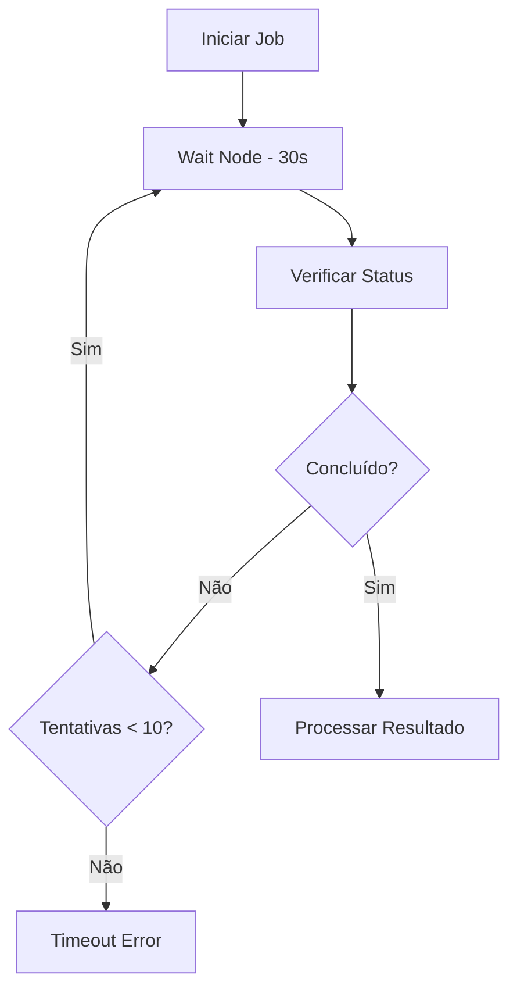

#ionicicon-nametime-outline-style-fontsize-24px color: '#cor-ea4b71-waiting-e Delays

O controle de tempo é fundamental em workflows de automação. O n8n oferece várias estratégias para implementar esperas, delays e sincronização, permitindo criar workflows resilientes que lidam graciosamente com latências, rate limits e dependências temporais.

#ionicicon-nameinformation-circle-outline-style-fontsize-24px color: '#cor-ea4b71-conceitos-fundamentais

#por-que-usar-waiting-e Delays?

- **Rate Limiting**: Respeitar limites de APIs externas
- **Sincronização**: Aguardar processos externos completarem
- **Retry Logic**: Implementar tentativas com delays crescentes
- **User Experience**: Criar delays naturais em automações
- **Resource Management**: Evitar sobrecarga de sistemas
- **Error Recovery**: Dar tempo para sistemas se recuperarem

#tipos-de-waiting-1-fixed Delays**: Pausas de tempo fixo
2. **Dynamic Delays**: Delays baseados em condições
3. **Event-based Waiting**: Aguardar eventos específicos
4. **Polling**: Verificação periódica de status
5. **Timeout**: Limites de tempo para operações

#ionicicon-namesettings-outline-style-fontsize-24px color: '#cor-ea4b71-implementao

#id-1-wait-node-o-wait Node** é a forma mais direta de implementar delays.

**Configuração básica:**
```json
{
  "waitFor": "duration",
  "duration": 5000  // 5 segundos
}
```

**Configuração avançada:**
```json
{
  "waitFor": "time",
  "time": "{{ $now.addHours(1) }}",
  "timeout": 3600000  // 1 hora máximo
}
```

#id-2-delays-dinmicos-delays-que variam baseado em condições ou dados.

```javascript
// Delay baseado no tamanho dos dados
const delay = $json.items.length * 100; // 100ms por item

return {
  "waitFor": "duration",
  "duration": delay
};
```

```javascript
// Delay baseado na hora do dia
const hora = $now.getHours();
const delay = hora >= 9 && hora <= 18 ? 1000 : 5000; // Menos delay em horário comercial

return {
  "waitFor": "duration",
  "duration": delay
};
```

#id-3-backoff-exponencial-estratgia-para retry com delays crescentes.

```javascript
// Backoff exponencial
const tentativa = $runIndex || 0;
const delay = Math.min(Math.pow(2, tentativa) * 1000, 30000); // Máximo 30s

return {
  "waitFor": "duration",
  "duration": delay
};
```

#ionicicon-namecode-outline-style-fontsize-24px color: '#cor-ea4b71-casos-de Uso Práticos

#id-1-rate-limiting-para-apis

**Cenário**: Respeitar limites de API (100 requisições por minuto).


**Implementação:**
```javascript
// Code Node - Calcular delay baseado no rate limit
const rateLimit = 100; // requisições por minuto
const delay = (60 * 1000) / rateLimit; // 600ms entre requisições

return {
  "waitFor": "duration",
  "duration": delay
};
```

#id-2-polling-com-timeout-cenrio Verificar status de job com timeout.



**Implementação:**
```javascript
// Code Node - Polling com timeout
const maxTentativas = 10;
const tentativaAtual = $runIndex || 0;

if (tentativaAtual >= maxTentativas) {
  throw new Error('Timeout: Job não foi concluído');
}

const status = $json.status;
const delay = status === 'processing' ? 30000 : 5000; // 30s se processando, 5s se pendente

return {
  "waitFor": "duration",
  "duration": delay
};
```

#id-3-sincronizao-com-processos-externos

**Cenário**: Aguardar processamento de arquivo em sistema externo.


**Implementação:**
```javascript
// Code Node - Sincronização inteligente
const status = $json.status;
let delay;

switch(status) {
  case 'uploading':
    delay = 10000; // 10s
    break;
  case 'processing':
    delay = 30000; // 30s
    break;
  case 'almost_done':
    delay = 5000; // 5s
    break;
  default:
    delay = 15000; // 15s
}

return {
  "waitFor": "duration",
  "duration": delay
};
```

#id-4-delays-condicionais-cenrio-delays diferentes baseados em prioridade.

```javascript
// Code Node - Delay baseado em prioridade
const prioridade = $json.prioridade;
let delay;

switch(prioridade) {
  case 'alta':
    delay = 0; // Sem delay
    break;
  case 'media':
    delay = 5000; // 5s
    break;
  case 'baixa':
    delay = 30000; // 30s
    break;
  default:
    delay = 10000; // 10s
}

return {
  "waitFor": "duration",
  "duration": delay
};
```

#ionicicon-nameconstruct-outline-style-fontsize-24px color: '#cor-ea4b71-estratgias-avanadas

#id-1-delays-adaptativos-delays-que se ajustam baseado no comportamento do sistema.

```javascript
// Code Node - Delay adaptativo
const historico = $('Database Node').json.tempos_resposta;
const tempoMedio = historico.reduce((a, b) => a + b, 0) / historico.length;
const delay = Math.max(tempoMedio * 1.5, 1000); // 1.5x o tempo médio, mínimo 1s

return {
  "waitFor": "duration",
  "duration": delay
};
```

#id-2-delays-baseados-em-carga

Delays que variam baseado na carga do sistema.

```javascript
// Code Node - Delay baseado em carga
const cargaSistema = $('Health Check Node').json.cpu_usage;
const delay = cargaSistema > 80 ? 10000 : 1000; // Mais delay se sistema sobrecarregado

return {
  "waitFor": "duration",
  "duration": delay
};
```

#id-3-delays-com-jitter-adiciona variação aleatória para evitar thundering herd.

```javascript
// Code Node - Delay com jitter
const delayBase = 5000;
const jitter = Math.random() * 2000; // ±2s de variação
const delay = delayBase + jitter;

return {
  "waitFor": "duration",
  "duration": delay
};
```

#ionicicon-nameflash-outline-style-fontsize-24px color: '#cor-ea4b71-expresses-e Data Mapping

#delays-dinmicos-com-expresses-javascript
// Delay baseado em dados de entrada
{
  "waitFor": "duration",
  "duration": "{{ $json.items.length * 100 }}"
}

// Delay baseado em configuração externa
{
  "waitFor": "duration",
  "duration": "{{ $('Config Node').json.delay_ms }}"
}

// Delay baseado em horário
{
  "waitFor": "duration",
  "duration": "{{ $now.getHours() < 9 || $now.getHours() > 18 ? 300000 : 5000 }}"
}
```

#horrios-dinmicos-javascript-aguardar até próxima hora cheia
{
  "waitFor": "time",
  "time": "{{ $now.setMinutes(0, 0, 0).addHours(1) }}"
}

// Aguardar até próximo dia útil
{
  "waitFor": "time",
  "time": "{{ $now.getDay() === 0 ? $now.addDays(1) : $now.addDays(1) }}"
}
```

#ionicicon-namewarning-outline-style-fontsize-24px color: '#cor-ea4b71-tratamento-de Erros

#timeout-e-cancelamento-javascript Wait Node com timeout
{
  "waitFor": "duration",
  "duration": 300000,  // 5 minutos
  "timeout": 600000    // 10 minutos máximo
}
```

#retry-com-backoff-exponencial-mermaid
graph TD
    A[Operação] --> B{Sucesso?}
    B -->|Não| C[Wait Node - Backoff]
    C --> D[Retry]
    D --> B
    B -->|Sim| E[Continuar]
```

**Implementação:**
```javascript
// Code Node - Backoff exponencial
const tentativa = $runIndex || 0;
const maxTentativas = 5;

if (tentativa >= maxTentativas) {
  throw new Error('Máximo de tentativas excedido');
}

const delay = Math.min(Math.pow(2, tentativa) * 1000, 30000);

return {
  "waitFor": "duration",
  "duration": delay
};
```

#ionicicon-namespeedometer-outline-style-fontsize-24px color: '#cor-ea4b71-performance-e Otimização

#boas-prticas-1-use-delays Apropriados**
   - Respeite rate limits das APIs
   - Considere o impacto no tempo total do workflow
   - Use delays dinâmicos quando possível

2. **Evite Delays Desnecessários**
   - Não use Wait Node apenas para "dar tempo"
   - Considere alternativas como webhooks
   - Use polling inteligente

3. **Monitore Performance**
   - Acompanhe o tempo total de execução
   - Identifique gargalos causados por delays
   - Otimize baseado em métricas reais

#exemplo-de-monitoramento-javascript Code Node - Monitoramento de delays
const startTime = $now;
const delay = 5000;

// Log do delay
console.log(`Aguardando ${delay}ms`);

return {
  "waitFor": "duration",
  "duration": delay,
  "metadata": {
    "startTime": startTime,
    "delay": delay,
    "reason": "rate_limiting"
  }
};
```

#ionicicon-namehelp-circle-outline-style-fontsize-24px color: '#cor-ea4b71-troubleshooting

#problemas-comuns-wait-node-no funciona**
- Verifique se o tipo de wait está correto
- Confirme se a duração está em milissegundos
- Verifique se o horário está no formato correto

**Workflow muito lento**
- Revise se os delays são necessários
- Considere usar webhooks em vez de polling
- Otimize a lógica de delays dinâmicos

**Timeout de execução**
- Aumente o timeout do workflow
- Reduza delays muito longos
- Use webhooks para operações longas

#cor-debugging-javascript-code-node - Debugging de delays
const debug = {
  "waitType": "duration",
  "duration": 5000,
  "timestamp": $now,
  "workflow": $workflow.name,
  "node": $node.name
};

console.log('Wait Debug:', JSON.stringify(debug, null, 2));

return {
  "waitFor": "duration",
  "duration": 5000
};
```

#ionicicon-namelink-outline-style-fontsize-24px color: '#cor-ea4b71-integrao-com Outros Nós

#fluxo-tpico-mermaid-graph-td
    A[HTTP Request] --> B[Wait Node]
    B --> C[Code Node]
    C --> D[Email]
```

#exemplo-completo-javascript-1 HTTP Request - Buscar dados
{
  "url": "https://api.exemplo.com/dados",
  "method": "GET"
}

// 2. Wait Node - Rate limiting
{
  "waitFor": "duration",
  "duration": 1000
}

// 3. Code Node - Processar dados
const dados = $json;
const processados = dados.map(item => ({
  ...item,
  processado_em: $now
}));

return processados;

// 4. HTTP Request - Enviar dados processados
{
  "url": "https://api.exemplo.com/processados",
  "method": "POST",
  "body": $json
}
```

#ionicicon-namedocument-text-outline-style-fontsize-24px color: '#cor-ea4b71-referncias **[Wait Node](../../integracoes/builtin-nodes/logic-control/wait)** - Nó específico para delays
- **[Error Handling](./error-handling)** - Tratamento de erros em workflows
- **[Execution Order](./execution-order)** - Ordem de execução de nós
- **[Webhook Trigger](../../integracoes/trigger-nodes/event-based/webhook-trigger)** - Triggers baseados em webhooks

---

:::warning **Nota de Atenção**
Esta documentação está em processo de validação. Os exemplos práticos e configurações de nós apresentados precisam ser testados e validados em ambientes reais. A intenção é sempre fornecer práticas e exemplos que funcionem corretamente em produção. Se encontrar inconsistências ou problemas, por favor, reporte para que possamos melhorar a qualidade da documentação.
:::

> <IonicIcon name="bulb-outline" style={{ fontSize: '18px', color: '#cor-ea4b71-dica-use delays estrategicamente para criar workflows mais robustos e respeitosos com os sistemas externos. Lembre-se que delays muito longos podem impactar a experiência do usuário, então sempre considere alternativas como webhooks para operações que podem demorar.

