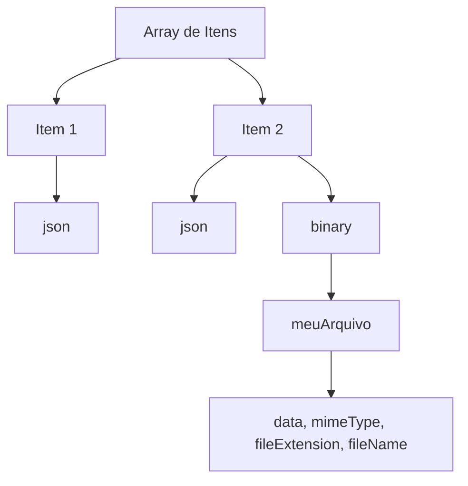
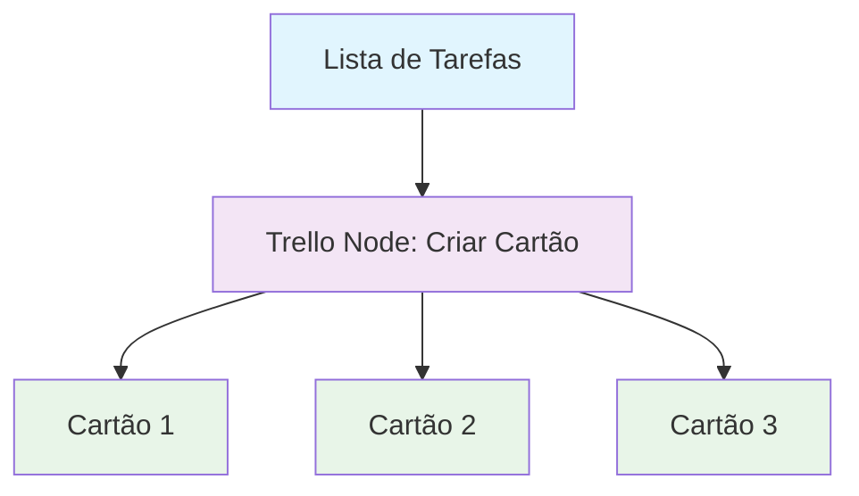

# Lógica e Manipulação de Dados no n8n: Workflows Inteligentes e Práticos

Domine a manipulação de dados, lógica de automação e técnicas avançadas para criar workflows inteligentes, eficientes e escaláveis no n8n. Esta seção abrange desde conceitos básicos até boas práticas e troubleshooting para automação empresarial.

## O que você encontrará aqui

- [Aprenda sobre tipos e manipulação de dados no n8n](./data/)
- [Explore lógica de fluxo e controle de execução](./flow-logic/)
- [Guia prático de debugging e troubleshooting no n8n](./flow-logic/debugging)

---

## <ion-icon name="document-text-outline" style={{ fontSize: '24px', color: '#ea4b71' }}></ion-icon> Dados {#dados}

- **Tipos de Dados**: Strings, números, objetos, arrays
- **Manipulação**: Transformação e formatação
- **Validação**: Verificação de dados
- **Conversão**: Mudança de tipos

---

## <ion-icon name="git-branch-outline" style={{ fontSize: '24px', color: '#ea4b71' }}></ion-icon> Lógica de Fluxo {#logica-de-fluxo}

- **Condicionais**: IF/ELSE e decisões
- **Loops**: Repetição de operações
- **Merge**: Combinação de fluxos
- **Error Handling**: Tratamento de erros

---

## <ion-icon name="git-network-outline" style={{ fontSize: '24px', color: '#ea4b71' }}></ion-icon> Conexões {#conexoes}

- **Tipos de Conexão**: Sucesso, erro, condicional
- **Mapeamento de Dados**: Passagem entre nodes
- **Transformação**: Modificação durante passagem

---

## <ion-icon name="school-outline" style={{ fontSize: '24px', color: '#ea4b71' }}></ion-icon> Conceitos Fundamentais {#conceitos-fundamentais}

### Estrutura de Dados

No n8n, **todos os dados trafegam entre os nodes como um array de objetos**, chamados de _items_. Cada item representa uma unidade de informação processada no workflow.

#### Estrutura de Dados no n8n

No n8n, **todos os dados trafegam entre os nodes como um array de objetos**, chamados de _items_. Cada item representa uma unidade de informação processada no workflow.

##### Estrutura Padrão de um Item

Cada item possui, no mínimo, a chave `json` (com dados estruturados) e, opcionalmente, a chave `binary` (para arquivos e dados binários):

```json
[
  {
    "json": {
      "nome": "João Silva",
      "email": "joao@exemplo.com",
      "idade": 30
    }
  },
  {
    "json": {
      "nome": "Maria Souza",
      "email": "maria@exemplo.com",
      "idade": 28
    },
    "binary": {
      "arquivo": {
        "data": "base64...",
        "mimeType": "application/pdf",
        "fileName": "contrato.pdf",
        "fileExtension": "pdf"
      }
    }
  }
]
```

##### Explicação dos Campos

- **json**: Objeto com dados estruturados (campos, valores, objetos aninhados).
- **binary**: Objeto para dados binários (arquivos, imagens, documentos).
  - **data**: Conteúdo do arquivo em base64.
  - **mimeType**: Tipo MIME do arquivo (ex: `image/png`, `application/pdf`).
  - **fileName**: Nome do arquivo original.
  - **fileExtension**: Extensão do arquivo (ex: `png`, `pdf`).

##### Boas Práticas

- Sempre defina `mimeType`, `fileName` e `fileExtension` ao trabalhar com arquivos binários para garantir compatibilidade e rastreabilidade.
- Use a chave `json` para todos os dados estruturados e reserve `binary` apenas para arquivos.
- Lembre-se: todos os nodes recebem e retornam arrays de items, mesmo que haja apenas um item no array.

##### Visualização e Debug

Você pode inspecionar a estrutura dos dados em cada etapa do workflow usando o node **Debug** ou a visualização de execução do n8n.

##### Visualização da Estrutura de Dados (Mermaid.js)



> **Nota importante:**
> A padronização da estrutura de dados facilita a criação de automações robustas, a integração entre diferentes nós e a manipulação de arquivos e informações em workflows complexos.

### Tipos de Dados

- **String**: Texto e caracteres
- **Number**: Números inteiros e decimais
- **Boolean**: Verdadeiro ou falso
- **Array**: Lista de valores
- **Object**: Estrutura chave-valor
- **Date**: Datas e timestamps

### Manipulação de Dados

- **Extração**: Obter valores específicos
- **Transformação**: Modificar formato ou estrutura
- **Validação**: Verificar integridade
- **Enriquecimento**: Adicionar informações

---

## <ion-icon name="repeat-outline" style={{ fontSize: '24px', color: '#ea4b71' }}></ion-icon> Processamento de Itens e Fluxo de Dados nos Nós

No n8n, **cada nó processa automaticamente todos os itens do array de entrada**. Isso significa que, se um node recebe 10 itens, ele executará sua lógica 10 vezes, uma para cada item, de forma independente.

### Como funciona a iteração

- **Entrada:** O node recebe um array de objetos (itens).
- **Processamento:** Executa a ação para cada item individualmente (exemplo: criar um cartão no Trello para cada item).
- **Saída:** Retorna um novo array, normalmente com a mesma quantidade de itens, mas os dados podem ser transformados, filtrados ou expandidos.

#### Exemplo prático: Trello Node

Se você conectar um node Trello após um node que gera múltiplos itens (ex: uma lista de tarefas), o Trello criará um cartão para **cada item** automaticamente:



### Paralelismo e múltiplos ramos

- **Ramos paralelos:** Quando um workflow se divide (ex: IF, Switch), cada ramo processa os itens de forma independente e paralela.
- **Ordem de execução:** O n8n executa todos os ramos em paralelo, mas a ordem de chegada dos resultados pode variar. Se precisar sincronizar, use o node Merge.
- **Always Output Data:** Use esta opção em ramos que podem não gerar saída, para garantir que o fluxo continue sem erros.

### Boas práticas

- Sempre que possível, projete seus workflows para processar múltiplos itens em lote, aproveitando o paralelismo nativo do n8n.
- Use o node Merge para reunir dados de diferentes ramos antes de etapas finais.
- Teste com diferentes quantidades de itens para garantir que o fluxo se comporte como esperado.

> **Nota importante:**
> O processamento item a item é automático e transparente para o usuário, tornando o n8n ideal para automações em escala, como envio de emails em massa, criação de múltiplos registros em sistemas externos ou processamento de grandes volumes de dados.

---

## <ion-icon name="trending-up-outline" style={{ fontSize: '24px', color: '#ea4b71' }}></ion-icon> Técnicas Avançadas {#tecnicas-avancadas}

### Agregações e Estatísticas

- **Soma**: Total de valores numéricos
- **Média**: Valor médio de um conjunto
- **Contagem**: Número de itens
- **Máximo/Mínimo**: Valores extremos

### Filtros e Seleção

- **Filtros Condicionais**: Seleção baseada em critérios
- **Ordenação**: Organização por valores
- **Limitação**: Redução de volume de dados
- **Deduplicação**: Remoção de duplicatas

### Mapeamento e Transformação

- **Mapeamento Simples**: Transformação 1:1
- **Mapeamento Complexo**: Transformações condicionais
- **Join**: Combinação de dados de fontes diferentes
- **Split**: Divisão de dados em múltiplos fluxos

---

## <ion-icon name="bug-outline" style={{ fontSize: '24px', color: '#ea4b71' }}></ion-icon> Debugging {#debugging}

### Ferramentas de Debug

- **Debug Node**: Visualização de dados em tempo real
- **Logs**: Registro de execução
- **Error Handling**: Captura e tratamento de erros
- **Validation**: Verificação de dados

### Boas Práticas

- **Teste Incremental**: Valide cada etapa
- **Documentação**: Comente lógicas complexas
- **Versionamento**: Controle de mudanças
- **Monitoramento**: Acompanhe performance

---

## <ion-icon name="arrow-forward-circle-outline" style={{ fontSize: '24px', color: '#ea4b71' }}></ion-icon> Próximos Passos

1. **Aprenda sobre [Dados](./data/)** para entender tipos e manipulação
2. **Explore [Lógica de Fluxo](./flow-logic/)** para controle de execução
3. **Pratique [Debugging](./flow-logic/debugging)** para troubleshooting

---

## <ion-icon name="link-outline" style={{ fontSize: '24px', color: '#ea4b71' }}></ion-icon> Recursos Relacionados

- **[Primeiros Passos](../primeiros-passos/)** – Conceitos básicos
- **[Usando n8n](../usando-n8n/)** – Guias práticos
- **[Integrações](../integracoes/)** – Conectar com dados externos
- **[API](../api/)** – Automação via API

---

> <span style={{fontSize: '18px', fontWeight: 'bold'}}>**Domine a manipulação de dados e crie workflows inteligentes com lógica poderosa!**</span>
