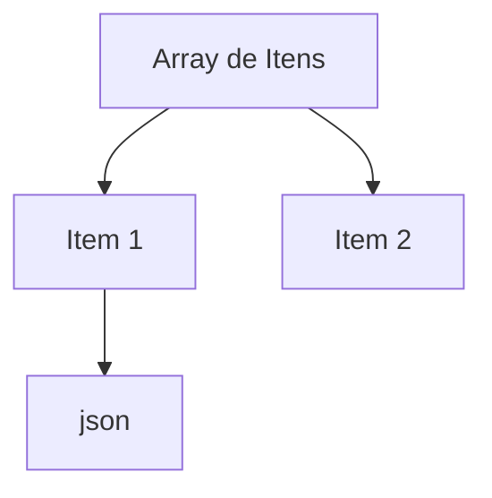

---
sidebar_position: 1
title: "Lógica e Manipulação de Dados no n8n: Workflows Inteligentes e Práticos"
description: Aprenda a dominar dados, lógica e processamento no n8n para criar workflows inteligentes, eficientes e escaláveis.
keywords: [n8n, lógica, dados, manipulação de dados, workflow inteligente, automação, processamento de dados, boas práticas, lógica de automação, transformação de dados]
---

:::info
<IonicIcon name="cube-outline" style={{ fontSize: '18px', color: '#cor-ea4b71-esta-seo apresenta os **fundamentos técnicos, arquitetura e conceitos de lógica e dados** do n8n. Para guias práticos, passo a passo e troubleshooting, acesse a seção [Usando n8n](../usando-n8n/).
:::

:::info
<IonicIcon name="cube-outline" style={{ fontSize: '18px', color: '#cor-ea4b71-veja-o guia completo:** [Estrutura de Dados no n8n](./estrutura-dados) — padrão, exemplos, boas práticas e diagrama visual.
:::

#resumo-tcnico-estrutura-de-dados no n8n

No n8n, **todos os dados trafegam entre os nós como um array de objetos**. Cada item pode conter:
- `json`: dados estruturados (campos, valores, objetos aninhados)
- `binary` (opcional): arquivos anexos, com `data`, `mimeType`, `fileExtension`, `fileName`

> Consulte a página [Estrutura de Dados no n8n](./estrutura-dados) para detalhes avançados, exemplos genéricos e diagrama visual.

#casos-de-uso-no-brasil

Veja exemplos completos e dicas para automações nacionais:
- [Automação de Boletos Bancários](./data/boletos-bancarios)
- [Integração de NF-e e XML Fiscal](./data/nfe-xml)
- [Anexos Contratuais e Documentos Digitais](./data/anexos-contratuais)

---

#ionicicon-namedocument-text-outline-style-fontsize-24px color: '#cor-ea4b71-dados#cor-dados-tipos-de-dados Strings, números, objetos, arrays
- **Manipulação**: Transformação e formatação
- **Validação**: Verificação de dados
- **Conversão**: Mudança de tipos

---

#ionicicon-namegit-branch-outline-style-fontsize-24px color: '#cor-ea4b71-lgica-de Fluxo {#logica-de-fluxo-condicionais-ifelse-e decisões
- **Loops**: Repetição de operações
- **Merge**: Combinação de fluxos
- **Error Handling**: Tratamento de erros

---

#ionicicon-namegit-network-outline-style-fontsize-24px color: '#cor-ea4b71-conexes#conexoes-tipos-de-conexo Sucesso, erro, condicional
- **Mapeamento de Dados**: Passagem entre nodes
- **Transformação**: Modificação durante passagem

---

#ionicicon-nameschool-outline-style-fontsize-24px color: '#cor-ea4b71-conceitos-fundamentais {#conceitos-fundamentais}

#estrutura-de-dados-no-n8n **todos os dados trafegam entre os nodes como um array de objetos**, chamados de _items_. Cada item representa uma unidade de informação processada no workflow.

#estrutura-de-dados-no-n8n

No n8n, **todos os dados trafegam entre os nodes como um array de objetos**, chamados de _items_. Cada item representa uma unidade de informação processada no workflow.

#estrutura-padro-de-um-item

Cada item possui, no mínimo, a chave `json` (com dados estruturados) e, opcionalmente, a chave `binary` (para arquivos e dados binários):

```json
[
  {
    "json": {
      "nome": "João Silva",
      "email": "joao@exemplo.com",
      "idade": 30
    }
  },
  {
    "json": {
      "nome": "Maria Souza",
      "email": "maria@exemplo.com",
      "idade": 28
    },
    "binary": {
      "arquivo": {
        "data": "base64...",
        "mimeType": "application/pdf",
        "fileName": "contrato.pdf",
        "fileExtension": "pdf"
      }
    }
  }
]
```

#explicao-dos-campos-json Objeto com dados estruturados (campos, valores, objetos aninhados).
- **binary**: Objeto para dados binários (arquivos, imagens, documentos).
  - **data**: Conteúdo do arquivo em base64.
  - **mimeType**: Tipo MIME do arquivo (ex: `image/png`, `application/pdf`).
  - **fileName**: Nome do arquivo original.
  - **fileExtension**: Extensão do arquivo (ex: `png`, `pdf`).

#boas-prticas-sempre-defina `mimeType`, `fileName` e `fileExtension` ao trabalhar com arquivos binários para garantir compatibilidade e rastreabilidade.
- Use a chave `json` para todos os dados estruturados e reserve `binary` apenas para arquivos.
- Lembre-se: todos os nodes recebem e retornam arrays de items, mesmo que haja apenas um item no array.

#visualizao-e-debug-voc-pode inspecionar a estrutura dos dados em cada etapa do workflow usando o node **Debug** ou a visualização de execução do n8n.

#visualizao-da-estrutura-de-dados (Mermaid.js)



> **Nota importante:**
> A padronização da estrutura de dados facilita a criação de automações robustas, a integração entre diferentes nós e a manipulação de arquivos e informações em workflows complexos.

#tipos-de-dados-string Texto e caracteres
- **Number**: Números inteiros e decimais
- **Boolean**: Verdadeiro ou falso
- **Array**: Lista de valores
- **Object**: Estrutura chave-valor
- **Date**: Datas e timestamps

#manipulao-de-dados-extrao Obter valores específicos
- **Transformação**: Modificar formato ou estrutura
- **Validação**: Verificar integridade
- **Enriquecimento**: Adicionar informações

---

#ionicicon-namerepeat-outline-style-fontsize-24px color: '#cor-ea4b71-processamento-de Itens e Fluxo de Dados nos Nós

No n8n, **cada nó processa automaticamente todos os itens do array de entrada**. Isso significa que, se um node recebe 10 itens, ele executará sua lógica 10 vezes, uma para cada item, de forma independente.

#como-funciona-a-iterao **Entrada:** O node recebe um array de objetos (itens).
- **Processamento:** Executa a ação para cada item individualmente (exemplo: criar um cartão no Trello para cada item).
- **Saída:** Retorna um novo array, normalmente com a mesma quantidade de itens, mas os dados podem ser transformados, filtrados ou expandidos.

#exemplo-prtico-trello-node-se você conectar um node Trello após um node que gera múltiplos itens (ex: uma lista de tarefas), o Trello criará um cartão para **cada item** automaticamente:

```mermaid
graph TD
    A[Lista de Tarefas] --> B[Trello Node: Criar Cartão]
    B --> C[Cartão 1]
    B --> D[Cartão 2]
    B --> E[Cartão 3]
    style A fill:#cor-e1f5fe-style-b-fill#cor-f3e5f5-style-c-fill#cor-e8f5e8-style-d-fill#cor-e8f5e8-style-e-fill#cor-e8f5e8

#paralelismo-e-mltiplos-ramos **Ramos paralelos:** Quando um workflow se divide (ex: IF, Switch), cada ramo processa os itens de forma independente e paralela.
- **Ordem de execução:** O n8n executa todos os ramos em paralelo, mas a ordem de chegada dos resultados pode variar. Se precisar sincronizar, use o node Merge.
- **Always Output Data:** Use esta opção em ramos que podem não gerar saída, para garantir que o fluxo continue sem erros.

#boas-prticas-sempre-que possível, projete seus workflows para processar múltiplos itens em lote, aproveitando o paralelismo nativo do n8n.
- Use o node Merge para reunir dados de diferentes ramos antes de etapas finais.
- Teste com diferentes quantidades de itens para garantir que o fluxo se comporte como esperado.

> **Nota importante:**
> O processamento item a item é automático e transparente para o usuário, tornando o n8n ideal para automações em escala, como envio de emails em massa, criação de múltiplos registros em sistemas externos ou processamento de grandes volumes de dados.

---

#ionicicon-nametrending-up-outline-style-fontsize-24px color: '#cor-ea4b71-tcnicas-avanadas {#tecnicas-avancadas}

#agregaes-e-estatsticas-soma Total de valores numéricos
- **Média**: Valor médio de um conjunto
- **Contagem**: Número de itens
- **Máximo/Mínimo**: Valores extremos

#filtros-e-seleo-filtros Condicionais**: Seleção baseada em critérios
- **Ordenação**: Organização por valores
- **Limitação**: Redução de volume de dados
- **Deduplicação**: Remoção de duplicatas

#mapeamento-e-transformao-mapeamento Simples**: Transformação 1:1
- **Mapeamento Complexo**: Transformações condicionais
- **Join**: Combinação de dados de fontes diferentes
- **Split**: Divisão de dados em múltiplos fluxos

---

#ionicicon-namebug-outline-style-fontsize-24px color: '#cor-ea4b71-debugging#cor-debugging}

#ferramentas-de-debug-debug Node**: Visualização de dados em tempo real
- **Logs**: Registro de execução
- **Error Handling**: Captura e tratamento de erros
- **Validation**: Verificação de dados

#boas-prticas-teste-incremental Valide cada etapa
- **Documentação**: Comente lógicas complexas
- **Versionamento**: Controle de mudanças
- **Monitoramento**: Acompanhe performance

---

#ionicicon-namearrow-forward-circle-outline-style-fontsize-24px color: '#cor-ea4b71-prximos-passos

1. **Aprenda sobre [Dados](./data/)** para entender tipos e manipulação
2. **Explore [Lógica de Fluxo](./flow-logic)** para controle de execução
3. **Pratique [Debugging](./flow-logic/debugging)** para troubleshooting

---

#ionicicon-namelink-outline-style-fontsize-24px color: '#cor-ea4b71-recursos-relacionados

- **[Primeiros Passos](../primeiros-passos/)** – Conceitos básicos
- **[Usando n8n](../usando-n8n/)** – Guias práticos
- **[Integrações](../integracoes/)** – Conectar com dados externos
- **[API](../api/)** – Automação via API

---

> <span style={{fontSize: '18px', fontWeight: 'bold'}}>**Domine a manipulação de dados e crie workflows inteligentes com lógica poderosa!**</span>

