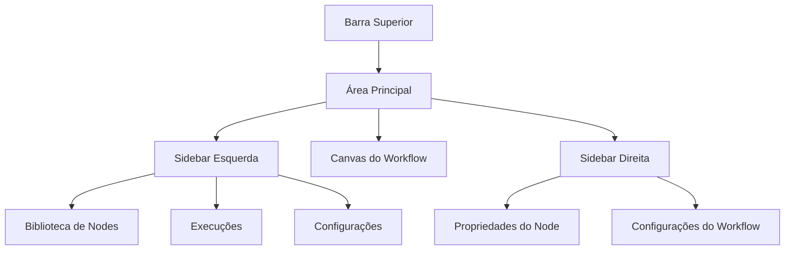

# Navegação no Editor UI

O editor n8n oferece uma interface intuitiva e poderosa para criar e gerenciar workflows. Este guia detalha todos os elementos da interface e como navegar eficientemente.

## Visão Geral da Interface

A interface do n8n é dividida em áreas principais que trabalham em conjunto:

## Barra Superior

### Menu Principal

- **File**: Salvar, exportar, importar workflows
- **Edit**: Desfazer, refazer, copiar, colar
- **View**: Alternar visibilidade de elementos
- **Help**: Documentação, sobre, suporte

### Botões de Ação

- **Execute Workflow**: Executa o workflow atual
- **Stop Execution**: Para execuções em andamento
- **Save**: Salva alterações
- **Share**: Compartilha o workflow

### Indicadores de Status

- **Connection Status**: Status da conexão com o servidor
- **Execution Status**: Status da última execução
- **Version**: Versão atual do n8n

## Sidebar Esquerda

### Biblioteca de Nodes

Organizada por categorias:

#### Core Nodes

- **Manual Trigger**: Inicia workflows manualmente
- **Schedule Trigger**: Executa em intervalos programados
- **Webhook**: Recebe dados via HTTP
- **HTTP Request**: Faz requisições HTTP
- **Code**: Executa código JavaScript/Python
- **Set**: Define valores de campos
- **IF**: Lógica condicional
- **Switch**: Múltiplas condições
- **Merge**: Combina dados de múltiplos nodes
- **Split In Batches**: Divide dados em lotes

#### App Nodes

- **Communication**: Email, Slack, Discord
- **Productivity**: Google Sheets, Trello, Notion
- **E-commerce**: Shopify, WooCommerce
- **Marketing**: Mailchimp, HubSpot
- **Finance**: PayPal, Stripe

### Execuções

- **Recent Executions**: Últimas execuções do workflow
- **Execution Details**: Logs e dados detalhados
- **Debug Information**: Informações para depuração

### Configurações

- **Workflow Settings**: Configurações gerais
- **Credentials**: Gerenciamento de credenciais
- **Variables**: Variáveis de ambiente

## Canvas do Workflow

### Área de Trabalho

- **Zoom Controls**: Zoom in/out, fit to screen
- **Pan**: Arrastar para navegar
- **Grid**: Grade de alinhamento
- **Mini-map**: Visão geral do workflow

### Nodes

- **Drag & Drop**: Arrastar nodes da biblioteca
- **Connection Points**: Conectar nodes com setas
- **Node Types**: Diferentes cores por categoria
- **Status Indicators**: Sucesso, erro, em execução

### Conexões

- **Data Flow**: Setas mostram fluxo de dados
- **Connection Types**: Diferentes tipos de conexão
- **Validation**: Validação automática de conexões

## Sidebar Direita

### Propriedades do Node

Quando um node está selecionado:

#### Configurações Básicas

- **Node Name**: Nome identificador
- **Description**: Descrição opcional
- **Tags**: Tags para organização

#### Parâmetros Específicos

- **Authentication**: Configuração de credenciais
- **Operation**: Operação específica do node
- **Fields**: Campos de entrada/saída
- **Options**: Opções avançadas

#### Validação

- **Required Fields**: Campos obrigatórios
- **Validation Rules**: Regras de validação
- **Error Messages**: Mensagens de erro

### Configurações do Workflow

- **General**: Nome, descrição, tags
- **Settings**: Configurações de execução
- **Variables**: Variáveis globais
- **Permissions**: Permissões de acesso

## Atalhos de Teclado

### Navegação

- `Ctrl + S`: Salvar workflow
- `Ctrl + Z`: Desfazer
- `Ctrl + Y`: Refazer
- `Ctrl + C`: Copiar node selecionado
- `Ctrl + V`: Colar node
- `Delete`: Remover node selecionado
- `Ctrl + A`: Selecionar todos os nodes
- `Ctrl + D`: Duplicar node

### Zoom e Navegação

- `Ctrl + +`: Zoom in
- `Ctrl + -`: Zoom out
- `Ctrl + 0`: Reset zoom
- `Space + Drag`: Pan no canvas
- `Ctrl + F`: Fit to screen

### Execução

- `F5`: Executar workflow
- `Ctrl + F5`: Executar com debug
- `Escape`: Parar execução

### Busca

- `Ctrl + F`: Buscar nodes
- `Ctrl + Shift + F`: Buscar em todo o workflow

## Dicas de Produtividade

### Organização

1. **Use Tags**: Organize workflows com tags descritivas
2. **Nomes Descritivos**: Dê nomes claros aos nodes
3. **Comentários**: Adicione comentários para documentar
4. **Agrupamento**: Agrupe nodes relacionados

### Debugging

1. **Test Mode**: Use modo de teste para validar
2. **Execution Logs**: Analise logs detalhadamente
3. **Data Preview**: Visualize dados em cada node
4. **Error Handling**: Implemente tratamento de erros

### Performance

1. **Batch Processing**: Use nodes de batch para grandes volumes
2. **Rate Limiting**: Configure limites de taxa
3. **Caching**: Use cache quando apropriado
4. **Optimization**: Otimize queries e operações

## Recursos Avançados

### Templates

- **Built-in Templates**: Templates pré-definidos
- **Custom Templates**: Crie seus próprios templates
- **Community Templates**: Templates da comunidade

### Versioning

- **Version Control**: Controle de versão integrado
- **Backup**: Backup automático de workflows
- **Restore**: Restaurar versões anteriores

### Collaboration

- **Sharing**: Compartilhar workflows
- **Comments**: Comentários colaborativos
- **Permissions**: Controle de acesso granular

## Troubleshooting

### Problemas Comuns

1. **Connection Issues**: Verificar credenciais e conectividade
2. **Data Format**: Validar formato dos dados
3. **Rate Limits**: Respeitar limites de API
4. **Memory Usage**: Monitorar uso de memória

### Ferramentas de Debug

- **Execution Inspector**: Inspecionar execuções
- **Data Viewer**: Visualizar dados estruturados
- **Error Tracker**: Rastrear erros
- **Performance Monitor**: Monitorar performance

## Recursos Adicionais

### Documentação Oficial

- [Interface Overview](https://docs.n8n.io/workflows/editor/)
- [Keyboard Shortcuts](https://docs.n8n.io/workflows/editor/keyboard-shortcuts/)
- [Node Reference](https://docs.n8n.io/integrations/)

### Comunidade

- [n8n Community](https://community.n8n.io/)
- [GitHub Discussions](https://github.com/n8n-io/n8n/discussions)
- [Discord Server](https://discord.gg/n8n)

### Vídeos Tutoriais

- [Interface Tutorial](https://www.youtube.com/watch?v=example)
- [Productivity Tips](https://www.youtube.com/watch?v=example)
- [Advanced Features](https://www.youtube.com/watch?v=example)

---

**Próximos Passos:**

- [Configuração de Credenciais](../credenciais/criar-editar.md)
- [Execução de Workflows](../execucoes/index.md)
- [Tratamento de Erros](../../logica-e-dados/01-flow-logic/error-handling.md)
