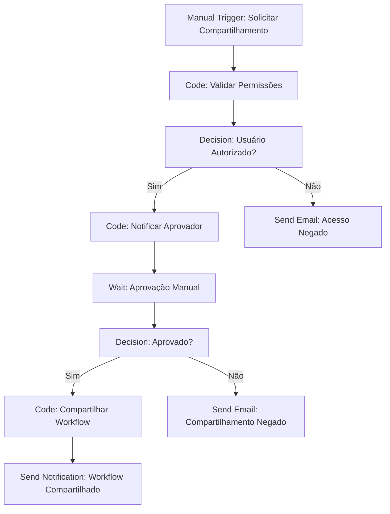
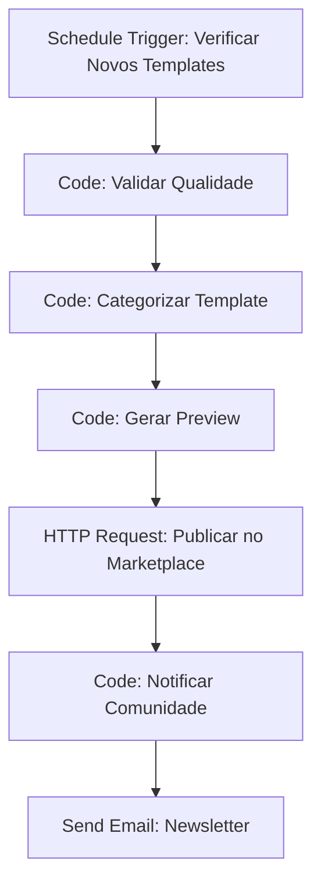

# Compartilhamento de Workflows

O compartilhamento de workflows permite colaborar com sua equipe, distribuir automações e reutilizar soluções. Esta seção aborda todas as formas de compartilhar workflows no n8n de forma segura e eficiente.

## Visão Geral

O compartilhamento de workflows oferece múltiplas opções para colaboração:

- **Compartilhamento interno** com membros da equipe
- **Compartilhamento público** via templates
- **Exportação/importação** de workflows
- **Versionamento** e controle de mudanças
- **Compartilhamento seguro** com controle de acesso

## Tipos de Compartilhamento

### Compartilhamento Interno

Compartilhe workflows com membros da sua organização:

```javascript
// Compartilhar workflow com usuários específicos
const compartilharWorkflow = async (workflowId, usuarios, permissoes) => {
  const response = await fetch(`/api/v1/workflows/${workflowId}/share`, {
    method: 'POST',
    headers: {
      'Content-Type': 'application/json',
      'Authorization': 'Bearer YOUR_API_KEY'
    },
    body: JSON.stringify({
      users: usuarios,
      permissions: permissoes,
      message: 'Workflow compartilhado para colaboração'
    })
  });
  
  return response.json();
};

// Exemplo de uso
const usuarios = ['joao@empresa.com', 'maria@empresa.com'];
const permissoes = ['read', 'execute'];

await compartilharWorkflow('workflow-123', usuarios, permissoes);
```

### Compartilhamento por Role

Compartilhe baseado em funções organizacionais:

```javascript
// Compartilhar com roles específicas
const compartilharPorRole = async (workflowId, roles, permissoes) => {
  const response = await fetch(`/api/v1/workflows/${workflowId}/share/roles`, {
    method: 'POST',
    headers: {
      'Content-Type': 'application/json',
      'Authorization': 'Bearer YOUR_API_KEY'
    },
    body: JSON.stringify({
      roles: roles,
      permissions: permissoes,
      inheritPermissions: true // Herdar permissões da role
    })
  });
  
  return response.json();
};

// Exemplo: Compartilhar com equipe de desenvolvimento
await compartilharPorRole('workflow-123', ['developer', 'admin'], ['read', 'write', 'execute']);
```

### Compartilhamento Público

Crie templates públicos para a comunidade:

```javascript
// Publicar workflow como template
const publicarTemplate = async (workflowId, metadata) => {
  const response = await fetch(`/api/v1/workflows/${workflowId}/publish`, {
    method: 'POST',
    headers: {
      'Content-Type': 'application/json',
      'Authorization': 'Bearer YOUR_API_KEY'
    },
    body: JSON.stringify({
      public: true,
      template: true,
      metadata: {
        name: metadata.nome,
        description: metadata.descricao,
        category: metadata.categoria,
        tags: metadata.tags,
        version: metadata.versao,
        author: metadata.autor,
        license: metadata.licenca
      }
    })
  });
  
  return response.json();
};

// Exemplo: Publicar template de automação de vendas
const metadata = {
  nome: 'Automação de Vendas - CRM',
  descricao: 'Workflow para automatizar processo de vendas com integração CRM',
  categoria: 'Vendas',
  tags: ['crm', 'vendas', 'automação', 'brasil'],
  versao: '1.0.0',
  autor: 'Equipe n8n Brasil',
  licenca: 'MIT'
};

await publicarTemplate('workflow-123', metadata);
```

## Permissões de Compartilhamento

### Níveis de Permissão

Defina diferentes níveis de acesso:

```javascript
// Configurar permissões granulares
const configurarPermissoes = {
  // Permissões básicas
  read: {
    description: 'Visualizar workflow',
    actions: ['view', 'export']
  },
  
  // Permissões de execução
  execute: {
    description: 'Executar workflow',
    actions: ['run', 'test', 'debug']
  },
  
  // Permissões de edição
  write: {
    description: 'Editar workflow',
    actions: ['edit', 'save', 'duplicate']
  },
  
  // Permissões administrativas
  admin: {
    description: 'Administrar workflow',
    actions: ['share', 'delete', 'configure', 'permissions']
  }
};

// Aplicar permissões
const aplicarPermissoes = async (workflowId, usuario, permissoes) => {
  const response = await fetch(`/api/v1/workflows/${workflowId}/permissions`, {
    method: 'PUT',
    headers: {
      'Content-Type': 'application/json',
      'Authorization': 'Bearer YOUR_API_KEY'
    },
    body: JSON.stringify({
      user: usuario,
      permissions: permissoes,
      expiresAt: new Date(Date.now() + 30 * 24 * 60 * 60 * 1000) // 30 dias
    })
  });
  
  return response.json();
};
```

### Controle de Acesso Temporal

Configure permissões com prazo de validade:

```javascript
// Compartilhamento temporário
const compartilhamentoTemporal = async (workflowId, usuarios, duracao) => {
  const expiracao = new Date(Date.now() + duracao * 60 * 60 * 1000); // duracao em horas
  
  const response = await fetch(`/api/v1/workflows/${workflowId}/share/temporary`, {
    method: 'POST',
    headers: {
      'Content-Type': 'application/json',
      'Authorization': 'Bearer YOUR_API_KEY'
    },
    body: JSON.stringify({
      users: usuarios,
      permissions: ['read', 'execute'],
      expiresAt: expiracao,
      notifyExpiration: true
    })
  });
  
  return response.json();
};

// Exemplo: Compartilhar por 24 horas
await compartilhamentoTemporal('workflow-123', ['consultor@empresa.com'], 24);
```

## Compartilhamento Seguro

### Criptografia de Dados Sensíveis

Proteja informações confidenciais:

```javascript
// Configurar criptografia para compartilhamento
const configurarCriptografia = {
  enabled: true,
  algorithm: 'AES-256-GCM',
  keyRotation: {
    enabled: true,
    interval: 30, // dias
    autoRotate: true
  },
  sensitiveFields: [
    'api_key',
    'password',
    'token',
    'secret',
    'cpf',
    'cnpj'
  ]
};

// Criptografar workflow antes do compartilhamento
const criptografarWorkflow = async (workflowId, chavePublica) => {
  const workflow = await buscarWorkflow(workflowId);
  
  // Criptografar credenciais sensíveis
  const workflowCriptografado = {
    ...workflow,
    nodes: workflow.nodes.map(node => {
      if (node.credentials) {
        return {
          ...node,
          credentials: criptografarCredenciais(node.credentials, chavePublica)
        };
      }
      return node;
    })
  };
  
  return workflowCriptografado;
};
```

### Assinatura Digital

Verifique a autenticidade dos workflows:

```javascript
// Assinar workflow digitalmente
const assinarWorkflow = async (workflowId, chavePrivada) => {
  const workflow = await buscarWorkflow(workflowId);
  const hash = await gerarHash(JSON.stringify(workflow));
  const assinatura = await assinarHash(hash, chavePrivada);
  
  return {
    workflow: workflow,
    signature: assinatura,
    timestamp: new Date().toISOString(),
    author: 'autor@empresa.com'
  };
};

// Verificar assinatura
const verificarAssinatura = async (workflowAssinado, chavePublica) => {
  const hash = await gerarHash(JSON.stringify(workflowAssinado.workflow));
  const valido = await verificarHash(hash, workflowAssinado.signature, chavePublica);
  
  return {
    valid: valido,
    timestamp: workflowAssinado.timestamp,
    author: workflowAssinado.author
  };
};
```

## Templates e Bibliotecas

### Biblioteca de Templates

Organize templates por categoria:

```javascript
// Criar biblioteca de templates
const bibliotecaTemplates = {
  vendas: {
    nome: 'Automações de Vendas',
    descricao: 'Templates para automação de processos de vendas',
    templates: [
      {
        id: 'vendas-lead-scoring',
        nome: 'Lead Scoring Automático',
        descricao: 'Classifica leads automaticamente baseado em comportamento',
        tags: ['vendas', 'lead', 'scoring', 'crm'],
        versao: '1.2.0',
        downloads: 1250
      },
      {
        id: 'vendas-follow-up',
        nome: 'Follow-up Automático',
        descricao: 'Automatiza follow-up com prospects',
        tags: ['vendas', 'follow-up', 'email', 'automação'],
        versao: '1.1.0',
        downloads: 890
      }
    ]
  },
  
  financeiro: {
    nome: 'Automações Financeiras',
    descricao: 'Templates para processos financeiros',
    templates: [
      {
        id: 'financeiro-conciliacao',
        nome: 'Conciliação Bancária',
        descricao: 'Automatiza conciliação bancária',
        tags: ['financeiro', 'banco', 'conciliação', 'contabilidade'],
        versao: '1.0.0',
        downloads: 567
      }
    ]
  }
};
```

### Marketplace de Templates

Crie um marketplace para a comunidade:

```javascript
// Configurar marketplace
const marketplaceConfig = {
  name: 'n8n Brasil Marketplace',
  description: 'Marketplace de templates para automação',
  categories: [
    'Vendas',
    'Marketing',
    'Financeiro',
    'RH',
    'Suporte',
    'E-commerce',
    'Integrações BR'
  ],
  
  // Sistema de avaliação
  rating: {
    enabled: true,
    minRating: 1,
    maxRating: 5,
    requireReview: true
  },
  
  // Sistema de downloads
  downloads: {
    trackDownloads: true,
    requireAuth: false,
    limitPerUser: 100
  },
  
  // Sistema de monetização
  monetization: {
    enabled: false,
    currency: 'BRL',
    paymentMethods: ['pix', 'cartao', 'boleto']
  }
};
```

## Colaboração em Tempo Real

### Edição Colaborativa

Trabalhe em equipe no mesmo workflow:

```javascript
// Configurar edição colaborativa
const configuracaoColaborativa = {
  enabled: true,
  maxCollaborators: 10,
  conflictResolution: 'manual', // manual, auto, prompt
  
  // Controle de versões
  versioning: {
    enabled: true,
    autoSave: true,
    saveInterval: 30000, // 30 segundos
    maxVersions: 50
  },
  
  // Comentários e feedback
  comments: {
    enabled: true,
    allowAttachments: true,
    notifyMentions: true
  },
  
  // Histórico de mudanças
  changeTracking: {
    enabled: true,
    trackUser: true,
    trackTimestamp: true,
    trackChanges: true
  }
};

// Adicionar comentário ao workflow
const adicionarComentario = async (workflowId, comentario) => {
  const response = await fetch(`/api/v1/workflows/${workflowId}/comments`, {
    method: 'POST',
    headers: {
      'Content-Type': 'application/json',
      'Authorization': 'Bearer YOUR_API_KEY'
    },
    body: JSON.stringify({
      text: comentario.texto,
      nodeId: comentario.nodeId,
      position: comentario.posicao,
      mentions: comentario.mentions
    })
  });
  
  return response.json();
};
```

### Notificações de Colaboração

Mantenha a equipe informada:

```javascript
// Configurar notificações de colaboração
const notificacoesColaboracao = {
  onShare: {
    enabled: true,
    channels: ['email', 'slack'],
    template: 'Workflow compartilhado com você por {{author}}'
  },
  
  onComment: {
    enabled: true,
    channels: ['email', 'slack'],
    template: 'Novo comentário no workflow {{workflowName}}'
  },
  
  onEdit: {
    enabled: true,
    channels: ['slack'],
    template: 'Workflow {{workflowName}} foi editado por {{user}}'
  },
  
  onPublish: {
    enabled: true,
    channels: ['email', 'slack', 'teams'],
    template: 'Novo template publicado: {{templateName}}'
  }
};
```

## Compartilhamento Específico para Brasil

### Templates Brasileiros

Crie templates específicos para o mercado brasileiro:

```javascript
// Templates específicos do Brasil
const templatesBrasil = {
  nfe: {
    nome: 'Automação NFe',
    descricao: 'Automatiza emissão e envio de NFes',
    integracoes: ['sefaz', 'email', 'whatsapp'],
    campos: ['cnpj', 'inscricao_estadual', 'cfop', 'icms']
  },
  
  pix: {
    nome: 'Automação PIX',
    descricao: 'Processa pagamentos PIX automaticamente',
    integracoes: ['banco_central', 'webhook', 'email'],
    campos: ['chave_pix', 'valor', 'descricao', 'beneficiario']
  },
  
  lgpd: {
    nome: 'Compliance LGPD',
    descricao: 'Automatiza processos de conformidade LGPD',
    integracoes: ['database', 'email', 'api'],
    campos: ['consentimento', 'finalidade', 'retencao', 'exclusao']
  },
  
  serasa: {
    nome: 'Consulta Serasa',
    descricao: 'Consulta dados de crédito no Serasa',
    integracoes: ['serasa_api', 'crm', 'email'],
    campos: ['cpf', 'cnpj', 'score', 'restricoes']
  }
};
```

### Integrações Brasileiras

Compartilhe workflows com integrações locais:

```javascript
// Workflows com integrações brasileiras
const integracoesBrasil = {
  receita: {
    nome: 'Consulta Receita Federal',
    descricao: 'Consulta dados de empresas na Receita',
    api: 'https://receitaws.com.br/v1/cnpj/',
    campos: ['cnpj', 'razao_social', 'situacao', 'endereco']
  },
  
  viacep: {
    nome: 'Consulta ViaCEP',
    descricao: 'Consulta endereços pelo CEP',
    api: 'https://viacep.com.br/ws/',
    campos: ['cep', 'logradouro', 'bairro', 'cidade', 'estado']
  },
  
  correios: {
    nome: 'Rastreamento Correios',
    descricao: 'Rastreia encomendas dos Correios',
    api: 'https://rastreamento.correios.com.br/app/index.php',
    campos: ['codigo_rastreio', 'status', 'historico', 'prazo']
  }
};
```

## Workflows de Compartilhamento

### Workflow: Aprovação de Compartilhamento



### Workflow: Distribuição de Templates



## Boas Práticas

### Segurança

- **Sempre valide permissões** antes de compartilhar
- **Use criptografia** para dados sensíveis
- **Implemente auditoria** de compartilhamentos
- **Configure expiração** para acessos temporários

### Colaboração

- **Documente workflows** antes de compartilhar
- **Use comentários** para explicar lógica complexa
- **Mantenha versionamento** de mudanças
- **Notifique mudanças** importantes

### Organização

- **Categorize templates** adequadamente
- **Use tags descritivas** para facilitar busca
- **Mantenha biblioteca atualizada** regularmente
- **Solicite feedback** dos usuários

## Troubleshooting

### Problemas Comuns

**Workflow não compartilhado:**
- Verificar permissões do usuário
- Verificar configurações de rede
- Verificar tamanho do workflow

**Permissões não aplicadas:**
- Verificar configurações de role
- Verificar herança de permissões
- Verificar expiração de acesso

**Template não publicado:**
- Verificar metadados obrigatórios
- Verificar validação de qualidade
- Verificar configurações de marketplace

## Recursos Adicionais

### Documentação Oficial
- [Workflow Sharing](https://docs.n8n.io/workflows/sharing/)
- [Templates](https://docs.n8n.io/workflows/templates/)

### Ferramentas Relacionadas
- **n8n Templates**: Biblioteca oficial de templates
- **GitHub**: Versionamento de workflows
- **Slack**: Notificações de colaboração

---

**Próximo**: [Exportação e Importação](./export-import) - Mova workflows entre ambientes 