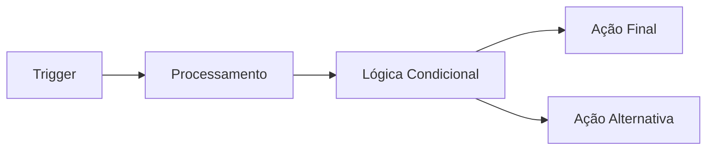
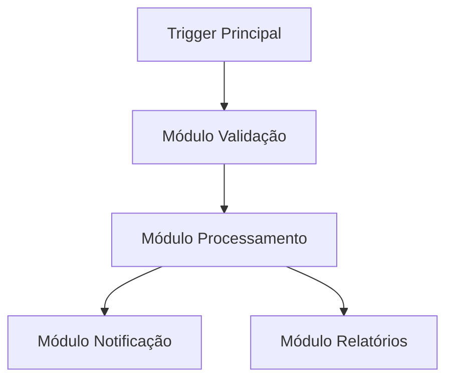
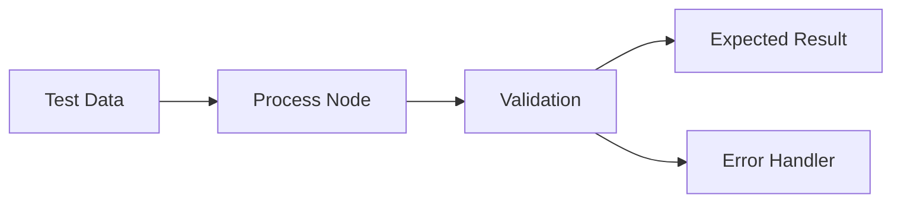
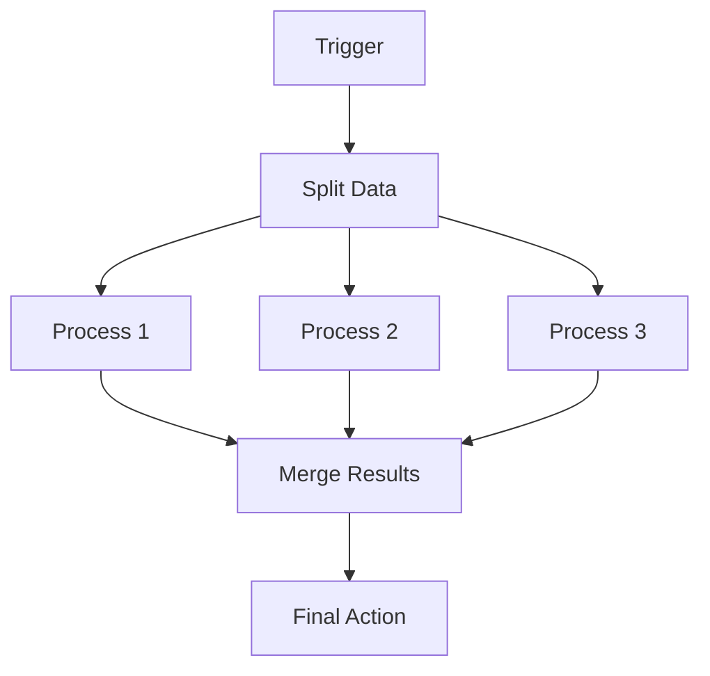
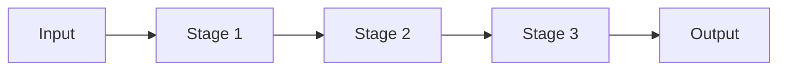
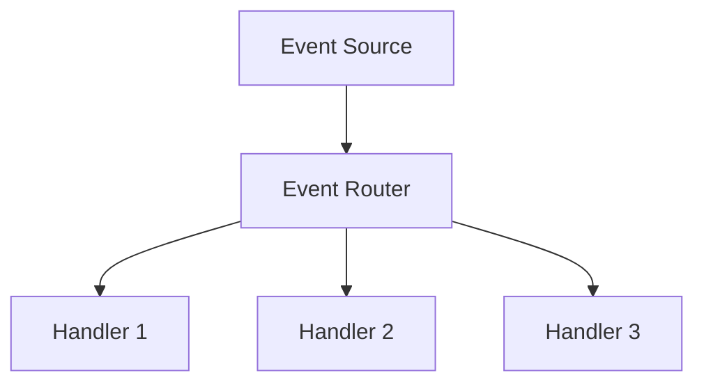
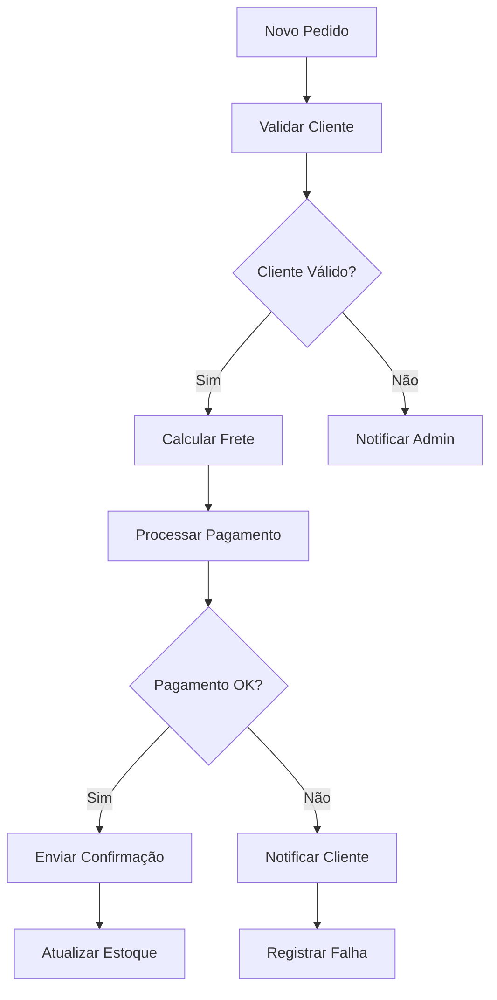

:::info
<IonicIcon name="shield-checkmark-outline" style={{ fontSize: '18px', color: '#17a2b8' }} /> Esta página da documentação foi validada tecnicamente e didaticamente.
:::

---
sidebar_position: 2
title: Criar e Editar Workflows
description: Guia completo para criar e editar workflows no n8n
keywords: [n8n, workflows, criar, editar, nodes, triggers, conexões]
---


# Criar e Editar Workflows

Criar workflows eficientes no n8n requer compreensão dos conceitos fundamentais, boas práticas de design e técnicas avançadas de organização. Este guia aborda todo o processo de criação e edição.

## Conceitos Fundamentais

### O que é um Workflow

Um workflow no n8n é uma sequência automatizada de operações que:

- **Processa dados** de uma ou múltiplas fontes
- **Aplica lógica** condicional e transformações
- **Executa ações** em sistemas externos
- **Retorna resultados** ou continua o processamento

### Estrutura Básica



## Criando seu Primeiro Workflow

### Passo 1: Escolher o Trigger

O trigger determina **quando** e **como** o workflow será executado:

#### Triggers Comuns

- **Manual Trigger**: Execução manual via interface
- **Schedule Trigger**: Execução em intervalos programados
- **Webhook**: Execução via requisição HTTP
- **App Triggers**: Eventos de aplicações externas

#### Exemplo: Schedule Trigger

```json
{
  "rule": {
    "interval": [
      {
        "field": "hour",
        "value": 9
      },
      {
        "field": "minute",
        "value": 0
      }
    ]
  }
}
```

### Passo 2: Adicionar Nodes de Processamento

Nodes processam e transformam os dados:

#### Tipos de Processamento

- **Data Transformation**: Modificar estrutura dos dados
- **Data Filtering**: Filtrar registros específicos
- **Data Enrichment**: Adicionar informações externas
- **Data Validation**: Validar integridade dos dados

#### Exemplo: Set Node

```json
{
  "values": {
    "string": [
      {
        "name": "status",
        "value": "processed"
      },
      {
        "name": "timestamp",
        "value": "={{ $now }}"
      }
    ]
  }
}
```

### Passo 3: Implementar Lógica Condicional

Use nodes de controle de fluxo para criar caminhos condicionais:

#### IF Node

```json
{
  "conditions": {
    "string": [
      {
        "value1": "={{ $json.status }}",
        "operation": "equals",
        "value2": "active"
      }
    ]
  }
}
```

#### Switch Node

```json
{
  "rules": {
    "rules": [
      {
        "conditions": {
          "string": [
            {
              "value1": "={{ $json.priority }}",
              "operation": "equals",
              "value2": "high"
            }
          ]
        },
        "outputIndex": 0
      }
    ]
  }
}
```

### Passo 4: Executar Ações Finais

Nodes de ação realizam operações em sistemas externos:

#### Exemplos de Ações

- **Send Email**: Enviar notificações
- **HTTP Request**: Chamar APIs externas
- **Database Operations**: Salvar/atualizar dados
- **File Operations**: Criar/modificar arquivos

## Técnicas Avançadas de Edição

### Organização de Workflows

#### 1. Nomenclatura Consistente

```yaml
# Boas práticas de nomenclatura
Workflow: "Processamento de Pedidos - E-commerce"
Nodes:
  - "Trigger - Novos Pedidos"
  - "Validação - Dados do Cliente"
  - "Processamento - Cálculo de Frete"
  - "Ação - Envio de Confirmação"
```

#### 2. Estrutura Modular

Divida workflows complexos em módulos menores:



#### 3. Comentários e Documentação

Use comentários para explicar lógica complexa:

```json
{
  "notes": "Este node calcula o desconto baseado no histórico do cliente e categoria do produto"
}
```

### Reutilização de Código

#### 1. Templates

Crie templates para workflows comuns:

- **Data Processing Templates**
- **Notification Templates**
- **Integration Templates**
- **Error Handling Templates**

#### 2. Subworkflows

Use subworkflows para lógica reutilizável:

```json
{
  "workflowId": "subworkflow-id",
  "parameters": {
    "inputData": "={{ $json }}"
  }
}
```

#### 3. Code Nodes Reutilizáveis

Crie funções JavaScript reutilizáveis:

```javascript
// Função para validação de email
function validateEmail(email) {
  const regex = /^[^\s@]+@[^\s@]+\.[^\s@]+$/;
  return regex.test(email);
}

// Função para formatação de data
function formatDate(date, format = 'DD/MM/YYYY') {
  return moment(date).format(format);
}
```

## Melhores Práticas

### Performance

1. **Batch Processing**: Processe dados em lotes
2. **Rate Limiting**: Respeite limites de API
3. **Caching**: Use cache para dados estáticos
4. **Optimization**: Otimize queries e operações

### Confiabilidade

1. **Error Handling**: Implemente tratamento de erros
2. **Retry Logic**: Configure tentativas automáticas
3. **Monitoring**: Monitore execuções
4. **Backup**: Faça backup de workflows importantes

### Manutenibilidade

1. **Version Control**: Use controle de versão
2. **Documentation**: Documente workflows complexos
3. **Testing**: Teste workflows regularmente
4. **Refactoring**: Refatore workflows antigos

## Debugging e Teste

### Ferramentas de Debug

1. **Execution Inspector**: Analise execuções detalhadamente
2. **Data Preview**: Visualize dados em cada node
3. **Error Logs**: Analise logs de erro
4. **Performance Monitor**: Monitore performance

### Estratégias de Teste

1. **Unit Testing**: Teste nodes individualmente
2. **Integration Testing**: Teste workflows completos
3. **Load Testing**: Teste com grandes volumes
4. **Error Testing**: Teste cenários de erro

### Exemplo: Workflow de Teste



## Workflows Complexos

### Padrões de Design

#### 1. Fan-out/Fan-in



#### 2. Pipeline Processing



#### 3. Event-driven Architecture



### Exemplo: Workflow de E-commerce



## Configurações Avançadas

### Variáveis de Ambiente

```json
{
  "variables": {
    "API_BASE_URL": "https://api.exemplo.com",
    "MAX_RETRIES": 3,
    "TIMEOUT": 30000
  }
}
```

### Configurações de Execução

```json
{
  "executionOrder": "v1",
  "saveExecutionProgress": true,
  "saveManualExecutions": true,
  "callerPolicy": "workflowsFromSameOwner"
}
```

### Permissões e Segurança

```json
{
  "permissions": {
    "owner": "user@exemplo.com",
    "sharedWith": [
      {
        "user": "admin@exemplo.com",
        "role": "editor"
      }
    ]
  }
}
```

## Troubleshooting

### Problemas Comuns

1. **Connection Issues**: Verificar credenciais e conectividade
2. **Data Format Errors**: Validar formato dos dados
3. **Rate Limit Exceeded**: Implementar delays e retry logic
4. **Memory Issues**: Otimizar processamento de dados

### Soluções

1. **Error Handling Nodes**: Implementar tratamento robusto
2. **Retry Mechanisms**: Configurar tentativas automáticas
3. **Monitoring**: Implementar alertas e logs
4. **Documentation**: Manter documentação atualizada

## Recursos Adicionais

### Documentação Oficial

- [Workflow Editor](https://docs.n8n.io/workflows/editor/)
- [Nodes Reference](https://docs.n8n.io/integrations/)
- [Best Practices](https://docs.n8n.io/workflows/best-practices/)

### Templates e Exemplos

- [n8n Templates](https://n8n.io/templates/)
- [Community Workflows](https://community.n8n.io/)
- [GitHub Examples](https://github.com/n8n-io/n8n/tree/master/packages/cli/templates)

### Ferramentas de Desenvolvimento

- [n8n CLI](https://docs.n8n.io/hosting/cli/)
- [n8n API](https://docs.n8n.io/api/)
- [n8n SDK](https://docs.n8n.io/integrations/creating-nodes/)

---

**Próximos Passos:**

- [Organização de Workflows](organizar)
- [Execução de Workflows](../execucoes/index)
- [Tratamento de Erros](../../logica-e-dados/flow-logic/error-handling)
