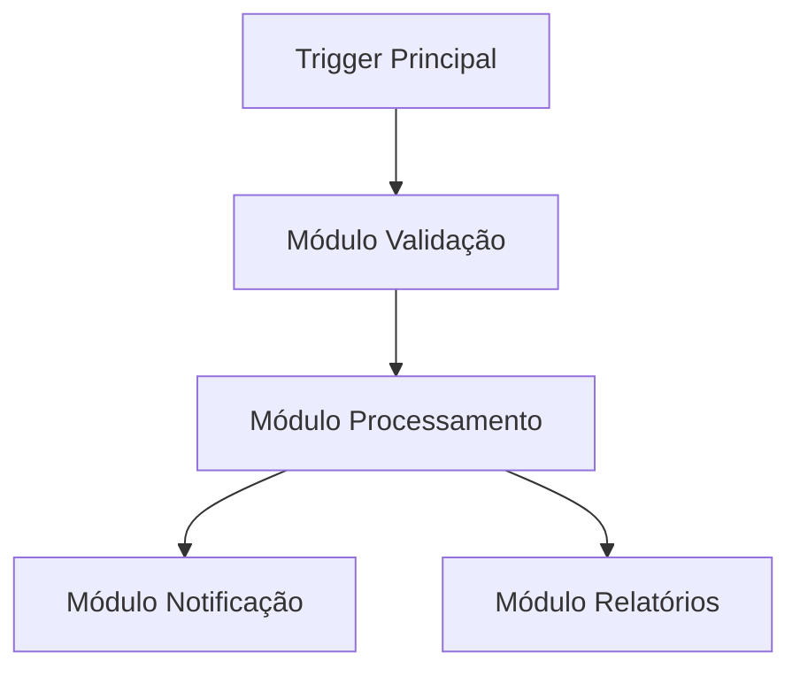

:::info
<IonicIcon name="shield-checkmark-outline" style={{ fontSize: '18px', color: '#cor-17a2b8-esta-pgina da documentação foi validada tecnicamente e didaticamente.
:::

---
sidebar_position: 2
title: Criar e Editar Workflows
description: Guia completo para criar e editar workflows no n8n
keywords: [n8n, workflows, criar, editar, nodes, triggers, conexões]
---


#criar-e-editar-workflows-criar workflows eficientes no n8n requer compreensão dos conceitos fundamentais, boas práticas de design e técnicas avançadas de organização. Este guia aborda todo o processo de criação e edição.

#conceitos-fundamentais

#o-que-um-workflow

Um workflow no n8n é uma sequência automatizada de operações que:

- **Processa dados** de uma ou múltiplas fontes
- **Aplica lógica** condicional e transformações
- **Executa ações** em sistemas externos
- **Retorna resultados** ou continua o processamento

#estrutura-bsica-mermaid-graph-lr
    A[Trigger] --> B[Processamento]
    B --> C[Lógica Condicional]
    C --> D[Ação Final]
    C --> E[Ação Alternativa]
```

#criando-seu-primeiro-workflow

#passo-1-escolher-o-trigger

O trigger determina **quando** e **como** o workflow será executado:

#triggers-comuns-manual-trigger Execução manual via interface
- **Schedule Trigger**: Execução em intervalos programados
- **Webhook**: Execução via requisição HTTP
- **App Triggers**: Eventos de aplicações externas

#exemplo-schedule-trigger-json
  "rule": {
    "interval": [
      {
        "field": "hour",
        "value": 9
      },
      {
        "field": "minute",
        "value": 0
      }
    ]
  }
}
```

#passo-2-adicionar-nodes-de Processamento

Nodes processam e transformam os dados:

#tipos-de-processamento-data Transformation**: Modificar estrutura dos dados
- **Data Filtering**: Filtrar registros específicos
- **Data Enrichment**: Adicionar informações externas
- **Data Validation**: Validar integridade dos dados

#exemplo-set-node-json
  "values": {
    "string": [
      {
        "name": "status",
        "value": "processed"
      },
      {
        "name": "timestamp",
        "value": "={{ $now }}"
      }
    ]
  }
}
```

#passo-3-implementar-lgica-condicional

Use nodes de controle de fluxo para criar caminhos condicionais:

#if-node-json-conditions {
    "string": [
      {
        "value1": "={{ $json.status }}",
        "operation": "equals",
        "value2": "active"
      }
    ]
  }
}
```

#switch-node-json-rules {
    "rules": [
      {
        "conditions": {
          "string": [
            {
              "value1": "={{ $json.priority }}",
              "operation": "equals",
              "value2": "high"
            }
          ]
        },
        "outputIndex": 0
      }
    ]
  }
}
```

#passo-4-executar-aes-finais

Nodes de ação realizam operações em sistemas externos:

#exemplos-de-aes-send Email**: Enviar notificações
- **HTTP Request**: Chamar APIs externas
- **Database Operations**: Salvar/atualizar dados
- **File Operations**: Criar/modificar arquivos

#tcnicas-avanadas-de-edio

#organizao-de-workflows

#id-1-nomenclatura-consistente-yaml
#boas-prticas-de-nomenclatura-workflow "Processamento de Pedidos - E-commerce"
Nodes:
  - "Trigger - Novos Pedidos"
  - "Validação - Dados do Cliente"
  - "Processamento - Cálculo de Frete"
  - "Ação - Envio de Confirmação"
```

#id-2-estrutura-modular-divida-workflows complexos em módulos menores:



#id-3-comentrios-e-documentao-use comentários para explicar lógica complexa:

```json
{
  "notes": "Este node calcula o desconto baseado no histórico do cliente e categoria do produto"
}
```

#reutilizao-de-cdigo

#id-1-templates-crie-templates-para workflows comuns:

- **Data Processing Templates**
- **Notification Templates**
- **Integration Templates**
- **Error Handling Templates**

#id-2-subworkflows-use-subworkflows-para lógica reutilizável:

```json
{
  "workflowId": "subworkflow-id",
  "parameters": {
    "inputData": "={{ $json }}"
  }
}
```

#id-3-code-nodes-reutilizveis-crie funções JavaScript reutilizáveis:

```javascript
// Função para validação de email
function validateEmail(email) {
  const regex = /^[^\s@]+@[^\s@]+\.[^\s@]+$/;
  return regex.test(email);
}

// Função para formatação de data
function formatDate(date, format = 'DD/MM/YYYY') {
  return moment(date).format(format);
}
```

#melhores-prticas

#performance-1-batch-processing-processe dados em lotes
2. **Rate Limiting**: Respeite limites de API
3. **Caching**: Use cache para dados estáticos
4. **Optimization**: Otimize queries e operações

#confiabilidade-1-error-handling-implemente tratamento de erros
2. **Retry Logic**: Configure tentativas automáticas
3. **Monitoring**: Monitore execuções
4. **Backup**: Faça backup de workflows importantes

#manutenibilidade-1-version-control-use controle de versão
2. **Documentation**: Documente workflows complexos
3. **Testing**: Teste workflows regularmente
4. **Refactoring**: Refatore workflows antigos

#cor-debugging-e-teste

#ferramentas-de-debug-1-execution Inspector**: Analise execuções detalhadamente
2. **Data Preview**: Visualize dados em cada node
3. **Error Logs**: Analise logs de erro
4. **Performance Monitor**: Monitore performance

#estratgias-de-teste-1-unit Testing**: Teste nodes individualmente
2. **Integration Testing**: Teste workflows completos
3. **Load Testing**: Teste com grandes volumes
4. **Error Testing**: Teste cenários de erro

#exemplo-workflow-de-teste-mermaid
graph LR
    A[Test Data] --> B[Process Node]
    B --> C[Validation]
    C --> D[Expected Result]
    C --> E[Error Handler]
```

#workflows-complexos

#padres-de-design

#id-1-fan-outfan-in-mermaid-graph-td
    A[Trigger] --> B[Split Data]
    B --> C[Process 1]
    B --> D[Process 2]
    B --> E[Process 3]
    C --> F[Merge Results]
    D --> F
    E --> F
    F --> G[Final Action]
```

#id-2-pipeline-processing-mermaid-graph LR
    A[Input] --> B[Stage 1]
    B --> C[Stage 2]
    C --> D[Stage 3]
    D --> E[Output]
```

#id-3-event-driven-architecture-mermaid-graph TD
    A[Event Source] --> B[Event Router]
    B --> C[Handler 1]
    B --> D[Handler 2]
    B --> E[Handler 3]
```

#exemplo-workflow-de-e-commerce-mermaid
graph TD
    A[Novo Pedido] --> B[Validar Cliente]
    B --> C{Cliente Válido?}
    C -->|Sim| D[Calcular Frete]
    C -->|Não| E[Notificar Admin]
    D --> F[Processar Pagamento]
    F --> G{Pagamento OK?}
    G -->|Sim| H[Enviar Confirmação]
    G -->|Não| I[Notificar Cliente]
    H --> J[Atualizar Estoque]
    I --> K[Registrar Falha]
```

#configuraes-avanadas

#variveis-de-ambiente-json
  "variables": {
    "API_BASE_URL": "https://api.exemplo.com",
    "MAX_RETRIES": 3,
    "TIMEOUT": 30000
  }
}
```

#configuraes-de-execuo-json
  "executionOrder": "v1",
  "saveExecutionProgress": true,
  "saveManualExecutions": true,
  "callerPolicy": "workflowsFromSameOwner"
}
```

#permisses-e-segurana-json
  "permissions": {
    "owner": "user@exemplo.com",
    "sharedWith": [
      {
        "user": "admin@exemplo.com",
        "role": "editor"
      }
    ]
  }
}
```

#Troubleshooting

#problemas-comuns-1-connection-issues Verificar credenciais e conectividade
2. **Data Format Errors**: Validar formato dos dados
3. **Rate Limit Exceeded**: Implementar delays e retry logic
4. **Memory Issues**: Otimizar processamento de dados

#solues-1-error-handling-nodes Implementar tratamento robusto
2. **Retry Mechanisms**: Configurar tentativas automáticas
3. **Monitoring**: Implementar alertas e logs
4. **Documentation**: Manter documentação atualizada

#recursos-adicionais

#documentao-oficial-workflow-editorhttpsdocsn8nioworkflowseditor
- [Nodes Reference](https://docs.n8n.io/integrations/)
- [Best Practices](https://docs.n8n.io/workflows/best-practices/)

#templates-e-exemplos-n8n Templates](https://n8n.io/templates/)
- [Community Workflows](https://community.n8n.io/)
- [GitHub Examples](https://github.com/n8n-io/n8n/tree/master/packages/cli/templates)

#ferramentas-de-desenvolvimento-n8n CLI](https://docs.n8n.io/hosting/cli/)
- [n8n API](https://docs.n8n.io/api/)
- [n8n SDK](https://docs.n8n.io/integrations/creating-nodes/)

---

**Próximos Passos:**

- [Organização de Workflows](organizar)
- [Execução de Workflows](../execucoes/index)
- [Tratamento de Erros](../../logica-e-dados/flow-logic/error-handling)
