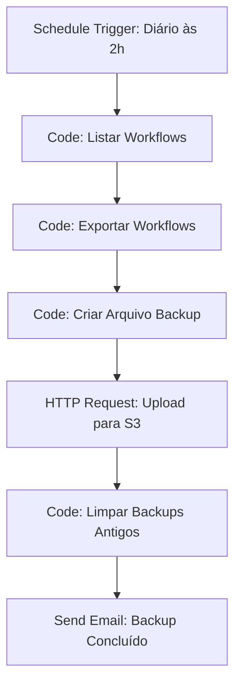
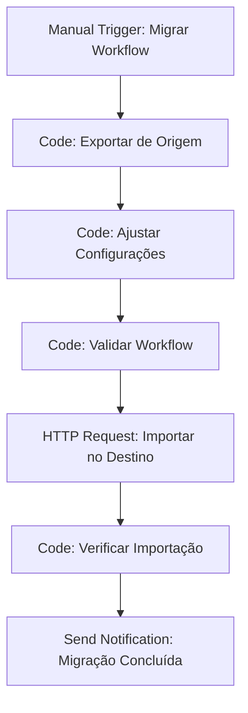

# Exportação e Importação de Workflows

A exportação e importação de workflows permite mover automações entre ambientes, fazer backup e compartilhar soluções. Esta seção aborda todas as formas de exportar e importar workflows no n8n de forma segura e eficiente.

## Visão Geral

A exportação e importação de workflows oferece múltiplas funcionalidades:

- **Migração entre ambientes** (desenvolvimento, homologação, produção)
- **Backup e recuperação** de workflows
- **Compartilhamento** de soluções entre equipes
- **Versionamento** e controle de mudanças
- **Templates** para reutilização

## Formatos de Exportação

### Formato JSON (Padrão)

O formato padrão do n8n inclui todos os dados do workflow:

```json
{
  "name": "Automação de Vendas",
  "nodes": [
    {
      "parameters": {},
      "id": "webhook-trigger",
      "name": "Webhook Trigger",
      "type": "n8n-nodes-base.webhook",
      "typeVersion": 1,
      "position": [240, 300]
    }
  ],
  "connections": {
    "Webhook Trigger": {
      "main": [
        [
          {
            "node": "HTTP Request",
            "type": "main",
            "index": 0
          }
        ]
      ]
    }
  },
  "active": false,
  "settings": {
    "executionTimeout": 3600000,
    "saveExecutionProgress": true
  },
  "versionId": "1.0.0",
  "meta": {
    "templateCredsSetupCompleted": true,
    "instanceId": "n8n-brasil"
  }
}
```

### Formato Compacto

Versão simplificada para compartilhamento rápido:

```json
{
  "name": "Automação de Vendas",
  "nodes": [
    {
      "parameters": {
        "httpMethod": "POST",
        "path": "vendas-webhook"
      },
      "id": "webhook-trigger",
      "name": "Webhook Trigger",
      "type": "n8n-nodes-base.webhook",
      "typeVersion": 1,
      "position": [240, 300]
    }
  ],
  "connections": {
    "Webhook Trigger": {
      "main": [
        [
          {
            "node": "HTTP Request",
            "type": "main",
            "index": 0
          }
        ]
      ]
    }
  },
  "active": false
}
```

### Formato com Credenciais

Inclui credenciais criptografadas (use com cuidado):

```json
{
  "name": "Automação de Vendas",
  "nodes": [
    {
      "parameters": {
        "url": "https://api.crm.com.br/v1/leads",
        "authentication": "genericCredentialType"
      },
      "credentials": {
        "httpBasicAuth": {
          "id": "crm-credentials",
          "name": "CRM API"
        }
      },
      "id": "http-request",
      "name": "HTTP Request",
      "type": "n8n-nodes-base.httpRequest",
      "typeVersion": 1,
      "position": [460, 300]
    }
  ],
  "connections": {},
  "active": false,
  "credentials": {
    "httpBasicAuth": {
      "id": "crm-credentials",
      "name": "CRM API",
      "type": "httpBasicAuth",
      "data": {
        "user": "encrypted-user",
        "password": "encrypted-password"
      }
    }
  }
}
```

## Exportação de Workflows

### Via Interface Web

Para exportar um workflow via interface:

1. **Abra o workflow** no editor
2. **Clique no menu** (⋮) no canto superior direito
3. **Selecione "Export"** no menu
4. **Escolha o formato** de exportação
5. **Clique em "Download"** para baixar o arquivo

### Via API

Exporte workflows programaticamente:

```javascript
// Exportar workflow via API
const exportarWorkflow = async (workflowId, formato = 'json') => {
  const response = await fetch(`/api/v1/workflows/${workflowId}/export`, {
    method: 'GET',
    headers: {
      'Authorization': 'Bearer YOUR_API_KEY',
      'Accept': `application/${formato}`
    },
    params: {
      format: formato,
      includeCredentials: false,
      includeSettings: true
    }
  });
  
  return response.json();
};

// Exemplo de uso
const workflow = await exportarWorkflow('workflow-123', 'json');
console.log(JSON.stringify(workflow, null, 2));
```

### Exportação em Lote

Exporte múltiplos workflows de uma vez:

```javascript
// Exportar múltiplos workflows
const exportarWorkflowsEmLote = async (workflowIds, formato = 'json') => {
  const workflows = [];
  
  for (const id of workflowIds) {
    try {
      const workflow = await exportarWorkflow(id, formato);
      workflows.push(workflow);
    } catch (error) {
      console.error(`Erro ao exportar workflow ${id}:`, error);
    }
  }
  
  return workflows;
};

// Exemplo: Exportar todos os workflows de vendas
const workflowIds = ['vendas-1', 'vendas-2', 'vendas-3'];
const workflowsVendas = await exportarWorkflowsEmLote(workflowIds);
```

### Exportação com Filtros

Exporte workflows baseado em critérios:

```javascript
// Exportar workflows com filtros
const exportarWorkflowsComFiltros = async (filtros) => {
  const response = await fetch('/api/v1/workflows/export/batch', {
    method: 'POST',
    headers: {
      'Content-Type': 'application/json',
      'Authorization': 'Bearer YOUR_API_KEY'
    },
    body: JSON.stringify({
      filters: {
        tags: filtros.tags,
        categories: filtros.categorias,
        active: filtros.ativo,
        createdAfter: filtros.criadoApos,
        createdBefore: filtros.criadoAntes
      },
      format: 'json',
      includeCredentials: false,
      includeSettings: true
    })
  });
  
  return response.json();
};

// Exemplo: Exportar workflows de vendas ativos
const filtros = {
  tags: ['vendas', 'crm'],
  categorias: ['Vendas'],
  ativo: true,
  criadoApos: '2024-01-01'
};

const workflowsFiltrados = await exportarWorkflowsComFiltros(filtros);
```

## Importação de Workflows

### Via Interface Web

Para importar um workflow via interface:

1. **Vá para a página de workflows**
2. **Clique em "Import from file"**
3. **Selecione o arquivo** JSON do workflow
4. **Configure as opções** de importação
5. **Clique em "Import"** para importar

### Via API

Importe workflows programaticamente:

```javascript
// Importar workflow via API
const importarWorkflow = async (workflowData, opcoes = {}) => {
  const response = await fetch('/api/v1/workflows/import', {
    method: 'POST',
    headers: {
      'Content-Type': 'application/json',
      'Authorization': 'Bearer YOUR_API_KEY'
    },
    body: JSON.stringify({
      workflow: workflowData,
      options: {
        overwrite: opcoes.sobrescrever || false,
        importCredentials: opcoes.importarCredenciais || false,
        importSettings: opcoes.importarConfiguracoes || true,
        updateExisting: opcoes.atualizarExistente || false
      }
    })
  });
  
  return response.json();
};

// Exemplo de uso
const workflowData = {
  name: "Automação de Vendas",
  nodes: [...],
  connections: {...}
};

const opcoes = {
  sobrescrever: false,
  importarCredenciais: true,
  importarConfiguracoes: true,
  atualizarExistente: true
};

const resultado = await importarWorkflow(workflowData, opcoes);
```

### Importação com Validação

Valide workflows antes da importação:

```javascript
// Validar workflow antes da importação
const validarWorkflow = async (workflowData) => {
  const response = await fetch('/api/v1/workflows/validate', {
    method: 'POST',
    headers: {
      'Content-Type': 'application/json',
      'Authorization': 'Bearer YOUR_API_KEY'
    },
    body: JSON.stringify({
      workflow: workflowData
    })
  });
  
  return response.json();
};

// Importar com validação
const importarComValidacao = async (workflowData) => {
  // Primeiro validar
  const validacao = await validarWorkflow(workflowData);
  
  if (validacao.valid) {
    // Se válido, importar
    return await importarWorkflow(workflowData);
  } else {
    throw new Error(`Workflow inválido: ${validacao.errors.join(', ')}`);
  }
};
```

### Importação em Lote

Importe múltiplos workflows de uma vez:

```javascript
// Importar múltiplos workflows
const importarWorkflowsEmLote = async (workflows, opcoes = {}) => {
  const resultados = [];
  
  for (const workflow of workflows) {
    try {
      const resultado = await importarWorkflow(workflow, opcoes);
      resultados.push({
        nome: workflow.name,
        sucesso: true,
        id: resultado.id
      });
    } catch (error) {
      resultados.push({
        nome: workflow.name,
        sucesso: false,
        erro: error.message
      });
    }
  }
  
  return resultados;
};

// Exemplo: Importar workflows de backup
const workflowsBackup = [
  { name: "Vendas 1", nodes: [...], connections: {...} },
  { name: "Vendas 2", nodes: [...], connections: {...} },
  { name: "Vendas 3", nodes: [...], connections: {...} }
];

const resultados = await importarWorkflowsEmLote(workflowsBackup);
```

## Migração Entre Ambientes

### Desenvolvimento para Homologação

```javascript
// Migrar workflow de dev para homologação
const migrarParaHomologacao = async (workflowId) => {
  // 1. Exportar de desenvolvimento
  const workflow = await exportarWorkflow(workflowId);
  
  // 2. Ajustar configurações para homologação
  const workflowHomologacao = {
    ...workflow,
    settings: {
      ...workflow.settings,
      executionTimeout: 1800000, // 30 minutos
      saveExecutionProgress: true,
      notifications: {
        onError: {
          enabled: true,
          channels: ['email'],
          recipients: ['dev@empresa.com']
        }
      }
    },
    meta: {
      ...workflow.meta,
      environment: 'homologacao',
      migratedAt: new Date().toISOString()
    }
  };
  
  // 3. Importar em homologação
  const homologacaoApiKey = 'HOMOLOGACAO_API_KEY';
  const resultado = await importarWorkflow(workflowHomologacao, {
    sobrescrever: true,
    importarCredenciais: false
  });
  
  return resultado;
};
```

### Homologação para Produção

```javascript
// Migrar workflow de homologação para produção
const migrarParaProducao = async (workflowId) => {
  // 1. Exportar de homologação
  const workflow = await exportarWorkflow(workflowId);
  
  // 2. Ajustar configurações para produção
  const workflowProducao = {
    ...workflow,
    settings: {
      ...workflow.settings,
      executionTimeout: 3600000, // 1 hora
      saveExecutionProgress: true,
      notifications: {
        onError: {
          enabled: true,
          channels: ['email', 'slack'],
          recipients: ['admin@empresa.com', 'dev@empresa.com']
        },
        onSuccess: {
          enabled: true,
          channels: ['slack'],
          recipients: ['vendas@empresa.com']
        }
      }
    },
    meta: {
      ...workflow.meta,
      environment: 'producao',
      migratedAt: new Date().toISOString(),
      version: '1.0.0'
    }
  };
  
  // 3. Importar em produção
  const producaoApiKey = 'PRODUCAO_API_KEY';
  const resultado = await importarWorkflow(workflowProducao, {
    sobrescrever: false,
    importarCredenciais: true
  });
  
  return resultado;
};
```

## Backup e Recuperação

### Backup Automático

Configure backup automático de workflows:

```javascript
// Configurar backup automático
const configurarBackupAutomatico = {
  enabled: true,
  schedule: '0 2 * * *', // Diário às 2h
  retention: {
    days: 30,
    maxBackups: 100
  },
  storage: {
    type: 's3', // s3, local, gcs
    bucket: 'n8n-backups',
    path: 'workflows/'
  },
  encryption: {
    enabled: true,
    algorithm: 'AES-256-GCM'
  }
};

// Executar backup
const executarBackup = async () => {
  // 1. Listar todos os workflows
  const workflows = await listarWorkflows();
  
  // 2. Exportar cada workflow
  const backups = [];
  for (const workflow of workflows) {
    const backup = await exportarWorkflow(workflow.id);
    backups.push(backup);
  }
  
  // 3. Criar arquivo de backup
  const backupData = {
    timestamp: new Date().toISOString(),
    version: '1.0.0',
    workflows: backups,
    metadata: {
      totalWorkflows: backups.length,
      environment: 'producao'
    }
  };
  
  // 4. Salvar backup
  await salvarBackup(backupData);
  
  return backupData;
};
```

### Recuperação de Backup

```javascript
// Recuperar workflow de backup
const recuperarBackup = async (backupId, workflowIds = null) => {
  // 1. Carregar backup
  const backup = await carregarBackup(backupId);
  
  // 2. Filtrar workflows se necessário
  const workflowsParaRecuperar = workflowIds 
    ? backup.workflows.filter(w => workflowIds.includes(w.id))
    : backup.workflows;
  
  // 3. Recuperar workflows
  const resultados = [];
  for (const workflow of workflowsParaRecuperar) {
    try {
      const resultado = await importarWorkflow(workflow, {
        sobrescrever: true,
        importarCredenciais: true
      });
      
      resultados.push({
        nome: workflow.name,
        sucesso: true,
        id: resultado.id
      });
    } catch (error) {
      resultados.push({
        nome: workflow.name,
        sucesso: false,
        erro: error.message
      });
    }
  }
  
  return resultados;
};
```

## Versionamento de Workflows

### Controle de Versões

```javascript
// Sistema de versionamento
const sistemaVersionamento = {
  // Estrutura de versão
  version: {
    major: 1, // Mudanças incompatíveis
    minor: 2, // Novas funcionalidades
    patch: 0  // Correções
  },
  
  // Histórico de versões
  history: [
    {
      version: '1.2.0',
      date: '2024-01-15',
      author: 'joao@empresa.com',
      changes: [
        'Adicionado node de validação CPF',
        'Corrigido bug no webhook trigger'
      ]
    }
  ],
  
  // Tags de versão
  tags: {
    'v1.0.0': 'Primeira versão estável',
    'v1.1.0': 'Adicionado suporte a PIX',
    'v1.2.0': 'Melhorias de performance'
  }
};

// Criar nova versão
const criarNovaVersao = async (workflowId, tipoMudanca = 'patch') => {
  const workflow = await exportarWorkflow(workflowId);
  const versaoAtual = workflow.versionId || '1.0.0';
  const novaVersao = incrementarVersao(versaoAtual, tipoMudanca);
  
  const workflowVersionado = {
    ...workflow,
    versionId: novaVersao,
    meta: {
      ...workflow.meta,
      versionHistory: [
        ...(workflow.meta.versionHistory || []),
        {
          version: novaVersao,
          date: new Date().toISOString(),
          author: 'usuario@empresa.com',
          changes: 'Mudanças automáticas'
        }
      ]
    }
  };
  
  return workflowVersionado;
};
```

## Templates e Reutilização

### Criar Template

```javascript
// Criar template reutilizável
const criarTemplate = async (workflowId, metadata) => {
  const workflow = await exportarWorkflow(workflowId);
  
  const template = {
    ...workflow,
    template: true,
    metadata: {
      name: metadata.nome,
      description: metadata.descricao,
      category: metadata.categoria,
      tags: metadata.tags,
      version: metadata.versao,
      author: metadata.autor,
      license: metadata.licenca,
      variables: metadata.variaveis || [],
      instructions: metadata.instrucoes || ''
    }
  };
  
  return template;
};

// Exemplo: Template de automação de vendas
const metadataTemplate = {
  nome: 'Automação de Vendas - Template',
  descricao: 'Template para automação de processo de vendas',
  categoria: 'Vendas',
  tags: ['vendas', 'crm', 'automação', 'template'],
  versao: '1.0.0',
  autor: 'Equipe n8n Brasil',
  licenca: 'MIT',
  variaveis: [
    {
      name: 'CRM_API_URL',
      description: 'URL da API do CRM',
      required: true,
      default: 'https://api.crm.com.br'
    },
    {
      name: 'EMAIL_NOTIFICACAO',
      description: 'Email para notificações',
      required: true,
      default: 'vendas@empresa.com'
    }
  ],
  instrucoes: [
    '1. Configure as variáveis obrigatórias',
    '2. Ajuste as credenciais do CRM',
    '3. Teste o workflow antes de ativar'
  ]
};

const template = await criarTemplate('workflow-123', metadataTemplate);
```

### Usar Template

```javascript
// Usar template com variáveis
const usarTemplate = async (template, variaveis) => {
  // 1. Substituir variáveis no template
  const workflowPersonalizado = substituirVariaveis(template, variaveis);
  
  // 2. Importar workflow personalizado
  const resultado = await importarWorkflow(workflowPersonalizado, {
    sobrescrever: false,
    importarCredenciais: false
  });
  
  return resultado;
};

// Função para substituir variáveis
const substituirVariaveis = (workflow, variaveis) => {
  let workflowString = JSON.stringify(workflow);
  
  for (const [variavel, valor] of Object.entries(variaveis)) {
    const regex = new RegExp(`\\{\\{${variavel}\\}\\}`, 'g');
    workflowString = workflowString.replace(regex, valor);
  }
  
  return JSON.parse(workflowString);
};

// Exemplo de uso
const variaveis = {
  CRM_API_URL: 'https://api.meucrm.com.br',
  EMAIL_NOTIFICACAO: 'vendas@minhaempresa.com'
};

const resultado = await usarTemplate(template, variaveis);
```

## Segurança na Exportação/Importação

### Sanitização de Dados

```javascript
// Sanitizar workflow antes da exportação
const sanitizarWorkflow = (workflow) => {
  const workflowSanitizado = {
    ...workflow,
    nodes: workflow.nodes.map(node => {
      // Remover credenciais sensíveis
      const nodeSanitizado = { ...node };
      delete nodeSanitizado.credentials;
      
      // Mascarar URLs sensíveis
      if (nodeSanitizado.parameters && nodeSanitizado.parameters.url) {
        nodeSanitizado.parameters.url = mascararUrl(nodeSanitizado.parameters.url);
      }
      
      return nodeSanitizado;
    })
  };
  
  // Remover credenciais globais
  delete workflowSanitizado.credentials;
  
  return workflowSanitizado;
};

// Mascarar URL sensível
const mascararUrl = (url) => {
  try {
    const urlObj = new URL(url);
    return `${urlObj.protocol}//***.***.***/${urlObj.pathname}`;
  } catch {
    return '***URL_MASCARADA***';
  }
};
```

### Validação de Segurança

```javascript
// Validar segurança do workflow
const validarSeguranca = (workflow) => {
  const problemas = [];
  
  // Verificar credenciais expostas
  if (workflow.credentials) {
    problemas.push('Workflow contém credenciais expostas');
  }
  
  // Verificar URLs sensíveis
  workflow.nodes.forEach(node => {
    if (node.parameters && node.parameters.url) {
      if (isUrlSensivel(node.parameters.url)) {
        problemas.push(`Node ${node.name} contém URL sensível`);
      }
    }
  });
  
  // Verificar dados pessoais
  if (contemDadosPessoais(workflow)) {
    problemas.push('Workflow contém dados pessoais');
  }
  
  return {
    seguro: problemas.length === 0,
    problemas: problemas
  };
};

// Verificar se URL é sensível
const isUrlSensivel = (url) => {
  const urlsSensiveis = [
    'localhost',
    '127.0.0.1',
    '192.168.',
    '10.',
    '172.'
  ];
  
  return urlsSensiveis.some(sensivel => url.includes(sensivel));
};
```

## Workflows de Exportação/Importação

### Workflow: Backup Automático



### Workflow: Migração Entre Ambientes



## Boas Práticas

### Exportação

- **Sempre valide workflows** antes da exportação
- **Sanitize dados sensíveis** quando necessário
- **Use versionamento** para controle de mudanças
- **Documente dependências** e pré-requisitos

### Importação

- **Valide workflows** antes da importação
- **Teste em ambiente isolado** primeiro
- **Configure credenciais** adequadamente
- **Verifique compatibilidade** de versões

### Segurança

- **Nunca exporte credenciais** em ambientes públicos
- **Use criptografia** para backups
- **Valide origem** dos workflows importados
- **Implemente auditoria** de importações

## Troubleshooting

### Problemas Comuns

**Erro na importação:**
- Verificar formato do arquivo JSON
- Verificar compatibilidade de versão
- Verificar permissões de usuário
- Verificar configurações de rede

**Credenciais não importadas:**
- Verificar se credenciais estão incluídas
- Verificar permissões de credenciais
- Verificar configurações de criptografia
- Verificar mapeamento de credenciais

**Workflow não funciona após importação:**
- Verificar configurações de ambiente
- Verificar URLs e endpoints
- Verificar credenciais e tokens
- Verificar dependências externas

## Recursos Adicionais

### Documentação Oficial
- [Export/Import Workflows](https://docs.n8n.io/workflows/export-import/)
- [Workflow Templates](https://docs.n8n.io/workflows/templates/)

### Ferramentas Relacionadas
- **n8n CLI**: Exportação/importação via linha de comando
- **Git**: Versionamento de workflows
- **Docker**: Containers para migração

---

**Próximo**: [Tags e Organização](./tags) - Organize seus workflows com tags 