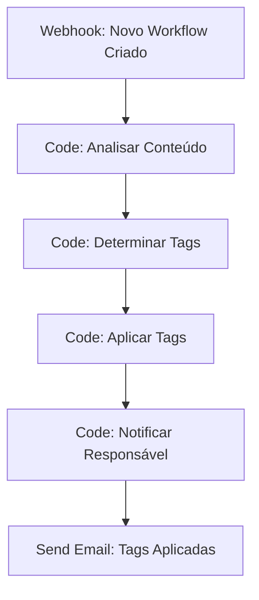
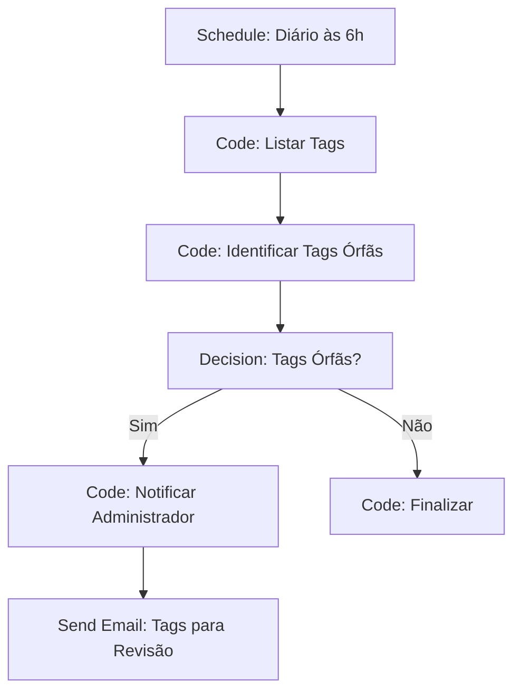

# Tags e Organização de Workflows

As tags e organização de workflows permitem estruturar, categorizar e encontrar suas automações de forma eficiente. Esta seção aborda como usar tags, criar hierarquias e manter seus workflows organizados.

## Visão Geral

A organização de workflows com tags oferece múltiplos benefícios:

- **Categorização automática** de workflows por função
- **Busca rápida** e filtros inteligentes
- **Hierarquia organizacional** por departamentos
- **Controle de acesso** baseado em tags
- **Relatórios estruturados** por categoria

## Sistema de Tags

### Estrutura de Tags

O n8n suporta uma estrutura hierárquica de tags:

```javascript
// Estrutura de tags organizacional
const estruturaTags = {
  // Tags principais (departamentos)
  departamentos: [
    'vendas',
    'marketing', 
    'financeiro',
    'rh',
    'suporte',
    'ti',
    'operacoes'
  ],
  
  // Tags secundárias (funcionalidades)
  funcionalidades: [
    'automacao',
    'integracao',
    'notificacao',
    'relatorio',
    'backup',
    'monitoramento'
  ],
  
  // Tags de status
  status: [
    'ativo',
    'inativo',
    'desenvolvimento',
    'homologacao',
    'producao',
    'depreciado'
  ],
  
  // Tags de prioridade
  prioridade: [
    'critica',
    'alta',
    'media',
    'baixa'
  ],
  
  // Tags específicas do Brasil
  brasil: [
    'nfe',
    'pix',
    'lgpd',
    'serasa',
    'receita',
    'correios'
  ]
};
```

### Convenções de Nomenclatura

```javascript
// Convenções para tags
const convencoesTags = {
  // Formato: departamento-funcionalidade-status
  formato: 'vendas-automacao-producao',
  
  // Separadores
  separadores: {
    principal: '-',    // vendas-automacao
    secundario: ':',   // vendas:leads
    hierarquico: '/'   // vendas/automacao/leads
  },
  
  // Prefixos especiais
  prefixos: {
    ambiente: 'env:',      // env:producao
    versao: 'v:',          // v:1.0.0
    projeto: 'proj:',      // proj:crm-integration
    cliente: 'cliente:',   // cliente:empresa-abc
    urgente: 'urgente:'    // urgente:crash-fix
  },
  
  // Exemplos práticos
  exemplos: [
    'vendas-automacao-producao',
    'financeiro-conciliacao-ativo',
    'rh-onboarding-desenvolvimento',
    'env:producao',
    'v:2.1.0',
    'proj:crm-integration',
    'cliente:empresa-abc',
    'urgente:crash-fix'
  ]
};
```

## Criação e Gerenciamento de Tags

### Criar Tags via Interface

Para criar tags via interface:

1. **Vá para a página de workflows**
2. **Clique em "Tags"** no menu lateral
3. **Clique em "Add Tag"** para criar nova tag
4. **Digite o nome** da tag
5. **Escolha a cor** para identificação visual
6. **Clique em "Save"** para salvar

### Criar Tags via API

```javascript
// Criar tag via API
const criarTag = async (tagData) => {
  const response = await fetch('/api/v1/tags', {
    method: 'POST',
    headers: {
      'Content-Type': 'application/json',
      'Authorization': 'Bearer YOUR_API_KEY'
    },
    body: JSON.stringify({
      name: tagData.nome,
      color: tagData.cor,
      description: tagData.descricao,
      parent: tagData.pai || null,
      metadata: tagData.metadados || {}
    })
  });
  
  return response.json();
};

// Exemplo: Criar tag de vendas
const tagVendas = {
  nome: 'vendas-automacao',
  cor: '#ff6b6b',
  descricao: 'Automações relacionadas ao processo de vendas',
  metadados: {
    departamento: 'vendas',
    responsavel: 'joao@empresa.com',
    sla: '4h'
  }
};

const tag = await criarTag(tagVendas);
```

### Gerenciar Tags Existentes

```javascript
// Listar todas as tags
const listarTags = async () => {
  const response = await fetch('/api/v1/tags', {
    method: 'GET',
    headers: {
      'Authorization': 'Bearer YOUR_API_KEY'
    }
  });
  
  return response.json();
};

// Atualizar tag
const atualizarTag = async (tagId, dados) => {
  const response = await fetch(`/api/v1/tags/${tagId}`, {
    method: 'PUT',
    headers: {
      'Content-Type': 'application/json',
      'Authorization': 'Bearer YOUR_API_KEY'
    },
    body: JSON.stringify(dados)
  });
  
  return response.json();
};

// Excluir tag
const excluirTag = async (tagId) => {
  const response = await fetch(`/api/v1/tags/${tagId}`, {
    method: 'DELETE',
    headers: {
      'Authorization': 'Bearer YOUR_API_KEY'
    }
  });
  
  return response.json();
};
```

## Aplicação de Tags em Workflows

### Aplicar Tags via Interface

Para aplicar tags a um workflow:

1. **Abra o workflow** no editor
2. **Clique no campo "Tags"** na barra superior
3. **Digite ou selecione** as tags desejadas
4. **Pressione Enter** para adicionar
5. **Clique em "Save"** para salvar

### Aplicar Tags via API

```javascript
// Aplicar tags a um workflow
const aplicarTags = async (workflowId, tags) => {
  const response = await fetch(`/api/v1/workflows/${workflowId}/tags`, {
    method: 'PUT',
    headers: {
      'Content-Type': 'application/json',
      'Authorization': 'Bearer YOUR_API_KEY'
    },
    body: JSON.stringify({
      tags: tags
    })
  });
  
  return response.json();
};

// Exemplo: Aplicar múltiplas tags
const tags = [
  'vendas-automacao',
  'crm-integration',
  'env:producao',
  'v:1.2.0',
  'prioridade:alta'
];

await aplicarTags('workflow-123', tags);
```

### Aplicação Automática de Tags

```javascript
// Aplicar tags automaticamente baseado no conteúdo
const aplicarTagsAutomaticas = async (workflowId) => {
  const workflow = await buscarWorkflow(workflowId);
  const tagsAutomaticas = [];
  
  // Analisar nodes para determinar tags
  workflow.nodes.forEach(node => {
    // Tags baseadas no tipo de node
    if (node.type.includes('crm')) {
      tagsAutomaticas.push('crm-integration');
    }
    
    if (node.type.includes('email')) {
      tagsAutomaticas.push('notificacao');
    }
    
    if (node.type.includes('http')) {
      tagsAutomaticas.push('api-integration');
    }
    
    // Tags baseadas em parâmetros
    if (node.parameters && node.parameters.url) {
      if (node.parameters.url.includes('vendas')) {
        tagsAutomaticas.push('vendas');
      }
      
      if (node.parameters.url.includes('financeiro')) {
        tagsAutomaticas.push('financeiro');
      }
    }
  });
  
  // Aplicar tags únicas
  const tagsUnicas = [...new Set(tagsAutomaticas)];
  await aplicarTags(workflowId, tagsUnicas);
  
  return tagsUnicas;
};
```

## Busca e Filtros

### Busca por Tags

```javascript
// Buscar workflows por tags
const buscarPorTags = async (tags, operador = 'AND') => {
  const response = await fetch('/api/v1/workflows/search', {
    method: 'POST',
    headers: {
      'Content-Type': 'application/json',
      'Authorization': 'Bearer YOUR_API_KEY'
    },
    body: JSON.stringify({
      tags: tags,
      operator: operador, // AND, OR
      includeInactive: false,
      limit: 100
    })
  });
  
  return response.json();
};

// Exemplo: Buscar workflows de vendas em produção
const workflowsVendas = await buscarPorTags([
  'vendas',
  'env:producao'
], 'AND');

// Exemplo: Buscar workflows críticos ou urgentes
const workflowsCriticos = await buscarPorTags([
  'prioridade:critica',
  'urgente:'
], 'OR');
```

### Filtros Avançados

```javascript
// Filtros avançados por tags
const filtrosAvancados = {
  // Filtro por departamento
  porDepartamento: async (departamento) => {
    return await buscarPorTags([departamento]);
  },
  
  // Filtro por ambiente
  porAmbiente: async (ambiente) => {
    return await buscarPorTags([`env:${ambiente}`]);
  },
  
  // Filtro por prioridade
  porPrioridade: async (prioridade) => {
    return await buscarPorTags([`prioridade:${prioridade}`]);
  },
  
  // Filtro por status
  porStatus: async (status) => {
    return await buscarPorTags([status]);
  },
  
  // Filtro combinado
  combinado: async (filtros) => {
    const tags = [];
    
    if (filtros.departamento) {
      tags.push(filtros.departamento);
    }
    
    if (filtros.ambiente) {
      tags.push(`env:${filtros.ambiente}`);
    }
    
    if (filtros.prioridade) {
      tags.push(`prioridade:${filtros.prioridade}`);
    }
    
    if (filtros.status) {
      tags.push(filtros.status);
    }
    
    return await buscarPorTags(tags, 'AND');
  }
};

// Exemplo de uso
const workflowsFiltrados = await filtrosAvancados.combinado({
  departamento: 'vendas',
  ambiente: 'producao',
  prioridade: 'alta',
  status: 'ativo'
});
```

## Organização Hierárquica

### Estrutura de Pastas com Tags

```javascript
// Organizar workflows em estrutura hierárquica
const estruturaHierarquica = {
  // Estrutura principal
  organizacao: {
    vendas: {
      automacao: {
        leads: ['vendas-automacao-leads', 'vendas-lead-scoring'],
        followup: ['vendas-followup-automatico', 'vendas-email-sequence'],
        crm: ['vendas-crm-sync', 'vendas-crm-backup']
      },
      relatorios: {
        diarios: ['vendas-relatorio-diario', 'vendas-metricas'],
        semanais: ['vendas-relatorio-semanal', 'vendas-performance'],
        mensais: ['vendas-relatorio-mensal', 'vendas-forecast']
      }
    },
    
    financeiro: {
      conciliacao: ['financeiro-conciliacao-bancaria', 'financeiro-conciliacao-cartao'],
      nfe: ['financeiro-nfe-emissao', 'financeiro-nfe-envio'],
      pix: ['financeiro-pix-processamento', 'financeiro-pix-notificacao']
    },
    
    rh: {
      onboarding: ['rh-onboarding-automatico', 'rh-documentos'],
      offboarding: ['rh-offboarding-processo', 'rh-acesso-revogacao'],
      beneficios: ['rh-beneficios-calculo', 'rh-beneficios-notificacao']
    }
  }
};

// Criar tags hierárquicas
const criarTagsHierarquicas = async () => {
  const tags = [];
  
  // Tags de primeiro nível (departamentos)
  tags.push(await criarTag({
    nome: 'vendas',
    cor: '#ff6b6b',
    descricao: 'Departamento de Vendas'
  }));
  
  // Tags de segundo nível (funcionalidades)
  tags.push(await criarTag({
    nome: 'vendas-automacao',
    cor: '#ff8e8e',
    descricao: 'Automações de Vendas',
    pai: 'vendas'
  }));
  
  // Tags de terceiro nível (específicas)
  tags.push(await criarTag({
    nome: 'vendas-automacao-leads',
    cor: '#ffb3b3',
    descricao: 'Automação de Leads',
    pai: 'vendas-automacao'
  }));
  
  return tags;
};
```

### Navegação por Tags

```javascript
// Navegar pela hierarquia de tags
const navegacaoTags = {
  // Obter tags filhas
  obterFilhas: async (tagPai) => {
    const response = await fetch(`/api/v1/tags/${tagPai}/children`, {
      method: 'GET',
      headers: {
        'Authorization': 'Bearer YOUR_API_KEY'
      }
    });
    
    return response.json();
  },
  
  // Obter tags pai
  obterPai: async (tagFilha) => {
    const response = await fetch(`/api/v1/tags/${tagFilha}/parent`, {
      method: 'GET',
      headers: {
        'Authorization': 'Bearer YOUR_API_KEY'
      }
    });
    
    return response.json();
  },
  
  // Obter árvore completa
  obterArvore: async (tagRaiz) => {
    const response = await fetch(`/api/v1/tags/${tagRaiz}/tree`, {
      method: 'GET',
      headers: {
        'Authorization': 'Bearer YOUR_API_KEY'
      }
    });
    
    return response.json();
  }
};
```

## Relatórios e Analytics

### Relatórios por Tags

```javascript
// Gerar relatórios baseados em tags
const relatoriosPorTags = {
  // Relatório de workflows por departamento
  porDepartamento: async () => {
    const departamentos = ['vendas', 'marketing', 'financeiro', 'rh', 'ti'];
    const relatorio = {};
    
    for (const dept of departamentos) {
      const workflows = await buscarPorTags([dept]);
      relatorio[dept] = {
        total: workflows.length,
        ativos: workflows.filter(w => w.active).length,
        inativos: workflows.filter(w => !w.active).length,
        ultimaExecucao: workflows.map(w => w.updatedAt).sort().pop()
      };
    }
    
    return relatorio;
  },
  
  // Relatório de workflows por ambiente
  porAmbiente: async () => {
    const ambientes = ['desenvolvimento', 'homologacao', 'producao'];
    const relatorio = {};
    
    for (const env of ambientes) {
      const workflows = await buscarPorTags([`env:${env}`]);
      relatorio[env] = {
        total: workflows.length,
        criticos: workflows.filter(w => w.tags.includes('prioridade:critica')).length,
        alta: workflows.filter(w => w.tags.includes('prioridade:alta')).length,
        media: workflows.filter(w => w.tags.includes('prioridade:media')).length,
        baixa: workflows.filter(w => w.tags.includes('prioridade:baixa')).length
      };
    }
    
    return relatorio;
  },
  
  // Relatório de performance por tags
  performancePorTags: async (periodo = '30d') => {
    const response = await fetch(`/api/v1/analytics/tags/performance`, {
      method: 'POST',
      headers: {
        'Content-Type': 'application/json',
        'Authorization': 'Bearer YOUR_API_KEY'
      },
      body: JSON.stringify({
        period: periodo,
        groupBy: 'tags'
      })
    });
    
    return response.json();
  }
};
```

### Dashboard de Tags

```javascript
// Criar dashboard de tags
const dashboardTags = {
  // Métricas principais
  metricas: async () => {
    const tags = await listarTags();
    const workflows = await listarWorkflows();
    
    return {
      totalTags: tags.length,
      totalWorkflows: workflows.length,
      workflowsComTags: workflows.filter(w => w.tags && w.tags.length > 0).length,
      tagsMaisUsadas: await obterTagsMaisUsadas(),
      tagsRecentes: await obterTagsRecentes()
    };
  },
  
  // Tags mais usadas
  obterTagsMaisUsadas: async () => {
    const workflows = await listarWorkflows();
    const contagemTags = {};
    
    workflows.forEach(workflow => {
      if (workflow.tags) {
        workflow.tags.forEach(tag => {
          contagemTags[tag] = (contagemTags[tag] || 0) + 1;
        });
      }
    });
    
    return Object.entries(contagemTags)
      .sort(([,a], [,b]) => b - a)
      .slice(0, 10)
      .map(([tag, count]) => ({ tag, count }));
  },
  
  // Tags recentes
  obterTagsRecentes: async () => {
    const response = await fetch('/api/v1/tags/recent', {
      method: 'GET',
      headers: {
        'Authorization': 'Bearer YOUR_API_KEY'
      }
    });
    
    return response.json();
  }
};
```

## Automação de Tags

### Workflow: Aplicação Automática de Tags



### Workflow: Limpeza de Tags



## Tags Específicas para Brasil

### Tags de Compliance

```javascript
// Tags específicas para compliance brasileiro
const tagsCompliance = {
  lgpd: {
    nome: 'lgpd-compliant',
    descricao: 'Workflow em conformidade com LGPD',
    cor: '#4CAF50'
  },
  
  nfe: {
    nome: 'nfe-integration',
    descricao: 'Integração com sistema NFe',
    cor: '#2196F3'
  },
  
  pix: {
    nome: 'pix-processing',
    descricao: 'Processamento de pagamentos PIX',
    cor: '#FF9800'
  },
  
  serasa: {
    nome: 'serasa-consult',
    descricao: 'Consulta de dados no Serasa',
    cor: '#9C27B0'
  }
};
```

### Tags de Integrações Brasileiras

```javascript
// Tags para integrações específicas do Brasil
const tagsIntegracoesBR = {
  receita: 'receita-federal',
  viacep: 'viacep-integration',
  correios: 'correios-tracking',
  bancoCentral: 'banco-central-pix',
  sefaz: 'sefaz-nfe',
  serasa: 'serasa-credit',
  spc: 'spc-consult',
  caged: 'caged-integration'
};

// Aplicar tags de integração automaticamente
const aplicarTagsIntegracaoBR = async (workflowId) => {
  const workflow = await buscarWorkflow(workflowId);
  const tagsIntegracao = [];
  
  workflow.nodes.forEach(node => {
    if (node.parameters && node.parameters.url) {
      const url = node.parameters.url.toLowerCase();
      
      if (url.includes('receitaws.com.br')) {
        tagsIntegracao.push('receita-federal');
      }
      
      if (url.includes('viacep.com.br')) {
        tagsIntegracao.push('viacep-integration');
      }
      
      if (url.includes('correios.com.br')) {
        tagsIntegracao.push('correios-tracking');
      }
      
      if (url.includes('bcb.gov.br')) {
        tagsIntegracao.push('banco-central-pix');
      }
    }
  });
  
  if (tagsIntegracao.length > 0) {
    await aplicarTags(workflowId, tagsIntegracao);
  }
  
  return tagsIntegracao;
};
```

## Boas Práticas

### Nomenclatura

- **Use nomes descritivos** para tags
- **Mantenha consistência** na nomenclatura
- **Evite tags muito específicas** que não serão reutilizadas
- **Use hierarquia** para organizar tags relacionadas

### Organização

- **Limite o número de tags** por workflow (máximo 5-7)
- **Use cores diferentes** para categorias distintas
- **Revise tags regularmente** para manter organização
- **Documente convenções** de tags da equipe

### Manutenção

- **Remova tags não utilizadas** periodicamente
- **Consolide tags similares** para evitar duplicação
- **Atualize tags** quando workflows mudam
- **Treine a equipe** nas convenções de tags

## Troubleshooting

### Problemas Comuns

**Tags não aparecem:**
- Verificar permissões de usuário
- Verificar se tags foram salvas corretamente
- Verificar cache do navegador
- Verificar configurações de exibição

**Busca não funciona:**
- Verificar ortografia das tags
- Verificar operador de busca (AND/OR)
- Verificar se tags existem
- Verificar permissões de acesso

**Tags duplicadas:**
- Verificar convenções de nomenclatura
- Consolidar tags similares
- Implementar validação automática
- Treinar equipe nas convenções

## Recursos Adicionais

### Documentação Oficial
- [Workflow Tags](https://docs.n8n.io/workflows/tags/)
- [Workflow Organization](https://docs.n8n.io/workflows/organize/)

### Ferramentas Relacionadas
- **n8n CLI**: Gerenciamento de tags via linha de comando
- **n8n API**: Automação de tags programática
- **n8n Templates**: Templates com tags pré-definidas

---

**Próximo**: [IDs de Workflow](./workflow-id) - Entenda os identificadores únicos 