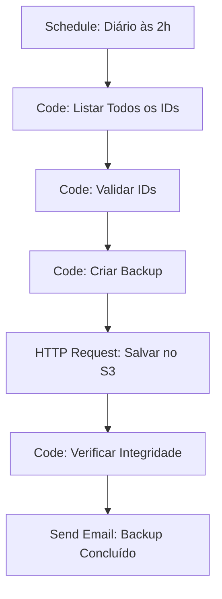
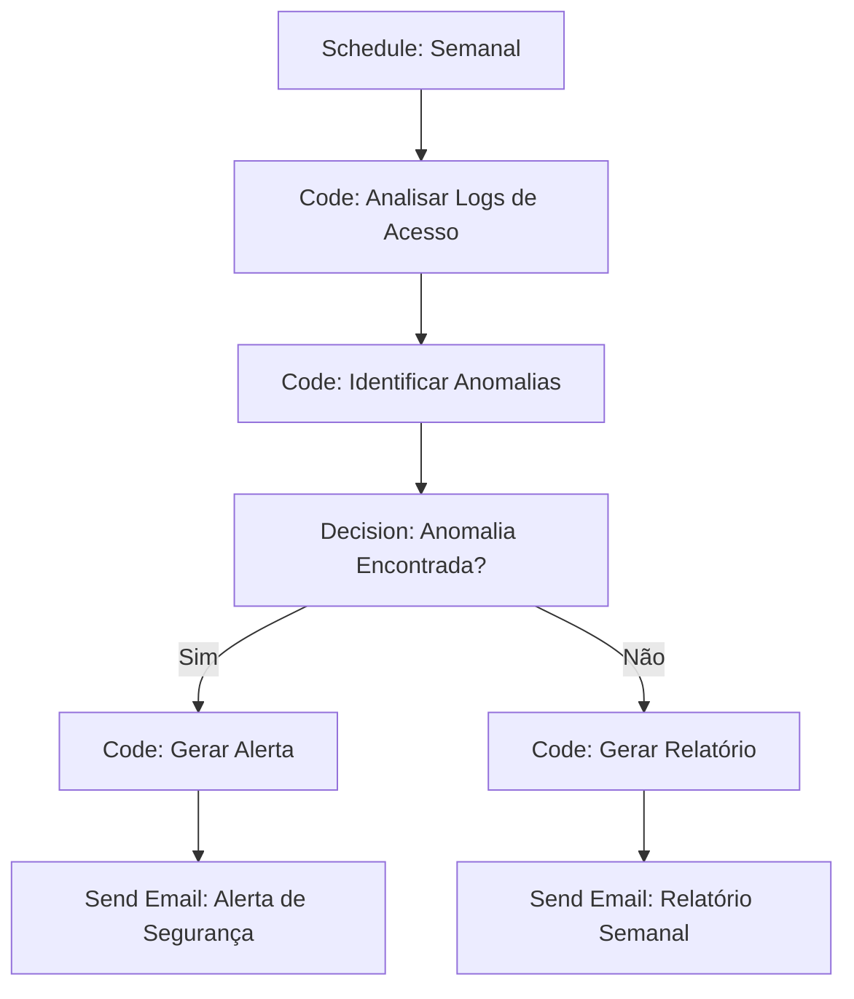

# IDs de Workflow

Os IDs de workflow são identificadores únicos que permitem referenciar, rastrear e gerenciar workflows de forma programática. Esta seção aborda como entender, usar e gerenciar IDs de workflow no n8n.

## Visão Geral

Os IDs de workflow são fundamentais para:

- **Identificação única** de workflows no sistema
- **Referência programática** via API
- **Rastreamento** de execuções e mudanças
- **Integração** com sistemas externos
- **Auditoria** e compliance

## Estrutura dos IDs

### Formato Padrão

Os IDs de workflow seguem um formato específico:

```javascript
// Estrutura do ID de workflow
const estruturaId = {
  // Formato: UUID v4
  formato: 'xxxxxxxx-xxxx-4xxx-yxxx-xxxxxxxxxxxx',
  
  // Exemplo real
  exemplo: 'a1b2c3d4-e5f6-7890-abcd-ef1234567890',
  
  // Componentes
  componentes: {
    versao: '4', // Versão do UUID
    variante: '8', // Variante do UUID
    timestamp: 'timestamp-embedded', // Timestamp embutido
    aleatorio: 'random-bytes' // Bytes aleatórios
  }
};
```

### Tipos de IDs

```javascript
// Diferentes tipos de identificadores
const tiposIds = {
  // ID interno do n8n
  interno: {
    formato: 'uuid-v4',
    exemplo: 'a1b2c3d4-e5f6-7890-abcd-ef1234567890',
    uso: 'Identificação interna no banco de dados'
  },
  
  // ID de execução
  execucao: {
    formato: 'uuid-v4',
    exemplo: 'b2c3d4e5-f6g7-8901-bcde-f23456789012',
    uso: 'Identificação única de cada execução'
  },
  
  // ID de versão
  versao: {
    formato: 'semantic-versioning',
    exemplo: '1.2.3',
    uso: 'Controle de versão do workflow'
  },
  
  // ID customizado
  customizado: {
    formato: 'user-defined',
    exemplo: 'vendas-automacao-2024',
    uso: 'Identificação amigável para usuários'
  }
};
```

## Geração de IDs

### Geração Automática

Os IDs são gerados automaticamente pelo n8n:

```javascript
// Geração automática de ID
const gerarIdAutomatico = () => {
  // O n8n gera automaticamente UUIDs v4
  const uuid = require('uuid');
  return uuid.v4();
};

// Exemplo de uso
const novoId = gerarIdAutomatico();
console.log(novoId); // a1b2c3d4-e5f6-7890-abcd-ef1234567890
```

### Geração Customizada

Para casos especiais, você pode gerar IDs customizados:

```javascript
// Gerar ID customizado
const gerarIdCustomizado = (prefixo, sufixo) => {
  const timestamp = Date.now();
  const aleatorio = Math.random().toString(36).substring(2, 8);
  
  return `${prefixo}-${timestamp}-${aleatorio}${sufixo ? `-${sufixo}` : ''}`;
};

// Exemplos de uso
const idVendas = gerarIdCustomizado('vendas', 'automacao');
console.log(idVendas); // vendas-1703123456789-abc123-automacao

const idFinanceiro = gerarIdCustomizado('financeiro', 'conciliacao');
console.log(idFinanceiro); // financeiro-1703123456789-def456-conciliacao
```

## Obtenção de IDs

### Via Interface Web

Para obter o ID de um workflow via interface:

1. **Abra o workflow** no editor
2. **Clique no menu** (⋮) no canto superior direito
3. **Selecione "Copy ID"** no menu
4. **O ID será copiado** para a área de transferência

### Via API

```javascript
// Obter ID de workflow via API
const obterIdWorkflow = async (nomeWorkflow) => {
  const response = await fetch('/api/v1/workflows', {
    method: 'GET',
    headers: {
      'Authorization': 'Bearer YOUR_API_KEY'
    },
    params: {
      name: nomeWorkflow
    }
  });
  
  const workflows = await response.json();
  
  if (workflows.length > 0) {
    return workflows[0].id;
  }
  
  throw new Error(`Workflow "${nomeWorkflow}" não encontrado`);
};

// Exemplo de uso
const id = await obterIdWorkflow('Automação de Vendas');
console.log(id); // a1b2c3d4-e5f6-7890-abcd-ef1234567890
```

### Listar IDs de Múltiplos Workflows

```javascript
// Listar IDs de workflows com filtros
const listarIdsWorkflows = async (filtros = {}) => {
  const response = await fetch('/api/v1/workflows', {
    method: 'GET',
    headers: {
      'Authorization': 'Bearer YOUR_API_KEY'
    },
    params: filtros
  });
  
  const workflows = await response.json();
  
  return workflows.map(workflow => ({
    id: workflow.id,
    name: workflow.name,
    active: workflow.active,
    updatedAt: workflow.updatedAt
  }));
};

// Exemplo: Listar IDs de workflows ativos
const workflowsAtivos = await listarIdsWorkflows({
  active: true
});

// Exemplo: Listar IDs de workflows por tag
const workflowsVendas = await listarIdsWorkflows({
  tags: ['vendas']
});
```

## Uso de IDs

### Referência via API

```javascript
// Usar ID para operações na API
const operacoesComId = {
  // Obter workflow por ID
  obterWorkflow: async (id) => {
    const response = await fetch(`/api/v1/workflows/${id}`, {
      method: 'GET',
      headers: {
        'Authorization': 'Bearer YOUR_API_KEY'
      }
    });
    
    return response.json();
  },
  
  // Executar workflow por ID
  executarWorkflow: async (id, dados = {}) => {
    const response = await fetch(`/api/v1/workflows/${id}/execute`, {
      method: 'POST',
      headers: {
        'Content-Type': 'application/json',
        'Authorization': 'Bearer YOUR_API_KEY'
      },
      body: JSON.stringify(dados)
    });
    
    return response.json();
  },
  
  // Atualizar workflow por ID
  atualizarWorkflow: async (id, dados) => {
    const response = await fetch(`/api/v1/workflows/${id}`, {
      method: 'PUT',
      headers: {
        'Content-Type': 'application/json',
        'Authorization': 'Bearer YOUR_API_KEY'
      },
      body: JSON.stringify(dados)
    });
    
    return response.json();
  },
  
  // Excluir workflow por ID
  excluirWorkflow: async (id) => {
    const response = await fetch(`/api/v1/workflows/${id}`, {
      method: 'DELETE',
      headers: {
        'Authorization': 'Bearer YOUR_API_KEY'
      }
    });
    
    return response.json();
  }
};

// Exemplo de uso
const workflow = await operacoesComId.obterWorkflow('a1b2c3d4-e5f6-7890-abcd-ef1234567890');
const execucao = await operacoesComId.executarWorkflow('a1b2c3d4-e5f6-7890-abcd-ef1234567890', {
  data: { lead: 'novo-lead@email.com' }
});
```

### Integração com Sistemas Externos

```javascript
// Integrar IDs com sistemas externos
const integracaoIds = {
  // Mapear ID do n8n com ID externo
  mapearId: async (idN8n, idExterno, sistema) => {
    const mapeamento = {
      idN8n: idN8n,
      idExterno: idExterno,
      sistema: sistema,
      criadoEm: new Date().toISOString()
    };
    
    // Salvar mapeamento no banco de dados
    await salvarMapeamento(mapeamento);
    
    return mapeamento;
  },
  
  // Obter ID externo por ID do n8n
  obterIdExterno: async (idN8n, sistema) => {
    const mapeamento = await buscarMapeamento(idN8n, sistema);
    return mapeamento ? mapeamento.idExterno : null;
  },
  
  // Obter ID do n8n por ID externo
  obterIdN8n: async (idExterno, sistema) => {
    const mapeamento = await buscarMapeamentoPorExterno(idExterno, sistema);
    return mapeamento ? mapeamento.idN8n : null;
  }
};

// Exemplo: Integração com CRM
const idN8n = 'a1b2c3d4-e5f6-7890-abcd-ef1234567890';
const idCrm = 'CRM-2024-001';

await integracaoIds.mapearId(idN8n, idCrm, 'salesforce');
const idExterno = await integracaoIds.obterIdExterno(idN8n, 'salesforce');
```

## Rastreamento e Auditoria

### Histórico de Mudanças

```javascript
// Rastrear mudanças por ID
const rastreamentoIds = {
  // Registrar mudança
  registrarMudanca: async (idWorkflow, tipo, detalhes) => {
    const mudanca = {
      workflowId: idWorkflow,
      tipo: tipo, // 'criado', 'atualizado', 'executado', 'excluido'
      detalhes: detalhes,
      timestamp: new Date().toISOString(),
      usuario: 'usuario@empresa.com'
    };
    
    await salvarMudanca(mudanca);
    return mudanca;
  },
  
  // Obter histórico de mudanças
  obterHistorico: async (idWorkflow, limite = 100) => {
    const mudancas = await buscarMudancas(idWorkflow, limite);
    return mudancas.sort((a, b) => new Date(b.timestamp) - new Date(a.timestamp));
  },
  
  // Obter última mudança
  obterUltimaMudanca: async (idWorkflow) => {
    const mudancas = await rastreamentoIds.obterHistorico(idWorkflow, 1);
    return mudancas[0] || null;
  }
};

// Exemplo de uso
await rastreamentoIds.registrarMudanca(
  'a1b2c3d4-e5f6-7890-abcd-ef1234567890',
  'executado',
  { resultado: 'sucesso', duracao: '2.5s' }
);

const historico = await rastreamentoIds.obterHistorico('a1b2c3d4-e5f6-7890-abcd-ef1234567890');
```

### Logs de Auditoria

```javascript
// Logs de auditoria por ID
const auditoriaIds = {
  // Log de acesso
  logAcesso: async (idWorkflow, acao, usuario) => {
    const log = {
      workflowId: idWorkflow,
      acao: acao, // 'visualizar', 'editar', 'executar', 'excluir'
      usuario: usuario,
      timestamp: new Date().toISOString(),
      ip: '192.168.1.100',
      userAgent: 'Mozilla/5.0...'
    };
    
    await salvarLogAuditoria(log);
    return log;
  },
  
  // Obter logs de auditoria
  obterLogsAuditoria: async (idWorkflow, periodo) => {
    const logs = await buscarLogsAuditoria(idWorkflow, periodo);
    return logs.sort((a, b) => new Date(b.timestamp) - new Date(a.timestamp));
  },
  
  // Relatório de auditoria
  relatorioAuditoria: async (idWorkflow) => {
    const logs = await auditoriaIds.obterLogsAuditoria(idWorkflow, '30d');
    
    return {
      totalAcessos: logs.length,
      acessosPorUsuario: agruparPorUsuario(logs),
      acessosPorAcao: agruparPorAcao(logs),
      ultimoAcesso: logs[0] || null
    };
  }
};

// Exemplo de uso
await auditoriaIds.logAcesso(
  'a1b2c3d4-e5f6-7890-abcd-ef1234567890',
  'executar',
  'joao@empresa.com'
);

const relatorio = await auditoriaIds.relatorioAuditoria('a1b2c3d4-e5f6-7890-abcd-ef1234567890');
```

## IDs em URLs e Webhooks

### URLs com IDs

```javascript
// URLs que usam IDs de workflow
const urlsComIds = {
  // URL do editor
  editor: (id) => `https://n8n.empresa.com/workflow/${id}`,
  
  // URL da API
  api: (id) => `https://n8n.empresa.com/api/v1/workflows/${id}`,
  
  // URL de execução
  execucao: (id) => `https://n8n.empresa.com/api/v1/workflows/${id}/execute`,
  
  // URL de webhook
  webhook: (id) => `https://n8n.empresa.com/webhook/${id}`,
  
  // URL de histórico
  historico: (id) => `https://n8n.empresa.com/workflow/${id}/history`
};

// Exemplo de uso
const id = 'a1b2c3d4-e5f6-7890-abcd-ef1234567890';
console.log(urlsComIds.editor(id)); // https://n8n.empresa.com/workflow/a1b2c3d4-e5f6-7890-abcd-ef1234567890
console.log(urlsComIds.webhook(id)); // https://n8n.empresa.com/webhook/a1b2c3d4-e5f6-7890-abcd-ef1234567890
```

### Webhooks com IDs

```javascript
// Configurar webhook com ID
const configurarWebhook = async (idWorkflow, configuracao) => {
  const webhook = {
    workflowId: idWorkflow,
    path: configuracao.path || `webhook-${idWorkflow}`,
    method: configuracao.method || 'POST',
    authentication: configuracao.authentication || 'none',
    active: configuracao.active || true
  };
  
  const response = await fetch(`/api/v1/workflows/${idWorkflow}/webhooks`, {
    method: 'POST',
    headers: {
      'Content-Type': 'application/json',
      'Authorization': 'Bearer YOUR_API_KEY'
    },
    body: JSON.stringify(webhook)
  });
  
  return response.json();
};

// Exemplo: Configurar webhook para automação de vendas
const configuracaoWebhook = {
  path: 'vendas-lead',
  method: 'POST',
  authentication: 'header',
  active: true
};

const webhook = await configurarWebhook('a1b2c3d4-e5f6-7890-abcd-ef1234567890', configuracaoWebhook);
```

## IDs em Templates e Compartilhamento

### Templates com IDs

```javascript
// Criar template com ID
const criarTemplateComId = async (idWorkflow, metadata) => {
  const workflow = await obterWorkflow(idWorkflow);
  
  const template = {
    ...workflow,
    templateId: `template-${idWorkflow}`,
    metadata: {
      ...metadata,
      originalId: idWorkflow,
      createdAt: new Date().toISOString(),
      version: '1.0.0'
    }
  };
  
  return template;
};

// Exemplo: Criar template de automação de vendas
const metadata = {
  name: 'Automação de Vendas - Template',
  description: 'Template para automação de processo de vendas',
  category: 'Vendas',
  tags: ['vendas', 'crm', 'automação']
};

const template = await criarTemplateComId('a1b2c3d4-e5f6-7890-abcd-ef1234567890', metadata);
```

### Compartilhamento com IDs

```javascript
// Compartilhar workflow por ID
const compartilharPorId = async (idWorkflow, usuarios, permissoes) => {
  const compartilhamento = {
    workflowId: idWorkflow,
    usuarios: usuarios,
    permissoes: permissoes,
    compartilhadoEm: new Date().toISOString(),
    compartilhadoPor: 'admin@empresa.com'
  };
  
  const response = await fetch(`/api/v1/workflows/${idWorkflow}/share`, {
    method: 'POST',
    headers: {
      'Content-Type': 'application/json',
      'Authorization': 'Bearer YOUR_API_KEY'
    },
    body: JSON.stringify(compartilhamento)
  });
  
  return response.json();
};

// Exemplo: Compartilhar workflow de vendas
const usuarios = ['joao@empresa.com', 'maria@empresa.com'];
const permissoes = ['read', 'execute'];

await compartilharPorId('a1b2c3d4-e5f6-7890-abcd-ef1234567890', usuarios, permissoes);
```

## Validação e Segurança

### Validação de IDs

```javascript
// Validar formato de ID
const validarId = (id) => {
  // Regex para UUID v4
  const uuidRegex = /^[0-9a-f]{8}-[0-9a-f]{4}-4[0-9a-f]{3}-[89ab][0-9a-f]{3}-[0-9a-f]{12}$/i;
  
  return {
    valido: uuidRegex.test(id),
    formato: 'uuid-v4',
    comprimento: id.length,
    caracteres: id.replace(/[^0-9a-f-]/gi, '').length === id.length
  };
};

// Exemplo de uso
const id = 'a1b2c3d4-e5f6-7890-abcd-ef1234567890';
const validacao = validarId(id);
console.log(validacao); // { valido: true, formato: 'uuid-v4', comprimento: 36, caracteres: 36 }
```

### Segurança de IDs

```javascript
// Medidas de segurança para IDs
const segurancaIds = {
  // Verificar permissões de acesso
  verificarPermissoes: async (idWorkflow, usuario) => {
    const workflow = await obterWorkflow(idWorkflow);
    const permissoes = await obterPermissoesUsuario(usuario);
    
    return {
      podeVisualizar: permissoes.includes('read') || workflow.owner === usuario,
      podeEditar: permissoes.includes('write') || workflow.owner === usuario,
      podeExecutar: permissoes.includes('execute') || workflow.owner === usuario,
      podeExcluir: permissoes.includes('admin') || workflow.owner === usuario
    };
  },
  
  // Log de tentativas de acesso
  logTentativaAcesso: async (idWorkflow, usuario, sucesso) => {
    const log = {
      workflowId: idWorkflow,
      usuario: usuario,
      sucesso: sucesso,
      timestamp: new Date().toISOString(),
      ip: '192.168.1.100'
    };
    
    await salvarLogSeguranca(log);
    return log;
  },
  
  // Rate limiting por ID
  verificarRateLimit: async (idWorkflow, usuario) => {
    const tentativas = await contarTentativas(idWorkflow, usuario, '1h');
    const limite = 100; // 100 tentativas por hora
    
    return {
      permitido: tentativas < limite,
      tentativasRestantes: limite - tentativas,
      resetEm: new Date(Date.now() + 3600000) // 1 hora
    };
  }
};

// Exemplo de uso
const permissoes = await segurancaIds.verificarPermissoes('a1b2c3d4-e5f6-7890-abcd-ef1234567890', 'joao@empresa.com');
const rateLimit = await segurancaIds.verificarRateLimit('a1b2c3d4-e5f6-7890-abcd-ef1234567890', 'joao@empresa.com');
```

## Workflows de Gerenciamento de IDs

### Workflow: Backup de IDs



### Workflow: Auditoria de IDs



## Boas Práticas

### Nomenclatura e Organização

- **Use IDs consistentes** em toda a organização
- **Documente mapeamentos** de IDs externos
- **Implemente validação** de IDs
- **Mantenha histórico** de mudanças

### Segurança

- **Valide permissões** antes de usar IDs
- **Implemente rate limiting** para APIs
- **Log todas as operações** com IDs
- **Use HTTPS** para todas as operações

### Performance

- **Cache IDs frequentemente usados**
- **Use índices** no banco de dados
- **Implemente paginação** para listas grandes
- **Otimize consultas** por ID

## Troubleshooting

### Problemas Comuns

**ID não encontrado:**
- Verificar se o ID está correto
- Verificar se o workflow existe
- Verificar permissões de acesso
- Verificar se o ID não foi excluído

**ID inválido:**
- Verificar formato do UUID
- Verificar caracteres especiais
- Verificar comprimento correto
- Verificar encoding

**Problemas de performance:**
- Verificar índices no banco de dados
- Verificar cache de IDs
- Verificar consultas otimizadas
- Verificar rate limiting

## Recursos Adicionais

### Documentação Oficial
- [Workflow IDs](https://docs.n8n.io/workflows/workflow-id/)
- [API Reference](https://docs.n8n.io/api/)

### Ferramentas Relacionadas
- **n8n CLI**: Gerenciamento de IDs via linha de comando
- **n8n API**: Operações programáticas com IDs
- **UUID Generator**: Geradores de UUID online

---

**Próximo**: [Histórico de Workflows](./history) - Acesse e analise o histórico de execuções 